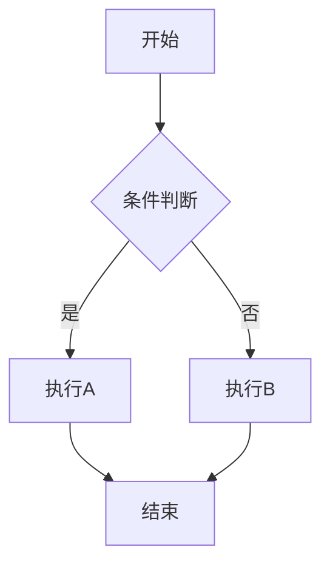

# Rspress 写作规范

## 1. 代码块规范

```markdown
// ✅ 正确 - 只标注语言
```java
public V put(K key, V value) {
    return putVal(hash(key), key, value, false, true);
}
``

// ❌ 错误 - 不支持 java:filename 语法
```java:HashMap.java
public V put(K key, V value) {
    return putVal(hash(key), key, value, false, true);
}
```
```

## 2. 容器使用

| 容器 | 关键词 | 用途 |
| --- | --- | --- |
| `:::tip` | 💡 | 加分回答、生产最佳实践、面试加分点 |
| `:::warning` | ⚠️ | 陷阱警示、翻车点提醒、常见误区 |
| `:::details` | 📖 | 源码展开、补充阅读、深入了解 |

```markdown
:::tip 💡
这是面试官想听到的加分回答，能说出这个的基本都是 P6+
:::

:::warning ⚠️
这里容易翻车，90% 的候选人都会犯，面试时被追问到就是送命题
:::

:::details 📖 点击展开 JDK 源码
```java
// JDK 1.8 HashMap.putVal 源码
final V putVal(int hash, K key, V value, boolean onlyIfAbsent, boolean evict) {
    // ...
}
```
:::
```

## 3. 链接规范

| ✅ 正确 | ❌ 错误 |
| --- | --- |
| `[HashMap](/java/collection/hashmap)` | `[HashMap](/java/collection/hashmap.mdx)` |
| `[JVM](/jvm/memory)` | `[JVM](/docs/jvm/memory)` |
| `[ConcurrentHashMap](/java/collection/concurrent-hashmap)` | `[ConcurrentHashMap](/java/collection/concurrent-hashmap.mdx)` |

核心规则：
- 站内链接禁止 `.mdx` 后缀
- 站内链接禁止 `/docs` 前缀
- 站内链接使用相对路径

## 4. 符号转义

正文、列表、表格中的运算符必须用反引号包裹：

```markdown
| 条件 | 结果 |
| --- | --- |
| n `<=` 100 | 暴力解 |
| n `<=` 1000 | 优化解 |
| `==` | equals 比较 |

这是 `=>` 箭头函数，那是 `->` 泛型符号
```

泛型尖括号需要正确处理：

```markdown
// ✅ 正确
`List<T>` `Map<K, V>` `HashMap<K, V>` `ConcurrentHashMap<K, V>`

// ❌ 错误 - 会导致渲染问题
List<T> Map<K, V>
```

## 5. Mermaid 图

```markdown

```

Mermaid 图使用场景：
- 流程图：决策流程、数据流向
- 时序图：方法调用链、线程交互
- 状态图：对象状态转换
- 类图：UML 类关系

## 6. 标题分隔

一级标题和二级标题之间不要用 `---` 分隔，用内容自然过渡。
