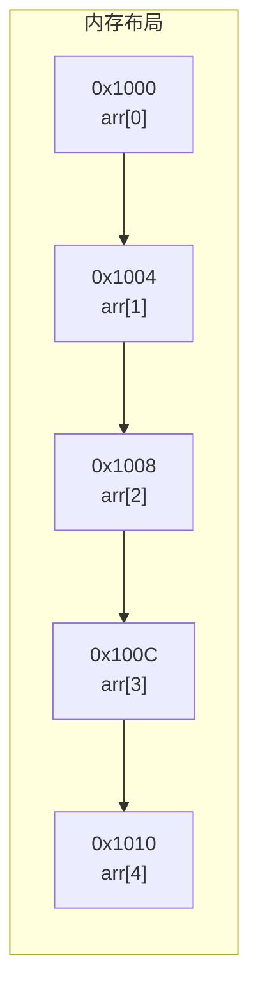
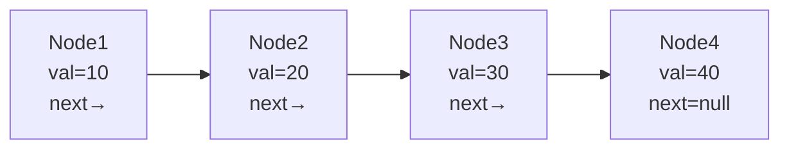
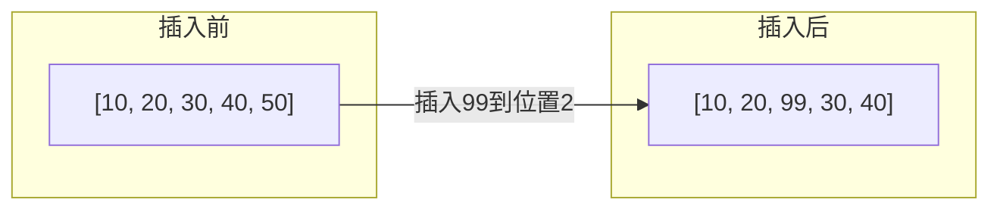
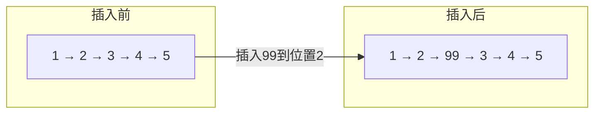
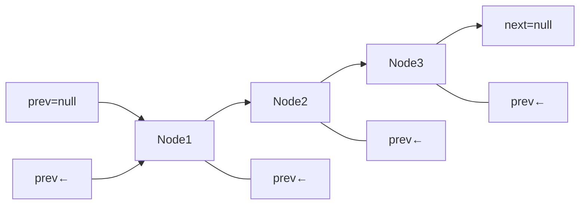

# 数组 vs 链表

面试官翻到简历上"熟悉数据结构与算法"这一行，开口问道：

"数组和链表的区别是什么？分别在什么场景下使用？"

候选人小张自信满满："数组是连续内存，链表是离散内存。数组查询快O(1)，增删慢O(n)；链表查询慢O(n)，增删快O(1)。"

面试官点点头："那为什么数组查询快、链表查询慢？"

小张："因为数组可以通过下标直接访问..."

面试官追问："那如果给你一个数组首地址和下标，计算机是怎么定位到那个元素的？"

小张停顿了两秒，开始支支吾吾...

---

## 一、从一个问题开始

这道题看起来太基础了，基础到很多人在简历上写"精通数据结构"时，根本没想过会被追问。

但真相是：**90%的候选人只能答出第一层，能把第二层、第三层讲清楚的不超过30%。**

今天，我们从计算机底层原理出发，把数组和链表彻底讲透。

【直观类比】

想象你有一栋学生宿舍楼：

- **数组**就像每个房间号连续的一号楼：301室、302室、303室...你知道301室的地址，直接走过去就行。
- **链表**就像随机分布的校外租房：301室在XX小区，302室在YY弄堂，303室在ZZ街...你只能从第一个房源开始问，一站一站找下去。

这就是为什么数组查询是O(1)，而链表查询是O(n)——**物理布局决定了访问方式**。

---

## 二、核心原理

### 2.1 数组的底层实现

数组在内存中是连续存储的。假设我们有一个`int[] arr = new int[5]`，起始地址是`0x1000`，每个int占4字节：



访问`arr[3]`时，计算机的计算公式是：

```
address = base_address + index * element_size
       = 0x1000 + 3 * 4
       = 0x100C
```

**一步到位**，不需要遍历。

```java
public class ArrayDemo {
    public static void main(String[] args) {
        int[] arr = {10, 20, 30, 40, 50};
        // 数组的随机访问：O(1)
        int value = arr[3];  // 直接计算地址：0x1000 + 3*4 = 0x100C
        System.out.println(value); // 输出 40
    }
}
```

**复杂度分析**：

| 操作 | 时间复杂度 | 原因 |
|------|-----------|------|
| 随机访问 `arr[i]` | `O(1)` | 地址计算公式直接得到 |
| 尾部插入/删除 | `O(1)` | 已知位置，直接操作 |
| 中间插入/删除 | `O(n)` | 需要移动后续所有元素 |

### 2.2 链表的底层实现

链表在内存中是离散存储的。每个节点包含数据和指向下一个节点的指针：

```java
public class ListNode {
    int val;
    ListNode next;
    
    ListNode(int val) {
        this.val = val;
        this.next = null;
    }
}
```



访问`node[3]`时，必须从头节点开始遍历：

```java
public int get(ListNode head, int index) {
    ListNode current = head;
    int count = 0;
    while (current != null) {
        if (count == index) {
            return current.val;
        }
        count++;
        current = current.next;  // 只能一站一站往下走
    }
    return -1; // 未找到
}
```

**复杂度分析**：

| 操作 | 时间复杂度 | 原因 |
|------|-----------|------|
| 随机访问 `get(i)` | `O(n)` | 必须从头遍历 |
| 头部插入/删除 | `O(1)` | 已知头节点位置 |
| 尾部插入/删除 | `O(1)` | 已知尾节点（有tail指针） |
| 中间插入/删除 | `O(n)` | 需要先找到位置 |

---

## 三、面试官追问：为什么数组增删慢？

很多候选人能背出"数组增删慢、链表增删快"，但被追问"具体怎么慢、慢在哪里"时，就开始语无伦次。

让我用图示告诉你真相：

### 3.1 数组中间插入：需要搬家

假设在`arr[2]`位置插入一个元素`99`：



**具体操作**：

```java
public void insert(int[] arr, int index, int value) {
    // 1. 从最后一个元素开始，依次向后移动一位
    for (int i = arr.length - 1; i > index; i--) {
        arr[i] = arr[i - 1];  // 40→50, 30→40, 20→30
    }
    // 2. 腾出位置后，放入新元素
    arr[index] = value;  // 99放到位置2
}
```

**时间复杂度**：`O(n)`，最坏情况是插入到头部，需要移动所有n个元素。

### 3.2 链表中间插入：改指针就行



**具体操作**：

```java
public ListNode insert(ListNode head, int index, int value) {
    ListNode newNode = new ListNode(value);
    
    if (index == 0) {
        newNode.next = head;
        return newNode;
    }
    
    // 1. 找到插入位置的前一个节点
    ListNode prev = head;
    for (int i = 0; i < index - 1; i++) {
        prev = prev.next;
    }
    
    // 2. 修改指针
    newNode.next = prev.next;  // 99指向原来的3
    prev.next = newNode;       // 2指向99
    
    return head;
}
```

**时间复杂度**：查找位置`O(n)` + 修改指针`O(1)` = `O(n)`。

等等，说好的"链表增删快"呢？

---

## 四、关键洞察：增删快的真正原因

很多人在这里犯迷糊：**链表增删真的是O(1)吗？**

**答案：取决于你站在哪个视角。**

### 4.1 如果位置已知：链表确实更快

```java
// 数组在已知位置插入：O(n) - 需要移动元素
void arrayInsert(int[] arr, int pos, int val) {
    for (int i = arr.length - 1; i > pos; i--) {
        arr[i] = arr[i - 1];  // 逐个移动
    }
    arr[pos] = val;
}

// 链表在已知位置插入：O(1) - 只需改两个指针
void linkedInsert(ListNode prev, int val) {
    ListNode node = new ListNode(val);
    node.next = prev.next;  // 指向下一个
    prev.next = node;        // 前一个指向新节点
}
```

### 4.2 如果位置未知：都要先找位置

现实开发中，位置很少是"已知"的。你要插入一个特定值的节点，首先得找到它。

```java
// 两者都需要先遍历找到位置
ListNode findNode(ListNode head, int target) {
    while (head != null) {
        if (head.val == target) return head;
        head = head.next;
    }
    return null;
}
```

**结论**：在实际业务中，链表的"增删快"优势往往被查找过程抵消了。只有在**已知确切位置**（如头部、尾部）或**插入频率远高于查询频率**的场景下，链表才有明显优势。

【面试官心理】

面试官追问这个问题，不是想刁难你。他想看的是：你有没有理解"复杂度分析的前提条件"。说"链表增删O(1)"只对了50%，说清楚"前提是位置已知"才能拿到满分。

---

## 五、边界与特例

### 5.1 CPU缓存友好的数组

现代CPU有缓存机制。数组的连续内存布局可以让CPU一次性加载多个元素到缓存：

```java
// 数组遍历：CPU缓存友好
int[] arr = new int[1000000];
for (int i = 0; i < arr.length; i++) {
    sum += arr[i];  // 连续访问，触发预取
}
```

```java
// 链表遍历：缓存不友好
ListNode head = createLinkedList(1000000);
ListNode current = head;
while (current != null) {
    sum += current.val;
    current = current.next;  // 跳跃访问，缓存命中低
}
```

实际测试表明，在某些场景下，数组遍历比链表快**10-100倍**！

### 5.2 链表的双向结构

单向链表只能从头向尾遍历。有些场景需要双向遍历：

```java
public class DoublyListNode {
    int val;
    DoublyListNode prev;
    DoublyListNode next;
}
```



双向链表的删除操作更简洁：

```java
public void remove(DoublyListNode node) {
    if (node.prev != null) {
        node.prev.next = node.next;
    }
    if (node.next != null) {
        node.next.prev = node.prev;
    }
}
```

**单链表 vs 双链表**：

| 特性 | 单向链表 | 双向链表 |
|------|---------|---------|
| 空间占用 | 每个节点1个指针 | 每个节点2个指针 |
| 遍历方向 | 单向 | 双向 |
| 删除已知节点 | 需要遍历找前驱 `O(n)` | 直接删除 `O(1)` |
| 应用场景 | 栈、邻接表 | LRU缓存、编辑器撤销 |

---

## 六、常见误区

### ❌ 误区一：链表增删一定是O(1)

**错误认知**：背熟了"数组查快改慢、链表改快查慢"，就以为链表增删一定是O(1)。

**实际情况**：找到插入位置需要O(n)，实际增删是O(n)。

### ❌ 误区二：数组比链表浪费空间

**错误认知**：链表的元素是分散的，所以比数组更浪费空间。

**实际情况**：
- 数组：如果知道元素数量，使用数组反而省空间（只有数据，无指针）
- 链表：每个节点额外存储一个指针（64位系统8字节），大量元素时指针开销可观

### ❌ 误区三：查询就用数组，增删就用链表

**错误认知**：非黑即白的选型思维。

**实际情况**：需要综合考虑数据规模、访问模式、内存布局、缓存友好性。

---

## 七、记忆技巧

用一句话记住两者的本质区别：

> **数组是"地址 = 首地址 + 偏移量"，链表是"顺着指针一路找"**

用一张表记住选择策略：

| 场景 | 推荐数据结构 | 原因 |
|------|-------------|------|
| 高频随机访问 | 数组 | `O(1)` 随机访问 |
| 高频头部插入删除 | 链表 | `O(1)` 头部操作 |
| 内存敏感 | 数组 | 无指针开销 |
| 频繁中间插入删除 | 链表（位置已知） | 只需改指针 |
| 需要缓存友好 | 数组 | 连续内存，预取友好 |

---

## 八、实战检验

### 检验一：力扣21题 - 合并两个有序链表

```java
public ListNode mergeTwoLists(ListNode l1, ListNode l2) {
    ListNode dummy = new ListNode(0);
    ListNode current = dummy;
    
    while (l1 != null && l2 != null) {
        if (l1.val <= l2.val) {
            current.next = l1;
            l1 = l1.next;
        } else {
            current.next = l2;
            l2 = l2.next;
        }
        current = current.next;
    }
    
    // 处理剩余部分
    current.next = (l1 != null) ? l1 : l2;
    
    return dummy.next;
}
```

**考点**：`O(1)` 空间复杂度的链表操作。

### 检验二：力扣283题 - 移动零

```java
public void moveZeroes(int[] nums) {
    int insertPos = 0;  // 记录非零元素应该放置的位置
    
    // 第一次遍历：把所有非零元素移到前面
    for (int num : nums) {
        if (num != 0) {
            nums[insertPos++] = num;
        }
    }
    
    // 第二次遍历：用0填充剩余位置
    while (insertPos < nums.length) {
        nums[insertPos++] = 0;
    }
}
```

**考点**：理解数组"覆盖"比"插入+移动"更高效。

---

## 九、总结

数组和链表的选择，本质上是**时间与空间的权衡**，也是**访问模式与数据规模的匹配**。

记住这三句话：

1. **数组的快，是地址计算的快；链表的快，是改指针的快**
2. **没有绝对的好坏，只有场景的匹配**
3. **复杂度分析要看前提条件**

下篇文章，我们会深入到**哈希表**的世界，看看它是如何结合两者优势的。
