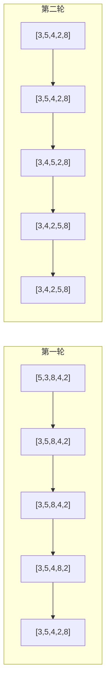
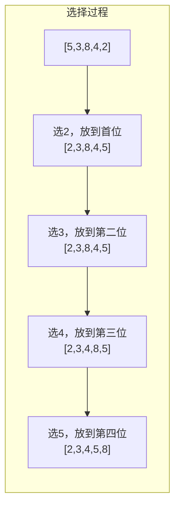
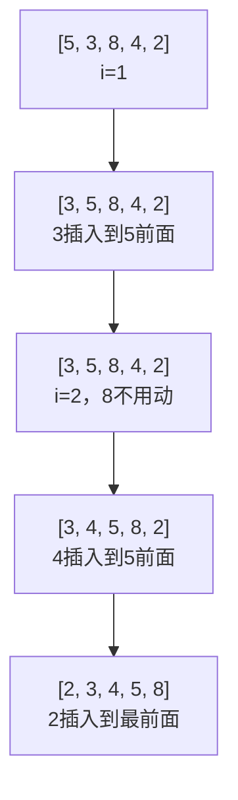

# 冒泡/选择/插入排序

面试官在白板上写下数字：5, 3, 8, 4, 2

"手写一下冒泡排序，给我演示这个数组是怎么排序的。"

候选人小张刷刷刷写完了代码：

```java
for (int i = 0; i < arr.length; i++) {
    for (int j = 0; j < arr.length - 1; j++) {
        if (arr[j] > arr[j + 1]) {
            swap(arr, j, j + 1);
        }
    }
}
```

面试官看了一眼，问："这个代码有问题，你知道吗？"

小张愣住了...

---

## 一、从一个问题开始

三大基础排序（冒泡、选择、插入）是排序算法的入门三件套，也是面试中的常客。

90%的候选人能写出冒泡排序，但能正确写出优化版的不到50%，能分析清楚三种排序适用场景的不到30%。

今天，我们把基础排序彻底讲透。

【直观类比】

三种排序就像整理扑克牌：

- **冒泡排序**：从头到尾比较相邻两张牌，把大的往后"冒"，一遍遍重复
- **选择排序**：每次从牌堆里选最小的，放到最前面
- **插入排序**：摸到一张牌，插到左边已经排好序的牌里

---

## 二、冒泡排序

### 2.1 标准版

```java
public void bubbleSort(int[] arr) {
    int n = arr.length;
    for (int i = 0; i < n - 1; i++) {        // 比较轮数
        for (int j = 0; j < n - 1 - i; j++) { // 每轮比较次数
            if (arr[j] > arr[j + 1]) {
                swap(arr, j, j + 1);
            }
        }
    }
}
```

**过程演示**：



### 2.2 优化版：提前退出

面试官问的问题就出在这里：**如果数组已经有序，冒泡排序还在傻傻地比较吗？**

```java
public void bubbleSortOptimized(int[] arr) {
    int n = arr.length;
    boolean swapped;
    
    for (int i = 0; i < n - 1; i++) {
        swapped = false;
        for (int j = 0; j < n - 1 - i; j++) {
            if (arr[j] > arr[j + 1]) {
                swap(arr, j, j + 1);
                swapped = true;
            }
        }
        // 如果没有发生交换，说明已经有序
        if (!swapped) break;
    }
}
```

### 2.3 再优化：记录最后交换位置

```java
public void bubbleSortSuper(int[] arr) {
    int n = arr.length;
    int right = n - 1;  // 右边界
    
    while (right > 0) {
        int lastSwap = 0;
        for (int j = 0; j < right; j++) {
            if (arr[j] > arr[j + 1]) {
                swap(arr, j, j + 1);
                lastSwap = j;  // 记录最后交换位置
            }
        }
        right = lastSwap;  // 之后的已经有序
    }
}
```

---

## 三、选择排序

### 3.1 标准版

核心思路：每轮从未排序区间选出最小元素，放到已排序区间末尾。

```java
public void selectionSort(int[] arr) {
    int n = arr.length;
    for (int i = 0; i < n - 1; i++) {
        int minIdx = i;
        // 在未排序区间找最小元素
        for (int j = i + 1; j < n; j++) {
            if (arr[j] < arr[minIdx]) {
                minIdx = j;
            }
        }
        // 放到已排序区间末尾
        swap(arr, i, minIdx);
    }
}
```

**过程演示**：



### 3.2 选择排序的致命缺点

```java
// 思考：选择排序的交换次数是多少？
// 无论数组是否有序，都是 n-1 次
// 而冒泡排序优化版在有序时是 0 次
```

**选择排序的致命问题**：**不是原地排序的稳定版本**！

```java
// 演示不稳定情况
// 原始：[5a, 5b, 1]
// 选择最小值1，和5a交换
// 结果：[1, 5b, 5a]
// 相同值的相对位置改变了！
```

---

## 四、插入排序

### 4.1 标准版

核心思路：把每个元素插入到左边已排序区间的正确位置。

```java
public void insertionSort(int[] arr) {
    int n = arr.length;
    for (int i = 1; i < n; i++) {
        int key = arr[i];
        int j = i - 1;
        
        // 在已排序区间从后向前找位置
        while (j >= 0 && arr[j] > key) {
            arr[j + 1] = arr[j];  // 元素后移
            j--;
        }
        arr[j + 1] = key;  // 插入
    }
}
```

**过程演示**：



### 4.2 插入排序的精髓：数据局部性

```java
// 插入排序在数组近乎有序时效率很高
// 时间复杂度接近 O(n)

// 对比：有序数组的排序时间
bubbleSort([1,2,3,4,5]) -> O(n²) [优化后 O(n)]
selectionSort([1,2,3,4,5]) -> O(n²) [不变]
insertionSort([1,2,3,4,5]) -> O(n)  // 只需一次比较！
```

### 4.3 插入排序 vs 冒泡排序

| 维度 | 冒泡排序 | 插入排序 |
|------|---------|---------|
| 比较次数 | 每次都从头比较 | 只比较到找到位置 |
| 交换次数 | 可能多次交换 | 元素后移，最后一次插入 |
| 有序数组 | O(n²)（优化后O(n)） | O(n) |
| 近乎有序 | O(n²)（优化后O(n)） | O(n) |
| 适用场景 | 教学/简单场景 | 链表/近乎有序 |

---

## 五、复杂度分析

### 5.1 时间复杂度对比

| 排序算法 | 最好 | 平均 | 最坏 | 稳定性 |
|---------|------|------|------|--------|
| 冒泡排序 | `O(n)` | `O(n²)` | `O(n²)` | 稳定 |
| 选择排序 | `O(n²)` | `O(n²)` | `O(n²)` | 不稳定 |
| 插入排序 | `O(n)` | `O(n²)` | `O(n²)` | 稳定 |

### 5.2 空间复杂度

三种排序都是**原地排序**（in-place），空间复杂度都是`O(1)`。

```java
// 空间复杂度分析
public void bubbleSort(int[] arr) {
    // 只使用了常数个变量：n, i, j, swapped
    // 空间复杂度：O(1)
}
```

### 5.3 为什么插入排序实际更快？

虽然三者最坏时间复杂度都是O(n²)，但插入排序有优势：

1. **比较次数更少**：找到位置就停，不像冒泡要比较完所有对
2. **交换次数更少**：插入排序是后移元素，最后一次交换
3. **缓存友好**：访问的是连续内存

---

## 六、边界与特例

### 6.1 空数组和单元素数组

```java
// 需要处理边界情况
if (arr == null || arr.length <= 1) return;
```

### 6.2 完全有序数组

| 算法 | 完全有序时间 |
|------|-------------|
| 冒泡（优化） | O(n) |
| 选择 | O(n²) |
| 插入 | O(n) |

### 6.3 完全逆序数组

| 算法 | 完全逆序时间 |
|------|-------------|
| 冒泡 | O(n²) |
| 选择 | O(n²) |
| 插入 | O(n²) |

---

## 七、常见误区

### ❌ 误区一：选择排序比冒泡排序好

**实际情况**：虽然选择排序的交换次数少，但选择排序是**不稳定**的，在某些场景下会导致问题。

```java
// 不稳定示例
Student s1 = {name: "张三", score: 90};
Student s2 = {name: "李四", score: 90};
// 如果按分数排序，选择排序可能改变相对顺序
```

### ❌ 误区二：排序算法越快越好

**实际情况**：对于小规模数据（n < 50），O(n²)的算法可能比O(nlogn)更快，因为：
- 没有递归栈开销
- 小数据量时常数项影响更大
- Java的Arrays.sort()在小数据量时用的就是插入排序

### ❌ 误区三：冒泡排序一无是处

**实际情况**：冒泡排序虽然慢，但它是**稳定**的，且实现简单，适合教学和小数据量场景。

---

## 八、记忆技巧

用一句话记住三种排序的核心特点：

> **冒泡：相邻比较，大的后冒；选择：选最小，放前面；插入：摸牌插队**

用口诀记住稳定性：

> **选冒插，择不稳，冒插稳**

---

## 九、实战检验

### 检验一：力扣912题 - 排序数组

```java
// 要求：排序一个包含大量重复元素的数组
// 分析：使用归并排序或快速排序
// 但如果数组近乎有序，插入排序反而更好
public int[] sortArray(int[] nums) {
    // 插入排序
    for (int i = 1; i < nums.length; i++) {
        int key = nums[i];
        int j = i - 1;
        while (j >= 0 && nums[j] > key) {
            nums[j + 1] = nums[j];
            j--;
        }
        nums[j + 1] = key;
    }
    return nums;
}
```

### 检验二：判断排序稳定性

```java
// 哪些排序是稳定的？
// 冒泡排序：稳定（相等的元素不交换）
// 插入排序：稳定（相等元素不后移）
// 选择排序：不稳定（有交换可能破坏相对顺序）
```

---

## 十、总结

三大基础排序各有特点：

1. **冒泡排序**：稳定，但效率低；优化后对有序情况有改善
2. **选择排序**：不稳定，但交换次数固定；适合交换成本高的场景
3. **插入排序**：稳定，对近乎有序的数据效率高；适合链表和小数据量

记住这三句话：

1. **没有最好的排序算法，只有最适合场景的排序算法**
2. **稳定性和时间复杂度同样重要**
3. **近乎有序时，插入排序是隐藏的王者**

下一篇文章，我们来聊聊面试中的高频考点——**快速排序**。
