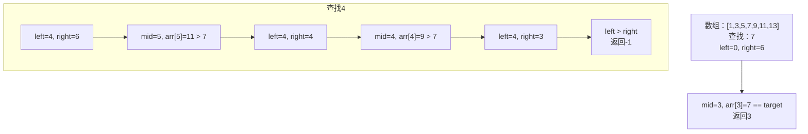
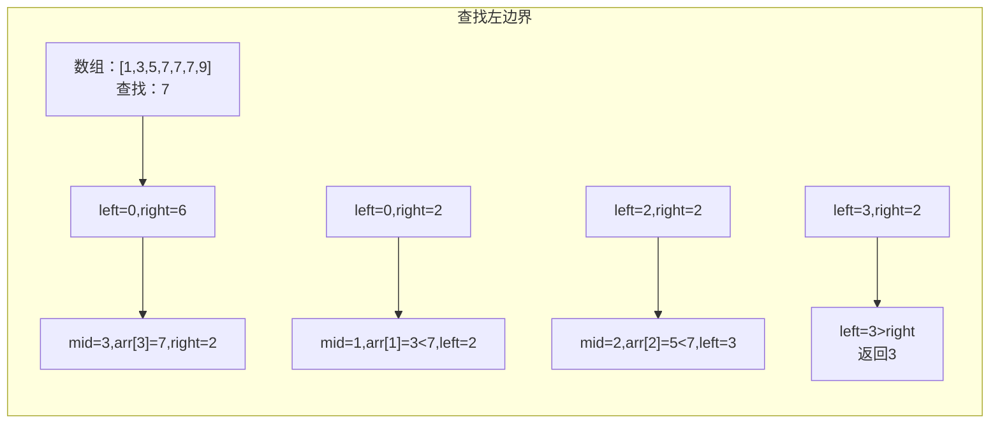
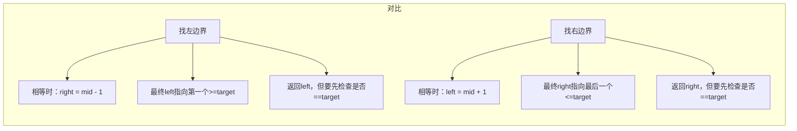
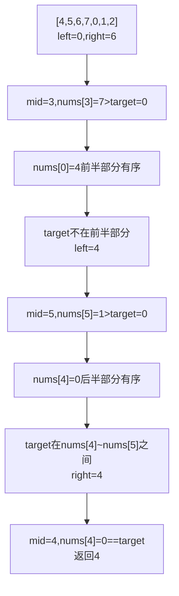
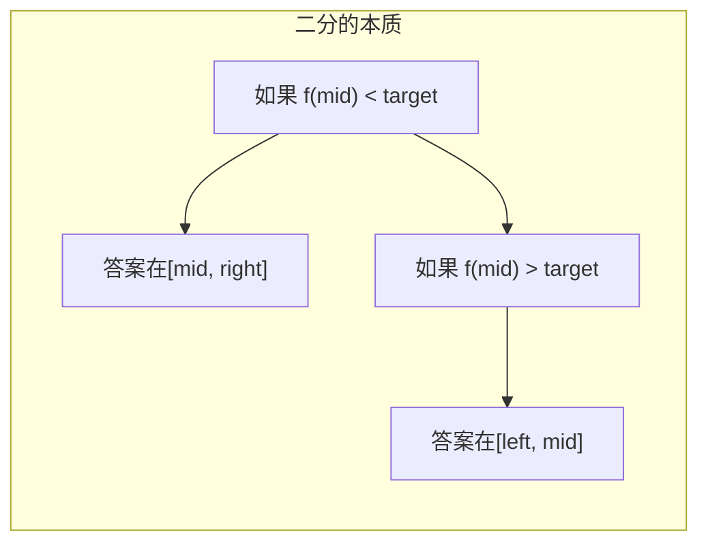

# 二分查找

面试官问："在有序数组`[1,3,5,7,9,11,13]`中查找7，写一下代码。"

候选人小张刷刷刷写完了：

```java
public int binarySearch(int[] arr, int target) {
    int left = 0;
    int right = arr.length;
    
    while (left <= right) {
        int mid = (left + right) / 2;
        if (arr[mid] == target) {
            return mid;
        } else if (arr[mid] < target) {
            left = mid;
        } else {
            right = mid;
        }
    }
    return -1;
}
```

面试官看了一眼，问："这个代码会死循环，你知道吗？"

小张愣住了...

---

## 一、从一个问题开始

二分查找是面试中出现频率最高的算法之一，90%的候选人能写出基本版本，但能正确处理边界条件的不超过60%，能熟练运用各种变体的不超过30%。

今天，我们把二分查找彻底讲透。

【直观类比】

二分查找就像猜数字游戏：
- 答案在1-100之间
- 你猜50，告诉你大了
- 你猜25，告诉你小了
- 你猜37，告诉你对了

每次猜完都排除一半的答案，这就是为什么二分查找只需要log₂(n)次就能找到目标。

---

## 二、基础二分查找

### 2.1 标准模板

```java
public int binarySearch(int[] arr, int target) {
    if (arr == null || arr.length == 0) return -1;
    
    int left = 0;
    int right = arr.length - 1;  // 关键1：right是长度-1
    
    while (left <= right) {       // 关键2：是 <=，不是 <
        int mid = left + (right - left) / 2;  // 关键3：防溢出
        
        if (arr[mid] == target) {
            return mid;
        } else if (arr[mid] < target) {
            left = mid + 1;       // 关键4：mid已经检查过，+1
        } else {
            right = mid - 1;      // 关键5：mid已经检查过，-1
        }
    }
    
    return -1;
}
```

### 2.2 四个关键边界问题

面试官问的问题就出在这里。让我们一一分析：

```java
// 问题1：right 的初始值
int right = arr.length - 1;  // 正确：闭区间 [left, right]
// 错误：int right = arr.length;  // 这会导致漏掉最后一个元素

// 问题2：循环条件
while (left <= right)  // 正确：等号不能丢
// 错误：while (left < right)  // 可能会漏掉 left == right 的情况

// 问题3：mid 的计算
int mid = left + (right - left) / 2;  // 正确：防溢出
// 错误：int mid = (left + right) / 2;  // 可能溢出

// 问题4：left 和 right 的更新
left = mid + 1;   // 正确：mid已经检查过
right = mid - 1;  // 正确：mid已经检查过
```

### 2.3 查找过程演示



---

## 三、二分查找的变体

### 3.1 查找左边界

找到**第一个**等于目标值的位置。

```java
public int leftBound(int[] arr, int target) {
    if (arr == null || arr.length == 0) return -1;
    
    int left = 0;
    int right = arr.length - 1;
    
    while (left <= right) {
        int mid = left + (right - left) / 2;
        if (arr[mid] < target) {
            left = mid + 1;
        } else if (arr[mid] > target) {
            right = mid - 1;
        } else {
            // 找到目标后不返回，继续向左找
            right = mid - 1;
        }
    }
    
    // 检查left是否越界，以及是否真的等于target
    if (left >= arr.length || arr[left] != target) {
        return -1;
    }
    return left;
}
```



### 3.2 查找右边界

找到**最后一个**等于目标值的位置。

```java
public int rightBound(int[] arr, int target) {
    if (arr == null || arr.length == 0) return -1;
    
    int left = 0;
    int right = arr.length - 1;
    
    while (left <= right) {
        int mid = left + (right - left) / 2;
        if (arr[mid] < target) {
            left = mid + 1;
        } else if (arr[mid] > target) {
            right = mid - 1;
        } else {
            // 找到目标后不返回，继续向右找
            left = mid + 1;
        }
    }
    
    // 检查right是否越界，以及是否真的等于target
    if (right < 0 || arr[right] != target) {
        return -1;
    }
    return right;
}
```

### 3.3 左边界 vs 右边界对比



---

## 四、旋转数组的二分查找

### 4.1 题目

假设一个排序数组在某个位置被旋转，例如`[4,5,6,7,0,1,2]`。

### 4.2 解法

```java
public int search(int[] nums, int target) {
    if (nums == null || nums.length == 0) return -1;
    
    int left = 0;
    int right = nums.length - 1;
    
    while (left <= right) {
        int mid = left + (right - left) / 2;
        
        if (nums[mid] == target) {
            return mid;
        }
        
        // 前半部分有序
        if (nums[left] <= nums[mid]) {
            // target在前半部分
            if (nums[left] <= target && target < nums[mid]) {
                right = mid - 1;
            } else {
                left = mid + 1;
            }
        } else {  // 后半部分有序
            // target在后半部分
            if (nums[mid] < target && target <= nums[right]) {
                left = mid + 1;
            } else {
                right = mid - 1;
            }
        }
    }
    
    return -1;
}
```



---

## 五、二分的本质

### 5.1 二分查找的适用范围

二分查找不只适用于排序数组，适用于任何满足**单调性**的问题：



```java
// 经典应用：求sqrt(x)
public int mySqrt(int x) {
    if (x < 0) return -1;
    
    long left = 0;
    long right = x;
    
    while (left <= right) {
        long mid = left + (right - left) / 2;
        long square = mid * mid;
        
        if (square == x) {
            return (int) mid;
        } else if (square < x) {
            left = mid + 1;
        } else {
            right = mid - 1;
        }
    }
    
    return (int) right;  // 返回向下取整的结果
}
```

### 5.2 二分答案

很多优化问题可以转化为二分查找：

```java
// 例子：给定产量数组，找到最小搬动次数，使得每次搬动不超过mid
public int minDays(int[] bloomDay, int m, int k) {
    // 二分答案：天数
    int left = 1;
    int right = Arrays.stream(bloomDay).max().getAsInt();
    
    while (left < right) {
        int mid = left + (right - left) / 2;
        if (canMake(bloomDay, m, k, mid)) {
            right = mid;  // 可以在mid天内完成
        } else {
            left = mid + 1;
        }
    }
    
    return left;
}
```

---

## 六、面试高频追问

### 6.1 追问一：为什么 mid = (left + right) / 2 可能溢出？

```java
// left 和 right 都是 int，最大值是 2^31 - 1
// left + right 可能超过 int 的范围，导致溢出变成负数

// 正确写法：
int mid = left + (right - left) / 2;
// 或者：
int mid = (left + right) >>> 1;  // 无符号右移
```

### 6.2 追问二：二分查找一定比线性查找快吗？

**不一定！**

```java
// 当 n 很小时，线性查找可能更快
// 因为二分查找有多次除法运算，常数因子较大

// 经验法则：
// n < 20：线性查找
// n >= 20：二分查找
```

### 6.3 追问三：如何在链表上实现二分查找？

```java
// 链表不支持随机访问，无法直接二分
// 但可以用跳表（Skip List）实现 O(logn) 查找

// 或者用以下方法：
// 1. 先遍历一次得到长度 n
// 2. 二分定位：走 n/2 步到 mid
// 3. 总时间复杂度 O(nlogn)，但避免了排序

public ListNode binarySearchOnList(ListNode head, int target) {
    int n = 0;
    ListNode curr = head;
    while (curr != null) {
        n++;
        curr = curr.next;
    }
    
    int left = 0, right = n - 1;
    while (left <= right) {
        int mid = left + (right - left) / 2;
        ListNode midNode = getNode(head, mid);
        
        if (midNode.val == target) return midNode;
        else if (midNode.val < target) left = mid + 1;
        else right = mid - 1;
    }
    return null;
}
```

---

## 七、常见误区

### ❌ 误区一：二分查找只能用于排序数组

**实际情况**：二分查找适用于任何**具有单调性**的问题，可以把问题转化为"答案是否可行"。

### ❌ 误区二：mid 的计算不重要

**实际情况**：mid 的计算错误可能导致死循环或漏掉元素。

### ❌ 误区三：二分查找一定比线性查找快

**实际情况**：对于小数据量，线性查找可能更快。

---

## 八、记忆技巧

用口诀记住边界条件：

> **左闭右开，左边+1；左开右闭，右边-1**

用口诀记住变体：

> **找左边界，right左移；找右边界，left右移**

---

## 九、实战检验

### 检验一：力扣704题 - 二分查找

```java
public int search(int[] nums, int target) {
    int left = 0, right = nums.length - 1;
    
    while (left <= right) {
        int mid = left + (right - left) / 2;
        if (nums[mid] == target) return mid;
        else if (nums[mid] < target) left = mid + 1;
        else right = mid - 1;
    }
    
    return -1;
}
```

### 检验二：力扣34题 - 在排序数组中查找元素的第一个和最后一个位置

```java
public int[] searchRange(int[] nums, int target) {
    int[] result = {-1, -1};
    result[0] = leftBound(nums, target);
    result[1] = rightBound(nums, target);
    return result;
}
```

### 检验三：力扣33题 - 搜索旋转排序数组

```java
public int search(int[] nums, int target) {
    // 见上面的旋转数组二分查找
}
```

---

## 十、总结

二分查找的核心是**每次排除一半**：

1. **确定搜索范围**：左闭右闭区间 `[left, right]`
2. **计算中点**：防溢出的 `mid = left + (right - left) / 2`
3. **判断并缩小范围**：根据 `arr[mid]` 与 `target` 的关系
4. **处理变体**：左边界、右边界需要特殊处理

记住这三句话：

1. **二分查找的本质是排除法，不是在数组里找，是在答案空间里找**
2. **边界条件是二分查找的核心，写错就死循环**
3. **二分查找不只适用于排序数组，适用于任何具有单调性的问题**

下一篇文章，我们来聊聊**LRU缓存**，看看如何设计一个高效的缓存淘汰机制。
