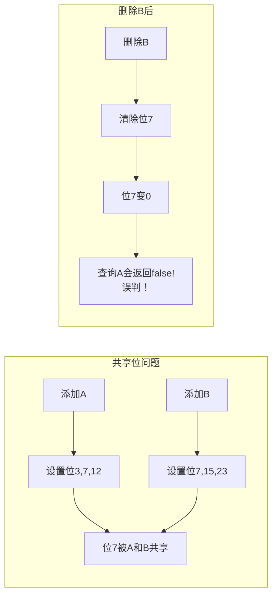
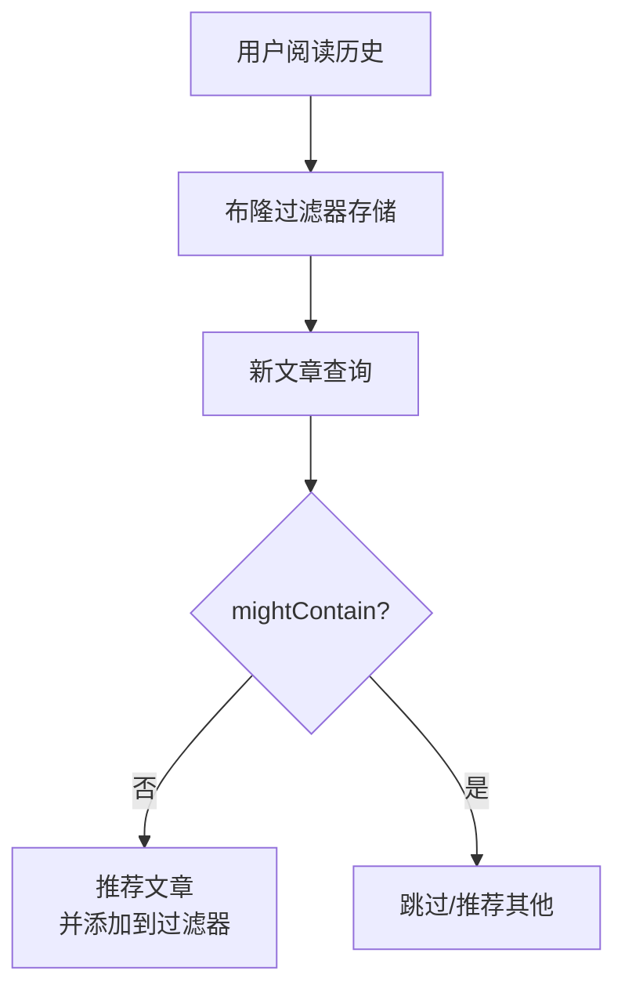

# 布隆过滤器原理与应用

面试官问："如果要判断一个URL是否已经被访问过，你会怎么做？"

候选人小张回答："用哈希表存储所有访问过的URL。"

面试官追问："如果有10亿个URL呢？"

小张愣住了...

---

## 一、从一个问题开始

布隆过滤器（Bloom Filter）是面试中的高频考点，90%的候选人能说出"用位数组判断元素是否存在"，但能解释误判率、不适用场景的不到30%。

今天，我们把布隆过滤器讲透。

【直观类比】

布隆过滤器就像一个**有风险的黑名单**：
- 如果布隆过滤器说"不在"，那**一定不在**
- 如果布隆过滤器说"在"，那**可能在**

这就是布隆过滤器的核心特性：**宁可错杀三千，不可放过一个**（误判只会有false positive，不会有false negative）。

---

## 二、核心原理

### 2.1 位数组

布隆过滤器使用一个**位数组**（bit array）来存储数据：

```java
// 用 long 数组实现位数组
// 每个 long 有 64 位
private long[] bitArray;
private int size;  // 位数组大小

public BloomFilter(int size) {
    this.size = size;
    this.bitArray = new long[(size + 63) / 64];  // 向上取整
}

// 设置第 i 位为 1
public void setBit(int i) {
    bitArray[i / 64] |= (1L << (i % 64));
}

// 获取第 i 位的值
public boolean getBit(int i) {
    return (bitArray[i / 64] & (1L << (i % 64))) != 0;
}
```

### 2.2 多个哈希函数

布隆过滤器使用**多个哈希函数**，每个哈希函数计算出一个位置：

```java
private static final int HASH_COUNT = 7;

private int hash1(String element) {
    return Math.abs(element.hashCode()) % size;
}

private int hash2(String element) {
    return Math.abs(element.hashCode() * 31) % size;
}

private int hash3(String element) {
    return Math.abs(element.hashCode() * 47) % size;
}

// ... 可以用更多哈希函数
```

### 2.3 添加和查询

```java
// 添加元素
public void add(String element) {
    for (int i = 0; i < HASH_COUNT; i++) {
        int index = hash(element, i);
        setBit(index);
    }
}

// 查询元素
public boolean mightContain(String element) {
    for (int i = 0; i < HASH_COUNT; i++) {
        int index = hash(element, i);
        if (!getBit(index)) {
            // 任何一个位置是 0，说明一定不存在
            return false;
        }
    }
    // 所有位置都是 1，可能存在（可能有误判）
    return true;
}

private int hash(String element, int seed) {
    // MurmurHash 或其他哈希算法
    return Math.abs((element.hashCode() * seed + 31) % size);
}
```

### 2.4 工作原理图解

```mermaid
flowchart TD
    subgraph 添加"google.com"
        A["位数组"] --> B["hash1 = 3"]
        B --> C["setBit(3)"]
        C --> D["hash2 = 7"]
        D --> E["setBit(7)"]
        E --> F["hash3 = 12"]
        F --> G["setBit(12)"]
    end
    
    subgraph 查询"google.com"
        H["检查位置3"] --> I{"是1?"}
        I -->|"是"| J["检查位置7"]
        J -->|"是"| K["检查位置12"]
        K -->|"是"| L["返回true<br/>可能存在"]
        I -->|"否"| M["返回false<br/>一定不存在"]
    end
```

---

## 三、误判率分析

### 3.1 误判率公式

布隆过滤器的误判率取决于三个因素：

```
n = 已添加的元素数量
m = 位数组大小
k = 哈希函数数量
```

**误判率公式**（近似）：

```
p = (1 - e^(-kn/m))^k
```

### 3.2 最优哈希函数数量

要使误判率最小，哈希函数的数量应为：

```
k = (m/n) * ln(2)
```

### 3.3 常见配置

| 元素数量n | 位数组大小m | 哈希函数k | 误判率 |
|-----------|-------------|-----------|--------|
| 100万 | 10MB | 7 | 1% |
| 100万 | 12MB | 7 | 0.5% |
| 1000万 | 100MB | 7 | 1% |

### 3.4 实际计算工具

```java
public class BloomFilterCalculator {
    // 计算最优哈希函数数量
    public static int optimalK(int m, int n) {
        return (int) Math.round((double) m / n * Math.log(2));
    }
    
    // 计算误判率
    public static double falsePositiveRate(int m, int n, int k) {
        double exponent = -k * n / (double) m;
        double p = Math.pow(1 - Math.exp(exponent), k);
        return p;
    }
    
    // 根据误判率反推位数组大小
    public static int optimalM(int n, double p) {
        return (int) Math.ceil(-n * Math.log(p) / (Math.log(2) * Math.log(2)));
    }
}
```

---

## 四、删除操作

### 4.1 为什么布隆过滤器不支持删除？

因为可能有**多个元素共享同一个位**：



### 4.2 计数布隆过滤器

**计数布隆过滤器**（Counting Bloom Filter）用计数器代替单个位，支持删除：

```java
private int[] counterArray;

public void add(String element) {
    for (int i = 0; i < HASH_COUNT; i++) {
        int index = hash(element, i);
        counterArray[index]++;  // 计数器+1
    }
}

public void remove(String element) {
    for (int i = 0; i < HASH_COUNT; i++) {
        int index = hash(element, i);
        counterArray[index]--;  // 计数器-1
    }
}
```

---

## 五、实际应用

### 5.1 Google Chrome：恶意URL检测

```
用户访问URL -> 检查布隆过滤器
                     |
                     ├── 不存在 -> 安全，直接访问
                     |
                     └── 存在 -> 可能危险，再查完整数据库确认
```

### 5.2 Redis：缓存穿透防护

```java
public String get(String key) {
    String value = redis.get(key);
    
    if (value == null) {
        // 布隆过滤器检查
        if (!bloomFilter.mightContain(key)) {
            // 布隆过滤器说一定不存在，直接返回null
            return null;
        }
        // 布隆过滤器说可能存在，查数据库
        value = db.get(key);
        redis.setex(key, 3600, value);
    }
    
    return value;
}
```

### 5.3 比特币：SPV节点

SPV（Simplified Payment Verification）节点使用布隆过滤器来查找与钱包相关的交易。

### 5.4  Medium：文章推荐去重



---

## 六、面试高频追问

### 6.1 追问一：布隆过滤器和哈希表的区别？

| 维度 | 布隆过滤器 | 哈希表 |
|------|-----------|--------|
| 空间 | 极小（1 bit/元素） | 大（数倍于元素） |
| 误判率 | 有 | 无 |
| 删除支持 | 不支持（标准版） | 支持 |
| false negative | 无 | 无 |

### 6.2 追问二：如何降低误判率？

1. **增加位数组大小**
2. **使用更多哈希函数**（但有最优值）
3. **定期重建布隆过滤器**

### 6.3 追问三：布隆过滤器能替代哈希表吗？

**不能**。布隆过滤器只能用于：
- 不需要100%准确
- 可以容忍误判
- 不需要删除的场景

---

## 七、边界与特例

### 7.1 位数组大小为0

```java
if (size <= 0) {
    throw new IllegalArgumentException("Size must be positive");
}
```

### 7.2 空字符串

```java
"".hashCode() == 0  // 需要特殊处理
```

### 7.3 哈希冲突

布隆过滤器利用哈希冲突来实现空间压缩，冲突越多，误判率越高。

---

## 八、常见误区

### ❌ 误区一：布隆过滤器可以删除元素

**实际情况**：标准布隆过滤器不支持删除。计数布隆过滤器可以，但空间会增大。

### ❌ 误区二：布隆过滤器没有误判

**实际情况**：布隆过滤器有误判率，但保证不会有false negative。

### ❌ 误区三：哈希函数越多越好

**实际情况**：哈希函数有最优值。太多会导致位数组被快速填满。

---

## 九、记忆技巧

用一句话记住布隆过滤器：

> **布隆过滤器：说不在一定不在，说在可能在**

用口诀记住适用场景：

> **海量数据去重判断，缓存穿透防护，查询数据库前先过滤**

---

## 十、实战检验

### 检验一：手写布隆过滤器

```java
public class BloomFilter {
    private long[] bitArray;
    private int size;
    private int hashCount;
    
    public BloomFilter(int expectedElements, double falsePositiveRate) {
        this.size = optimalSize(expectedElements, falsePositiveRate);
        this.hashCount = optimalHashCount(size, expectedElements);
        this.bitArray = new long[(size + 63) / 64];
    }
    
    public void add(String element) {
        for (int i = 0; i < hashCount; i++) {
            setBit(hash(element, i));
        }
    }
    
    public boolean mightContain(String element) {
        for (int i = 0; i < hashCount; i++) {
            if (!getBit(hash(element, i))) {
                return false;
            }
        }
        return true;
    }
    
    // ... 其他方法省略
}
```

---

## 十一、总结

布隆过滤器的核心是**用多个哈希函数和位数组实现空间压缩**：

1. **位数组**：用1 bit表示存在与否
2. **多个哈希函数**：降低误判率
3. **说不在一定不在，说在可能在**：核心特性

记住这三句话：

1. **布隆过滤器是空间换时间的典范，牺牲准确性换空间**
2. **误判率可控，但不会有false negative**
3. **不适合需要删除元素的场景**

下一篇文章，我们来聊聊**动态规划**，看看如何解决最优子结构和重叠子问题。
