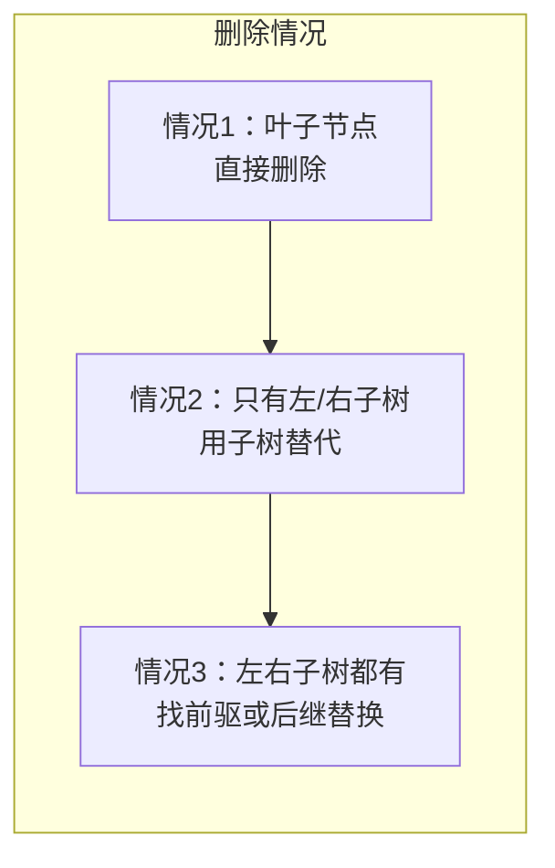
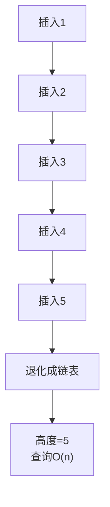
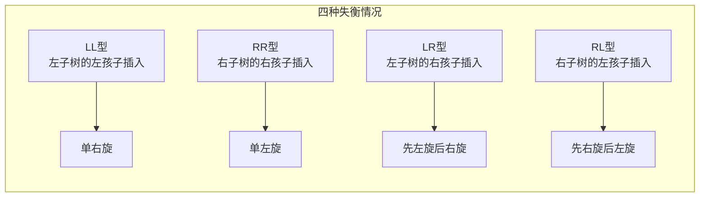
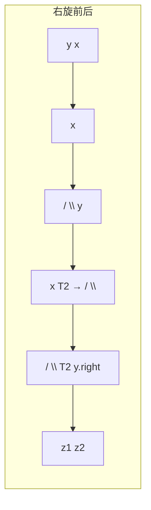

# 二叉搜索树与AVL树

面试官问："如果我往一棵二叉搜索树里依次插入1,2,3,4,5，会发生什么？"

候选人小张回答："会形成一个有序的二叉树，查询效率还是O(logn)。"

面试官追问："你自己画一下看看。"

小张在白板上画了：

```
    1
     \
      2
       \
        3
         \
          4
           \
            5
```

面试官："这棵树的高度是多少？查询效率还是O(logn)吗？"

小张愣住了...

---

## 一、从一个问题开始

很多人知道二叉搜索树（BST）查询效率是O(logn)，但忽略了一个前提：**树必须保持平衡**。

如果插入顺序是有序的，BST会退化成链表，查询效率退化成O(n)。

这节课，我们来看两种解决失衡问题的方案：AVL树和红黑树。

【直观类比】

二叉搜索树就像公司的组织架构：
- **平衡的BST**：扁平化管理，每个领导管3-5个人，沟通效率高
- **失衡的BST**：金字塔式管理，CEO→总监→经理→主管→员工，沟通链条太长

AVL树的使命就是**保持平衡**，确保任何一个节点的左右子树高度差不超过1。

---

## 二、二叉搜索树（BST）

### 2.1 BST的定义

BST（Binary Search Tree）满足以下特性：
- **左子树**所有节点的值 **< 根节点**的值
- **右子树**所有节点的值 **> 根节点**的值
- 左右子树本身也是BST

```java
public class TreeNode {
    int val;
    TreeNode left;
    TreeNode right;
    
    TreeNode(int val) {
        this.val = val;
        this.left = null;
        this.right = null;
    }
}
```

### 2.2 BST的基本操作

**查找**：

```java
public TreeNode search(TreeNode root, int target) {
    if (root == null || root.val == target) {
        return root;
    }
    if (target < root.val) {
        return search(root.left, target);
    } else {
        return search(root.right, target);
    }
}
```

**插入**：

```java
public TreeNode insert(TreeNode root, int val) {
    if (root == null) {
        return new TreeNode(val);
    }
    if (val < root.val) {
        root.left = insert(root.left, val);
    } else {
        root.right = insert(root.right, val);
    }
    return root;
}
```

**删除**（三种情况）：



```java
public TreeNode delete(TreeNode root, int val) {
    if (root == null) return null;
    
    if (val < root.val) {
        root.left = delete(root.left, val);
    } else if (val > root.val) {
        root.right = delete(root.right, val);
    } else {
        // 找到了要删除的节点
        if (root.left == null) return root.right;
        if (root.right == null) return root.left;
        
        // 左右子树都有：用后继节点替换
        TreeNode successor = findMin(root.right);
        root.val = successor.val;
        root.right = delete(root.right, successor.val);
    }
    return root;
}

private TreeNode findMin(TreeNode node) {
    while (node.left != null) {
        node = node.left;
    }
    return node;
}
```

### 2.3 BST的失衡问题

**有序插入导致退化**：



```java
// 按升序插入：1,2,3,4,5
//     1
//      \
//       2
//        \
//         3
//          \
//           4
//            \
//             5

// 按降序插入：5,4,3,2,1
//              5
//             /
//            4
//           /
//          3
//         /
//        2
//       /
//      1
```

**复杂度分析**：

| 操作 | 平衡BST | 失衡BST（退化链表） |
|------|---------|---------------------|
| 查找 | `O(logn)` | `O(n)` |
| 插入 | `O(logn)` | `O(n)` |
| 删除 | `O(logn)` | `O(n)` |

---

## 三、AVL树

### 3.1 AVL树的定义

AVL树是最早发明的自平衡二叉搜索树，由Adelson-Velsky和Landis在1962年发明。

**核心特性**：任意节点的左右子树高度差不超过1。

```java
public class AVLNode {
    int val;
    int height;
    AVLNode left;
    AVLNode right;
    
    AVLNode(int val) {
        this.val = val;
        this.height = 1;
        this.left = null;
        this.right = null;
    }
}

public class AVLTree {
    private AVLNode root;
    
    // 获取高度
    private int height(AVLNode node) {
        return node == null ? 0 : node.height;
    }
    
    // 获取平衡因子（左子树高度 - 右子树高度）
    private int getBalance(AVLNode node) {
        return node == null ? 0 : height(node.left) - height(node.right);
    }
}
```

### 3.2 AVL树的旋转操作

当插入或删除节点后，可能导致树失衡。AVL树通过**旋转**来恢复平衡。



**右旋（LL型）**：

```java
private AVLNode rightRotate(AVLNode y) {
    AVLNode x = y.left;
    AVLNode T2 = x.right;
    
    // 执行旋转
    x.right = y;
    y.left = T2;
    
    // 更新高度（注意顺序：先更新y，再更新x）
    y.height = Math.max(height(y.left), height(y.right)) + 1;
    x.height = Math.max(height(x.left), height(x.right)) + 1;
    
    return x;
}
```



**左旋（RR型）**：

```java
private AVLNode leftRotate(AVLNode x) {
    AVLNode y = x.right;
    AVLNode T2 = y.left;
    
    // 执行旋转
    y.left = x;
    x.right = T2;
    
    // 更新高度
    x.height = Math.max(height(x.left), height(x.right)) + 1;
    y.height = Math.max(height(y.left), height(y.right)) + 1;
    
    return y;
}
```

### 3.3 AVL树的插入

```java
public AVLNode insert(AVLNode node, int val) {
    // 1. 普通BST插入
    if (node == null) return new AVLNode(val);
    
    if (val < node.val) {
        node.left = insert(node.left, val);
    } else if (val > node.val) {
        node.right = insert(node.right, val);
    } else {
        return node;  // 不允许重复值
    }
    
    // 2. 更新高度
    node.height = Math.max(height(node.left), height(node.right)) + 1;
    
    // 3. 获取平衡因子，检查是否失衡
    int balance = getBalance(node);
    
    // 4. 失衡了，需要旋转恢复平衡
    
    // LL型：右旋
    if (balance > 1 && val < node.left.val) {
        return rightRotate(node);
    }
    
    // RR型：左旋
    if (balance < -1 && val > node.right.val) {
        return leftRotate(node);
    }
    
    // LR型：先左旋后右旋
    if (balance > 1 && val > node.left.val) {
        node.left = leftRotate(node.left);
        return rightRotate(node);
    }
    
    // RL型：先右旋后左旋
    if (balance < -1 && val < node.right.val) {
        node.right = rightRotate(node.right);
        return leftRotate(node);
    }
    
    return node;
}
```

### 3.4 AVL vs 普通BST

| 特性 | 普通BST | AVL树 |
|------|---------|-------|
| 平衡性 | 依赖插入顺序 | 始终平衡 |
| 高度 | 最坏O(n) | 保证O(logn) |
| 查询效率 | 不稳定 | 稳定O(logn) |
| 插入/删除开销 | 低 | 每次需要O(logn)旋转调整 |
| 适用场景 | 插入顺序随机 | 插入顺序可能有序 |

---

## 四、面试高频追问

### 4.1 追问一：AVL树和红黑树的区别是什么？

这是面试中的经典问题。

| 特性 | AVL树 | 红黑树 |
|------|-------|--------|
| 平衡标准 | 高度差 `<= 1` | 黑色高度相等 |
| 平衡强度 | 严格平衡 | 近似平衡 |
| 旋转次数 | 最多2次 | 最多3次 |
| 查询效率 | 更高 | 略低但接近 |
| 插入/删除效率 | 略低（需更多旋转） | 更高 |
| 典型应用 | 数据库索引 | Java HashMap、TreeMap、Linux进程调度 |

【直观类比】

AVL树就像"强迫症管理者"：每个部门人数必须完全相等（或差1）。
红黑树就像"灵活管理者"：允许部门人数有一定弹性，只要满足特定规则就行。

### 4.2 追问二：为什么MySQL用B+树而不是AVL树？

| 维度 | AVL树 | B+树 |
|------|-------|------|
| 适用场景 | 内存 | 磁盘 |
| 扇出度 | 低（每个节点2个子节点） | 高（每个节点数百个子节点） |
| I/O次数 | 多（树高） | 少（树矮） |
| 磁盘友好性 | 差 | 好 |
| 范围查询 | 需要中序遍历 | 叶节点链表连接，O(1) |

---

## 五、边界与特例

### 5.1 只有单个节点的树

```java
// AVL树插入第一个节点
// height = 1, balance = 0
// 不需要旋转
```

### 5.2 连续插入导致多次旋转

```java
// 按顺序插入：3, 2, 1
// 第1步：插入3
// 第2步：插入2，触发一次右旋
// 第3步：插入1，又触发一次右旋
```

### 5.3 平衡因子的边界

```java
// 平衡因子只能是 -1, 0, 1
// 如果变成 -2 或 2，就需要旋转调整
```

---

## 六、常见误区

### ❌ 误区一：BST查询一定是O(logn)

**实际情况**：只有平衡的BST才是O(logn)，失衡的可能退化成O(n)。

### ❌ 误区二：AVL树一定比BST好

**实际情况**：对于插入顺序随机的场景，普通BST的期望高度就是O(logn)，AVL树的额外旋转开销反而是负担。

### ❌ 误区三：平衡因子只看绝对值

**实际情况**：平衡因子 = 左子树高度 - 右子树高度。`> 1`是左重，`< -1`是右重，处理方式不同。

---

## 七、记忆技巧

用一句话记住AVL的四种失衡：

> **LL（左左）要右旋，RR（右右）要左旋，LR（左右）先左后右，RL（右左）先右后左**

用口诀记住平衡因子判断：

> **balance > 1 看左边，balance < -1 看右边**

---

## 八、实战检验

### 检验一：力扣110题 - 平衡二叉树

```java
public boolean isBalanced(TreeNode root) {
    return checkHeight(root) != -1;
}

private int checkHeight(TreeNode node) {
    if (node == null) return 0;
    
    int left = checkHeight(node.left);
    if (left == -1) return -1;
    
    int right = checkHeight(node.right);
    if (right == -1) return -1;
    
    if (Math.abs(left - right) > 1) return -1;
    
    return Math.max(left, right) + 1;
}
```

### 检验二：力扣98题 - 验证BST

```java
public boolean isValidBST(TreeNode root) {
    return validate(root, Long.MIN_VALUE, Long.MAX_VALUE);
}

private boolean validate(TreeNode node, long min, long max) {
    if (node == null) return true;
    if (node.val <= min || node.val >= max) return false;
    return validate(node.left, min, node.val) && validate(node.right, node.val, max);
}
```

---

## 九、总结

BST和AVL树的选择，本质上是**查询效率与维护成本的权衡**：

1. **BST**：简单高效，但依赖插入顺序
2. **AVL树**：严格平衡，但有额外的旋转开销
3. **红黑树**：近似平衡（下一篇文章），综合性能更好

记住这三句话：

1. **BST的O(logn)是有前提的——树必须保持平衡**
2. **AVL通过旋转保持平衡，但有维护成本**
3. **没有最好的数据结构，只有最适合场景的数据结构**

下一篇文章，我们来深入研究**红黑树**，看看Java的HashMap和TreeMap为什么选择了它。
