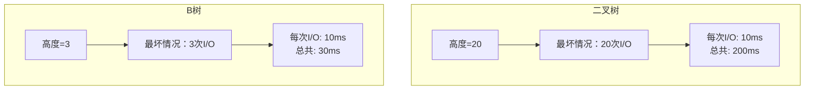
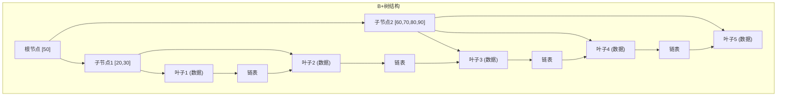
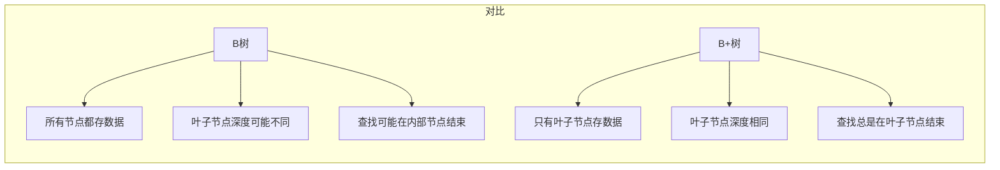
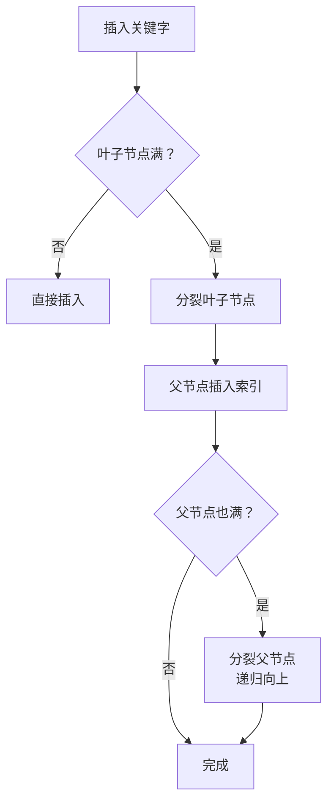

# B树与B+树对比

面试官问："MySQL为什么用B+树而不是B树作为索引？红黑树不行吗？"

候选人小张回答："因为B+树更扁平，查询更快。"

面试官追问："怎么个扁平法？为什么红黑树不适合数据库？"

小张支支吾吾...

---

## 一、从一个问题开始

数据库索引是面试中的高频考点，但很多人只背了"B+树比B树好"这个结论，却不理解**为什么**。

今天，我们从磁盘I/O的视角，把B树和B+树讲透。

【直观类比】

想象你要在一本1000页的字典里查"数据结构"这个词：

- **二叉树（如红黑树）**：像"翻到任意页后，只能看前后几页"，需要翻很多次
- **B树**：像"每页有几十个词条和页码"，翻几页就能找到
- **B+树**：像"把所有词都放到目录页，所有页码都指向数据页"，更高效

---

## 二、从磁盘I/O视角理解

### 2.1 为什么数据库不���二叉树？

首先看一个关键公式：

```
访问时间 = 寻道时间 + 旋转延迟 + 传输时间
```

机械硬盘的寻道时间可能是**毫秒级**，而内存访问是**纳秒级**，差了**10万倍**！

所以数据库索引必须：**尽量减少磁盘I/O次数**。

### 2.2 二叉树 vs B树的I/O对比

假设有100万条数据：

| 树类型 | 树高（最坏） | 磁盘I/O次数 |
|--------|-------------|-------------|
| 红黑树 | `log2(100万)` ≈ 20 | 最坏20次 |
| B树（m=100） | `log_m(100万)` ≈ 3 | 最坏3次 |



B树每高一层，能索引的数据量是**指数级增长**的！

---

## 三、B树的定义与结构

### 3.1 B树的定义

B树（Balance Tree）是一种**多路平衡查找树**，满足以下特性：

1. 每个节点最多有**m**个子节点
2. 每个非根非叶子节点至少有**m/2**个子节点
3. 根节点至少有2个子节点（除非是叶子）
4. 有k个子节点的节点有k-1个关键字
5. 所有叶子节点在同一层

### 3.2 B树的结构

```mermaid
graph TD
    subgraph B树结构（m=3）
        A["根节点 [50]"]
        A --> B["子节点1 [20,30]"]
        A --> C["子节点2 [60,70,80]"]
        A --> D["子节点3 [90]"]
        
        B --> E["叶子1"]
        B --> F["叶子2"]
        C --> G["叶子3"]
        C --> H["叶子4"]
        D --> I["叶子5"]
    end
```

```java
public class BTreeNode {
    int[] keys;        // 关键字数组
    BTreeNode[] children;  // 子节点指针
    int n;            // 当前关键字数量
    boolean leaf;     // 是否是叶子节点
    
    BTreeNode(int t) {
        keys = new int[2 * t - 1];
        children = new BTreeNode[2 * t];
        n = 0;
        leaf = true;
    }
}
```

### 3.3 B树的关键特性

| 参数 | 说明 |
|------|------|
| t | 最小度数（minimum degree），每个节点至少有t-1个最多2t-1个关键字 |
| m = 2t | 最大子节点数 |
| 高度 h | `h <= log_t((n+1)/2)` |

---

## 四、B+树的定义与结构

### 4.1 B+树的核心改进

B+树是B树的变体，有两个关键变化：

1. **所有数据都存储在叶子节点**
2. **叶子节点之间用链表相连**

### 4.2 B+树的结构



### 4.3 B+树 vs B树的关键区别



---

## 五、面试高频追问：为什么MySQL用B+树？

### 5.1 范围查询优势

**B树**：需要中序遍历，可能在不同分支间跳跃


**B+树**：叶子节点链表连接，可以顺序扫描

```java
// B+树范围查询：O(1)定位起点 + O(结果集)
public List<Integer> rangeQuery(BPlusTree tree, int start, int end) {
    List<Integer> result = new ArrayList<>();
    BPlusNode node = tree.lowerBound(start);  // O(log n)
    
    while (node != null) {
        for (int key : node.keys) {
            if (key > end) return result;
            result.add(key);
        }
        node = node.next;  // 链表顺序访问，O(1)
    }
    return result;
}
```

### 5.2 查询稳定性

B树的查找可能在任意层结束（如果找到关键字），时间复杂度不稳定。

B+树的查找**必须到叶子节点**，每次查询的I/O次数固定。

### 5.3 磁盘利用率

| 维度 | B树 | B+树 |
|------|-----|------|
| 非叶子节点存储 | 关键字 + 数据 | 关键字 + 指针 |
| 空间利用率 | 较低 | 更高 |
| 相同数据量 | 树更高 | 树更矮 |

B+树的非叶子节点不存储数据，可以存放更多的索引项，扇出度更高。

---

## 六、边界与特例

### 6.1 B树的分裂

当节点关键字达到2t-1时，需要分裂：

```java
public void splitChild(BTreeNode parent, int i) {
    BTreeNode y = parent.children[i];
    BTreeNode z = new BTreeNode(y.t);
    z.leaf = y.leaf;
    z.n = y.t - 1;
    
    // 把关键字复制到新节点
    for (int j = 0; j < y.t - 1; j++) {
        z.keys[j] = y.keys[j + y.t];
    }
    if (!y.leaf) {
        for (int j = 0; j < y.t; j++) {
            z.children[j] = y.children[j + y.t];
        }
    }
    
    y.n = y.t - 1;
    parent.insertKey(y.keys[y.t - 1]);  // 提升中间关键字
    parent.children[i + 1] = z;
}
```

### 6.2 B+树的插入

B+树插入时，如果叶子节点满，需要分裂并在上层插入新的索引项。



---

## 七、常见误区

### ❌ 误区一：B+树就是B树加了链表

**实际情况**：B+树有两个关键改进：1）只有叶子节点存数据；2）叶子节点链表相连。不能只看到第二点。

### ❌ 误区二：B树的查找一定比B+树慢

**实际情况**：对于精确查找，B树可能更快（不用查到叶子），但数据库更看重**稳定性**和**范围查询**。

### ❌ 误区三：m越大越好

**实际情况**：m受制于磁盘页大小（通常是4KB或16KB），需要平衡I/O效率和内存使用。

---

## 八、记忆技巧

用对比表记住B树 vs B+树：

| 特性 | B树 | B+树 |
|------|-----|------|
| 关键字 | 所有节点 | 只有叶子 |
| 叶子连接 | 无 | 有（链表） |
| 范围查询 | 需要回溯 | 顺序扫描 |
| I/O次数 | 不稳定 | 稳定 |
| 数据库应用 | NoSQL | MySQL |

用一句话记住选择：

> **MySQL选B+树，是因为范围查询的稳定性和磁盘友好的高扇出度**

---

## 九、实战检验

### 检验一：理解B树的分裂

```java
// B树节点满时的分裂过程
// 假设t=2，节点最多4个关键字
// 满节点：[10,20,30,40]
// 分裂后：[10] [30] 新节点：[40]
// 中间值30提升到父节点
```

### 检验二：计算B树高度

假设：
- 每行数据1KB
- 每个索引节点16KB（m约160）
- 100万条数据

计算B+树的高度：
- 根节点：最多160个索引
- 第二层：最多160² = 25600个索引
- 第三层：指向数据，能覆盖100万条

**结论：三层B+树就能索引100万条数据，只需3次I/O！**

---

## 十、总结

B树与B+树的选择，本质上是**I/O效率与查询特性的权衡**：

1. **B树**：适合随机查询，但范围查询需要回溯
2. **B+树**：适合范围查询稳定，但精确查找可能多一次I/O

记住这三句话：

1. **数据库选B+树，是因为I/O次数少且稳定**
2. **范围查询是数据库的灵魂，B+树的链表设计完美支持**
3. **磁盘页大小决定了B+树的阶数m**

下一篇文章，我们来聊聊**排序算法**，从最简单的冒泡排序开始。
