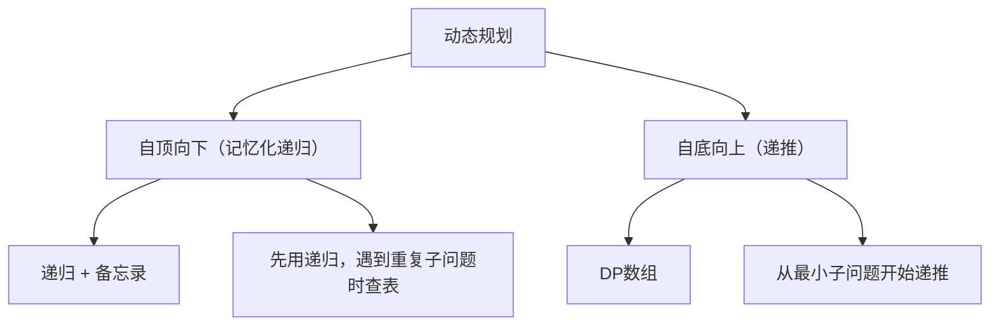
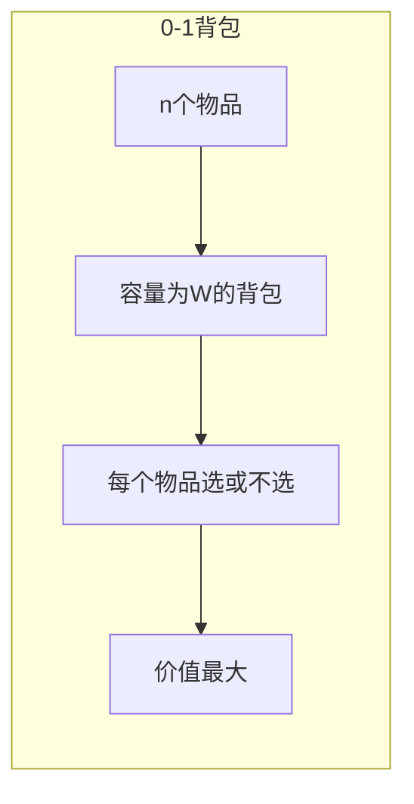
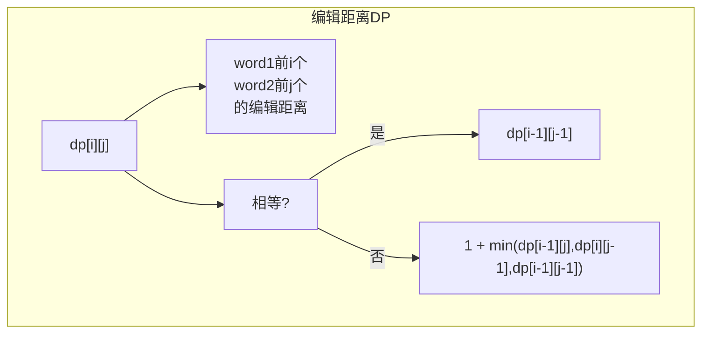
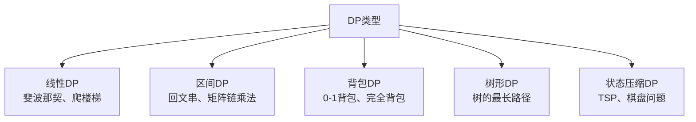

# 动态规划经典问题

面试官问："爬楼梯，一次可以爬1步或2步，爬到第n层有几种方法？"

候选人小张回答："斐波那契数列，f(n) = f(n-1) + f(n-2)。"

面试官追问："如果一次可以爬1步、2步或3步呢？"

小张说："那就改成 f(n) = f(n-1) + f(n-2) + f(n-3)。"

面试官点点头，又问："如果台阶有代价，爬每一步都要花钱，怎么求最小代价？"

小张彻底卡住了...

---

## 一、从一个问题开始

动态规划（DP）是面试中最难的算法之一，90%的候选人知道斐波那契，但能独立解决背包问题、编辑距离的不超过30%。

今天，我们把动态规划讲透。

【直观类比】

动态规划就像**剥洋葱**：
- 把大问题**分解**成小问题
- 小问题的解**复用**给大问题
- 从最小的子问题**自底向上**求解

---

## 二、动态规划基础

### 2.1 动态规划的三大条件

一个问题是动态规划问题，必须满足：

1. **最优子结构**：子问题的最优解能推出原问题的最优解
2. **无后效性**：当前状态的选择不影响后续状态
3. **重叠子问题**：子问题会被重复计算

### 2.2 动态规划的两种实现



---

## 三、经典问题

### 3.1 爬楼梯（Fibonacci变体）

```java
// 普通递归（指数级）
public int climbStairs(int n) {
    if (n <= 2) return n;
    return climbStairs(n - 1) + climbStairs(n - 2);
}

// 记忆化递归（自顶向下）
public int climbStairsMemo(int n, int[] memo) {
    if (n <= 2) return n;
    if (memo[n] != 0) return memo[n];
    memo[n] = climbStairsMemo(n - 1, memo) + climbStairsMemo(n - 2, memo);
    return memo[n];
}

// DP数组（自底向上）
public int climbStairsDP(int n) {
    if (n <= 2) return n;
    int[] dp = new int[n + 1];
    dp[1] = 1;
    dp[2] = 2;
    for (int i = 3; i <= n; i++) {
        dp[i] = dp[i - 1] + dp[i - 2];
    }
    return dp[n];
}

// 空间优化：只需要前两个状态
public int climbStairsOptimized(int n) {
    if (n <= 2) return n;
    int prev = 1, curr = 2;
    for (int i = 3; i <= n; i++) {
        int sum = prev + curr;
        prev = curr;
        curr = sum;
    }
    return curr;
}
```

### 3.2 最小花费爬楼梯

```java
// 题目：每一步台阶有代价，求最小代价
// 数组 cost 表示每一步的代价，可以从第0或第1步开始

public int minCostClimbingStairs(int[] cost) {
    int n = cost.length;
    int[] dp = new int[n + 1];
    dp[0] = 0;      // 从第0步开始，花费0
    dp[1] = 0;      // 从第1步开始，花费0
    
    for (int i = 2; i <= n; i++) {
        // 要到达第i步，可以从i-1走一步，或从i-2走两步
        dp[i] = Math.min(dp[i - 1] + cost[i - 1], 
                        dp[i - 2] + cost[i - 2]);
    }
    
    return dp[n];
}

// 空间优化
public int minCostClimbingStairsOptimized(int[] cost) {
    int n = cost.length;
    int prev = 0, curr = 0;
    for (int i = 2; i <= n; i++) {
        int next = Math.min(prev + cost[i - 2], curr + cost[i - 1]);
        prev = curr;
        curr = next;
    }
    return curr;
}
```

### 3.3 背包问题



```java
// 0-1背包：每个物品只能选一次
// w[i]：第i个物品的重量
// v[i]：第i个物品的价值
// W：背包容量

public int knapsack(int[] w, int[] v, int W) {
    int n = w.length;
    int[][] dp = new int[n + 1][W + 1];
    
    for (int i = 1; i <= n; i++) {
        for (int j = 0; j <= W; j++) {
            if (w[i - 1] <= j) {
                // 可以选或不选第i个物品
                dp[i][j] = Math.max(dp[i - 1][j], 
                                   dp[i - 1][j - w[i - 1]] + v[i - 1]);
            } else {
                // 不能选第i个物品
                dp[i][j] = dp[i - 1][j];
            }
        }
    }
    
    return dp[n][W];
}

// 空间优化：一维DP数组
public int knapsackOptimized(int[] w, int[] v, int W) {
    int n = w.length;
    int[] dp = new int[W + 1];
    
    for (int i = 0; i < n; i++) {
        // 必须从后往前遍历，否则会重复使用物品
        for (int j = W; j >= w[i]; j--) {
            dp[j] = Math.max(dp[j], dp[j - w[i]] + v[i]);
        }
    }
    
    return dp[W];
}
```

### 3.4 编辑距离

```java
// 将 word1 转换成 word2 的最少操作次数
// 操作：插入、删除、替换

public int minDistance(String word1, String word2) {
    int m = word1.length();
    int n = word2.length();
    
    int[][] dp = new int[m + 1][n + 1];
    
    // 初始化：第一行和第一列
    for (int i = 0; i <= m; i++) dp[i][0] = i;  // 删除i个字符
    for (int j = 0; j <= n; j++) dp[0][j] = j;  // 插入j个字符
    
    for (int i = 1; i <= m; i++) {
        for (int j = 1; j <= n; j++) {
            if (word1.charAt(i - 1) == word2.charAt(j - 1)) {
                dp[i][j] = dp[i - 1][j - 1];  // 不操作
            } else {
                dp[i][j] = 1 + Math.min(
                    dp[i - 1][j],      // 删除
                    Math.min(dp[i][j - 1],  // 插入
                             dp[i - 1][j - 1])  // 替换
                );
            }
        }
    }
    
    return dp[m][n];
}
```



---

## 四、DP问题解题套路

### 4.1 四步法

```
1. 定义状态：dp[i] 表示什么？
2. 状态转移：dp[i] = ?
3. 初始化：dp[0]、dp[1] 等
4. 遍历顺序：从小到大还是从大到小？
```

### 4.2 常见DP类型



---

## 五、面试高频追问

### 5.1 追问一：什么情况下需要二维DP？

当状态需要**两个维度**时：

```java
// 爬楼梯：一维DP
int[] dp = new int[n + 1];

// 编辑距离：二维DP
int[][] dp = new int[m + 1][n + 1];
// dp[i][j]：word1前i个字符，word2前j个字符
```

### 5.2 追问二：空间优化怎么做？

如果当前状态只依赖前几个状态，就可以压缩空间：

```java
// 原版：dp[i] 只依赖 dp[i-1] 和 dp[i-2]
int[] dp = new int[n];
// 优化：
int prev = 1, curr = 2;
```

### 5.3 追问三：DP和递归的区别？

| 维度 | 递归 | 动态规划 |
|------|------|---------|
| 方式 | 自顶向下 | 自底向上 |
| 效率 | 有重复计算 | 无重复计算 |
| 空间 | 调用栈 | DP数组 |
| 边界 | 需要终止条件 | 需要初始化 |

---

## 六、常见误区

### ❌ 误区一：所有问题都能用DP

**实际情况**：DP只适用于有**最优子结构**和**重叠子问题**的问题。

### ❌ 误区二：DP一定要用二维数组

**实际情况**：很多问题可以优化到一维数组。

### ❌ 误区三：空间优化总是可行的

**实际情况**：有些问题必须用二维数组，因为依赖关系比较复杂。

---

## 七、记忆技巧

用口诀记住DP四步：

> **定义状态写方程，初始条件不能忘，遍历顺序要看清，空间优化看依赖**

用一句话记住DP的本质：

> **DP就是用空间换时间，把重复计算变成查表**

---

## 八、实战检验

### 检验一：力扣70题 - 爬楼梯

```java
public int climbStairs(int n) {
    if (n <= 2) return n;
    int prev = 1, curr = 2;
    for (int i = 3; i <= n; i++) {
        int sum = prev + curr;
        prev = curr;
        curr = sum;
    }
    return curr;
}
```

### 检验二：力扣416题 - 分割等和子集

```java
public boolean canPartition(int[] nums) {
    int sum = Arrays.stream(nums).sum();
    if (sum % 2 != 0) return false;
    
    int target = sum / 2;
    int[] dp = new int[target + 1];
    
    for (int num : nums) {
        for (int j = target; j >= num; j--) {
            dp[j] = Math.max(dp[j], dp[j - num] + num);
        }
    }
    
    return dp[target] == target;
}
```

---

## 九、总结

动态规划的核心是**分解问题、复用子问题答案**：

1. **定义状态**：搞清楚 dp[i] 表示什么
2. **状态转移**：dp[i] = f(dp[i-1], dp[i-2], ...)
3. **初始化**：边界条件
4. **空间优化**：看依赖关系

记住这三句话：

1. **DP的本质是把指数级的递归优化成多项式级的递推**
2. **空间优化要看状态依赖，能省就省**
3. **DP难在定义状态，状态定义对了就成功一半**

下一篇文章，我们来聊聊**双指针技巧**，看看如何用O(1)空间解决数组问题。
