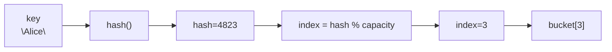
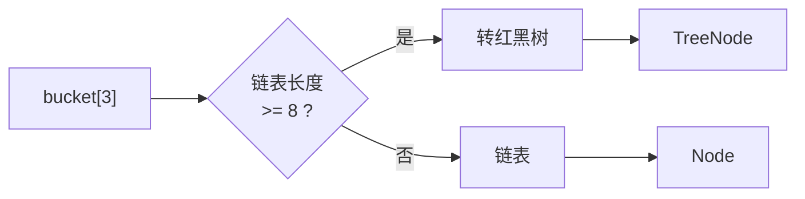
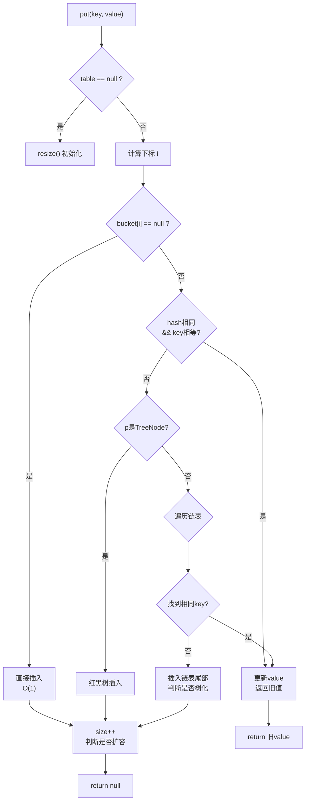
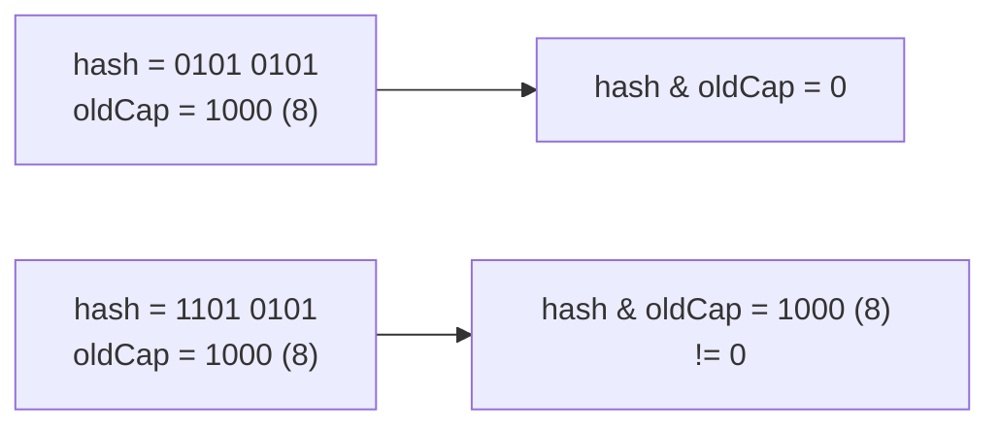
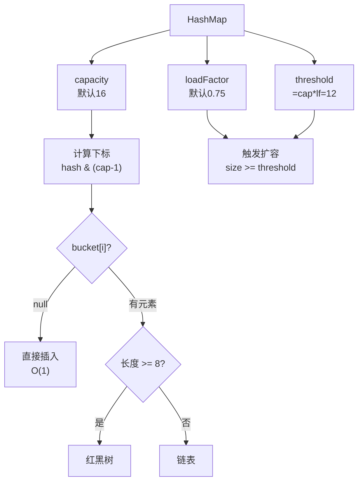

# 哈希表原理

面试官问："哈希表是怎么实现的？为什么它能做到O(1)的查询效率？"

候选人小王回答："哈希表通过哈希函数计算key的哈希值，然后直接定位到数据存储位置，所以是O(1)。"

面试官点点头，又问："那如果两个不同的key计算出了相同的哈希值，怎么办？"

小王说："用链表或者红黑树存储冲突的元素。"

面试官追问："JDK 8里，为什么链表转红黑树的阈值是8？"

小王愣住了...

---

## 一、从一个问题开始

90%的候选人被问到"哈希表"，能答出"哈希函数"、"哈希冲突"、"链地址法"。但能回答"为什么链表转红黑树的阈值是8"的，不超过20%。

这就是"背八股"和"真正理解"的差距。

今天，我们把哈希表的每一个设计细节讲透。

【直观类比】

想象你有一排储物柜，每个柜子对应一个编号。你把物品存进去时，不是按顺序放，而是根据物品特征计算一个编号。

比如"手机"算出来是3号柜，"钥匙"算出来是7号柜，"钱包"也算出来是3号柜。

3号柜现在就放了"手机"和"钱包"两样东西。这就是**哈希冲突**。

怎么处理？
- 方案A：3号柜做成一个大柜子，能放很多东西（开放地址法）
- 方案B：3号柜里放一个小盒子，盒子不够了换成箱子（链表/红黑树）

JDK选择了方案B，但加了一个优化：盒子太满就换成箱子。

---

## 二、核心原理

### 2.1 哈希函数

哈希函数的作用是把任意长度的key转换成固定长度的哈希值：



```java
// 最简单的哈希函数
public int hash(String key) {
    int h = key.hashCode();
    // 扰动函数：让哈希值分布更均匀
    return h ^ (h >>> 16);
}

// 计算数组下标
public int indexFor(int h, int length) {
    return h & (length - 1);  // 等价于 h % length，但更快
}
```

**一个好的哈希函数应该满足**：
1. **确定性**：相同输入产生相同输出
2. **均匀性**：哈希值分布均匀，减少冲突
3. **高效性**：计算速度快

### 2.2 哈希表结构演进

#### JDK 1.7 之前：数组 + 链表

```java
transient Entry<K, V>[] table;

static class Entry<K, V> {
    final K key;
    V value;
    Entry<K, V> next;  // 指向冲突元素的链表
    int hash;
}
```

```mermaid
graph LR
    subgraph HashMap结构
        A["table[0]"] -->|"null"| A1[""]
        B["table[1]"] --> B1["Entry1 → Entry2"]
        C["table[2]"] -->|"null"| C1[""]
        D["table[3]"] --> D1["Entry3 → Entry4 → Entry5"]
        E["table[4]"] -->|"null"| E1[""]
    end
```

#### JDK 1.8：数组 + 链表 + 红黑树

```java
transient Node<K, V>[] table;

static class Node<K, V> {
    final int hash;
    final K key;
    V value;
    Node<K, V> next;
}

static final class TreeNode<K, V> extends LinkedHashMap.Entry<K, V> {
    TreeNode<K, V> parent;
    TreeNode<K, V> left;
    TreeNode<K, V> right;
    // 红黑树相关颜色、兄弟节点等
}
```



### 2.3 put流程详解

```java
public V put(K key, V value) {
    return putVal(hash(key), key, value, false, true);
}

final V putVal(int hash, K key, V value, boolean onlyIfAbsent, boolean evict) {
    Node<K, V>[] tab;
    Node<K, V> p;
    int n, i;
    
    // 1. 初始化或扩容
    if ((tab = table) == null || (n = tab.length) == 0)
        n = (tab = resize()).length;
    
    // 2. 计算下标，找桶
    if ((p = tab[i = (n - 1) & hash]) == null)
        tab[i] = newNode(hash, key, value, null);  // 桶为空，直接放
    else {
        // 3. 桶不为空，处理冲突
        Node<K, V> e;
        K k;
        
        if (p.hash == hash && ((k = p.key) == key || key.equals(k)))
            e = p;  // key已存在，更新value
        else if (p instanceof TreeNode)
            e = ((TreeNode<K, V>) p).putTreeVal(this, tab, hash, key, value);  // 红黑树
        else {
            // 链表遍历
            for (int binCount = 0; ; ++binCount) {
                if ((e = p.next) == null) {
                    p.next = newNode(hash, key, value, null);  // 插入链表尾部
                    // 链表长度 >= 8，转红黑树
                    if (binCount >= TREEIFY_THRESHOLD - 1)
                        treeifyBin(tab, i);
                    break;
                }
                if (e.hash == hash && ((k = e.key) == key || key.equals(k)))
                    break;
                p = e;
            }
        }
        
        // 4. key已存在，更新value
        if (e != null) {
            V oldValue = e.value;
            if (!onlyIfAbsent || oldValue == null)
                e.value = value;
            afterNodeAccess(e);
            return oldValue;
        }
    }
    
    // 5. modCount++
    ++modCount;
    // 6. 超过阈值，扩容
    if (++size > threshold)
        resize();
    
    afterNodeInsertion(evict);
    return null;
}
```



---

## 三、面试官追问：为什么链表转红黑树的阈值是8？

这是面试中的高频追问，能答出来的都是真正看过源码的。

### 3.1 泊松分布分析

JDK源码注释里解释了原因：

```java
/*
 * TreeNodes占用空间是普通Nodes的2倍，所以我们只在
 * 链表足够长时才使用TreeNodes，即bucket中节点数达到TREEIFY_THRESHOLD。
 * 
 * 理想情况下，随机哈希码下，链表节点数的分布遵循泊松分布，
 * 平均参数 lambda = 0.5。阈值8时的概率约为 0.00000006。
 * 换句话说，8个节点的链表已经非常罕见了。
 */
```

翻译成人话：**哈希冲突服从泊松分布，链表长度超过8的概率只有千万分之六。**

### 3.2 为什么不用更大的阈值？

| 阈值 | 链表查找时间 | 红黑树查找时间 | 红黑树空间开销 |
|------|-------------|---------------|---------------|
| 6 | O(6) | 不触发 | 无 |
| 7 | O(7) | 不触发 | 无 |
| 8 | O(8) | O(log8) | 每个节点多2个指针 |
| 10 | O(10) | O(log10) | 更多红黑树节点 |

**权衡点**：
- 阈值太小：频繁触发红黑树转换，增加复杂度
- 阈值太大：链表查询性能下降
- **8是经验值**：在查询性能（O(n) vs O(logn)）和空间开销之间取得平衡

【直观类比】

就像高速公路的收费站：
- 车少（`< 8`）：排一队人工收费也行
- 车多（`>= 8`）：改成ETC闸机（红黑树），虽然建设成本高，但通行效率高

---

## 四、扩容机制

### 4.1 什么时候扩容？

```java
// threshold = capacity * loadFactor
// 默认：initialCapacity=16, loadFactor=0.75
// threshold = 16 * 0.75 = 12
```

当`size >= threshold`时，触发扩容。

**为什么负载因子是0.75？**

和链表转红黑树的阈值一样，这也是个经验值：
- **太大**（如0.9）：空间利用率高，但哈希冲突严重，链表/红黑树变长
- **太小**（如0.5）：空间利用率低，冲突少，但容易扩容

0.75是在**空间和时间**之间的一个平衡点。

### 4.2 扩容时如何rehash？

**JDK 1.7 的问题**：扩容时重新计算每个元素的哈希值，元素位置可能完全改变。

```java
void transfer(Entry[] newTable) {
    Entry[] src = table;
    int newCapacity = newTable.length;
    for (int j = 0; j < src.length; j++) {
        Entry<K, V> e = src[j];
        if (e != null) {
            src[j] = null;  // 释放旧表
            do {
                Entry<K, V> next = e.next;
                // 重新计算哈希
                int i = indexFor(e.hash, newCapacity);
                // 头插法：新来的放前面
                e.next = newTable[i];
                newTable[i] = e;
                e = next;
            } while (e != null);
        }
    }
}
```

**JDK 1.8 的优化**：不再重新计算哈希，而是通过高位运算判断是否需要移动：

```java
// JDK 1.8 新增的优化
if ((e.hash & oldCap) == 0) {
    // 扩容后位置不变
    newTab[j] = loHead;
} else {
    // 扩容后位置 = 原位置 + oldCap
    newTab[j + oldCap] = hiHead;
}
```



这样**避免了rehash**，提升了扩容性能。

---

## 五、边界与特例

### 5.1 哈希碰撞攻击

攻击者可能故意构造大量哈希值相同的key，导致HashMap退化成链表，查询时间从O(1)变成O(n)。

**JDK 1.8 的防御**：使用扰动函数`hash ^ (h >>> 16)`，混合高位信息，增加攻击难度。

```java
static final int hash(Object key) {
    int h;
    return (key == null) ? 0 : (h = key.hashCode()) ^ (h >>> 16);
}
```

### 5.2 null key 和 null value

```java
HashMap<String, Integer> map = new HashMap<>();
map.put(null, 1);     // key可以是null，放在bucket[0]
map.put("a", null);  // value可以是null
map.get(null);       // 返回1
map.get("b");        // 返回null（可能是null值，也可能是key不存在）
map.containsKey(null);  // 判断key是否存在
map.containsValue(null); // 判断value是否存在
```

### 5.3 fail-fast机制

当多个线程同时修改HashMap时，可能触发`ConcurrentModificationException`：

```java
Map<String, Integer> map = new HashMap<>();
map.put("a", 1);

for (String key : map.keySet()) {
    // 另一个线程调用 map.remove(key)
    // 触发 fail-fast
    if ("a".equals(key)) {
        map.remove(key);  // 可能抛出ConcurrentModificationException
    }
}
```

**原因**：HashMap使用`modCount`计数，结构性修改（扩容、删除）时modCount++，遍历时检查modCount是否变化。

---

## 六、常见误区

### ❌ 误区一：哈希表查询一定是O(1)

**实际情况**：
- 理想情况：`O(1)`
- 严重哈希冲突：`O(n)`（退化成链表）或`O(logn)`（红黑树）

### ❌ 误区二：红黑树一定比链表好

**实际情况**：
- 节点少时（`< 8`）：链表简单高效
- 节点多时（`>= 8`）：红黑树查询更快
- 红黑树空间开销是链表的2倍

### ❌ 误区三：哈希函数越复杂越好

**实际情况**：哈希函数需要在"计算速度"和"分布均匀性"之间权衡。太复杂会拖慢put/get性能。

---

## 七、记忆技巧

用一张图记住HashMap的核心参数：



---

## 八、实战检验

### 检验一：力扣1题 - 两数之和

```java
public int[] twoSum(int[] nums, int target) {
    Map<Integer, Integer> map = new HashMap<>();
    
    for (int i = 0; i < nums.length; i++) {
        int complement = target - nums[i];
        if (map.containsKey(complement)) {
            return new int[]{map.get(complement), i};
        }
        map.put(nums[i], i);
    }
    
    throw new IllegalArgumentException("No solution");
}
```

**考点**：哈希表加速查找，从O(n²)降到O(n)。

### 检验二：力扣387题 - 字符串中第一个唯一字符

```java
public int firstUniqChar(String s) {
    Map<Character, Integer> count = new HashMap<>();
    
    // 第一次遍历：统计每个字符出现次数
    for (char c : s.toCharArray()) {
        count.put(c, count.getOrDefault(c, 0) + 1);
    }
    
    // 第二次遍历：找第一个计数为1的字符
    for (int i = 0; i < s.length(); i++) {
        if (count.get(s.charAt(i)) == 1) {
            return i;
        }
    }
    
    return -1;
}
```

---

## 九、总结

哈希表的精髓在于**空间换时间**：用额外的哈希计算和冲突处理，换取O(1)的查询效率。

记住这三句话：

1. **哈希函数决定分布，分布决定冲突，冲突决定查询时间**
2. **链表和红黑树是冲突的两种应对策略，各有优劣**
3. **扩容是双刃剑：减少冲突但消耗性能**

下一篇文章，我们来聊聊**栈与队列**，看看这两个"受限"的数据结构如何在实际场景中大显身手。
