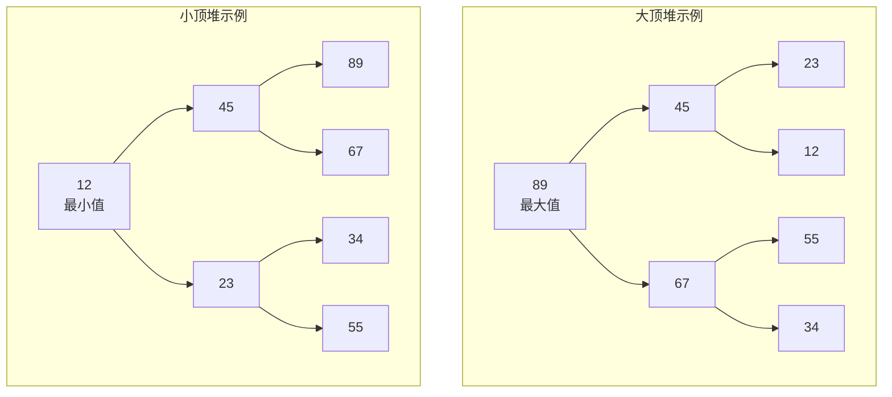
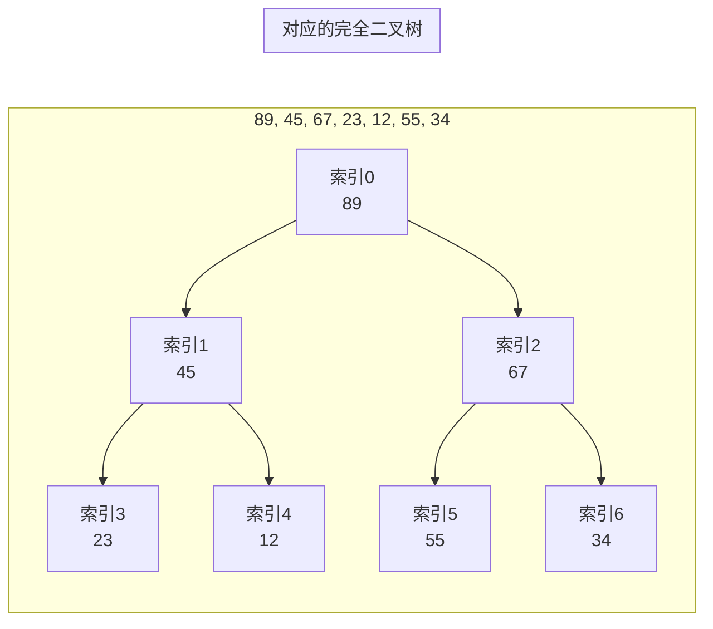
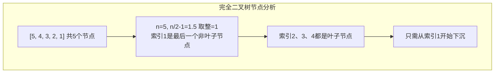
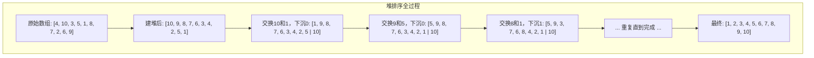
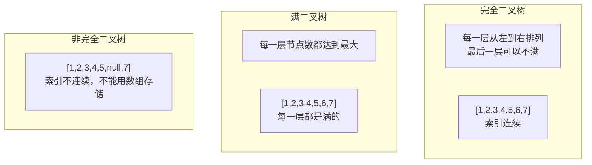

# 堆排序与优先队列

面试官问："如何在10亿个数中找出最大的100个数？"

候选人小张说："排序后取前100个，时间复杂度O(n log n)。"

面试官点点头："那如果内存只能放下1000个数呢？"

小张愣了一下，说："那...那就分批处理？"

面试官追问："不用排序，用什么数据结构能在O(n log k)内解决？"

小张开始挠头...

---

## 一、从一个问题开始

这道题是面试中出现频率最高的算法题之一。90%的候选人能想到排序，但能想到用堆的不到40%。

**答案是：维护一个大小为100的小顶堆。**

为什么小顶堆能解决这个问题？堆排序的原理是什么？让我们从头开始。

【直观类比】

想象你是一个班级的班长，需要随时知道班级里成绩最高的几个人：

- **排序的做法**：每次想知道前几名，就把全班成绩排一遍——太累了。
- **堆的做法**：你维护一张"尖子生榜"，只有比榜上最低分高的人才能上榜。来了新人就替换掉分数最低的那个。

**小顶堆**在这里就是那张"榜"——你关注的是榜上的"守门员"（最小值），而不是整个班级。

---

## 二、二叉堆的原理

### 2.1 什么是二叉堆

二叉堆是一棵**完全二叉树**，并且满足**堆序性质**：

- **大顶堆（Max Heap）**：父节点的值 `>=` 子节点的值。树根是最大值。
- **小顶堆（Min Heap）**：父节点的值 `<=` 子节点的值。树根是最小值。



### 2.2 二叉堆的数组存储

二叉堆用数组存储，因为它是完全二叉树，可以用下标直接计算父子关系，**不需要指针**：

```java
// 假设数组下标从 1 开始（更方便计算）
parent(i) = i / 2        // 父节点下标
left(i)   = 2 * i        // 左子节点下标
right(i)  = 2 * i + 1    // 右子节点下标

// 如果数组下标从 0 开始
parent(i) = (i - 1) / 2
left(i)   = 2 * i + 1
right(i)  = 2 * i + 2
```



**核心优势**：完全二叉树 + 数组存储 = O(1) 的父子节点定位，比链表实现的普通二叉树高效得多。

---

## 三、堆化操作（Heapify）

### 3.1 自上而下的上浮（sift-up）

当往堆中添加一个元素时，把它放到最后，然后让它"上浮"到正确位置：

```java
public void siftUp(int[] heap, int i) {
    while (i > 0) {
        int parent = (i - 1) / 2;
        if (heap[i] > heap[parent]) {
            // 当前节点比父节点大，交换
            swap(heap, i, parent);
            i = parent;  // 继续向上检查
        } else {
            break;  // 已找到正确位置
        }
    }
}

// 时间复杂度：O(log n)，最多上升到根节点
```

```mermaid
graph TD
    subgraph 上浮过程：在末尾添加 99
        A1["[89, 45, 67, 23, 12, 55, 34, 99]"] 
        A1 --> A2["99 > 67，交换"]
        A2 --> A3["[89, 45, 99, 23, 12, 55, 34, 67]"]
        A3 --> A4["99 > 89，交换"]
        A4 --> A5["[99, 45, 89, 23, 12, 55, 34, 67]<br/>完成"]
    end
```

### 3.2 自下而上的下沉（sift-down）

当删除堆顶或调整堆时，让节点"下沉"到正确位置：

```java
public void siftDown(int[] heap, int i, int heapSize) {
    while (true) {
        int left = 2 * i + 1;
        int right = 2 * i + 2;
        int largest = i;

        // 找出三个节点（父、左、右）中最大的
        if (left < heapSize && heap[left] > heap[largest]) {
            largest = left;
        }
        if (right < heapSize && heap[right] > heap[largest]) {
            largest = right;
        }

        if (largest != i) {
            swap(heap, i, largest);
            i = largest;  // 继续向下检查
        } else {
            break;  // 已找到正确位置
        }
    }
}

// 时间复杂度：O(log n)，最多下沉的叶子节点
```

```mermaid
graph TD
    subgraph 下沉过程：根节点 12 需要下沉
        B1["[89, 45, 67, 23, 12, 55, 34]"] 
        B1 --> B2["左子=45, 右子=67<br/>最大=67，交换"]
        B2 --> B3["[89, 45, 67, 23, 12, 55, 34] --> [89, 67, 45, 23, 12, 55, 34]"]
        B3 --> B4["左子=23, 右子=55<br/>最大=55，交换"]
        B4 --> B5["[89, 67, 55, 23, 12, 45, 34]<br/>完成"]
    end
```

:::tip
sift-up 和 sift-down 是堆的两个核心操作。面试中经常直接问"手写一个堆"，就是考察这两个操作的正确性。
:::

---

## 四、堆排序（Heap Sort）

### 4.1 堆排序的核心思想

堆排序分为两步：

1. **建堆（Build Heap）**：把无序数组整理成堆结构，`O(n)`
2. **排序（Extract Max）**：反复取出堆顶元素，放到数组末尾，然后调整堆，`O(n log n)`

### 4.2 建堆：从末尾开始堆化

```java
public void buildHeap(int[] arr) {
    // 从最后一个非叶子节点开始，向前下沉
    // 最后一个非叶子节点 = arr.length / 2 - 1
    for (int i = arr.length / 2 - 1; i >= 0; i--) {
        siftDown(arr, i, arr.length);
    }
}
```

**为什么从 `n/2 - 1` 开始？**



**建堆的时间复杂度**：`O(n)`

```java
// 证明思路（了解即可）：
// 高度为h的节点最多下沉h层
// 高度h的节点数最多为 n / 2^(h+1)
// 总工作量 = Σ (n / 2^(h+1)) * h = O(n)
```

### 4.3 完整的堆排序实现

```java
public class HeapSort {
    
    public void sort(int[] arr) {
        if (arr == null || arr.length <= 1) return;
        
        // 第一步：建堆 O(n)
        buildHeap(arr);
        
        // 第二步：排序 O(n log n)
        for (int i = arr.length - 1; i > 0; i--) {
            // 把堆顶（最大值）移到数组末尾
            swap(arr, 0, i);
            // 缩小堆的大小，对堆顶下沉
            siftDown(arr, 0, i);
        }
    }
    
    private void buildHeap(int[] arr) {
        for (int i = arr.length / 2 - 1; i >= 0; i--) {
            siftDown(arr, i, arr.length);
        }
    }
    
    private void siftDown(int[] arr, int i, int heapSize) {
        while (true) {
            int left = 2 * i + 1;
            int right = 2 * i + 2;
            int largest = i;
            
            if (left < heapSize && arr[left] > arr[largest]) {
                largest = left;
            }
            if (right < heapSize && arr[right] > arr[largest]) {
                largest = right;
            }
            
            if (largest != i) {
                swap(arr, i, largest);
                i = largest;
            } else {
                break;
            }
        }
    }
    
    private void swap(int[] arr, int i, int j) {
        int temp = arr[i];
        arr[i] = arr[j];
        arr[j] = temp;
    }
}
```



### 4.4 复杂度分析

| 阶段 | 时间复杂度 | 空间复杂度 | 说明 |
|------|-----------|-----------|------|
| 建堆 | `O(n)` | `O(1)` | 从 `n/2` 个节点下沉 |
| 排序 | `O(n log n)` | `O(1)` | n 次下沉，每次 `O(log n)` |
| **总计** | **`O(n log n)`** | **`O(1)`** | 原地排序，无额外空间 |

---

## 五、优先队列（Priority Queue）

### 5.1 Java 中的 PriorityQueue

Java 的 `PriorityQueue` 就是一个小顶堆的实现：

```java
// 默认是小顶堆
PriorityQueue<Integer> minHeap = new PriorityQueue<>();

// 如果需要大顶堆，传入自定义比较器
PriorityQueue<Integer> maxHeap = new PriorityQueue<>(Collections.reverseOrder());

// 或者用 lambda
PriorityQueue<Integer> maxHeap2 = new PriorityQueue<>((a, b) -> b - a);
```

### 5.2 Top K 问题：用小顶堆

回到开头的面试题：**如何在10亿个数中找出最大的100个数？**

```java
public List<Integer> topK(int[] nums, int k) {
    // 维护一个大小为 k 的小顶堆
    PriorityQueue<Integer> minHeap = new PriorityQueue<>(k);
    
    for (int num : nums) {
        if (minHeap.size() < k) {
            minHeap.offer(num);
        } else if (num > minHeap.peek()) {
            // 当前数比堆顶大，替换
            minHeap.poll();
            minHeap.offer(num);
        }
    }
    
    return new ArrayList<>(minHeap);
}
```

**为什么用小顶堆而不是大顶堆？**

```mermaid
graph TD
    subgraph 大顶堆方案
        A["用大顶堆存前K个"] --> B["每次来新数，与堆顶比较"]
        B --> C["比堆顶大则替换"]
        C --> D["最后堆中就是前K大的数"]
    end

    subgraph 小顶堆方案（更优）
        E["用小顶堆存前K个"] --> F["堆顶是K个数中的最小值"]
        F --> G["新来的数 > 堆顶才入堆"]
        G --> H["堆中始终是K个最大的数"]
    end

    subgraph 复杂度对比
        I["大顶堆: 遍历n次，每次最多入堆 O(n log K)"] --> J["O(n log n)"]
        I --> K["小顶堆: 遍历n次，每次最多入堆 O(log K)"] --> L["O(n log K)"]
    end
```

:::tip
Top K 问题的最优解是**小顶堆**：`O(n log K)`，远优于排序的 `O(n log n)`。
当 K 远小于 n 时（比如 n=10亿，K=100），这个优化非常显著。
:::

---

## 六、Top K 的变体

### 6.1 流数据中的 Top K

```java
public class StreamTopK {
    private int k;
    private PriorityQueue<Integer> minHeap;
    
    public StreamTopK(int k) {
        this.k = k;
        this.minHeap = new PriorityQueue<>(k);
    }
    
    public void add(int num) {
        if (minHeap.size() < k) {
            minHeap.offer(num);
        } else if (num > minHeap.peek()) {
            minHeap.poll();
            minHeap.offer(num);
        }
    }
    
    public List<Integer> getTopK() {
        return new ArrayList<>(minHeap);
    }
}
```

### 6.2 两个有序数组的 Top K

```java
public List<Integer> topKFromTwoSortedArrays(int[] a, int[] b, int k) {
    PriorityQueue<int[]> maxHeap = new PriorityQueue<>(
        (x, y) -> (y[0] - x[0])
    );
    
    // 初始：两个数组的最大元素
    maxHeap.offer(new int[]{a[0], 0, 0});
    maxHeap.offer(new int[]{b[0], 1, 0});
    
    List<Integer> result = new ArrayList<>();
    Set<String> visited = new HashSet<>();
    visited.add("0,0");
    visited.add("1,0");
    
    while (result.size() < k) {
        int[] cur = maxHeap.poll();
        result.add(cur[0]);
        
        int arrIdx = cur[1];
        int idx = cur[2];
        
        // 添加下一个元素
        if (arrIdx == 0 && idx + 1 < a.length) {
            String key = "0," + (idx + 1);
            if (!visited.contains(key)) {
                maxHeap.offer(new int[]{a[idx + 1], 0, idx + 1});
                visited.add(key);
            }
        }
        
        if (arrIdx == 1 && idx + 1 < b.length) {
            String key = "1," + (idx + 1);
            if (!visited.contains(key)) {
                maxHeap.offer(new int[]{b[idx + 1], 1, idx + 1});
                visited.add(key);
            }
        }
    }
    
    return result;
}
```

---

## 七、边界与特例

### 7.1 堆排序的不稳定性

**堆排序是不稳定的排序算法**。在交换堆顶和末尾元素时，可能改变相同元素的相对顺序：

```java
// 不稳定示例：
// 初始：[{name: "A", score: 5}, {name: "B", score: 5}, {name: "C", score: 5}]
// 排序后可能变成：[{name: "C", score: 5}, {name: "B", score: 5}, {name: "A", score: 5}]
```

| 排序算法 | 时间复杂度 | 空间复杂度 | 稳定性 |
|---------|-----------|-----------|--------|
| 堆排序 | `O(n log n)` | `O(1)` | 不稳定 |
| 归并排序 | `O(n log n)` | `O(n)` | 稳定 |
| 快速排序 | `O(n log n)` | `O(log n)` | 不稳定 |

:::warning
如果面试题要求"稳定排序"，堆排序直接淘汰。这时应该用归并排序。
:::

### 7.2 完全二叉树 vs 满二叉树



### 7.3 堆的层数与节点数

```java
// 含 n 个节点的完全二叉树的层数
int height = (int) Math.ceil(Math.log(n + 1) / Math.log(2));
// 或者
int height = (int) Math.floor(Math.log(n) / Math.log(2)) + 1;

// 高度为 h 的层，最多有 2^h 个节点
```

---

## 八、常见误区

### ❌ 误区一：堆排序是 O(n) 的

**错误认知**："堆排序建堆是 O(n)，排序是 O(n)，所以堆排序是 O(n)。"

**实际情况**：堆排序的总时间复杂度是 `O(n log n)`。建堆是 `O(n)`，但排序过程中 n 次下沉操作每次是 `O(log n)`，总计 `O(n log n)`。

### ❌ 误区二：top K 问题用大顶堆更快

**错误认知**："大顶堆存放最大的数，找 top K 不是更快吗？"

**实际情况**：大顶堆需要遍历全部 n 个数，每次调整是 `O(log K)`，总计 `O(n log K)`。而小顶堆只需要 O(log K) 的调整。如果用**BFPRT**算法，top K 可以优化到 `O(n)`。

### ❌ 误区三：优先队列就是队列

**错误认知**："PriorityQueue 是 Queue 的实现类，所以它就是队列。"

**实际情况**：`PriorityQueue` 虽然实现了 `Queue` 接口，但它的出队顺序是**按优先级**，而不是按入队顺序。它更像是一个"带排序的容器"。

### ❌ 误区四：堆化一定从根节点开始

**错误认知**："堆化就是从根节点开始下沉。"

**实际情况**：**建堆**时应该从**最后一个非叶子节点**开始向前下沉。从根节点开始的下沉只适用于删除堆顶后的调整。

---

## 九、记忆技巧

用口诀记住堆排序的核心步骤：

> **建堆从后往前，排序从前往后，堆顶末尾互交换**

用口诀记住 top K 的堆选择：

> **Top K 用小顶堆，新来比顶大就换，顶是最小守门员**

用口诀记住父子关系：

> **父找子乘2加1，子找父除2取整（从0开始）**

---

## 十、实战检验

### 检验一：力扣215题 - 数组中的第K个最大元素

```java
public int findKthLargest(int[] nums, int k) {
    // 方法1：小顶堆
    PriorityQueue<Integer> minHeap = new PriorityQueue<>(k);
    for (int num : nums) {
        if (minHeap.size() < k) {
            minHeap.offer(num);
        } else if (num > minHeap.peek()) {
            minHeap.poll();
            minHeap.offer(num);
        }
    }
    return minHeap.peek();
}
```

```java
public int findKthLargest(int[] nums, int k) {
    // 方法2：快速选择（更快）
    return quickSelect(nums, 0, nums.length - 1, nums.length - k);
}

private int quickSelect(int[] nums, int left, int right, int k) {
    if (left == right) return nums[left];
    
    int pivot = nums[left];
    int i = left, j = right;
    
    while (i <= j) {
        while (nums[i] < pivot) i++;
        while (nums[j] > pivot) j--;
        if (i <= j) {
            swap(nums, i, j);
            i++;
            j--;
        }
    }
    
    if (k <= j) return quickSelect(nums, left, j, k);
    if (k >= i) return quickSelect(nums, i, right, k);
    return nums[k];
}
```

**考点**：top K 问题，堆排序和快速选择的对比。

### 检验二：力扣295题 - 数据流的中位数

```java
public class MedianFinder {
    private PriorityQueue<Integer> maxHeap;  // 存较小的一半
    private PriorityQueue<Integer> minHeap;  // 存较大的一半

    public MedianFinder() {
        maxHeap = new PriorityQueue<>(Collections.reverseOrder());
        minHeap = new PriorityQueue<>();
    }

    public void addNum(int num) {
        maxHeap.offer(num);
        minHeap.offer(maxHeap.poll());
        
        // 保证 maxHeap >= minHeap
        if (maxHeap.size() < minHeap.size()) {
            maxHeap.offer(minHeap.poll());
        }
    }

    public double findMedian() {
        if (maxHeap.size() > minHeap.size()) {
            return maxHeap.peek();
        }
        return (maxHeap.peek() + minHeap.peek()) / 2.0;
    }
}
```

**考点**：两个堆的经典应用——维护中位数。

### 检验三：合并 K 个有序链表

```java
public ListNode mergeKLists(ListNode[] lists) {
    PriorityQueue<ListNode> minHeap = new PriorityQueue<>(
        Comparator.comparingInt(node -> node.val)
    );
    
    // 初始：每个链表的头节点入堆
    for (ListNode node : lists) {
        if (node != null) {
            minHeap.offer(node);
        }
    }
    
    ListNode dummy = new ListNode(0);
    ListNode current = dummy;
    
    while (!minHeap.isEmpty()) {
        ListNode node = minHeap.poll();
        current.next = node;
        current = current.next;
        
        if (node.next != null) {
            minHeap.offer(node.next);
        }
    }
    
    return dummy.next;
}
```

**考点**：堆的扩展应用——多路归并。

---

## 十一、总结

堆排序和优先队列是处理 Top K、优先级调度等问题的利器。

记住这三句话：

1. **堆是完全二叉树 + 数组存储，O(1) 定位父子，O(log n) 调整**
2. **Top K 用小顶堆，堆顶是"守门员"，比守门员强才能入场**
3. **堆排序不稳定，建堆 O(n) + 排序 O(n log n) = 总计 O(n log n)**

下篇文章，我们来聊聊**双指针技巧**，看看如何在链表中优雅地找到中点和检测环路。
