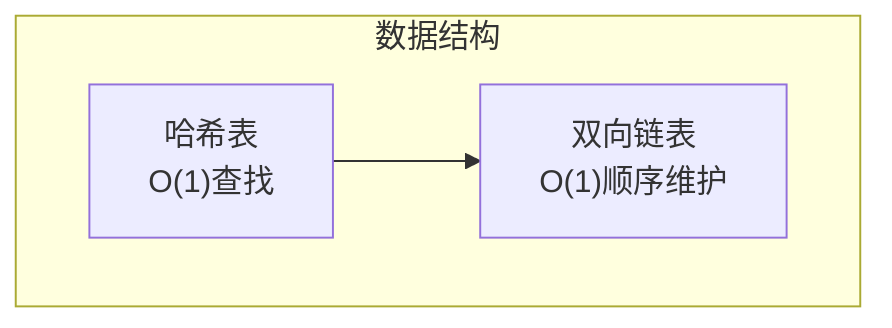

# LRU缓存实现

面试官问："设计一个LRU缓存，支持get和put操作，要求时间复杂度都是O(1)。"

候选人小张回答："用哈希表存储key-value，get的时候返回value就行了。"

面试官追问："那怎么淘汰最久未使用的元素？"

小张愣住了...

---

## 一、从一个问题开始

LRU（Least Recently Used）缓存是面试中的高频考点，90%的候选人能说出用哈希表实现，但能用O(1)时间复杂度实现淘汰机制的不超过50%。

今天，我们手撕LRU缓存，从设计思路到代码实现。

【直观类比】

LRU缓存就像你手机的照片应用：
- 最近查看的照片放在最前面
- 当你查看某张照片，它会跳到最前面
- 当相册满了，自动删除最久远的照片

这就是"最近使用"的策略。

---

## 二、核心数据结构

### 2.1 为什么需要特殊设计？

普通的哈希表可以做到O(1)的get和put，但无法实现LRU淘汰。

普通链表可以记录访问顺序，但get是O(n)。

**解决方案**：**哈希表 + 双向链表**，兼顾查找和顺序。



### 2.2 双向链表节点定义

```java
public class DLinkedNode {
    int key;
    int value;
    DLinkedNode prev;
    DLinkedNode next;
    
    DLinkedNode() {}
    
    DLinkedNode(int key, int value) {
        this.key = key;
        this.value = value;
    }
}
```

### 2.3 哈希表加双向链表

```java
public class LRUCache {
    private Map<Integer, DLinkedNode> cache;  // 哈希表
    private DLinkedNode head, tail;              // 虚拟头尾节点
    private int capacity;                      // 容量
    
    public LRUCache(int capacity) {
        this.capacity = capacity;
        this.cache = new HashMap<>(capacity);
        
        // 初始化虚拟头尾节点
        head = new DLinkedNode();
        tail = new DLinkedNode();
        head.next = tail;
        tail.prev = head;
    }
}
```

---

## 三、核心操作实现

### 3.1 get 操作

**步骤**：1. 查找节点；2. 移动到头部

```java
public int get(int key) {
    DLinkedNode node = cache.get(key);
    if (node == null) return -1;
    
    // 把节点移到链表头部（表示最近使用）
    moveToHead(node);
    return node.value;
}

private void moveToHead(DLinkedNode node) {
    removeNode(node);
    addToHead(node);
}
```

### 3.2 put 操作

**步骤**：1. 查找/创建节点；2. 更新值；3. 移动到头部；4. 必要时淘汰

```java
public void put(int key, int value) {
    DLinkedNode node = cache.get(key);
    
    if (node == null) {
        // 创建新节点
        DLinkedNode newNode = new DLinkedNode(key, value);
        cache.put(key, newNode);
        addToHead(newNode);
        
        // 超出容量，淘汰尾部节点
        if (cache.size() > capacity) {
            DLinkedNode tailNode = removeTail();
            cache.remove(tailNode.key);
        }
    } else {
        // 更新值
        node.value = value;
        moveToHead(node);
    }
}
```

### 3.3 辅助方法

```java
// 添加到链表头部
private void addToHead(DLinkedNode node) {
    node.prev = head;
    node.next = head.next;
    head.next.prev = node;
    head.next = node;
}

// 删除节点
private void removeNode(DLinkedNode node) {
    node.prev.next = node.next;
    node.next.prev = node.prev;
}

// 删除尾部节点
private DLinkedNode removeTail() {
    DLinkedNode tailNode = tail.prev;
    removeNode(tailNode);
    return tailNode;
}
```

### 3.4 操作图解

```mermaid
flowchart TD
    subgraph 初始状态
        A["head"] --> B["node1"]
        B --> C["node2"]
        C --> D["node3"]
        D --> E["tail"]
    end
    
    subgraph get(node1)后
        A2["head"] --> C2["node2"]
        C2 --> B2["node1"]
        B2 --> D2["node3"]
        D2 --> E2["tail"]
    end
```

---

## 四、Java内置实现：LinkedHashMap

### 4.1 使用LinkedHashMap实现LRU

```java
public class LRUCacheLinkedHashMap extends LinkedHashMap<Integer, Integer> {
    private int capacity;
    
    public LRUCacheLinkedHashMap(int capacity) {
        super(capacity, 0.75f, true);  // accessOrder=true 开启访问顺序
        this.capacity = capacity;
    }
    
    @Override
    protected boolean removeEldestEntry(Map.Entry eldest) {
        return size() > capacity;
    }
}
```

### 4.2 LinkedHashMap的访问顺序

```java
// accessOrder = true 时：
map.get(key);   // 访问后移到末尾
map.put(key, v); // 插入到末尾

// accessOrder = false 时（默认）：
map.get(key);   // 不会改变顺序
map.put(key, v); // 插入到末尾
```

### 4.3 完整实现

```java
public class LRUCache {
    private int capacity;
    private LinkedHashMap<Integer, Integer> cache;
    
    public LRUCache(int capacity) {
        this.capacity = capacity;
        this.cache = new LinkedHashMap<Integer, Integer>(capacity, 0.75f, true) {
            @Override
            protected boolean removeEldestEntry(Map.Entry eldest) {
                return size() > LRUCache.this.capacity;
            }
        };
    }
    
    public int get(int key) {
        return cache.getOrDefault(key, -1);
    }
    
    public void put(int key, int value) {
        cache.put(key, value);
    }
}
```

---

## 五、LFU：最不经常使用

### 5.1 LFU vs LRU

| 策略 | 全称 | 淘汰规则 | 适用场景 |
|------|------|----------|----------|
| LRU | Least Recently Used | 最久未使用 | 短期热点数据 |
| LFU | Least Frequently Used | 使用频率最低 | 长期热点数据 |

### 5.2 LFU实现思路

```java
// LFU需要两个哈希表：
// 1. key -> Node：快速查找
// 2. freq -> NodeSet：按频率分组
// 3. 维护一个最小频率

class LFUNode {
    int key, value, freq;
    LFUNode prev, next;
}

class LFUCache {
    private Map<Integer, LFUNode> cache;
    private Map<Integer, LinkedHashSet<LFUNode>> freqMap;
    private int minFreq;
    private int capacity;
}
```

---

## 六、面试高频追问

### 6.1 追问一：为什么用双向链表而不是单向链表？

因为需要O(1)删除节点。单向链表删除需要找到前驱节点，是O(n)。

### 6.2 追问二：为什么用虚拟头尾节点？

避免边界判断。如果没有虚拟节点，删除第一个或最后一个节点时需要特殊处理。

### 6.3 追问三：LRU和LFU的区别和使用场景？

**LRU**：
- 淘汰最久未使用的
- 适合短期热点数据
- Redis的近似LRU算法

**LFU**：
- 淘汰使用频率最低的
- 适合长期热点数据
- CDN缓存、CDN推荐用LFU

---

## 七、边界与特例

### 7.1 容量为1

```java
// 容量为1时，每次put都会导致之前的被淘汰
// 需要特殊处理
```

### 7.2 重复put相同的key

```java
// 不会创建新节点，只会更新值并移动到头部
```

### 7.3 并发场景

```java
// 上述实现不是线程安全的
// 可以用 ConcurrentHashMap + synchronized
// 或者用 java.util.concurrent 的实现
```

---

## 八、常见误区

### ❌ 误区一：LRU缓存只需要哈希表

**实际情况**：哈希表可以O(1)查找，但无法O(1)淘汰。需要配合链表。

### ❌ 误区二：LinkedHashMap默认是LRU

**实际情况**：默认`accessOrder=false`，按插入顺序。需要设置`accessOrder=true`。

### ❌ 误区三：LRU比LFU好

**实际情况**：LRU适合短期热点，LFU适合长期热点。选择取决于使用场景。

---

## 九、记忆技巧

用一句话记住LRU的实现：

> **哈希表负责O(1)查找，双向链表负责O(1)顺序，头部是最近，尾部是最久**

用口诀记住操作：

> **get要移动到头，put要判断容量，超容量删尾部节点**

---

## 十、实战检验

### 检验一：力扣146题 - LRU缓存

```java
class LRUCache {
    private Map<Integer, DLinkedNode> cache;
    private DLinkedNode head, tail;
    private int capacity;
    
    public LRUCache(int capacity) {
        this.capacity = capacity;
        cache = new HashMap<>();
        head = new DLinkedNode();
        tail = new DLinkedNode();
        head.next = tail;
        tail.prev = head;
    }
    
    public int get(int key) {
        DLinkedNode node = cache.get(key);
        if (node == null) return -1;
        moveToHead(node);
        return node.value;
    }
    
    public void put(int key, int value) {
        DLinkedNode node = cache.get(key);
        if (node == null) {
            node = new DLinkedNode(key, value);
            cache.put(key, node);
            addToHead(node);
            if (cache.size() > capacity) {
                DLinkedNode removed = removeTail();
                cache.remove(removed.key);
            }
        } else {
            node.value = value;
            moveToHead(node);
        }
    }
    
    // ... 辅助方法省略
}
```

---

## 十一、总结

LRU缓存的核心是**哈希表加双向链表**：

1. **哈希表**：O(1)查找
2. **双向链表**：O(1)顺序维护和淘汰
3. **头节点**：最近使用
4. **尾节点**：最久未使用

记住这三句话：

1. **LRU的核心是维护访问顺序，哈希表加链表是最优解**
2. **LinkedHashMap是Java中LRU的偷懒实现**
3. **LRU适合短期热点，LFU适合长期热点**

下一篇文章，我们来聊聊**布隆过滤器**，看看如何用极小的空间判断元素是否存在。
