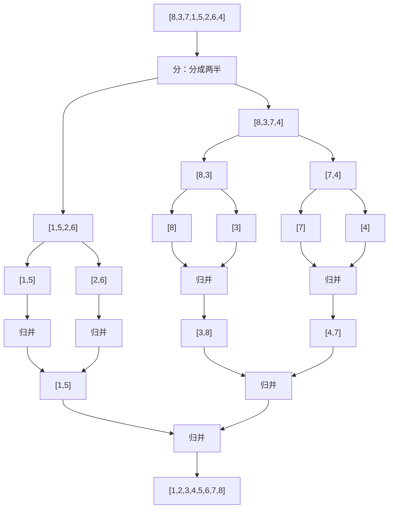
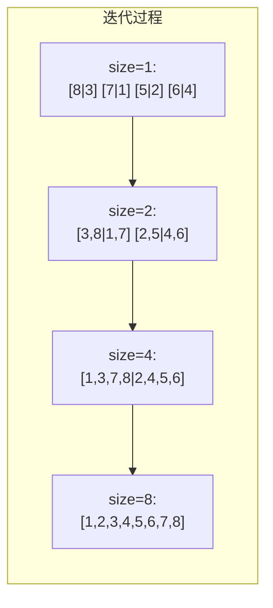
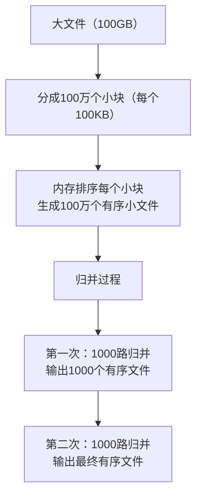

# 归并排序

面试官问："快速排序是稳定的吗？"

候选人小张回答："是稳定的。"

面试官又问："那归并排序呢？它和快速排序的区别是什么？"

小张开始支支吾吾...

---

## 一、从一个问题开始

归并排序是面试中另一个高频考点。和快速排序一样，它也是基于分治思想，但两者的实现和特性有很大不同。

90%的候选人知道归并排序是稳定的，但能讲清楚"什么是稳定"、为什么归并排序稳定、什么时候用归并排序的，不超过30%。

今天，我们把归并排序讲透。

【直观类比】

归并排序就像合并两个有序的扑克牌堆：
1. 把牌分成两堆（分治）
2. 把两堆分别排好序
3. 把两堆按顺序合并成一大堆

关键在于：**分牌的时候，牌的相对位置不变**。这就是"稳定"的含义。

---

## 二、核心原理：分而治之

### 2.1 归并排序的步骤



### 2.2 合并两个有序数组

归并排序的核心是**合并两个有序数组**：

```java
public void merge(int[] arr, int left, int mid, int right) {
    int[] temp = new int[right - left + 1];
    int i = left, j = mid + 1, k = 0;
    
    // 把两个有序数组合并成一个
    while (i <= mid && j <= right) {
        if (arr[i] <= arr[j]) {
            temp[k++] = arr[i++];
        } else {
            temp[k++] = arr[j++];
        }
    }
    
    // 处理剩余元素
    while (i <= mid) {
        temp[k++] = arr[i++];
    }
    while (j <= right) {
        temp[k++] = arr[j++];
    }
    
    // 把合并结果复制回原数组
    for (int p = 0; p < temp.length; p++) {
        arr[left + p] = temp[p];
    }
}
```

### 2.3 完整的归并排序

```java
public void mergeSort(int[] arr, int left, int right) {
    if (left >= right) return;
    
    int mid = left + (right - left) / 2;
    
    // 1. 先递归排序左右两部分
    mergeSort(arr, left, mid);
    mergeSort(arr, mid + 1, right);
    
    // 2. 再合并两部分
    merge(arr, left, mid, right);
}
```

---

## 三、快速排序 vs 归并排序

### 3.1 对比表格

| 维度 | 快速排序 | 归并排序 |
|------|---------|---------|
| 核心思想 | 分区 | 合并 |
| 时间复杂度（平均） | `O(nlogn)` | `O(nlogn)` |
| 时间复杂度（最坏） | `O(n²)` | `O(nlogn)` |
| 空间复杂度 | `O(1)` | `O(n)` |
| 稳定性 | **不稳定** | **稳定** |
| 适用场景 | 原地排序优先 | 需要稳定性 |

### 3.2 为什么归并排序是稳定的？

关键在合并过程：

```java
// 当 arr[i] == arr[j] 时，选择 arr[i]（左边的元素）
if (arr[i] <= arr[j]) {
    temp[k++] = arr[i++];  // 稳定
}
```

因为相等时选择左边的元素，所以**相同元素的相对顺序保持不变**。

### 3.3 为什么快速排序是不稳定的？

快速排序的分区过程可能改变相同元素的相对位置：

```java
// 单边循环partition
if (arr[j] <= pivot) {
    i++;
    swap(arr, i, j);  // 如果arr[i]==arr[j]，交换会改变相对位置
}
```

---

## 四、迭代版归并排序（自底向上）

递归版归并排序需要O(logn)的栈空间，迭代版可以避免这个问题：

```java
public void mergeSortIterative(int[] arr) {
    int n = arr.length;
    int[] temp = new int[n];
    
    // 子数组大小：1, 2, 4, 8, ...
    for (int size = 1; size < n; size *= 2) {
        // 合并每对相邻的子数组
        for (int left = 0; left < n; left += 2 * size) {
            int mid = Math.min(left + size - 1, n - 1);
            int right = Math.min(left + 2 * size - 1, n - 1);
            
            if (mid < right) {  // 只有当两个子数组都存在时才合并
                merge(arr, temp, left, mid, right);
            }
        }
    }
}
```



---

## 五、外部排序与海量数据

归并排序真正发挥威力的是**外部排序**（处理无法一次性加载到内存的数据）。

### 5.1 外部排序的思路

```
1. 把大文件分成若干个小块，每个小块能加载到内存
2. 对每个小块内部排序（内存排序）
3. 逐个归并小块，形成最终有序文件
```



### 5.2 归并路数与磁盘I/O

**归并路数（degree）**越多，合并次数越少，但每次合并需要的内存越多。

```java
// 最佳归并路数 = 能加载到内存的缓冲区数 - 1
// 假设有1000个缓冲区：最佳路数 = 999
```

---

## 六、面试高频追问

### 6.1 追问一：为什么归并排序需要O(n)额外空间？

因为合并两个有序数组时，需要一个额外的数组来存放合并结果。这个额外空间与原数组大小成正比。

### 6.2 追问二：能否优化到O(1)空间？

可以，但代价是时间复杂度变高：
- 方案A：原地归并，但需要额外移动操作
- 方案B：用链表可以直接原地归并

### 6.3 追问三：Java的Arrays.sort用什么排序？

```java
// Java 1.8+ 的 TimSort
// 对于小数据量，使用改进的归并排序
// 对于大数据量，使用快速排序 + 插入排序的混合
```

---

## 七、边界与特例

### 7.1 空数组和单元素数组

```java
if (arr == null || arr.length <= 1) return;
if (left >= right) return;  // 递归终止
```

### 7.2 完全有序数组

归并排序不管数组是否有序，时间复杂度都是`O(nlogn)`。

### 7.3 递归深度

对于n=10亿的数组，递归深度是`log₂(10亿)` ≈ 30，不会栈溢出。

---

## 八、常见误区

### ❌ 误区一：归并排序一定比快速排序慢

**实际情况**：在需要稳定性的场景下，归并排序是唯一选择；在随机数据下，两者性能相近。

### ❌ 误区二：归并排序的空间复杂度无法优化

**实际情况**：可以用链表实现原地归并，不需要额外数组。

### ❌ 误区三：外部排序只能归并排序

**实际情况**：外部排序适合用归并，因为可以流式处理数据。

---

## 九、记忆技巧

用一句话记住快排和归并的区别：

> **快排先分区后递归，归并先递归后合并；快排原地不合并，归并合并要空间**

用口诀记住归并排序：

> **先对半切，分到最小，合并时从小到大**

---

## 十、实战检验

### 检验一：力扣21题 - 合并两个有序链表

```java
public ListNode mergeTwoLists(ListNode l1, ListNode l2) {
    ListNode dummy = new ListNode(0);
    ListNode current = dummy;
    
    while (l1 != null && l2 != null) {
        if (l1.val <= l2.val) {
            current.next = l1;
            l1 = l1.next;
        } else {
            current.next = l2;
            l2 = l2.next;
        }
        current = current.next;
    }
    
    current.next = (l1 != null) ? l1 : l2;
    return dummy.next;
}
```

### 检验二：剑指offer - 数组中的逆序对

```java
private int mergeAndCount(int[] arr, int left, int mid, int right) {
    int[] temp = new int[right - left + 1];
    int i = left, j = mid + 1, k = 0, count = 0;
    
    while (i <= mid && j <= right) {
        if (arr[i] <= arr[j]) {
            temp[k++] = arr[i++];
        } else {
            // arr[i] > arr[j]，构成逆序对
            count += (mid - i + 1);
            temp[k++] = arr[j++];
        }
    }
    
    // ... 复制回原数组
    return count;
}
```

---

## 十一、总结

归并排序的核心是**分治合并**：

1. **分**：把数组分成两半
2. **治**：递归排序左右两半
3. **合**：合并两个有序数组

记住这三句话：

1. **归并排序是稳定的，快速排序是不稳定的**
2. **归并排序需要O(n)额外空间，快速排序是O(1)**
3. **归并排序是外部排序的首选**

下一篇文章，我们来聊聊**堆排序**，看看如何用二叉堆实现原地排序。
