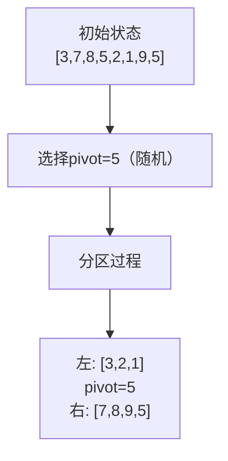
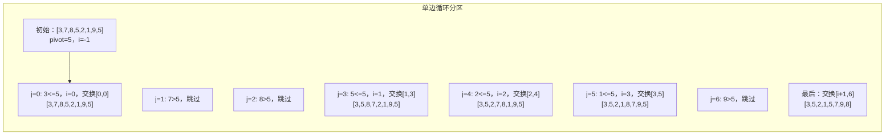
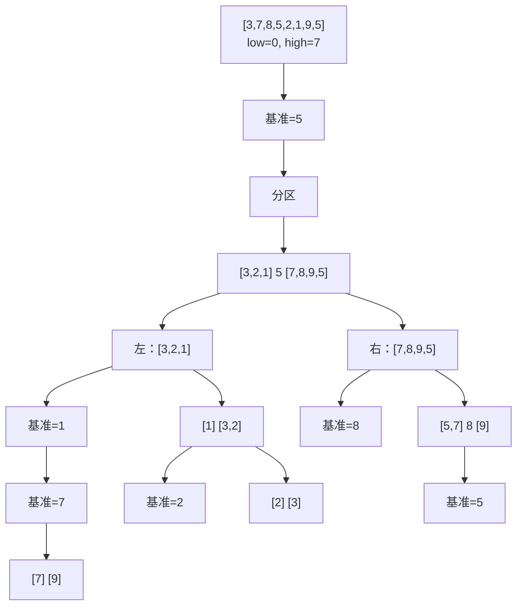

# 快速排序

面试官说："手写一个快速排序。"

候选人小张刷刷刷写完了：

```java
public void quickSort(int[] arr, int left, int right) {
    if (left >= right) return;
    
    int pivot = arr[left];
    int i = left, j = right;
    
    while (i < j) {
        while (i < j && arr[j] >= pivot) j--;
        arr[i] = arr[j];
        while (i < j && arr[i] <= pivot) i++;
        arr[j] = arr[i];
    }
    arr[i] = pivot;
    
    quickSort(arr, left, i - 1);
    quickSort(arr, i + 1, right);
}
```

面试官看了半天，问："你这个代码在某些情况下会出问题，你知道吗？"

小张愣住了...

---

## 一、从一个问题开始

快速排序是面试中出现频率最高的排序算法，90%的候选人能写出基本版本，但能正确处理边界情况的不超过60%，能讲清楚优化策略的不到30%。

今天，我们把快速排序彻底讲透。

【直观类比】

快速排序就像分班考试：
1. 找一个"中位数"同学作为基准
2. 让比他矮的站左边，比他高的站右边
3. 然后左边、右边各自重复这个过程

最终，所有同学都站到了正确的位置。

---

## 二、核心原理：分治思想

### 2.1 快速排序的核心

快速排序的核心是**分治**：把大问题分解成小问题，分别解决。

```
快速排序 = 选基准 + 分区 + 递归
```

```java
public void quickSort(int[] arr, int low, int high) {
    if (low >= high) return;
    
    // 1. 分区：返回一个位置，这个位置的元素已经排好序
    int pivotIndex = partition(arr, low, high);
    
    // 2. 递归处理左右两部分
    quickSort(arr, low, pivotIndex - 1);
    quickSort(arr, pivotIndex + 1, high);
}
```

### 2.2 partition过程详解

partition的目标是把数组分成两部分：**左边的都 `<=` pivot，右边的都 > pivot**。



**方法一：双边循环法（常用）**

```java
public int partition(int[] arr, int low, int high) {
    int pivot = arr[low];  // 选择第一个元素作为基准
    int i = low, j = high;
    
    while (i < j) {
        // 1. 从右向左找第一个小于pivot的元素
        while (i < j && arr[j] >= pivot) {
            j--;
        }
        // 2. 找到后移到左边
        arr[i] = arr[j];
        
        // 3. 从左向右找第一个大于pivot的元素
        while (i < j && arr[i] <= pivot) {
            i++;
        }
        // 4. 找到后移到右边
        arr[j] = arr[i];
    }
    
    // 5. 把pivot放到正确位置
    arr[i] = pivot;
    return i;
}
```

**方法二：单边循环法（更简洁）**

```java
public int partition(int[] arr, int low, int high) {
    int pivot = arr[high];  // 选择最后一个元素作为基准
    int i = low - 1;        // i是小于等于pivot区域的边界
    
    for (int j = low; j < high; j++) {
        if (arr[j] <= pivot) {
            i++;
            swap(arr, i, j);
        }
    }
    
    // 把pivot放到中间位置
    swap(arr, i + 1, high);
    return i + 1;
}
```

### 2.3 分区过程图解



---

## 三、递归过程演示



---

## 四、面试高频追问

### 4.1 追问一：快速排序为什么快？

| 维度 | 快速排序 | 归并排序 |
|------|---------|---------|
| 划分方式 | 基于元素值划分 | 基于位置划分 |
| 递归方向 | 先排序，再递归 | 先递归，再合并 |
| 缓存友好 | 是（访问局部性好） | 否（需要额外数组） |
| 常数因子 | 更小 | 更大 |

### 4.2 追问二：快速排序的缺点是什么？

1. **最坏情况**：基准选择不当（如有序数组选第一个或最后一个），退化成O(n²)
2. **不稳定**：相等的元素可能改变相对顺序
3. **递归深度**：最坏情况下递归深度是O(n)，可能导致栈溢出

### 4.3 追问三：如何避免最坏情况？

**三数取中法**：

```java
public int medianOfThree(int[] arr, int low, int high) {
    int mid = low + (high - low) / 2;
    
    // 三个数排序后取中位数
    if (arr[low] > arr[mid]) swap(arr, low, mid);
    if (arr[low] > arr[high]) swap(arr, low, high);
    if (arr[mid] > arr[high]) swap(arr, mid, high);
    
    // 现在 arr[mid] <= arr[high]，把它作为pivot
    swap(arr, mid, high);
    return arr[high];
}
```

---

## 五、优化策略

### 5.1 小数据量切换到插入排序

```java
public void quickSort(int[] arr, int low, int high) {
    // 小数据量时，切换到插入排序
    if (high - low < 10) {
        insertionSort(arr, low, high);
        return;
    }
    
    if (low >= high) return;
    int pivotIndex = partition(arr, low, high);
    quickSort(arr, low, pivotIndex - 1);
    quickSort(arr, pivotIndex + 1, high);
}

private void insertionSort(int[] arr, int low, int high) {
    for (int i = low + 1; i <= high; i++) {
        int key = arr[i];
        int j = i - 1;
        while (j >= low && arr[j] > key) {
            arr[j + 1] = arr[j];
            j--;
        }
        arr[j + 1] = key;
    }
}
```

### 5.2 尾递归优化

```java
public void quickSort(int[] arr, int low, int high) {
    while (low < high) {
        int pivotIndex = partition(arr, low, high);
        
        // 先处理小区间，减少递归深度
        if (pivotIndex - low < high - pivotIndex) {
            quickSort(arr, low, pivotIndex - 1);
            low = pivotIndex + 1;  // 尾递归改成循环
        } else {
            quickSort(arr, pivotIndex + 1, high);
            high = pivotIndex - 1;
        }
    }
}
```

### 5.3 三路划分（处理重复元素）

```java
public void quickSort3Way(int[] arr, int low, int high) {
    if (low >= high) return;
    
    int pivot = arr[low];
    int lt = low;      // arr[low+1...lt] < pivot
    int gt = high + 1;  // arr[gt...high] > pivot
    int i = low + 1;   // arr[lt+1...i-1] == pivot
    
    while (i < gt) {
        if (arr[i] < pivot) {
            swap(arr, ++lt, i++);
        } else if (arr[i] > pivot) {
            swap(arr, --gt, i);
        } else {
            i++;
        }
    }
    
    swap(arr, low, lt);
    
    quickSort3Way(arr, low, lt - 1);
    quickSort3Way(arr, gt, high);
}
```

---

## 六、边界与特例

### 6.1 空数组和单元素数组

```java
if (arr == null || arr.length <= 1) return;
if (low >= high) return;  // 递归终止条件
```

### 6.2 重复元素

重复元素多时，partition会极度不平衡。**三数取中**和**三路划分**能有效缓解。

### 6.3 基准选择不当

```java
// 有序数组选第一个/最后一个作为基准 -> O(n²)
// 解决：三数取中、随机基准
int randomIndex = low + (int)(Math.random() * (high - low + 1));
swap(arr, randomIndex, high);
```

---

## 七、常见误区

### ❌ 误区一：快速排序是最快的排序

**实际情况**：在随机数据下，快速排序确实快；但在极端情况下可能退化成O(n²)。数据量小时可能不如插入排序。

### ❌ 误区二：partition只能用双边循环

**实际情况**：单边循环更简洁，更不容易出错（如处理边界条件）。

### ❌ 误区三：快速排序是稳定的

**实际情况**：快速排序是**不稳定**的。如果需要稳定排序，可以用归并排序。

---

## 八、记忆技巧

用口诀记住partition过程：

> **双边循环：右往左找小，左往右找大，相遇放基准**

用对比记住快排和归并：

> **快排先排后递归，归并先递后合并；快排原地不合并，归并需要额外位**

---

## 九、实战检验

### 检验一：力扣912题 - 排序数组

```java
public int[] sortArray(int[] nums) {
    quickSort(nums, 0, nums.length - 1);
    return nums;
}

private void quickSort(int[] arr, int low, int high) {
    if (low >= high) return;
    int pivotIndex = partition(arr, low, high);
    quickSort(arr, low, pivotIndex - 1);
    quickSort(arr, pivotIndex + 1, high);
}

private int partition(int[] arr, int low, int high) {
    int pivot = arr[high];
    int i = low - 1;
    for (int j = low; j < high; j++) {
        if (arr[j] <= pivot) {
            swap(arr, ++i, j);
        }
    }
    swap(arr, i + 1, high);
    return i + 1;
}
```

### 检验二：Top K 问题

```java
public int findKthLargest(int[] nums, int k) {
    int target = nums.length - k;
    int low = 0, high = nums.length - 1;
    
    while (low <= high) {
        int pivotIndex = partition(nums, low, high);
        if (pivotIndex == target) {
            return nums[pivotIndex];
        } else if (pivotIndex < target) {
            low = pivotIndex + 1;
        } else {
            high = pivotIndex - 1;
        }
    }
    return -1;
}
```

---

## 十、总结

快速排序的核心是**分治**和**原地分区**：

1. **分治**：大问题分解成小问题
2. **原地分区**：不需要额外数组
3. **基准选择**：决定性能的关键

记住这三句话：

1. **快速排序的快，来自原地分区和良好的缓存局部性**
2. **基准选择不当会让快排变成慢排**
3. **处理重复元素时，三路划分是利器**

下一篇文章，我们来聊聊快速排序的孪生兄弟——**归并排序**。
