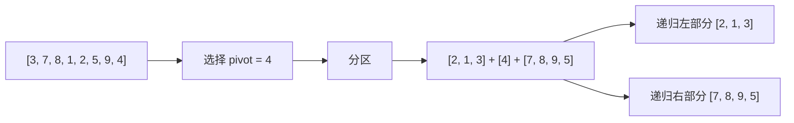

# 快速排序

> 目标级别：P5

面试官问：「手写一个快速排序」——然后面试官追问：「基准怎么选？」「最坏情况是什么？」「怎么优化？」

快速排序是最常用的高效排序算法，是面试中必须掌握的手写算法之一。

## 一、算法原理

### 1.1 核心思想

```
快速排序核心：分治法 + 原地分区

1. 选择一个基准元素（pivot）
2. 将数组分为两部分：小于 pivot 和大于等于 pivot
3. 递归排序两部分

分区的过程：
[ 小于 pivot ] | pivot | [ 大于等于 pivot ]
```

### 1.2 分区过程



---

## 二、代码实现

### 2.1 基础版本

```java
public class QuickSort {
    public void sort(int[] arr) {
        quickSort(arr, 0, arr.length - 1);
    }

    private void quickSort(int[] arr, int low, int high) {
        if (low < high) {
            int pivotIndex = partition(arr, low, high);
            quickSort(arr, low, pivotIndex - 1);
            quickSort(arr, pivotIndex + 1, high);
        }
    }

    private int partition(int[] arr, int low, int high) {
        int pivot = arr[high];  // 选择最后一个元素作为基准
        int i = low - 1;  // i 是小于 pivot 区域的边界

        for (int j = low; j < high; j++) {
            if (arr[j] < pivot) {
                i++;
                swap(arr, i, j);
            }
        }

        // 将基准放到正确位置
        swap(arr, i + 1, high);
        return i + 1;
    }

    private void swap(int[] arr, int i, int j) {
        int temp = arr[i];
        arr[i] = arr[j];
        arr[j] = temp;
    }
}
```

### 2.2 双指针版本

```java
// 双指针分区（Lomuto 方案）
private int partition(int[] arr, int low, int high) {
    int pivot = arr[high];
    int i = low;  // 指向小于 pivot 区域的第一个元素

    for (int j = low; j < high; j++) {
        if (arr[j] < pivot) {
            swap(arr, i, j);
            i++;
        }
    }
    swap(arr, i, high);
    return i;
}

// Hoare 方案
private int partitionHoare(int[] arr, int low, int high) {
    int pivot = arr[low];
    int i = low - 1;
    int j = high + 1;

    while (true) {
        do { j--; } while (arr[j] > pivot);
        do { i++; } while (arr[i] < pivot);

        if (i < j) {
            swap(arr, i, j);
        } else {
            return j;
        }
    }
}
```

---

## 三、算法分析

### 3.1 时间复杂度

```
时间复杂度分析：

最好情况：每次划分均匀
- T(n) = 2T(n/2) + O(n) = O(n log n)

最坏情况：每次划分极度不均匀
- T(n) = T(n-1) + T(0) + O(n) = O(n²)

平均情况：
- 期望划分比较均匀
- T(n) = O(n log n)
```

### 3.2 空间复杂度

```
空间复杂度：O(log n)

递归调用栈深度：
- 最好/平均：O(log n)
- 最坏：O(n)

由于是原地排序，不需要额外数组。
```

---

## 四、优化策略

### 4.1 基准选择优化

```java
// 三数取中（Median of Three）
private int medianOfThree(int[] arr, int low, int high) {
    int mid = low + (high - low) / 2;

    // 排序三个数：arr[low], arr[mid], arr[high]
    if (arr[low] > arr[mid]) swap(arr, low, mid);
    if (arr[low] > arr[high]) swap(arr, low, high);
    if (arr[mid] > arr[high]) swap(arr, mid, high);

    // 将中位数放到 low+1 位置
    swap(arr, mid, low + 1);
    return low + 1;
}
```

### 4.2 小数据优化

```java
// 小数据时使用插入排序
private void quickSort(int[] arr, int low, int high) {
    if (high - low + 1 < 10) {
        insertionSort(arr, low, high);
        return;
    }

    if (low < high) {
        int pivotIndex = partition(arr, low, high);
        quickSort(arr, low, pivotIndex - 1);
        quickSort(arr, pivotIndex + 1, high);
    }
}

private void insertionSort(int[] arr, int low, int high) {
    for (int i = low + 1; i <= high; i++) {
        int key = arr[i];
        int j = i - 1;
        while (j >= low && arr[j] > key) {
            arr[j + 1] = arr[j];
            j--;
        }
        arr[j + 1] = key;
    }
}
```

### 4.3 三路划分

```java
// 三路划分，处理大量重复元素
private void quickSort3Way(int[] arr, int low, int high) {
    if (low >= high) return;

    int pivot = arr[low];
    int lt = low;      // [low, lt) < pivot
    int gt = high + 1; // (gt, high] > pivot
    int i = low + 1;   // [lt, i) == pivot

    while (i < gt) {
        if (arr[i] < pivot) {
            swap(arr, lt++, i++);
        } else if (arr[i] > pivot) {
            swap(arr, i, --gt);
        } else {
            i++;
        }
    }

    quickSort3Way(arr, low, lt - 1);
    quickSort3Way(arr, gt, high);
}
```

---

## 五、面试题精讲

### 🔴 【高频】手写快速排序

**问题**：请手写快速排序算法。

**标准答案**：

```java
public void quickSort(int[] arr, int low, int high) {
    if (low < high) {
        int pivotIndex = partition(arr, low, high);
        quickSort(arr, low, pivotIndex - 1);
        quickSort(arr, pivotIndex + 1, high);
    }
}

private int partition(int[] arr, int low, int high) {
    int pivot = arr[high];
    int i = low - 1;

    for (int j = low; j < high; j++) {
        if (arr[j] < pivot) {
            i++;
            swap(arr, i, j);
        }
    }
    swap(arr, i + 1, high);
    return i + 1;
}
```

### 🟡 【中频】快排优化

**问题**：快速排序有什么优化方法？

**标准答案**：

```
1. 基准选择优化
   - 三数取中（首、中、尾的中位数）
   - 随机选择基准

2. 小数据优化
   - 数据量小时使用插入排序

3. 三路划分
   - 处理大量重复元素

4. 尾递归优化
   - 先处理小区间，减少递归深度
```

### 🟡 【中频】最坏情况

**问题**：快速排序的最坏情况是什么？

**标准答案**：

```
最坏情况：每次划分都极度不均匀

场景：
1. 已排序数组 + 选择第一个/最后一个作为基准
2. 逆序数组 + 选择第一个/最后一个作为基准

时间复杂度：O(n²)

原因：T(n) = T(n-1) + T(0) + O(n) = O(n²)

解决方案：
- 随机选择基准
- 三数取中
```

---

## 六、对比总结

### Lomuto vs Hoare

| 维度 | Lomuto | Hoare |
|------|--------|-------|
| 基准选择 | 通常最后一个 | 通常第一个 |
| 交换次数 | 较多 | 较少 |
| 适用性 | 简单直观 | 高效 |

### 快排 vs 归排

| 维度 | 快速排序 | 归并排序 |
|------|----------|----------|
| 时间（平均） | O(n log n) | O(n log n) |
| 时间（最坏） | O(n²) | O(n log n) |
| 空间 | O(log n) | O(n) |
| 稳定性 | 不稳定 | 稳定 |
| 适用 | 通用 | 外部排序 |

---

## 七、扩展思考

### 💡 非递归实现

```java
public void quickSortIterative(int[] arr) {
    Stack<int[]> stack = new Stack<>();
    stack.push(new int[]{0, arr.length - 1});

    while (!stack.isEmpty()) {
        int[] range = stack.pop();
        int low = range[0], high = range[1];

        if (low < high) {
            int pivotIndex = partition(arr, low, high);
            stack.push(new int[]{low, pivotIndex - 1});
            stack.push(new int[]{pivotIndex + 1, high});
        }
    }
}
```

### 💡 与其他算法结合

```
实际使用中，通常是多种排序算法的组合：

1. 小数据：插入排序
2. 大数据：快速排序
3. 特殊数据：计数排序、基数排序

Java Arrays.sort():
- 小数组（< 286）：快速排序
- 中数组（< 47）：插入排序
- 特殊数据：计数排序（基础类型）
```

> 快速排序是面试中最常考的手写算法之一。理解它的原理、优化方法和时间复杂度分析，才能在面试中得心应手。