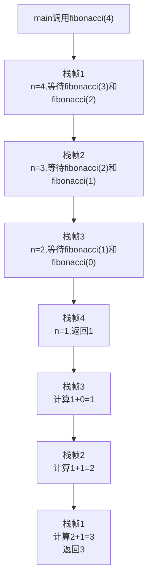
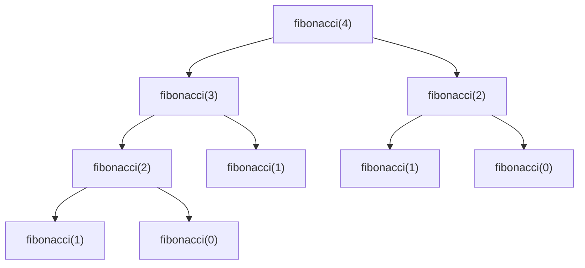
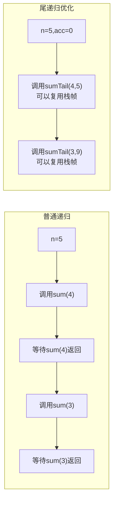
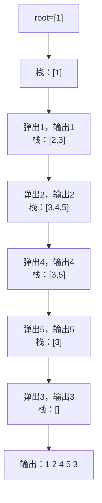
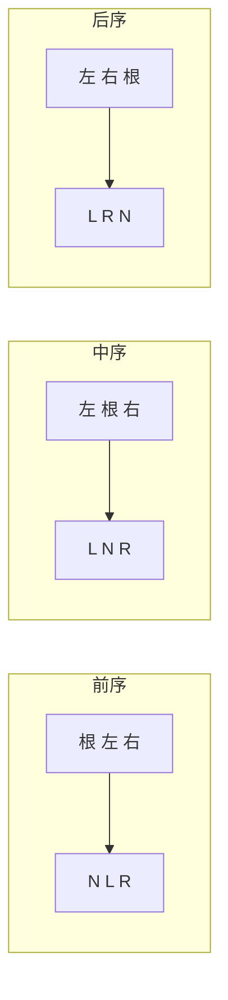

# 递归与迭代的转换

面试官问："写一个函数，计算斐波那契数列第n项。"

候选人小李刷刷刷写下了：

```java
public int fibonacci(int n) {
    if (n <= 1) return n;
    return fibonacci(n - 1) + fibonacci(n - 2);
}
```

面试官看了一眼，问："这个代码有什么问题？当n=50时，会计算多少次？"

小李愣住了...

---

## 一、从一个问题开始

递归是算法中最优雅的思想之一，也是面试中最容易翻车的知识点之一。

90%的候选人能写出递归代码，但能正确分析时间复杂度的不到50%，能说出栈溢出风险的不到30%，能把递归改成迭代的不到10%。

今天，我们把递归和迭代彻底讲透。

【直观类比】

递归就像俄罗斯套娃：

```
大娃 = 打开，里面是中娃
中娃 = 打开，里面是小娃
小娃 = 打开，里面是最小的娃
最小的娃 = 打开，里面是空的，返回！
```

每一层都依赖下一层的返回值，这就是递归的本质：**自己调用自己，直到触发终止条件**。

迭代呢？迭代就像爬楼梯：

```
第一层 -> 第二层 -> 第三层 -> ... -> 第n层
```

没有嵌套，没有返回，每一步都在循环中完成。

---

## 二、递归的本质

### 2.1 什么是递归

递归是指函数调用自身的行为。任何一个递归都有三个要素：

1. **终止条件**：什么时候停止
2. **递归调用**：调用自身
3. **返回值计算**：如何组合子问题的结果

```java
// 递归三要素示例：求数组和
public int sum(int[] arr, int n) {
    // 终止条件：n为0时，返回0
    if (n == 0) return 0;

    // 递归调用：求前n-1个元素的和
    int rest = sum(arr, n - 1);

    // 返回值计算：当前元素 + 剩余元素之和
    return arr[n - 1] + rest;
}
```

### 2.2 递归调用栈

递归的代价是什么？**栈空间**。



每递归调用一次，就会在栈上创建一个新的栈帧。当栈深度过大时，就会发生**栈溢出**（StackOverflowError）。

:::warning ⚠️
Java默认栈大小约为1MB，递归深度超过10000就可能栈溢出。但实际项目中，几百层递归就可能出问题。
:::

### 2.3 递归的时间复杂度

递归的时间复杂度怎么算？用**递归树**来分析。

斐波那契的递归：

```java
public int fibonacci(int n) {
    if (n <= 1) return n;
    return fibonacci(n - 1) + fibonacci(n - 2);
}
```



可以看到，大量子问题被重复计算。时间复杂度是 `O(2^n)`，指数级爆炸！

:::tip 💡
面试中如果写出这样的斐波那契，面试官一定会追问优化方案。记住：**递归虽美，但要注意重复计算**。
:::

---

## 三、尾递归

### 3.1 什么是尾递归

尾递归是指**递归调用是函数的最后一个操作**。编译器可以对此进行优化，避免创建新的栈帧。

```java
// 普通递归：返回值需要参与运算
public int sum(int n) {
    if (n == 0) return 0;
    return n + sum(n - 1);  // 调用后还要做加法
}

// 尾递归：递归调用后没有其他操作
public int sumTail(int n, int acc) {
    if (n == 0) return acc;
    return sumTail(n - 1, n + acc);  // 最后一个操作就是递归调用
}
```

### 3.2 尾递归的编译器优化

为什么尾递归可以优化？因为递归调用后没有需要保存的上下文。



但遗憾的是，**Java编译器（JIT）不优化尾递归**。Scala、Kotlin等语言支持，但Java只能靠手动改写为迭代。

---

## 四、递归转迭代

### 4.1 为什么需要转换

递归转迭代的原因：

1. **避免栈溢出**：递归深度受栈空间限制，迭代不受限制
2. **性能优化**：减少函数调用开销
3. **内存控制**：更精确地控制内存使用

### 4.2 最简单的转换：尾递归改循环

对于尾递归，直接改成循环即可：

```java
// 尾递归版本
public int sumTail(int n, int acc) {
    if (n == 0) return acc;
    return sumTail(n - 1, n + acc);
}

// 迭代版本
public int sumIter(int n) {
    int acc = 0;
    for (int i = n; i > 0; i--) {
        acc = i + acc;
    }
    return acc;
}
```

### 4.3 非尾递归的转换：显式栈

对于非尾递归，需要用**显式栈**模拟系统栈：

```java
// 递归版本：二叉树前序遍历
public void preorder(TreeNode root) {
    if (root == null) return;
    System.out.print(root.val + " ");
    preorder(root.left);
    preorder(root.right);
}

// 迭代版本：用栈模拟
public void preorderIter(TreeNode root) {
    if (root == null) return;

    Stack<TreeNode> stack = new Stack<>();
    stack.push(root);

    while (!stack.isEmpty()) {
        TreeNode node = stack.pop();
        System.out.print(node.val + " ");

        // 右子树先入栈，这样左子树会先出栈
        if (node.right != null) {
            stack.push(node.right);
        }
        if (node.left != null) {
            stack.push(node.left);
        }
    }
}
```



### 4.4 通用模板：状态机法

对于复杂的递归，可以将递归改写为状态机：

```java
// 递归版本：斐波那契
public int fibonacci(int n) {
    if (n <= 1) return n;
    return fibonacci(n - 1) + fibonacci(n - 2);
}

// 迭代版本1：空间O(1)
public int fibonacciIter1(int n) {
    if (n <= 1) return n;
    int prev = 0, curr = 1;
    for (int i = 2; i <= n; i++) {
        int sum = prev + curr;
        prev = curr;
        curr = sum;
    }
    return curr;
}

// 迭代版本2：用栈处理更复杂的依赖关系
public int fibonacciIter2(int n) {
    if (n <= 1) return n;

    Stack<int[]> stack = new Stack<>();
    stack.push(new int[]{n, 0});  // {剩余深度, 状态}

    int result = 0, prev = 0, curr = 1;

    while (!stack.isEmpty()) {
        int[] state = stack.peek();

        if (state[0] <= 1) {
            result = state[0] == 0 ? prev : curr;
            stack.pop();
            if (!stack.isEmpty()) {
                int[] parent = stack.pop();
                if (parent[1] == 0) {
                    // 第一个子问题完成，准备计算第二个
                    stack.push(new int[]{parent[0] - 2, 1});
                    stack.push(new int[]{parent[0] - 1, 0});
                } else {
                    // 第二个子问题完成，合并结果
                    int temp = prev + curr;
                    prev = curr;
                    curr = temp;
                }
            }
        } else {
            // 需要继续分解
            stack.pop();
            stack.push(new int[]{state[0] - 2, 1});
            stack.push(new int[]{state[0] - 1, 0});
        }
    }

    return curr;
}
```

:::warning ⚠️
斐波那契的迭代版本2实际上是为了演示方法，真实面试中直接用版本1就够了。记住：**能用简单循环就别用复杂栈**。
:::

---

## 五、经典面试题：二叉树的递归与迭代

### 5.1 三种遍历对比

```java
// 前序遍历
// 递归
public void preorder(TreeNode root) {
    if (root == null) return;
    System.out.print(root.val + " ");
    preorder(root.left);
    preorder(root.right);
}

// 迭代：栈模拟
public void preorderIter(TreeNode root) {
    Stack<TreeNode> stack = new Stack<>();
    while (root != null || !stack.isEmpty()) {
        while (root != null) {
            System.out.print(root.val + " ");
            stack.push(root);
            root = root.left;
        }
        root = stack.pop().right;
    }
}

// 中序遍历
// 递归
public void inorder(TreeNode root) {
    if (root == null) return;
    inorder(root.left);
    System.out.print(root.val + " ");
    inorder(root.right);
}

// 迭代：栈模拟
public void inorderIter(TreeNode root) {
    Stack<TreeNode> stack = new Stack<>();
    while (root != null || !stack.isEmpty()) {
        while (root != null) {
            stack.push(root);
            root = root.left;
        }
        root = stack.pop();
        System.out.print(root.val + " ");
        root = root.right;
    }
}

// 后序遍历（最复杂）
// 递归
public void postorder(TreeNode root) {
    if (root == null) return;
    postorder(root.left);
    postorder(root.right);
    System.out.print(root.val + " ");
}

// 迭代：双栈法
public void postorderIter(TreeNode root) {
    Stack<TreeNode> stack1 = new Stack<>();
    Stack<TreeNode> stack2 = new Stack<>();

    stack1.push(root);
    while (!stack1.isEmpty()) {
        root = stack1.pop();
        stack2.push(root);
        if (root.left != null) stack1.push(root.left);
        if (root.right != null) stack1.push(root.right);
    }

    while (!stack2.isEmpty()) {
        System.out.print(stack2.pop().val + " ");
    }
}
```



### 5.2 面试高频追问

**追问一**：后序遍历的迭代版本，为什么不能用单栈？

可以用！用`prev`记录上一个访问的节点：

```java
public void postorderOneStack(TreeNode root) {
    Stack<TreeNode> stack = new Stack<>();
    TreeNode prev = null;

    while (root != null || !stack.isEmpty()) {
        while (root != null) {
            stack.push(root);
            root = root.left;
        }

        root = stack.peek().right;
        if (root == null || root == prev) {
            root = stack.pop();
            System.out.print(root.val + " ");
            prev = root;
            root = null;  // 避免重复处理
        }
    }
}
```

**追问二**：Morris遍历能做到O(1)空间吗？

可以！这是一种不使用栈的遍历方法，利用树的空闲指针：

```java
public void morrisInorder(TreeNode root) {
    TreeNode curr = root;
    while (curr != null) {
        if (curr.left == null) {
            System.out.print(curr.val + " ");
            curr = curr.right;
        } else {
            TreeNode prev = curr.left;
            while (prev.right != null && prev.right != curr) {
                prev = prev.right;
            }

            if (prev.right == null) {
                prev.right = curr;  // 建立临时连接
                curr = curr.left;
            } else {
                prev.right = null;  // 恢复树结构
                System.out.print(curr.val + " ");
                curr = curr.right;
            }
        }
    }
}
```

---

## 六、边界与特例

### 6.1 递归的适用场景

| 场景 | 递归优势 | 迭代替代 |
|------|----------|----------|
| 树/图的遍历 | 代码简洁，天然递归 | 需要显式栈 |
| 分治算法 | 完美契合 | 需要手动模拟栈 |
| 动态规划 | 记忆化搜索 | 自底向上DP |
| 搜索/回溯 | 代码清晰 | 需要状态管理 |

### 6.2 需要谨慎的场景

1. **数据量未知**：用户输入决定递归深度，可能导致栈溢出
2. **性能敏感**：函数调用有开销，高频调用用迭代
3. **资源受限**：嵌入式设备栈空间小，避免递归

:::tip 💡
面试中如果被问到递归相关问题，可以主动说："如果没有栈空间限制，用递归代码更清晰；如果需要优化，可以改成迭代。"这展现了全面的思考能力。
:::

---

## 七、常见误区

### ❌ 误区一：递归一定比迭代慢

**实际情况**：递归本身不慢，**函数调用开销**才是慢的原因。尾递归优化后，递归和迭代性能相当。

### ❌ 误区二：递归一定会栈溢出

**实际情况**：只有当递归深度超过栈容量时才会溢出。深度1000以内的递归通常是安全的（Java默认栈约1MB）。

### ❌ 误区三：所有递归都能改成迭代

**实际情况**：理论上可以，但有些递归（如互相递归）改成迭代会极其复杂，代码可读性变差。这种情况下保持递归是更好的选择。

### ❌ 误区四：记忆化递归就是最优解

**实际情况**：记忆化递归虽然避免了重复计算，但仍然使用栈空间。真正的最优解可能是自底向上的DP。

---

## 八、记忆技巧

### 8.1 递归转迭代口诀

> **尾递归直接改循环，非尾递归用栈来模拟。栈中存状态，状态转移要记清。**

### 8.2 遍历顺序口诀

> **前序：根先入栈；中序：左到底再处理；后序：双栈或者prev标记。**

### 8.3 复杂度分析口诀

> **递归树画出来，每层操作加起来，指数树要优化，记忆化或DP改。**

---

## 九、实战检验

### 检验一：力扣206题 - 反转链表

```java
// 递归版本
public ListNode reverseList(ListNode head) {
    if (head == null || head.next == null) return head;
    ListNode newHead = reverseList(head.next);
    head.next.next = head;
    head.next = null;
    return newHead;
}

// 迭代版本
public ListNode reverseListIter(ListNode head) {
    ListNode prev = null, curr = head;
    while (curr != null) {
        ListNode next = curr.next;
        curr.next = prev;
        prev = curr;
        curr = next;
    }
    return prev;
}
```

### 检验二：力扣104题 - 二叉树最大深度

```java
// 递归版本
public int maxDepth(TreeNode root) {
    if (root == null) return 0;
    return Math.max(maxDepth(root.left), maxDepth(root.right)) + 1;
}

// 迭代版本：层序遍历计数
public int maxDepthIter(TreeNode root) {
    if (root == null) return 0;
    Queue<TreeNode> queue = new LinkedList<>();
    queue.offer(root);
    int depth = 0;
    while (!queue.isEmpty()) {
        int size = queue.size();
        for (int i = 0; i < size; i++) {
            TreeNode node = queue.poll();
            if (node.left != null) queue.offer(node.left);
            if (node.right != null) queue.offer(node.right);
        }
        depth++;
    }
    return depth;
}
```

### 检验三：力扣22题 - 括号生成

```java
// 递归版本
public List<String> generateParenthesis(int n) {
    List<String> result = new ArrayList<>();
    backtrack(result, new StringBuilder(), 0, 0, n);
    return result;
}

private void backtrack(List<String> result, StringBuilder sb, int open, int close, int n) {
    if (sb.length() == 2 * n) {
        result.add(sb.toString());
        return;
    }
    if (open < n) {
        sb.append('(');
        backtrack(result, sb, open + 1, close, n);
        sb.deleteCharAt(sb.length() - 1);
    }
    if (close < open) {
        sb.append(')');
        backtrack(result, sb, open, close + 1, n);
        sb.deleteCharAt(sb.length() - 1);
    }
}

// 迭代版本：用栈模拟（此处保持递归更清晰，不强制改）
```

---

## 十、总结

递归与迭代的转换，是算法能力的分水岭。

核心要点：

1. **递归的本质**：自己调用自己，有终止条件，有返回值计算
2. **递归的代价**：栈空间，每次调用都创建新栈帧
3. **尾递归**：最后一个操作是递归调用，可优化（但Java不支持）
4. **递归转迭代**：尾递归直接改循环，非尾递归用显式栈模拟

记住这三句话：

1. **递归代码优雅，迭代代码高效；理解原理，才能选择最优**
2. **递归深度要可控，栈溢出是生产事故的常见原因**
3. **能用简单循环就别用复杂栈，面试中展示的是工程判断力**

下一篇文章，我们来聊聊**动态规划**，看看如何用记忆化递归和自底向上DP解决复杂问题。
