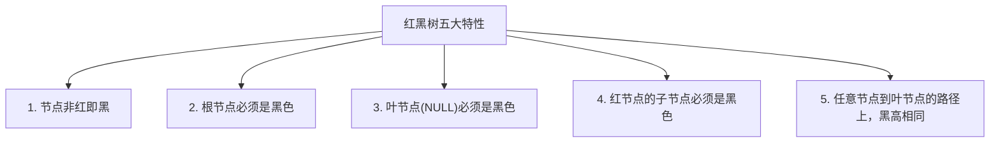
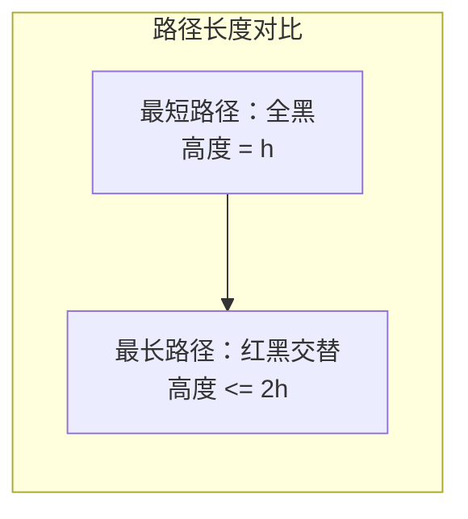
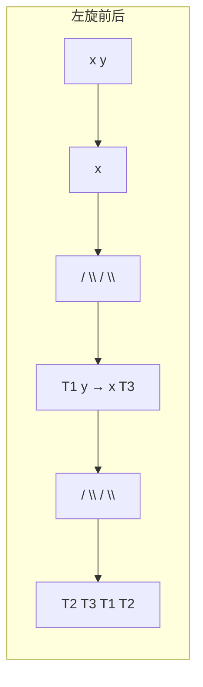
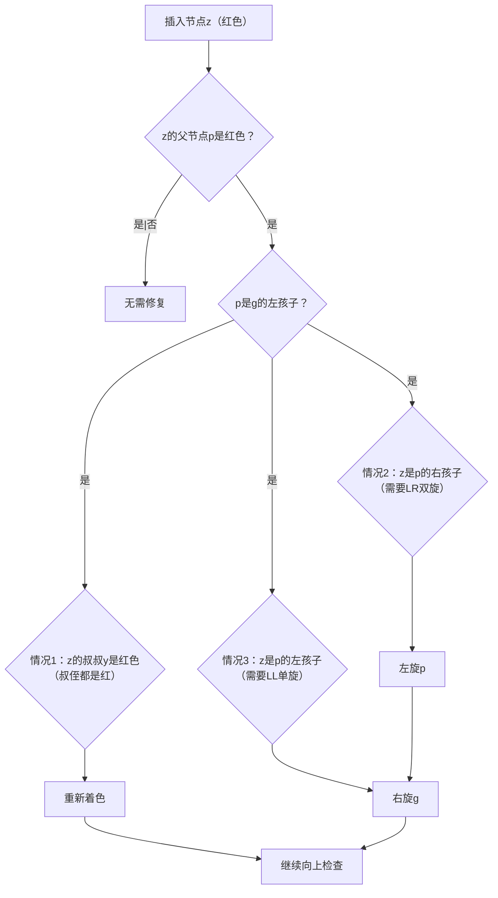
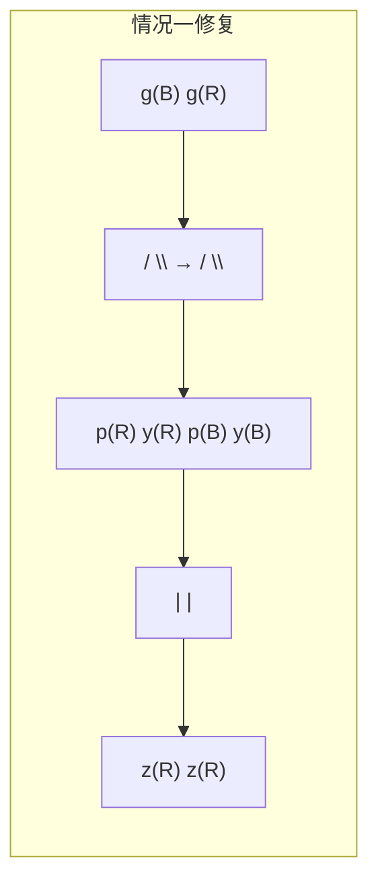

# 红黑树特性与原理

面试官问："为什么Java的HashMap要用红黑树？链表不行吗？"

候选人小张回答："因为链表查询太慢，红黑树查询快。"

面试官追问："那为什么阈值是8？不是16或者32？"

小张支支吾吾...

面试官又问："红黑树有哪些特性？它是怎么保持平衡的？"

小张彻底卡住了...

---

## 一、从一个问题开始

红黑树是面试中的高频难点，90%的候选人能背出"红黑树是自平衡二叉搜索树"，但能讲清楚五大特性、插入修复算法的不超过30%，能回答"为什么选择红黑树而不是AVL树"的不到20%。

今天，我们把红黑树讲透。

【直观类比】

红黑树就像一个有序的停车场：
- **红色车位**：临时候车位，不能连续停两辆
- **黑色车位**：正式车位，稳定可靠
- **规则**：每条"路"（路径）上的临时候车位数量必须相等

通过这种巧妙的设计，即使不严格平衡，树的高度也能保持在O(logn)范围内。

---

## 二、红黑树的五大特性

红黑树必须满足以下五个约束：



```java
public class RBTreeNode {
    private static final boolean RED = true;
    private static final boolean BLACK = false;
    
    int val;
    boolean color;  // RED = true, BLACK = false
    RBTreeNode left;
    RBTreeNode right;
    RBTreeNode parent;
}
```

### 2.1 为什么这五个特性能让树保持平衡？

**关键洞察**：特性4（红节点的子节点必须是黑色）保证了**不会有连续的红节点**。

这意味着：
- 最长路径（交替红黑）最多是最短路径的**2倍**
- 树的高度被限制在`2 * log2(n)`范围内



### 2.2 黑高（Black Height）

**黑高**：从某节点出发（不包括该节点）到叶节点的任意路径上，黑色节点的数量。

特性5保证了：从任意节点出发，到其所有叶节点的路径上，黑色节点数量相同。

```java
// 计算黑高
private int blackHeight(RBTreeNode node) {
    if (node == null) return 0;
    int left = blackHeight(node.left);
    int right = blackHeight(node.right);
    return node.color == BLACK ? Math.max(left, right) + 1 : Math.max(left, right);
}
```

---

## 三、红黑树的旋转操作

红黑树的旋转和AVL树类似，但更简单（不需要维护高度）。

### 3.1 左旋

```java
private void leftRotate(RBTreeNode x) {
    RBTreeNode y = x.right;
    x.right = y.left;
    if (y.left != null) y.left.parent = x;
    y.parent = x.parent;
    
    if (x.parent == null) root = y;
    else if (x.parent.left == x) x.parent.left = y;
    else x.parent.right = y;
    
    y.left = x;
    x.parent = y;
}
```



### 3.2 右旋

```java
private void rightRotate(RBTreeNode y) {
    RBTreeNode x = y.left;
    y.left = x.right;
    if (x.right != null) x.right.parent = y;
    x.parent = y.parent;
    
    if (y.parent == null) root = x;
    else if (y.parent.left == y) y.parent.left = x;
    else y.parent.right = x;
    
    x.right = y;
    y.parent = x;
}
```

---

## 四、插入操作与修复算法

### 4.1 插入步骤

```java
public void insert(int val) {
    // 1. 按BST规则插入
    RBTreeNode node = new RBTreeNode(val, RED, null, null, null);
    insertBST(node);
    
    // 2. 修复红黑树性质
    insertFixup(node);
}

// BST插入
private void insertBST(RBTreeNode node) {
    RBTreeNode y = null;
    RBTreeNode x = root;
    while (x != null) {
        y = x;
        if (node.val < x.val) x = x.left;
        else x = x.right;
    }
    node.parent = y;
    if (y == null) root = node;
    else if (node.val < y.val) y.left = node;
    else y.right = node;
}
```

### 4.2 插入修复（重点）

新插入的节点默认是**红色**（为什么是红色？后面解释）。

插入后可能有三种违规情况：



**情况一：叔节点是红色**

```java
if (uncle != null && uncle.color == RED) {
    // 父节点和叔节点都变成黑色
    parent.color = BLACK;
    uncle.color = BLACK;
    // 祖父节点变成红色，继续向上检查
    grandParent.color = RED;
    z = grandParent;
}
```



**情况二：叔节点是黑色，且z是内侧孩子（需要双旋）**

```java
if (parent == grandParent.left && z == parent.right) {
    leftRotate(parent);
    z = parent;
}
```

**情况三：叔节点是黑色，且z是外侧孩子（单旋）**

```java
if (parent == grandParent.left && z == parent.left) {
    parent.color = BLACK;
    grandParent.color = RED;
    rightRotate(grandParent);
}
```

### 4.3 为什么新节点是红色？

这是一个面试高频追问。

**答案**：如果新节点是黑色，那么特性5（黑高相同）必定被破坏，需要重新染色；而新节点是红色，只有在父节点也是红色时才需要修复，开销更小。

【直观类比】

新节点是红色就像"先不锁门"：
- 如果隔壁也是红色（父节点红），才需要加锁（修复）
- 如果隔壁是黑色（父节点黑），直接通行，不用管

---

## 五、与AVL树的对比

| 特性 | AVL树 | 红黑树 |
|------|-------|--------|
| 平衡标准 | 高度差 `<= 1` | 近似平衡 |
| 查询性能 | 最优（严格平衡） | 略低但接近O(logn) |
| 插入/删除性能 | 需要更多旋转 | 最多3次旋转 |
| 旋转复杂度 | 简单 | 稍复杂 |
| 典型应用 | 数据库索引 | HashMap、TreeMap、Linux CFS |

**为什么Java选择红黑树？**

1. **插入/删除更频繁**：HashMap的put操作涉及扩容、删除节点等，红黑树的旋转开销更小
2. **综合性能更好**：虽然查询略慢，但插入删除的常数因子更小
3. **实现更简单**：相比AVL，红黑树的修复算法更易实现

---

## 六、边界与特例

### 6.1 根节点修复

```java
// 插入后检查根节点
if (node.parent == null) {
    node.color = BLACK;
    root = node;
    return;
}
```

### 6.2 NIL叶子节点

红黑树的叶节点不是真正的TreeNode，而是NIL哨兵节点（黑色）：

```java
private RBTreeNode NIL = new RBTreeNode(0, BLACK, null, null, null);
```

这样可以简化边界判断，不需要每次检查`null`。

### 6.3 连续红节点的检查

```java
while (z != root && z.parent.color == RED) {
    // 检查父节点是祖父节点的左还是右孩子
    // 分别处理两种对称情况
}
```

---

## 七、常见误区

### ❌ 误区一：红黑树是完全平衡的

**实际情况**：红黑树是**近似平衡**，高度最多是最短路径的2倍，而不是绝对相等。

### ❌ 误区二：红黑树查询一定比AVL快

**实际情况**：AVL查询略快（因为严格平衡），红黑树插入/删除更快。

### ❌ 误区三：红黑树的平衡靠旋转

**实际情况**：红黑树主要靠**重新染色**，旋转只是辅助。AVL主要靠旋转。

---

## 八、记忆技巧

用口诀记住红黑树五大特性：

> **红黑相间不连续，根叶必须都是黑，所有路径黑高同**

用一句话记住平衡原理：

> **红黑树不追求绝对平衡，只保证最长路径不超过最短路径的2倍**

---

## 九、实战检验

### 检验一：手写红黑树插入

关键点：
1. 按BST规则插入
2. 新节点着红色
3. 调用`insertFixup`修复

### 检验二：力扣110题 - 平衡二叉树

```java
public boolean isBalanced(TreeNode root) {
    return checkHeight(root) != -1;
}

private int checkHeight(TreeNode node) {
    if (node == null) return 0;
    
    int left = checkHeight(node.left);
    if (left == -1) return -1;
    
    int right = checkHeight(node.right);
    if (right == -1) return -1;
    
    if (Math.abs(left - right) > 1) return -1;
    
    return Math.max(left, right) + 1;
}
```

---

## 十、总结

红黑树的核心设计思想：

1. **用颜色约束代替高度约束**：不需要严格平衡，只要求黑色高度相同
2. **旋转次数少**：最多3次旋转，适合插入删除频繁的场景
3. **综合性能最优**：查询略慢但插入删除快，广泛应用于生产环境

记住这三句话：

1. **红黑树是近似平衡，不是完全平衡**
2. **红黑树的平衡靠染色，AVL的平衡靠旋转**
3. **选择哪种树，取决于查询和修改的频率**

下一篇文章，我们来聊聊**B树与B+树**，看看数据库索引为什么选择了它们。
