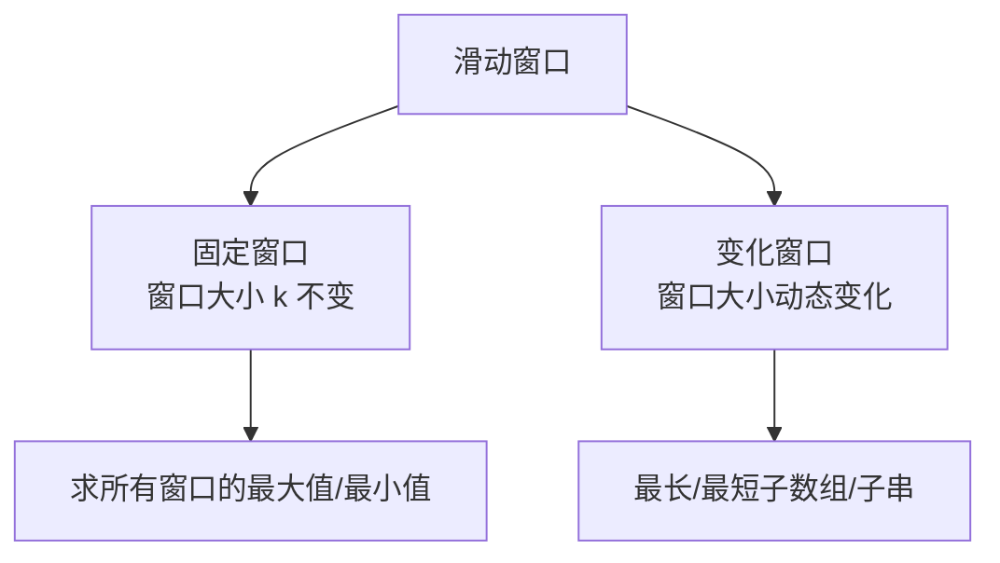
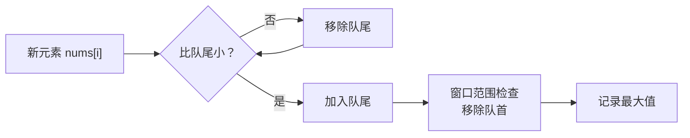

# 滑动窗口算法

想象你坐公交车：

- 窗口就是车窗，每前进一站，窗口内的人就发生变化
- 左边的人下车（移除窗口），右边的人上车（加入窗口）
- 始终保持窗口内是一段连续的乘客

这就是滑动窗口的核心思想——**维护一个可变区间，在区间滑动的过程中更新答案**。

【直观类比】

滑动窗口就像你想在公司附近租一套房子：

- 你设定一个预算范围（窗口大小）
- 从内环向外环开始看房（窗口滑动）
- 发现月租超出预算，就从左边减一个小区（左边界收缩）
- 发现还有空间，从右边加一个小区（右边界扩张）
- 直到找到最合适的为止

这个"看房→调整范围→继续看"的循环，就是滑动窗口的精髓。

---

## 一、问题的引入

先看一道经典题：

> 给定一个数组 `nums` 和一个窗口大小 `k`，求所有窗口的最大值。

示例：
```
输入: nums = [1,3,-1,-3,5,3,6,7], k = 3
输出: [3,3,5,5,6,7]
```

**普通解法**：`O(n*k)` — 每个窗口遍历 k 个元素

**滑动窗口解法**：`O(n)` — 每个元素只进窗口一次、出窗口一次

---

## 二、滑动窗口的两大类型



### 2.1 固定窗口（窗口大小不变）

**模板**：

```java
public void fixedWindow(int[] nums, int k) {
    // 1. 初始化窗口
    int left = 0, right = 0;
    // 结果集
    List<Integer> result = new ArrayList<>();

    // 2. 右边界扩张
    for (right = 0; right < nums.length; right++) {
        // 加入窗口 nums[right]

        // 3. 当窗口达到目标大小时，收缩左边界
        if (right - left + 1 >= k) {
            // 窗口内处理逻辑
            result.add(窗口内答案);

            // 移除 nums[left]，左边界收缩
            left++;
        }
    }
}
```

**应用场景**：求所有窗口的最大值、窗口内元素和等

### 2.2 变化窗口（窗口大小动态变化）

**模板**：

```java
public void variableWindow(int[] nums, int target) {
    int left = 0, right = 0;
    int windowSum = 0;
    int minLength = Integer.MAX_VALUE;

    for (right = 0; right < nums.length; right++) {
        // 1. 扩张：加入新元素
        windowSum += nums[right];

        // 2. 收缩：当满足条件时，尝试缩小窗口
        while (windowSum >= target) {
            // 更新答案（窗口大小）
            minLength = Math.min(minLength, right - left + 1);

            // 3. 移除左边元素，收缩窗口
            windowSum -= nums[left];
            left++;
        }
    }
}
```

**应用场景**：最短子数组、和大于等于 target 等

---

## 三、实战：LeetCode 239 滑动窗口最大值 🔴

**题目**：
```
给你一个整数数组 nums，有一个大小为 k 的窗口在数组中滑动。
求窗口从左移到右时，每次窗口中的最大元素。
```

**暴力解法**（超时）：
```java
public int[] maxSlidingWindow(int[] nums, int k) {
    int[] result = new int[nums.length - k + 1];
    for (int i = 0; i <= nums.length - k; i++) {
        int max = nums[i];
        for (int j = i; j < i + k; j++) {
            max = Math.max(max, nums[j]);
        }
        result[i] = max;
    }
    return result;
}
```

**单调队列优化**：`O(n)`

```java
public int[] maxSlidingWindow(int[] nums, int k) {
    if (nums == null || nums.length == 0) return new int[0];

    // 单调递减队列：存储元素索引
    // 队首始终是当前窗口最大值的索引
    LinkedList<Integer> deque = new LinkedList<>();
    int[] result = new int[nums.length - k + 1];
    int resultIndex = 0;

    for (int i = 0; i < nums.length; i++) {
        // 1. 加入新元素前，先把比它小的都移除（它们不可能是最大值）
        while (!deque.isEmpty() && nums[deque.peekLast()] <= nums[i]) {
            deque.pollLast();
        }
        deque.addLast(i);

        // 2. 窗口左边界收缩：移除超出窗口范围的元素
        if (deque.peekFirst() <= i - k) {
            deque.pollFirst();
        }

        // 3. 窗口达到大小k时，记录答案
        if (i >= k - 1) {
            result[resultIndex++] = nums[deque.peekFirst()];
        }
    }
    return result;
}
```

**核心思想**：单调队列



---

## 四、实战：LeetCode 76 最小覆盖子串 🔴

**题目**：
```
给你一个字符串 s 和 t，求 s 中包含 t 所有字符的最小子串。
```

**示例**：
```
输入: s = "ADOBECODEBANC", t = "ABC"
输出: "BANC"
```

**解题思路**：

```java
public String minWindow(String s, String t) {
    if (s == null || t == null || s.length() < t.length()) {
        return "";
    }

    // 1. 统计 t 中每个字符的出现次数
    Map<Character, Integer> need = new HashMap<>();
    for (char c : t.toCharArray()) {
        need.put(c, need.getOrDefault(c, 0) + 1);
    }

    // 2. 滑动窗口
    Map<Character, Integer> window = new HashMap<>();
    int left = 0, right = 0;
    int matchCount = 0; // 窗口中匹配字符数
    int minLength = Integer.MAX_VALUE;
    String result = "";

    while (right < s.length()) {
        char c = s.charAt(right);
        window.put(c, window.getOrDefault(c, 0) + 1);

        // 如果窗口中的字符c满足了需要，加入匹配计数
        if (need.containsKey(c) && window.get(c) <= need.get(c)) {
            matchCount++;
        }

        // 3. 当所有字符都匹配时，尝试收缩左边界
        while (matchCount == t.length()) {
            // 更新最小子串
            if (right - left + 1 < minLength) {
                minLength = right - left + 1;
                result = s.substring(left, right + 1);
            }

            // 收缩左边界
            char leftChar = s.charAt(left);
            if (need.containsKey(leftChar) &&
                window.get(leftChar) <= need.get(leftChar)) {
                matchCount--;
            }
            window.put(leftChar, window.get(leftChar) - 1);
            left++;
        }
        right++;
    }
    return result;
}
```

**关键点**：
- 用 `need` 统计需要匹配的字符
- 用 `window` 统计窗口内的字符
- `matchCount` 记录已匹配字符种类数

---

## 五、常见题型总结

| 题型 | 窗口类型 | 关键点 |
| --- | --- | --- |
| 所有窗口的最大值 | 固定窗口 | 单调递减队列 |
| 长度最小的子数组 | 变化窗口 | 右扩→满足条件→左缩→更新答案 |
| 找到字符串中所有字母异位词 | 固定窗口 | 字符计数比较 |
| 最大 K 个数和 | 变化窗口 | 维护窗口内 K 个元素 |

---

## 六、记忆技巧

滑动窗口的**三口诀**：

> **"右扩撑满，左缩找最优，再扩再缩，直到遍历完"**

**固定窗口**：`for` 右边界扩张 → `if` 窗口满 → 收缩左边界 → 记录答案

**变化窗口**：`for` 右边界扩张 → `while` 满足条件 → 收缩左边界 → 更新答案

---

## 七、实战检验

### 检验一：LeetCode 3 无重复字符的最长子串

```java
public int lengthOfLongestSubstring(String s) {
    Set<Character> window = new HashSet<>();
    int left = 0, right = 0;
    int maxLength = 0;

    while (right < s.length()) {
        if (!window.contains(s.charAt(right))) {
            window.add(s.charAt(right));
            maxLength = Math.max(maxLength, right - left + 1);
            right++;
        } else {
            window.remove(s.charAt(left));
            left++;
        }
    }
    return maxLength;
}
```

### 检验二：LeetCode 438 找到字符串中所有字母异位词

```java
public List<Integer> findAnagrams(String s, String p) {
    Map<Character, Integer> need = new HashMap<>();
    for (char c : p.toCharArray()) {
        need.put(c, need.getOrDefault(c, 0) + 1);
    }

    Map<Character, Integer> window = new HashMap<>();
    List<Integer> result = new ArrayList<>();
    int left = 0, right = 0;
    int matchCount = 0;

    while (right < s.length()) {
        char c = s.charAt(right);
        if (need.containsKey(c)) {
            window.put(c, window.getOrDefault(c, 0) + 1);
            if (window.get(c) <= need.get(c)) {
                matchCount++;
            }
        }

        if (right - left + 1 > p.length()) {
            char lc = s.charAt(left);
            if (need.containsKey(lc)) {
                if (window.get(lc) <= need.get(lc)) {
                    matchCount--;
                }
                window.put(lc, window.get(lc) - 1);
            }
            left++;
        }

        if (matchCount == need.size()) {
            result.add(left);
        }
        right++;
    }
    return result;
}
```

**考点**：固定窗口 + 字符计数 + 窗口收缩时机。

---

## 八、总结

滑动窗口的核心是**双指针的优雅应用**：

1. **右指针扩张**：把新元素加入窗口
2. **条件判断**：是否满足某种条件
3. **左指针收缩**：在满足条件时，尝试缩小窗口
4. **更新答案**：在窗口变化的过程中记录最优解

记住：**滑动窗口不是魔法，它是"有策略的双指针"**。
