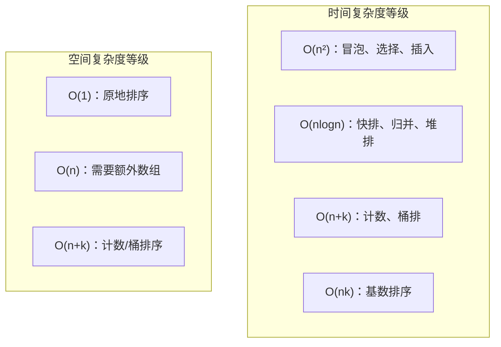
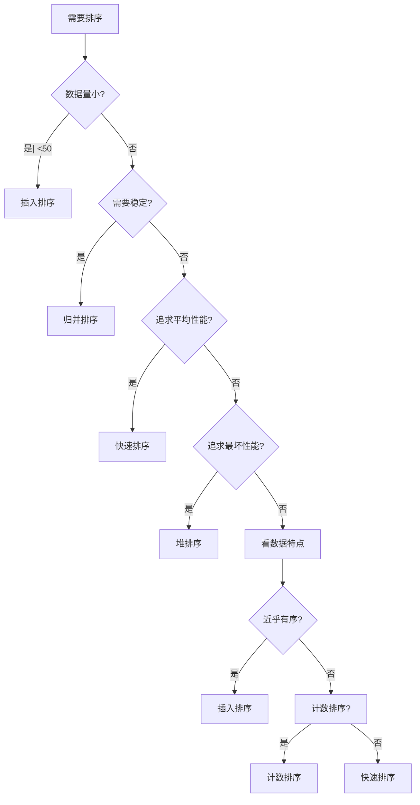

# 排序算法对比总结

面试官问："如果让你实现一个排序算法，你会选择哪个？为什么？"

候选人小张回答："快速排序，因为它是最快的。"

面试官追问："有序数组呢？近乎有序的数组呢？需要稳定排序的场景呢？"

小张愣住了...

---

## 一、从一个问题开始

很多候选人只背了"快速排序是O(nlogn)，最快"，却没有理解每种排序算法的适用场景。

今天，我们做一个全景对比，帮你建立完整的排序算法知识体系。

【直观类比】

排序算法就像不同的出行方式：
- 冒泡/选择/插入：走路，简单但慢
- 快速排序：骑自行车，快但可能摔跤
- 归并排序：坐地铁，稳定可靠
- 堆排序：直升机，理论最快但成本高

---

## 二、全景对比表

### 2.1 十大排序算法一览

| 算法 | 最好 | 平均 | 最坏 | 空间 | 稳定性 |
|------|------|------|------|------|--------|
| 冒泡排序 | `O(n)` | `O(n²)` | `O(n²)` | `O(1)` | 稳定 |
| 选择排序 | `O(n²)` | `O(n²)` | `O(n²)` | `O(1)` | 不稳定 |
| 插入排序 | `O(n)` | `O(n²)` | `O(n²)` | `O(1)` | 稳定 |
| 希尔排序 | `O(nlogn)` | `O(n^1.3)` | `O(n²)` | `O(1)` | 不稳定 |
| 归并排序 | `O(nlogn)` | `O(nlogn)` | `O(nlogn)` | `O(n)` | 稳定 |
| 快速排序 | `O(nlogn)` | `O(nlogn)` | `O(n²)` | `O(logn)` | 不稳定 |
| 堆排序 | `O(nlogn)` | `O(nlogn)` | `O(nlogn)` | `O(1)` | 不稳定 |
| 计数排序 | `O(n+k)` | `O(n+k)` | `O(n+k)` | `O(k)` | 稳定 |
| 桶排序 | `O(n+k)` | `O(n+k)` | `O(n²)` | `O(n+k)` | 稳定 |
| 基数排序 | `O(nk)` | `O(nk)` | `O(nk)` | `O(n+k)` | 稳定 |

### 2.2 复杂度可视化



---

## 三、按特性分类

### 3.1 原地排序 vs 非原地排序

```mermaid
graph LR
    subgraph 原地排序（不需要额外数组）
        A["冒泡排序"]
        B["选择排序"]
        C["插入排序"]
        D["希尔排序"]
        E["快速排序"]
        F["堆排序"]
    end
    
    subgraph 非原地排序（需要额外数组）
        G["归并排序"]
        H["计数排序"]
        I["桶排序"]
        J["基数排序"]
    end
```

### 3.2 稳定排序 vs 不稳定排序

**稳定性**：排序后相同值的元素相对位置不变。

```java
// 不稳定排序的经典反例
// 原始：[{name: "A", score: 90}, {name: "B", score: 90}, {name: "C", score: 80}]
// 按分数降序排序后（不稳定）：
// 结果：[{name: "B", score: 90}, {name: "A", score: 90}, {name: "C", score: 80}]
// 注意：A和B的相对位置改变了！

// 稳定排序的结果应该是：
// 结果：[{name: "A", score: 90}, {name: "B", score: 90}, {name: "C", score: 80}]
```

| 稳定排序 | 不稳定排序 |
|---------|-----------|
| 冒泡、插入、归并、计数、桶、基数 | 选择、希尔、快排、堆排 |

### 3.3 分治排序 vs 非分治排序

| 分治排序 | 非分治排序 |
|---------|-----------|
| 快速排序、归并排序 | 冒泡、选择、插入、堆排 |

---

## 四、适用场景分析

### 4.1 小规模数据（n <= 50）

```java
// 场景：几十一百个元素的排序
// 推荐：插入排序

// 原因：
// 1. 小数据量时，O(n²) 和 O(nlogn) 差距不大
// 2. 插入排序的常数因子小
// 3. 插入排序对有序数组近乎 O(n)
insertionSort(arr);
```

### 4.2 近乎有序的数据

```java
// 场景：数组基本有序，只有少量乱序
// 推荐：插入排序

// 验证
int[] nearlySorted = {1, 3, 2, 4, 5, 6, 8, 7};
// 插入排序：只需交换几次，时间接近 O(n)
```

### 4.3 需要稳定排序

```java
// 场景：排序后相同值的相对位置必须保持
// 推荐：归并排序

// 典型场景：
// 1. 按多个字段排序（先按A排，再按B排）
// 2. 数据库多字段排序
mergeSort(arr);  // 稳定排序
```

### 4.4 追求极致性能（随机数据）

```java
// 场景：大量随机数据的排序
// 推荐：快速排序（平均性能最好）

// 原因：
// 1. 平均 O(nlogn)
// 2. 原地排序，空间 O(logn)
// 3. 缓存友好
quickSort(arr);
```

### 4.5 追求最坏情况稳定

```java
// 场景：对性能要求严格，不能接受 O(n²) 的最坏情况
// 推荐：堆排序

// 特点：
// 1. 最坏情况也是 O(nlogn)
// 2. 原地排序，空间 O(1)
// 3. 但缓存不友好
heapSort(arr);
```

### 4.6 整数排序（范围有限）

```java
// 场景：整数排序，范围有限（如 0-10000）
// 推荐：计数排序

// 原因：O(n) 时间复杂度
int[] arr = {5, 2, 8, 1, 9, 3, 7, 4, 6};
countingSort(arr);  // O(n+k)，k是范围大小
```

### 4.7 字符串/日期排序

```java
// 场景：按字典序排序字符串
// 推荐：基数排序

// 原因：按字符逐位排序，适合等长字符串
radixSort(strings);
```

---

## 五、面试高频追问

### 5.1 追问一：为什么快速排序在实际中比归并排序更快？

| 维度 | 快速排序 | 归并排序 |
|------|---------|---------|
| 缓存友好性 | 访问局部性好 | 需要访问远距离数据 |
| 常数因子 | 更小 | 更大 |
| 空间开销 | O(logn) | O(n) |
| 递归深度 | logn（平均） | logn |

快速排序的分区操作是**顺序读写**，对CPU缓存友好；归并排序需要把数据写到临时数组再读回来，缓存命中率高。

### 5.2 追问二：Java的Arrays.sort是怎么实现的？

```java
// Java 1.8+ 的实现策略
public static void sort(int[] a) {
    // 小数据量（< 47）：插入排序
    // 大数据量：TimSort（改进的归并排序）
    // 对于基本类型：用快速排序（不稳定但快）
    // 对于对象类型：用TimSort（稳定）
}
```

**TimSort**：结合了插入排序和归并排序的优势，对近乎有序的数据特别有效。

### 5.3 追问三：能不能同时做到又快又稳定？

```java
// 方案：改进的快速排序 + 插入排序
// 实际上Java对基本类型就是这么做的
// 虽然不稳定，但基本类型不需要稳定性

// 如果需要稳定，可以：
// 1. 用TimSort（Java对象排序）
// 2. 用归并排序（最坏情况也是 O(nlogn)）
```

---

## 六、工程实践中的选择

### 6.1 各语言的排序选择

| 语言 | 基本类型 | 对象类型 |
|------|---------|---------|
| Java | 快速排序 | TimSort |
| Python | 快速排序（ introsort） | TimSort |
| C++ | 快速排序（ introsort） | 归并排序 |
| Go | 快速排序 | 归并排序 |

### 6.2 数据库的排序选择

```sql
-- 数据库通常选择堆排序或归并排序
-- 原因：可能需要 top-k，不需要全量排序

SELECT * FROM orders ORDER BY create_time DESC LIMIT 10;
-- 如果用堆排序，可以 O(nlogk) 完成
-- 如果用归并排序，需要 O(nlogn)
```

### 6.3 海量数据排序

```java
// 场景：10GB数据排序，但内存只有1GB
// 方案：外部排序

// 1. 分批加载：把10GB分成10个1GB文件
// 2. 内存内排序：分别对每个文件排序
// 3. 多路归并：用堆排序实现多路归并

public void externalSort(String inputFile, String outputFile) {
    // Step 1: 分成小文件，内存内排序
    splitAndSort(inputFile);
    
    // Step 2: 多路归并
    kWayMerge(outputFile);
}
```

---

## 七、记忆技巧

用口诀记住稳定性：

> **选泡插（选择、冒泡、插入）都不稳，希快堆（希尔、快排、堆排）也不稳，归基桶（归并、基数、桶排）都稳定**

用选择树记住选型：



---

## 八、实战检验

### 检验：如何选择排序算法

```java
public void sort(int[] arr) {
    // 问题：给你一个数组，怎么选择排序算法？
    
    // 回答：
    // 1. n <= 50：插入排序
    if (arr.length <= 50) {
        insertionSort(arr);
        return;
    }
    
    // 2. 基本类型（不需要稳定）：快速排序
    // Arrays.sort() 对基本类型就是这么做的
    if (isPrimitiveArray(arr)) {
        quickSort(arr);
        return;
    }
    
    // 3. 对象类型（需要稳定）：TimSort / 归并排序
    // Java 对对象类型就是这么做的
    mergeSort(arr);
}

// 简化版：直接用语言自带的排序
public void sortSimple(int[] arr) {
    Arrays.sort(arr);  // 内部会根据数据特点选择最优算法
}
```

---

## 九、总结

排序算法的选择，本质上是**时间、空间、稳定性的权衡**：

| 场景 | 推荐算法 |
|------|---------|
| 小数据量 | 插入排序 |
| 近乎有序 | 插入排序 |
| 需要稳定 | 归并排序 |
| 追求平均最快 | 快速排序 |
| 追求最坏稳定 | 堆排序 / 归并排序 |
| 整数范围有限 | 计数排序 |
| 字符串排序 | 基数排序 |
| 海量数据 | 外部排序 |

记住这三句话：

1. **没有最好的排序算法，只有最适合场景的排序算法**
2. **稳定性和时间复杂度同样重要**
3. **生产环境直接用语言自带的排序，它们已经做了最好的选择**

下一篇文章，我们来聊聊**二分查找**，看看如何在有序数组中快速定位目标。
