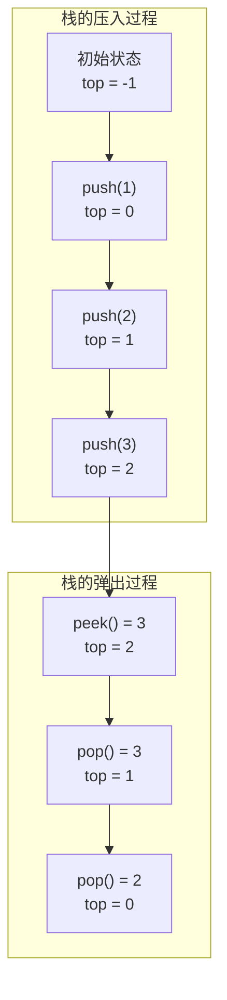
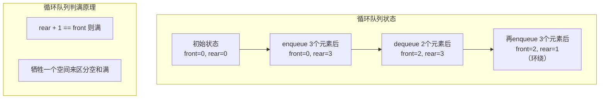
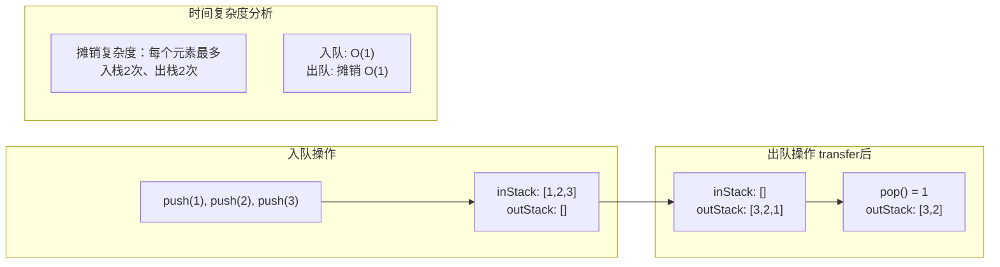

# 栈与队列的实现原理

面试官问："如何用栈实现队列？反过来，用队列实现栈呢？"

候选人小张拿起笔，开始画图：

"栈是LIFO，队列是FIFO..."

面试官打断他："你知道栈和队列的底层可以用哪些数据结构实现吗？它们的时间复杂度分别是多少？"

小张愣了一下，说："数组和链表都可以..."

面试官追问："那用数组实现栈时，下溢和上溢是什么？怎么避免？"

小张开始擦汗...

---

## 一、从一个问题开始

栈和队列是算法中最基础的数据结构，但也是面试中出错率最高的知识点之一。90%的候选人能说出"LIFO"和"FIFO"，但能正确实现一个带边界检查的栈的，不超过50%。

今天，我们把栈和队列从底层原理到工程实现彻底讲透。

【直观类比】

想象你有一摞餐盘：

- **栈**就像叠盘子：你只能从最上面放盘子（push），也只能从最上面拿盘子（pop）。最后放上去的盘子，最先被拿走——这就是**LIFO（Last In First Out）**。
- **队列**就像排队买奶茶：你从队尾加入（enqueue），从队头离开（dequeue）。最先排队的，最先买到——这就是**FIFO（First In First Out）**。

---

## 二、栈的原理与实现

### 2.1 栈的核心操作

栈只有两个核心操作：

```java
public interface Stack<E> {
    void push(E item);    // 入栈：把元素放到栈顶
    E pop();              // 出栈：移除并返回栈顶元素
    E peek();             // 查看栈顶元素（不出栈）
    boolean isEmpty();    // 栈是否为空
    int size();           // 栈中元素数量
}
```

### 2.2 用数组实现栈

```java
public class ArrayStack<E> {
    private Object[] data;  // 存储数据的数组
    private int top;        // 栈顶指针，-1表示空栈
    private int capacity;   // 栈容量

    public ArrayStack(int initialCapacity) {
        this.capacity = initialCapacity;
        this.data = new Object[capacity];
        this.top = -1;
    }

    public void push(E item) {
        // 关键1：检查上溢
        if (top >= capacity - 1) {
            throw new StackOverflowError("Stack is full");
        }
        data[++top] = item;  // top先+1，再赋值
    }

    @SuppressWarnings("unchecked")
    public E pop() {
        // 关键2：检查下溢
        if (top < 0) {
            throw new IllegalStateException("Stack is empty");
        }
        return (E) data[top--];  // 先返回，再top-1
    }

    @SuppressWarnings("unchecked")
    public E peek() {
        if (top < 0) {
            throw new IllegalStateException("Stack is empty");
        }
        return (E) data[top];  // 只查看，不移动指针
    }

    public boolean isEmpty() {
        return top < 0;
    }

    public int size() {
        return top + 1;
    }
}
```



**复杂度分析**：

| 操作 | 时间复杂度 | 原因 |
|------|-----------|------|
| `push()` | `O(1)` | 直接在栈顶添加 |
| `pop()` | `O(1)` | 直接从栈顶移除 |
| `peek()` | `O(1)` | 只读取栈顶 |
| 查询（任意位置） | `O(n)` | 需要弹出元素才能看到 |

### 2.3 用链表实现栈

```java
public class LinkedStack<E> {
    private Node<E> top;  // 栈顶节点
    private int size;      // 栈中元素数量

    private static class Node<E> {
        E data;
        Node<E> next;
        Node(E data) {
            this.data = data;
        }
    }

    public void push(E item) {
        Node<E> newNode = new Node<>(item);
        newNode.next = top;  // 新节点指向当前栈顶
        top = newNode;        // 更新栈顶指针
        size++;
    }

    public E pop() {
        if (top == null) {
            throw new IllegalStateException("Stack is empty");
        }
        E data = top.data;
        top = top.next;       // 栈顶下移
        size--;
        return data;
    }

    public E peek() {
        if (top == null) {
            throw new IllegalStateException("Stack is empty");
        }
        return top.data;
    }

    public boolean isEmpty() {
        return top == null;
    }

    public int size() {
        return size;
    }
}
```

### 2.4 数组实现 vs 链表实现

| 维度 | 数组实现 | 链表实现 |
|------|---------|---------|
| 时间复杂度 | 全部 `O(1)` | 全部 `O(1)` |
| 空间复杂度 | 需要预设容量 | 动态伸缩 |
| 上溢问题 | 有（固定容量） | 无（动态扩容） |
| 下溢问题 | 有（空栈时pop） | 有（空栈时pop） |
| 内存布局 | 连续内存，缓存友好 | 离散内存，指针开销 |
| push/pop 开销 | 只需数组赋值 | 需创建/销毁节点 |

---

## 三、队列的原理与实现

### 3.1 队列的核心操作

```java
public interface Queue<E> {
    void enqueue(E item);   // 入队：从队尾加入
    E dequeue();            // 出队：从队头移除并返回
    E front();              // 查看队头元素
    boolean isEmpty();      // 队列是否为空
    int size();             // 队列中元素数量
}
```

### 3.2 用数组实现队列（循环队列）

普通数组队列的出队操作需要移动所有元素，时间复杂度是`O(n)`。用**循环队列**可以解决这个问题。

```java
public class CircularQueue<E> {
    private Object[] data;
    private int front;      // 队头指针：指向第一个元素
    private int rear;       // 队尾指针：指向下一个写入位置
    private int capacity;   // 队列容量

    public CircularQueue(int capacity) {
        this.capacity = capacity;
        this.data = new Object[capacity];
        this.front = 0;
        this.rear = 0;
    }

    // 关键：判空和判满的条件不同
    public boolean isEmpty() {
        return front == rear;  // 队头==队尾时为空
    }

    public boolean isFull() {
        return (rear + 1) % capacity == front;  // 牺牲一个空间区分空满
    }

    public void enqueue(E item) {
        if (isFull()) {
            throw new IllegalStateException("Queue is full");
        }
        data[rear] = item;
        rear = (rear + 1) % capacity;  // 循环移动
    }

    @SuppressWarnings("unchecked")
    public E dequeue() {
        if (isEmpty()) {
            throw new IllegalStateException("Queue is empty");
        }
        E item = (E) data[front];
        data[front] = null;  // 释放引用
        front = (front + 1) % capacity;  // 循环移动
        return item;
    }

    @SuppressWarnings("unchecked")
    public E front() {
        if (isEmpty()) {
            throw new IllegalStateException("Queue is empty");
        }
        return (E) data[front];
    }

    public int size() {
        return (rear - front + capacity) % capacity;
    }
}
```



### 3.3 用链表实现队列

```java
public class LinkedQueue<E> {
    private Node<E> front;  // 队头
    private Node<E> rear;   // 队尾
    private int size;

    private static class Node<E> {
        E data;
        Node<E> next;
        Node(E data) {
            this.data = data;
        }
    }

    public void enqueue(E item) {
        Node<E> newNode = new Node<>(item);
        if (rear == null) {
            front = rear = newNode;
        } else {
            rear.next = newNode;
            rear = newNode;
        }
        size++;
    }

    public E dequeue() {
        if (front == null) {
            throw new IllegalStateException("Queue is empty");
        }
        E item = front.data;
        front = front.next;
        if (front == null) {
            rear = null;  // 队列空了，重置队尾
        }
        size--;
        return item;
    }

    public E front() {
        if (front == null) {
            throw new IllegalStateException("Queue is empty");
        }
        return front.data;
    }

    public boolean isEmpty() {
        return front == null;
    }

    public int size() {
        return size;
    }
}
```

### 3.4 数组实现 vs 链表实现

| 维度 | 循环数组实现 | 链表实现 |
|------|-------------|---------|
| 时间复杂度 | 全部 `O(1)` | 全部 `O(1)` |
| 空间复杂度 | 固定容量 | 动态伸缩 |
| 容量限制 | 有（牺牲1个空间） | 无 |
| 内存布局 | 连续内存 | 离散内存 |
| 入队效率 | `O(1)` | `O(1)` 有尾指针 |

---

## 四、经典面试题：用栈实现队列

这是面试中的高频题，考察对数据结构的灵活运用。

```java
public class StackToQueue {
    private Stack<Integer> inStack;   // 入栈
    private Stack<Integer> outStack;  // 出栈

    public StackToQueue() {
        inStack = new Stack<>();
        outStack = new Stack<>();
    }

    // 入队：直接入到inStack
    public void push(int x) {
        inStack.push(x);
    }

    // 出队：从outStack弹出，如果outStack为空则将inStack全部倒入
    public int pop() {
        if (outStack.isEmpty()) {
            transfer();
        }
        return outStack.pop();
    }

    public int peek() {
        if (outStack.isEmpty()) {
            transfer();
        }
        return outStack.peek();
    }

    // 关键：将inStack全部倒入outStack（顺序反转）
    private void transfer() {
        while (!inStack.isEmpty()) {
            outStack.push(inStack.pop());
        }
    }

    public boolean isEmpty() {
        return inStack.isEmpty() && outStack.isEmpty();
    }
}
```



---

## 五、经典面试题：用队列实现栈

```java
public class QueueToStack {
    private Queue<Integer> q1;  // 主队列
    private Queue<Integer> q2;  // 辅助队列

    public QueueToStack() {
        q1 = new LinkedList<>();
        q2 = new LinkedList<>();
    }

    public void push(int x) {
        q1.offer(x);  // 入栈元素加到主队列
    }

    public int pop() {
        // 将前n-1个元素移到辅助队列
        while (q1.size() > 1) {
            q2.offer(q1.poll());
        }
        int result = q1.poll();  // 剩下的一个就是栈顶

        // 交换队列引用
        Queue<Integer> temp = q1;
        q1 = q2;
        q2 = temp;

        return result;
    }

    public int top() {
        while (q1.size() > 1) {
            q2.offer(q1.poll());
        }
        int result = q1.peek();  // 只查看，不移除
        q2.offer(q1.poll());     // 移到最后

        Queue<Integer> temp = q1;
        q1 = q2;
        q2 = temp;

        return result;
    }

    public boolean isEmpty() {
        return q1.isEmpty();
    }
}
```

---

## 六、边界与特例

### 6.1 栈的下溢与上溢

```java
// 下溢：空栈时pop
Stack<Integer> stack = new Stack<>();
stack.pop();  // 抛出 IllegalStateException

// 上溢：满栈时push
ArrayStack<Integer> arrStack = new ArrayStack<>(3);
arrStack.push(1);
arrStack.push(2);
arrStack.push(3);
arrStack.push(4);  // 抛出 StackOverflowError
```

:::tip
工程实践中，建议使用 `ArrayDeque` 替代 `Stack` 类。`Stack` 继承自 `Vector`，是同步的（有性能开销），且违背了"优先使用组合而非继承"的设计原则。
:::

### 6.2 循环队列的判空判满

循环队列的核心难点是**判空**和**判满**的条件设计：

```java
// 方案1：牺牲一个空间（常用）
// 判满：rear + 1 == front
// 判空：rear == front
// 缺点：浪费1个空间

// 方案2：用size记录
// 判满：size == capacity
// 判空：size == 0
// 优点：不浪费空间

// 方案3：用标记位
// 判满：rear == front && flag == true
// 判空：rear == front && flag == false
```

### 6.3 栈的最小元素问题

如何实现一个能 `O(1)` 获取最小值的栈？

```java
public class MinStack {
    private Stack<Integer> dataStack;
    private Stack<Integer> minStack;  // 辅助栈记录最小值

    public MinStack() {
        dataStack = new Stack<>();
        minStack = new Stack<>();
    }

    public void push(int val) {
        dataStack.push(val);
        // 关键：minStack要记录每个状态的最小值
        if (minStack.isEmpty() || val <= minStack.peek()) {
            minStack.push(val);
        } else {
            minStack.push(minStack.peek());  // 保持同步
        }
    }

    public void pop() {
        dataStack.pop();
        minStack.pop();  // 同步弹出
    }

    public int top() {
        return dataStack.peek();
    }

    public int getMin() {
        return minStack.peek();  // O(1) 获取最小值
    }
}
```

---

## 七、常见误区

### ❌ 误区一：栈和队列的查询操作是 O(1)

**错误认知**："栈和队列都是 O(1) 的数据结构。"

**实际情况**：栈和队列的 `push/pop/enqueue/dequeue` 是 `O(1)`，但如果需要找到第 `k` 个元素或者搜索特定值，都需要 `O(n)`。

### ❌ 误区二：循环队列浪费一个空间是多此一举

**错误认知**："用 size 变量记录不就好了，为什么要浪费一个空间？"

**实际情况**：用 size 记录需要额外的状态维护，而且无法区分"队列满但size==capacity"和"队列空但size==0"（corner case）。牺牲一个空间是最简洁的解决方案。

### ❌ 误区三：Java 的 Stack 比 ArrayDeque 更好

**错误认知**："Java 原生的 Stack 类是专门为栈设计的，当然用它。"

**实际情况**：`Stack` 继承自 `Vector`（线程安全但性能差），且违背了设计原则。**正确做法**：使用 `ArrayDeque<E>` 作为栈，用 `LinkedList<E>` 作为队列。

### ❌ 误区四：用栈实现队列需要两个栈

**错误认知**："一个栈不够用吗？"

**实际情况**：一个栈确实无法实现队列。必须用两个栈——一个负责入队，一个负责出队——才能模拟队列的 FIFO 特性。

---

## 八、记忆技巧

用口诀记住栈的核心操作：

> **栈栈栈，LIFO，push pop peek，上溢下溢要记牢**

用口诀记住循环队列的判空判满：

> **循环队列真巧妙，空满判断有门道：front == rear 是空，rear + 1 == front 是满，多留一位显神通**

用口诀记住栈和队列的选择：

> **想反转顺序用栈，想保持顺序用队列**

---

## 九、实战检验

### 检验一：力扣20题 - 有效的括号

```java
public boolean isValid(String s) {
    Stack<Character> stack = new Stack<>();
    
    for (char c : s.toCharArray()) {
        if (c == '(' || c == '[' || c == '{') {
            stack.push(c);
        } else {
            if (stack.isEmpty()) return false;
            char top = stack.pop();
            if ((c == ')' && top != '(') ||
                (c == ']' && top != '[') ||
                (c == '}' && top != '{')) {
                return false;
            }
        }
    }
    
    return stack.isEmpty();
}
```

**考点**：栈的经典应用——括号匹配。

### 检验二：力扣225题 - 用队列实现栈

```java
// 见上面的 QueueToStack 实现
```

**考点**：队列的入队/出队特性与栈的 LIFO 特性的对比理解。

### 检验三：设计一个带超时功能的队列

```java
public class TimeoutQueue<E> {
    private Queue<E> queue;
    private Queue<Long> timestamps;  // 记录入队时间
    
    public TimeoutQueue() {
        queue = new LinkedList<>();
        timestamps = new LinkedList<>();
    }
    
    public void enqueue(E item, long timeoutMs) {
        queue.offer(item);
        timestamps.offer(System.currentTimeMillis() + timeoutMs);
    }
    
    public E dequeue(long maxWaitMs) {
        if (queue.isEmpty()) return null;
        
        long deadline = timestamps.peek();
        long now = System.currentTimeMillis();
        
        if (now >= deadline) {
            // 已超时，移除并返回
            timestamps.poll();
            return queue.poll();
        } else if (now + maxWaitMs >= deadline) {
            // 等待后超时
            maxWaitMs = deadline - now;
        }
        
        // 这里省略等待逻辑...
        return null;
    }
}
```

**考点**：在实际业务中队列经常需要超时控制，比如缓存、任务调度等场景。

---

## 十、总结

栈和队列是算法世界的两大基石，LIFO 和 FIFO 的思想渗透在计算机的各个角落。

记住这三句话：

1. **栈是后悔药，队列是排队机——数据结构的选择就是场景的选择**
2. **循环队列的核心是"指针循环"，数组实现要注意空满判断**
3. **用栈实现队列靠两个栈反转顺序，用队列实现栈靠反复搬移元素**

下篇文章，我们来聊聊**堆排序与优先队列**，看看如何在海量数据中找到 Top K。
