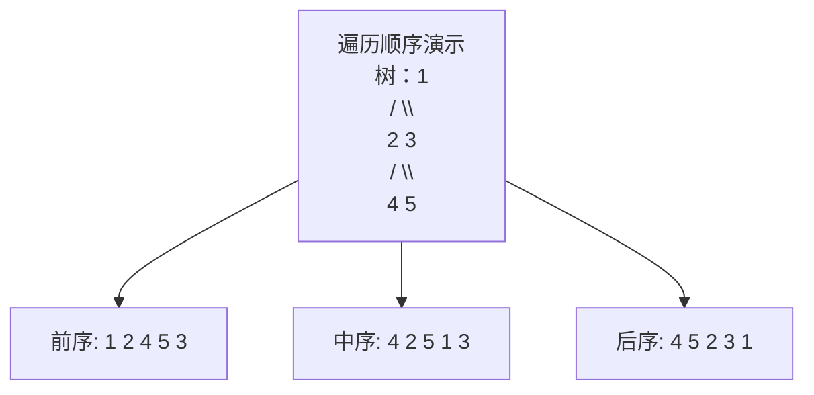
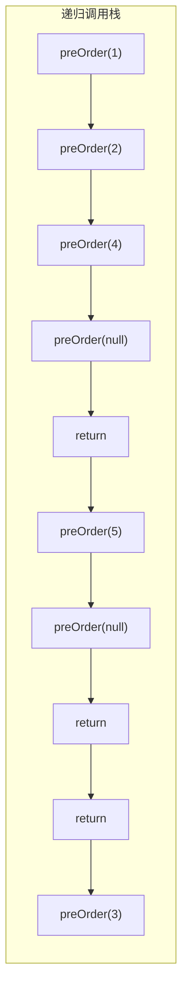
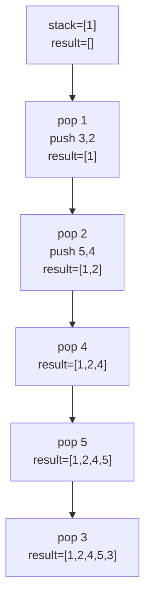
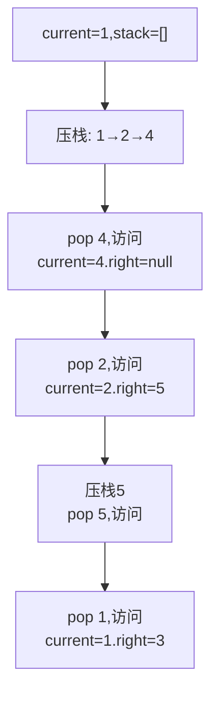
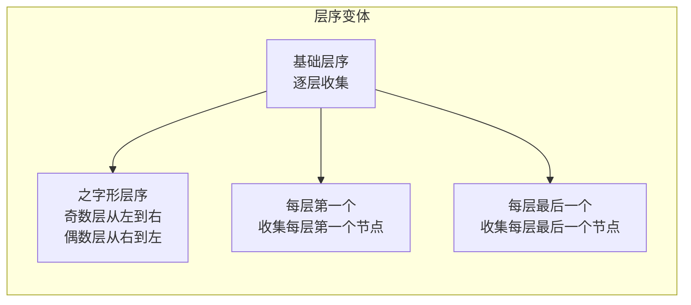

# 二叉树遍历

面试官在白板上画了一棵树：

```
        1
       / \
      2   3
     / \
    4   5
```

"这棵二叉树的前序遍历结果是什么？"

候选人小张脱口而出："1 2 4 5 3。"

面试官点点头，又问："用迭代而不是递归，怎么实现？"

小张开始挠头...

---

## 一、从一个问题开始

二叉树遍历是算法面试中的常客，90%的候选人能答出递归版本，但能用迭代实现的不到50%，能讲清楚层序遍历变体的不超过30%。

今天，我们把二叉树遍历的每一种方式都讲透。

【直观类比】

想象你参观一栋历史建筑：

- **前序遍历**：先看门口的牌子（根），再参观左边（Left），再参观右边（Right）
- **中序遍历**：先参观左边，再看门口的牌子（根），再参观右边
- **后序遍历**：先参观左边，再参观右边，最后看门口的牌子（根）
- **层序遍历**：按楼层逐层参观，从1楼到N楼

---

## 二、核心原理

### 2.1 二叉树节点定义

```java
public class TreeNode {
    int val;
    TreeNode left;
    TreeNode right;
    
    TreeNode(int val) {
        this.val = val;
        this.left = null;
        this.right = null;
    }
}
```

### 2.2 递归遍历：三行代码

递归遍历是最好理解的版本，只需要三行核心代码：

```java
// 前序遍历：根 → 左 → 右
public void preOrder(TreeNode root) {
    if (root == null) return;
    System.out.print(root.val + " ");  // 访问根
    preOrder(root.left);                // 遍历左子树
    preOrder(root.right);               // 遍历右子树
}

// 中序遍历：左 → 根 → 右
public void inOrder(TreeNode root) {
    if (root == null) return;
    inOrder(root.left);
    System.out.print(root.val + " ");  // 访问根
    inOrder(root.right);
}

// 后序遍历：左 → 右 → 根
public void postOrder(TreeNode root) {
    if (root == null) return;
    postOrder(root.left);
    postOrder(root.right);
    System.out.print(root.val + " ");  // 访问根
}
```



**为什么递归这么简单？** 因为递归天然契合树的结构——树的左右子树也是树，递归调用可以完美处理这种自相似结构。

### 2.3 递归的隐式栈

递归的本质是什么？**函数调用栈**。



每次递归调用都会把当前函数压栈，遍历完成后依次出栈。所以递归版本实际上用了`O(h)`的栈空间（h是树的高度）。

---

## 三、迭代遍历

### 3.1 前序遍历迭代版

思路：用栈模拟递归调用栈。压栈顺序与遍历顺序相反。

```java
public List<Integer> preorderTraversal(TreeNode root) {
    List<Integer> result = new ArrayList<>();
    Stack<TreeNode> stack = new Stack<>();
    
    if (root == null) return result;
    
    stack.push(root);
    while (!stack.isEmpty()) {
        TreeNode node = stack.pop();
        result.add(node.val);  // 先访问根
        
        // 右孩子先压栈（因为栈是LIFO，后出栈先访问）
        if (node.right != null) stack.push(node.right);
        if (node.left != null) stack.push(node.left);
    }
    
    return result;
}
```



### 3.2 中序遍历迭代版

中序遍历更难一些，因为根节点不是第一个访问的。需要先找到最左边的节点。

```java
public List<Integer> inorderTraversal(TreeNode root) {
    List<Integer> result = new ArrayList<>();
    Stack<TreeNode> stack = new Stack<>();
    TreeNode current = root;
    
    while (current != null || !stack.isEmpty()) {
        // 1. 先把左子树全部压栈
        while (current != null) {
            stack.push(current);
            current = current.left;
        }
        
        // 2. 弹出节点，访问它
        current = stack.pop();
        result.add(current.val);
        
        // 3. 然后处理右子树
        current = current.right;
    }
    
    return result;
}
```



### 3.3 后序遍历迭代版

后序遍历是三种遍历中最复杂的，因为根节点是最后访问的。

思路：利用前序遍历的变种。前序是"根左右"，后序是"左右根"。如果我们把前序改成"根右左"，然后reverse，就得到"左右根"。

```java
public List<Integer> postorderTraversal(TreeNode root) {
    List<Integer> result = new ArrayList<>();
    Stack<TreeNode> stack = new Stack<>();
    
    if (root == null) return result;
    
    stack.push(root);
    while (!stack.isEmpty()) {
        TreeNode node = stack.pop();
        result.add(node.val);  // 根
        
        // 左孩子先压栈（这样会先处理右子树）
        if (node.left != null) stack.push(node.left);
        if (node.right != null) stack.push(node.right);
    }
    
    // reverse得到后序遍历
    Collections.reverse(result);
    return result;
}
```

或者用更直观的双栈法：

```java
public List<Integer> postorderTraversalTwoStacks(TreeNode root) {
    List<Integer> result = new ArrayList<>();
    Stack<TreeNode> s1 = new Stack<>();
    Stack<TreeNode> s2 = new Stack<>();
    
    if (root == null) return result;
    
    s1.push(root);
    while (!s1.isEmpty()) {
        TreeNode node = s1.pop();
        s2.push(node);  // s2用于收集节点
        
        if (node.left != null) s1.push(node.left);
        if (node.right != null) s1.push(node.right);
    }
    
    while (!s2.isEmpty()) {
        result.add(s2.pop().val);  // s2出栈顺序就是后序
    }
    
    return result;
}
```

---

## 四、层序遍历

层序遍历按层级访问节点，需要借助队列。

### 4.1 基础层序遍历

```java
public List<List<Integer>> levelOrder(TreeNode root) {
    List<List<Integer>> result = new ArrayList<>();
    Queue<TreeNode> queue = new LinkedList<>();
    
    if (root == null) return result;
    
    queue.offer(root);
    while (!queue.isEmpty()) {
        int levelSize = queue.size();  // 关键：记录当前层节点数
        List<Integer> level = new ArrayList<>();
        
        for (int i = 0; i < levelSize; i++) {
            TreeNode node = queue.poll();
            level.add(node.val);
            
            if (node.left != null) queue.offer(node.left);
            if (node.right != null) queue.offer(node.right);
        }
        result.add(level);
    }
    
    return result;
}
```

### 4.2 层序遍历的变体



**之字形层序**（力扣103题）：

```java
public List<List<Integer>> zigzagLevelOrder(TreeNode root) {
    List<List<Integer>> result = new ArrayList<>();
    Queue<TreeNode> queue = new LinkedList<>();
    boolean leftToRight = true;
    
    if (root == null) return result;
    
    queue.offer(root);
    while (!queue.isEmpty()) {
        int levelSize = queue.size();
        List<Integer> level = new ArrayList<>(levelSize);
        
        for (int i = 0; i < levelSize; i++) {
            TreeNode node = queue.poll();
            level.add(node.val);
            
            if (node.left != null) queue.offer(node.left);
            if (node.right != null) queue.offer(node.right);
        }
        
        if (!leftToRight) {
            Collections.reverse(level);  // 偶数层反转
        }
        leftToRight = !leftToRight;
        result.add(level);
    }
    
    return result;
}
```

---

## 五、面试高频追问

### 5.1 追问一：为什么中序遍历BST能得到有序序列？

因为BST的特性是：**左子树所有节点 < 根节点 < 右子树所有节点**。

中序遍历的顺序是"左→根→右"，正好从小到大遍历所有节点。

```java
// 验证BST
public boolean isValidBST(TreeNode root) {
    return isValidBST(root, Long.MIN_VALUE, Long.MAX_VALUE);
}

private boolean isValidBST(TreeNode node, long min, long max) {
    if (node == null) return true;
    if (node.val <= min || node.val >= max) return false;
    return isValidBST(node.left, min, node.val) 
        && isValidBST(node.right, node.val, max);
}
```

### 5.2 追问二：怎么在O(1)空间内遍历二叉树？

Morris遍历，利用叶子节点的空指针临时存储前驱信息：

```java
public void morrisInOrder(TreeNode root) {
    TreeNode current = root;
    while (current != null) {
        if (current.left == null) {
            System.out.print(current.val + " ");
            current = current.right;
        } else {
            // 找到前驱节点（右子树最右节点）
            TreeNode pre = current.left;
            while (pre.right != null && pre.right != current) {
                pre = pre.right;
            }
            
            if (pre.right == null) {
                pre.right = current;  // 建立临时连接
                current = current.left;
            } else {
                pre.right = null;     // 恢复空指针
                System.out.print(current.val + " ");
                current = current.right;
            }
        }
    }
}
```

---

## 六、边界与特例

### 6.1 空树

```java
if (root == null) return;  // 空树直接返回
```

### 6.2 只有单个节点

```java
// 树：1
// 前序：1
// 中序：1
// 后序：1
```

### 6.3 极度不平衡的树（链表状）

```java
//     1
//    /
//   2
//  /
// 3
//
// 树高 = n，递归深度最坏 = O(n)
```

---

## 七、常见误区

### ❌ 误区一：前序/中序/后序指的是遍历结果顺序

**实际情况**：它们指的是**根节点访问的时机**：
- 前序：根最先
- 中序：根在中间
- 后序：根最后

### ❌ 误区二：递归比迭代性能更好

**实际情况**：递归有函数调用开销（栈帧），迭代更节省空间（手动栈可以复用）。

### ❌ 误区三：层序遍历只能是逐层收集

**实际情况**：层序遍历的核心是BFS，变体很多（zigzag、收集奇数层节点等）。

---

## 八、记忆技巧

用口诀记住三种DFS遍历：

> **前：根左右；中：左根右；后：左右根**

用一句话记住层序遍历：

> **BFS用队列，DFS用栈；层序遍历是横向的BFS**

---

## 九、实战检验

### 检验一：力扣104题 - 二叉树最大深度

```java
public int maxDepth(TreeNode root) {
    if (root == null) return 0;
    return Math.max(maxDepth(root.left), maxDepth(root.right)) + 1;
}
```

### 检验二：力扣112题 - 路径总和

```java
public boolean hasPathSum(TreeNode root, int targetSum) {
    if (root == null) return false;
    if (root.left == null && root.right == null) {
        return root.val == targetSum;
    }
    return hasPathSum(root.left, targetSum - root.val) 
        || hasPathSum(root.right, targetSum - root.val);
}
```

### 检验三：力扣236题 - 二叉树的最近公共祖先

```java
public TreeNode lowestCommonAncestor(TreeNode root, TreeNode p, TreeNode q) {
    if (root == null || root == p || root == q) return root;
    
    TreeNode left = lowestCommonAncestor(root.left, p, q);
    TreeNode right = lowestCommonAncestor(root.right, p, q);
    
    if (left == null) return right;
    if (right == null) return left;
    return root;
}
```

---

## 十、总结

二叉树遍历的核心就两件事：

1. **DFS（递归/迭代）**：栈的应用，关注根的访问时机
2. **BFS（层序）**：队列的应用，按层级逐层访问

记住这三句话：

1. **递归是DFS的简洁写法，迭代是手动控制栈**
2. **BST中序遍历一定有序，这是它的核心特性**
3. **Morris遍历是面试加分项，展示了空间优化的思考**

下一篇文章，我们来聊聊**BST和AVL树**，看看如何让二叉搜索树保持平衡。
