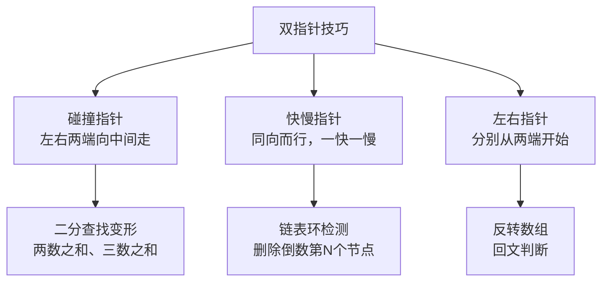
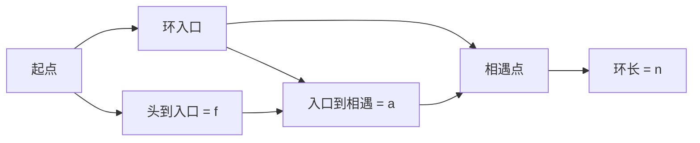

# 双指针技巧

面试官问："如何在 O(n) 时间内，在一个升序数组中找到两个数，使它们的和等于 target？"

候选人小赵秒答："用哈希表，遍历一次，记录每个数需要的另一个数。"

面试官点点头："空间复杂度能做到 O(1) 吗？"

小赵愣了一下，说："那...只能用暴力解法 O(n²) ..."

面试官追问："你再想想，有没有不需要额外空间的做法？"

小赵陷入沉思。

【直观类比】

双指针就像**两人从房子两端向中间走**：

- 你站在门口，朋友站在窗户边
- 你们同时向对方走去
- 每走一步，互相通报看到了什么
- 直到两人相遇，或者找到了目标

这就是双指针的核心思想——**利用数组的物理结构，用两个指针从不同方向夹逼**。

---

## 一、问题的引入

经典题：两数之和（LeetCode 167）

```
给定升序数组 nums 和目标值 target，
找出数组中两数之和等于 target 的下标（假设唯一解）。
```

**哈希表解法**：`O(n)` 时间，`O(n)` 空间

```java
public int[] twoSum(int[] nums, int target) {
    Map<Integer, Integer> map = new HashMap<>();
    for (int i = 0; i < nums.length; i++) {
        int complement = target - nums[i];
        if (map.containsKey(complement)) {
            return new int[]{map.get(complement), i};
        }
        map.put(nums[i], i);
    }
    return new int[]{-1, -1};
}
```

**双指针解法**：`O(n)` 时间，`O(1)` 空间

```java
public int[] twoSum(int[] nums, int target) {
    int left = 0, right = nums.length - 1;

    while (left < right) {
        int sum = nums[left] + nums[right];
        if (sum == target) {
            return new int[]{left + 1, right + 1}; // 返回下标（1-based）
        } else if (sum < target) {
            left++;  // 和小了，左指针右移（更大的数）
        } else {
            right--; // 和大了，右指针左移（更小的数）
        }
    }
    return new int[]{-1, -1};
}
```

---

## 二、双指针的三种类型



### 2.1 碰撞指针（左右夹逼）

**适用场景**：有序数组、字符串

**模板**：

```java
int left = 0, right = nums.length - 1;
while (left < right) {
    int result = compare(nums[left], nums[right]);
    if (result == target) {
        // 找到了
    } else if (result < target) {
        left++;  // 需要更大的值
    } else {
        right--; // 需要更小的值
    }
}
```

### 2.2 快慢指针（同向而行）

**适用场景**：链表、数组

**模板**：

```java
int slow = 0, fast = 0;
while (fast < nums.length) {
    // 先移动快指针
    if (满足某个条件) {
        // 再移动慢指针
        slow++;
    }
    fast++;
}
```

### 2.3 左右指针（两端出发）

**适用场景**：反转数组、回文判断

**模板**：

```java
int left = 0, right = nums.length - 1;
while (left < right) {
    // 在两端进行处理
    swap(nums, left, right);
    left++;
    right--;
}
```

---

## 三、实战：LeetCode 15 三数之和 🔴

**题目**：
```
给你一个整数数组 nums，判断是否存在三个元素 a, b, c 使其和为 0。
找出所有不重复的三元组。
```

**示例**：
```
输入: [-1, 0, 1, 2, -1, -4]
输出: [[-1, -1, 2], [-1, 0, 1]]
```

**解题思路**：

```java
public List<List<Integer>> threeSum(int[] nums) {
    List<List<Integer>> result = new ArrayList<>();
    Arrays.sort(nums); // 先排序

    for (int i = 0; i < nums.length - 2; i++) {
        // 剪枝：第一个数大于0，三数之和不可能为0
        if (nums[i] > 0) break;

        // 去重：跳过相同的第一个数
        if (i > 0 && nums[i] == nums[i - 1]) continue;

        // 双指针找剩余两数
        int left = i + 1, right = nums.length - 1;
        int target = -nums[i];

        while (left < right) {
            int sum = nums[left] + nums[right];
            if (sum == target) {
                result.add(Arrays.asList(nums[i], nums[left], nums[right]));
                // 去重：跳过相同的左右指针值
                while (left < right && nums[left] == nums[left + 1]) left++;
                while (left < right && nums[right] == nums[right - 1]) right--;
                left++;
                right--;
            } else if (sum < target) {
                left++;
            } else {
                right--;
            }
        }
    }
    return result;
}
```

**关键点**：
- 先排序：`O(n log n)`，为双指针创造条件
- 固定一个数，再用双指针找另外两个
- 去重是难点，也是面试官追问的点

---

## 四、实战：LeetCode 142 环形链表 II 🔴

**题目**：
```
给定一个链表，判断是否有环。
如果有，找到环的入口节点。
```

**普通解法**：用 `HashSet` 记录访问过的节点

```java
public ListNode detectCycle(ListNode head) {
    Set<ListNode> visited = new HashSet<>();
    ListNode current = head;
    while (current != null) {
        if (visited.contains(current)) {
            return current; // 有环
        }
        visited.add(current);
        current = current.next;
    }
    return null; // 无环
}
```

**快慢指针解法**：`O(1)` 空间

```java
public ListNode detectCycle(ListNode head) {
    if (head == null) return null;

    // 1. 找到相遇点
    ListNode slow = head, fast = head;
    while (fast != null && fast.next != null) {
        slow = slow.next;
        fast = fast.next.next;
        if (slow == fast) break;
    }

    // 无环
    if (fast == null || fast.next == null) return null;

    // 2. 找环入口：两个指针从不同起点出发
    slow = head;
    while (slow != fast) {
        slow = slow.next;
        fast = fast.next;
    }
    return slow;
}
```

**数学证明**：



- 慢指针走了 `f + a`
- 快指针走了 `f + a + n`（多走了一整圈）
- 快指针速度是慢指针的 2 倍：`2(f + a) = f + a + n` → `f = n - a`

---

## 五、实战：删除链表倒数第 N 个节点 🔴

**题目**：LeetCode 19

```java
public ListNode removeNthFromEnd(ListNode head, int n) {
    ListNode dummy = new ListNode(0);
    dummy.next = head;

    ListNode slow = dummy, fast = dummy;

    // 1. 快指针先走 n+1 步
    for (int i = 0; i <= n; i++) {
        fast = fast.next;
    }

    // 2. 一起走，直到快指针到末尾
    while (fast != null) {
        slow = slow.next;
        fast = fast.next;
    }

    // 3. slow.next 就是倒数第 N 个节点
    slow.next = slow.next.next;
    return dummy.next;
}
```

---

## 六、常见题型总结

| 题型 | 双指针类型 | 核心技巧 |
| --- | --- | --- |
| 两数之和（有序数组） | 碰撞指针 | 左 + 右向中间夹逼 |
| 三数之和 | 碰撞指针 | 外层循环 + 双指针 |
| 容器盛水问题 | 碰撞指针 | 移动较小边的指针 |
| 环形链表检测 | 快慢指针 | 快指针走两步，慢指针走一步 |
| 删除倒数第 N 节点 | 快慢指针 | 快指针先走 n+1 步 |
| 反转链表 | 左右指针 | 交换节点值或反转指针 |
| 回文串判断 | 左右指针 | 两端向中间比较 |

---

## 七、记忆技巧

双指针的**三口诀**：

> **"碰撞指针左右走，有序数组夹逼求"**
> **"快慢指针同向跑，链表环检测最妙"**
> **"头尾指针向中靠，数据反转回文找"**

---

## 八、实战检验

### 检验一：LeetCode 11 容器盛水问题

```java
public int maxArea(int[] height) {
    int left = 0, right = height.length - 1;
    int maxArea = 0;

    while (left < right) {
        int width = right - left;
        int h = Math.min(height[left], height[right]);
        maxArea = Math.max(maxArea, width * h);

        // 移动较小边的指针
        if (height[left] < height[right]) {
            left++;
        } else {
            right--;
        }
    }
    return maxArea;
}
```

**考点**：碰撞指针 + 贪心（移动较小边）。

### 检验二：LeetCode 234 回文链表

```java
public boolean isPalindrome(ListNode head) {
    if (head == null || head.next == null) return true;

    // 1. 找到中点
    ListNode slow = head, fast = head;
    while (fast.next != null && fast.next.next != null) {
        slow = slow.next;
        fast = fast.next.next;
    }

    // 2. 反转后半部分
    ListNode prev = null, current = slow.next;
    while (current != null) {
        ListNode next = current.next;
        current.next = prev;
        prev = current;
        current = next;
    }

    // 3. 比较前半部分和反转后的后半部分
    ListNode p1 = head, p2 = prev;
    while (p2 != null) {
        if (p1.val != p2.val) return false;
        p1 = p1.next;
        p2 = p2.next;
    }
    return true;
}
```

**考点**：快慢指针找中点 + 反转链表 + 比较。

---

## 九、总结

双指针是一种**利用数据结构物理特性**的算法技巧：

1. **有序数组** → 用碰撞指针，从两端向中间夹逼
2. **链表** → 用快慢指针，一个走快点、一个走慢点
3. **反转操作** → 用左右指针，从两端交换

记住：**双指针的核心是用空间换时间，或者说是"利用已知条件减少遍历"**。
