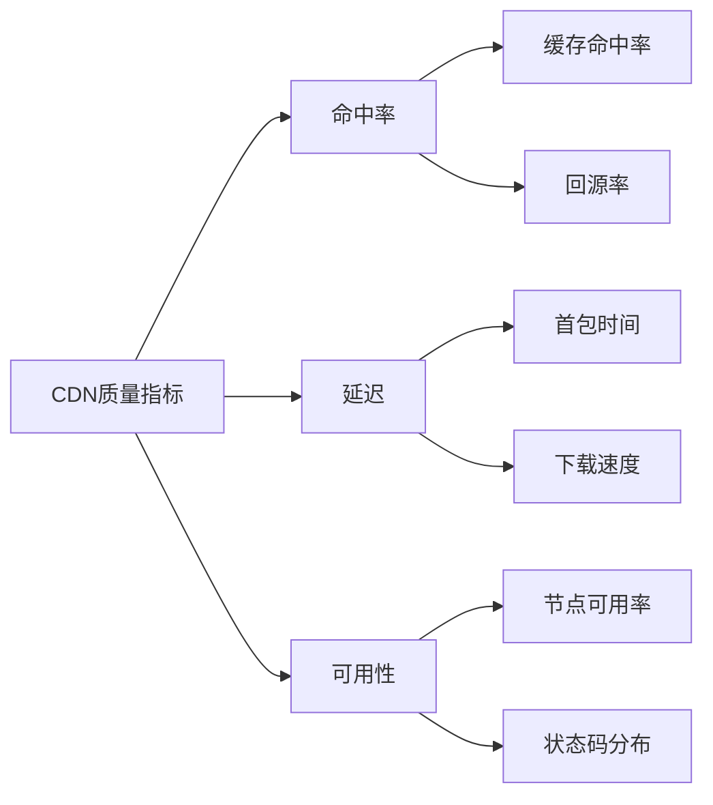
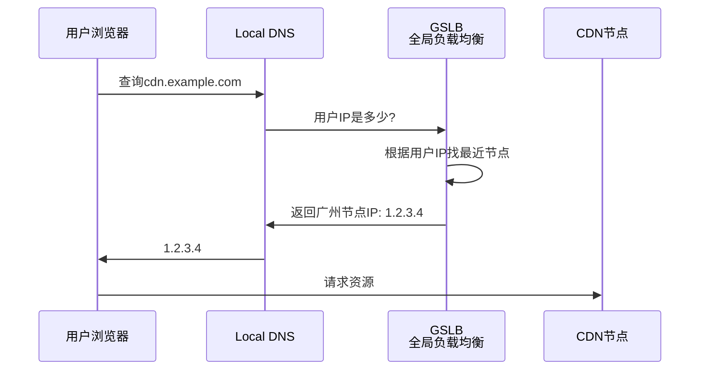
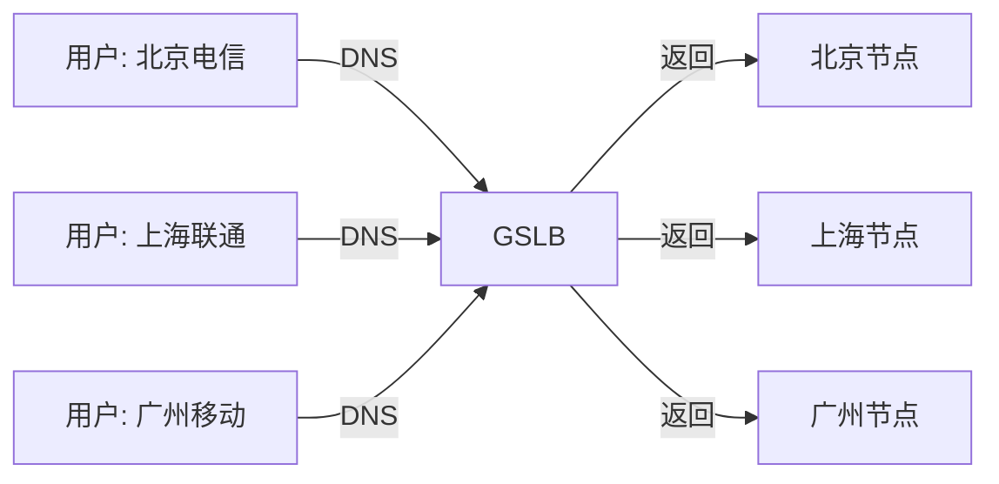
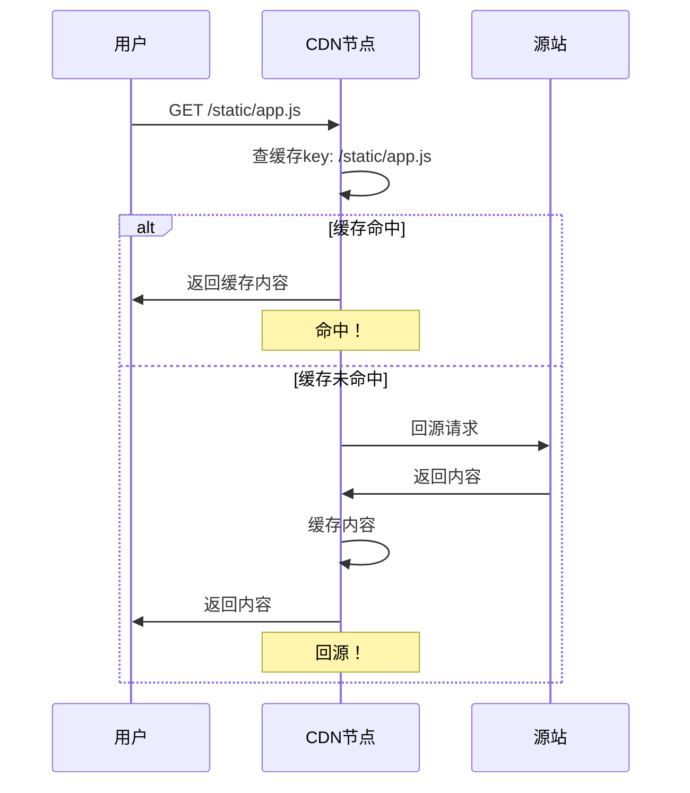
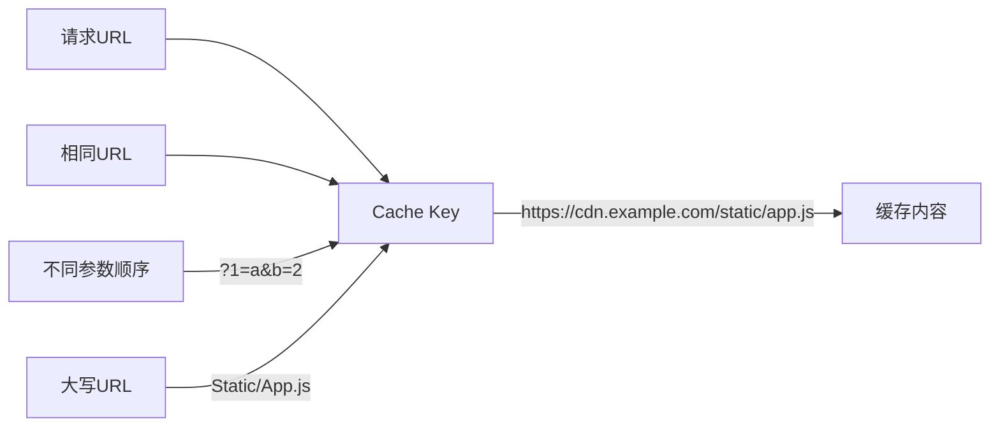
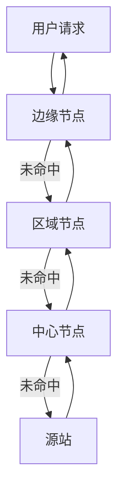
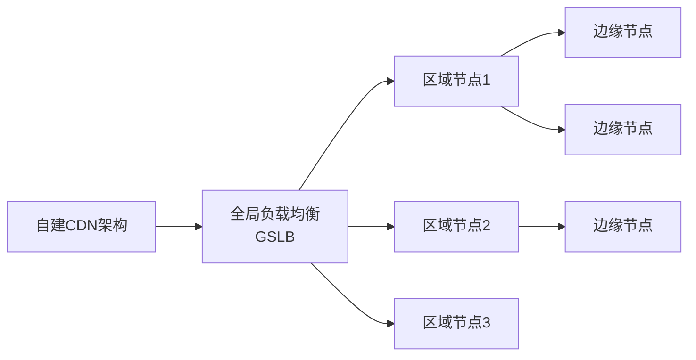

# CDN原理与缓存架构

双十一凌晨，运营发现：

"为什么华南用户访问特别慢？华东只要1秒，华南要5秒！"

小张排查发现：服务器在华东机房，华南用户跨了半个中国。

"加CDN！"领导一拍脑袋。

小张配置了CDN，但发现缓存命中率只有30%，大量请求还是回源。

"CDN不是加上就完事了吗？"小张慌了。

【直观类比】

把CDN想象成**超市配送网络**：

- **没有CDN**：北京用户买农夫山泉，水从杭州工厂发货，要3天
- **有CDN**：北京用户买农夫山泉，从北京仓库发货，只要1小时

CDN就是在全国各地建"前置仓库"，让用户从最近的仓库拿货。

## CDN核心概念

### 什么是CDN？

CDN（Content Delivery Network，内容分发网络）是一组分布在不同地理位置的服务器群，缓存源站内容，就近提供给用户。

```mermaid
graph LR
    A[北京用户] -->|访问| B[北京CDN节点]
    C[上海用户] -->|访问| D[上海CDN节点]
    E[深圳用户] -->|访问| F[深圳CDN节点]
    
    B -->|回源| G[源站: 华东机房]
    D -->|回源| G
    F -->|回源| G
    
    Note over B,D,F: 缓存命中时直接返回
```

### CDN的作用

| 作用 | 说明 | 效果 |
|------|------|------|
| 就近访问 | 用户访问最近节点 | 延迟降低70%+ |
| 负载分担 | 减轻源站压力 | 源站QPS降低90%+ |
| 抗DDoS | 吸收攻击流量 | 保护源站 |
| 节省带宽 | 减少跨运营商流量 | 带宽成本降低 |

### 核心指标



## CDN工作原理

### 1. 域名解析阶段

用户访问时，DNS根据用户IP返回最近的CDN节点IP：



**GSLB（Global Server Load Balance）**：



### 2. 缓存阶段

CDN节点检查是否有缓存：



### 3. 缓存过期策略

CDN使用**TTL（Time To Live）**控制缓存时间：

```bash
# CDN缓存策略配置
# 1. 源站设置Cache-Control
Cache-Control: max-age=86400  # 缓存1天

# 2. CDN控制台配置缓存规则
# 图片: 7天
# JS/CSS: 1天
# HTML: 10分钟

# 3. 强制刷新
# CDN控制台 → URL刷新/目录刷新
```

## CDN缓存策略

### 1. 缓存key设计

缓存key决定了缓存的唯一性：



**问题**：URL参数顺序不同、大小写不同，算不算同一个key？

```javascript
// CDN通常配置忽略参数顺序
// ?a=1&b=2 和 ?b=2&a=1 统一处理

// 区分大小写
// /Static/App.js 和 /static/app.js 是不同key
```

### 2. 缓存分级



**边缘节点（Pop）**：最接近用户的节点
**区域节点**：省级/区域级缓存
**中心节点**：大区级缓存
**回源**：边缘→区域→中心→源站

### 3. 缓存刷新

```bash
# URL刷新：刷新单个文件
POST /api/v1/cache/refresh
{"urls": ["https://cdn.example.com/static/app.js"]}

# 目录刷新：刷新整个目录
POST /api/v1/cache/refresh
{"dirs": ["https://cdn.example.com/static/"]}

# 注意事项：
# 1. 刷新需要时间（通常几秒到几分钟）
# 2. 刷新期间回源压力增加
# 3. 不影响已缓存用户的体验
```

## CDN缓存配置最佳实践

### 1. 按资源类型设置TTL

```nginx
# CDN缓存配置示例
server {
    # HTML: 短TTL，便于快速更新
    location / {
        expires 10m;
    }
    
    # 图片: 中等TTL
    location ~* \.(jpg|png|gif|webp)$ {
        expires 30d;
    }
    
    # JS/CSS: 较长TTL，配合版本号
    location ~* \.(js|css)$ {
        expires 7d;
    }
    
    # 字体: 长TTL
    location ~* \.(woff|woff2|ttf)$ {
        expires 1y;
    }
}
```

### 2. 版本化资源URL

```html
<!-- 不用版本号: 缓存无法控制 -->
<script src="/static/app.js"></script>

<!-- 带版本号: 更新后URL变化，强制拉取 -->
<script src="/static/app.js?v=1.0.0"></script>

<!-- 更好的方式: 基于内容hash -->
<script src="/static/app.a1b2c3d4.js"></script>
<!-- 文件内容变化时hash变化 -->
<!-- 文件内容不变时hash不变 -->
```

:::tip 💡
面试官追问"为什么CSS更新后用户还是看到旧的"，答案是：
1. **URL没变**：CSS更新了但URL没变化，CDN/浏览器直接返回缓存
2. **TTL太长**：CDN缓存时间设置太长
3. **浏览器缓存**：用户本地有缓存

解决方案：使用基于内容的hash命名，或主动刷新CDN缓存。
:::

### 3. 防盗链配置

防止其他网站盗用你的CDN资源：

```nginx
# 方式1:  Referer防盗链
valid_referers none blocked server_names *.example.com;
if ($invalid_referer) {
    return 403;
}

# 方式2:  URL签名防盗链
# 生成带时效的签名URL
# http://cdn.example.com/file.jpg?sign=xxx&expires=1234567890

# 方式3:  IP黑白名单
allow 1.2.3.0/24;
deny all;
```

## CDN常见问题与解决方案

### 问题一：缓存命中率低

**表现**：CDN回源率高，源站压力没有减轻

**原因分析**：

```mermaid
graph LR
    A[命中率低] --> B[URL参数不同]
    A --> C[TTL设置太短]
    A --> D[不缓存的Content-Type]
    A --> E[源站设置了no-cache]
    
    B -->|"a=1&b=2<br/>b=2&a=1| F[算不同key]
    C -->|"TTL=0| F
    D -->|"application/json<br/>text/html| F
```

**解决方案**：

```nginx
# 1. 忽略不必要的URL参数
server {
    # 忽略utm_*参数
    ignore_cache_control on;
    slice: 1m;
}

# 2. 设置合适的TTL
# 根据资源更新频率设置TTL

# 3. 确保源站允许CDN缓存
# 不要设置 Cache-Control: private
# 不要设置 Pragma: no-cache
```

### 问题二：缓存更新不及时

**场景**：用户看到过期内容

**解决方案**：

```bash
# 1. 主动刷新CDN
# 控制台操作或API调用

# 2. 使用版本化的URL
# 文件名带版本号或hash

# 3. 灰度更新
# 先更新10%节点，观察无误后再全量
```

### 问题三：CDN故障导致服务不可用

**场景**：CDN节点故障，大量用户无法访问

**解决方案**：

```nginx
# 1. 配置多个CDN供应商
# 主用阿里云，备用腾讯云

# 2. 故障时切回源站
# 监控CDN可用性，自动切换

# 3. 缓存fallback策略
# CDN不可用时返回静态资源
```

## CDN与高并发

### 峰值流量应对

```mermaid
graph LR
    A[用户请求<br/>100万QPS] --> B[CDN边缘节点]
    B -->|1%回源| C[源站<br/>1万QPS]
    
    Note over C: 源站只承受1%流量
    Note over B: CDN吸收99%流量
```

**CDN的优势**：
- 吸收峰值流量
- 跨运营商访问
- 就近访问低延迟

### 缓存失效的"惊群效应"

```mermaid
sequenceDiagram
    participant U1 as 用户1
    participant U2 as 用户2
    participant U3 as 用户3
    participant N as CDN节点
    participant S as 源站
    
    Note over U1,U2,U3: 同时请求<br/>缓存刚过期
    
    U1->>N: GET /index.html
    U2->>N: GET /index.html
    U3->>N: GET /index.html
    N->>S: 回源请求 × 3
    Note over S: 源站压力3倍！
```

**问题**：缓存过期瞬间，大量请求同时回源

**解决方案**：

```nginx
# 1. 缓存预热
# 提前刷新缓存，确保流量高峰时缓存有效

# 2. 锁机制
# 第一个请求回源，其他等待
# proxy_cache_lock on;

# 3. 梯度过期
# 缓存快过期时异步更新
# stale-while-revalidate
Cache-Control: max-age=3600, stale-while-revalidate=300
```

## CDN安全

### 1. HTTPS配置

```nginx
# CDN HTTPS配置
server {
    listen 443 ssl http2;
    ssl_certificate /path/to/cert.pem;
    ssl_certificate_key /path/to/key.pem;
    
    # TLS版本控制
    ssl_protocols TLSv1.2 TLSv1.3;
    
    # 安全配置
    ssl_prefer_server_ciphers on;
    ssl_ciphers 'ECDHE-RSA-AES128-GCM-SHA256:...';
}
```

### 2. WAF防护

CDN通常集成Web应用防火墙：

```yaml
# WAF规则示例
rules:
  - name: block-sql-injection
    match:
      - url: /api/*
        condition: contains sql_keywords(request.body)
    action: block
    code: 403
  
  - name: rate-limit
    match:
      - url: /login
        condition: rate_limit > 100/minute
    action: challenge
    type: captcha
```

### 3. DDoS防护

```mermaid
graph LR
    A[攻击流量<br/>100Gbps] --> B[CDN边缘]
    B --> C[清洗中心]
    C -->|正常流量| D[源站]
    C -->|攻击流量| E[丢弃]
    
    Note over B: 边缘节点吸收<br/>海量流量
    Note over C: 识别攻击特征<br/>清洗恶意流量
```

## 边界与特例

### 1. CDN不适用场景

| 场景 | 原因 | 替代方案 |
|------|------|----------|
| 实时数据 | 无法缓存 | API Gateway |
| 个性化内容 | 每个人不同 | 边缘计算 |
| 频繁更新 | 缓存失效快 | SSR直出 |
| 小文件/稀疏访问 | 回源率高 | 就近机房 |

### 2. CDN成本考量

```
CDN费用构成：
1. 流量费：按GB计费
2. 请求费：按万次计费
3. HTTPS费：按请求数计费
4. 高级功能：WAF、DDOS防护额外收费

优化建议：
- 合理设置TTL，减少回源
- 使用压缩，减少流量
- 按需开启HTTPS
- 灰度使用CDN
```

### 3. 私有CDN

大型互联网公司可能自建CDN：



**优势**：完全可控、成本可控
**劣势**：运维复杂、需要专业团队

## 常见误区

### 误区一：CDN就是缓存

**错！** CDN的核心是**就近访问 + 缓存**：
- 就近访问降低延迟
- 缓存减轻源站压力
- 还有负载均衡、安全防护等功能

### 误区二：CDN配置好就不用管了

**错！** CDN需要持续优化：
- 命中率监控
- TTL调整
- 故障应急演练
- 成本优化

### 误区三：CDN能解决所有性能问题

**错！** CDN的局限：
- 不缓存个性化内容
- 首次访问还是会回源
- 跨CDN切换有延迟

### 误区四：HTTPS一定比HTTP安全

**不完全对。** HTTPS加密传输，但：
- CDN节点能看到明文（解密后再缓存）
- 需要选择可信的CDN厂商
- 配置不当仍然有安全风险

## 记忆技巧

### CDN核心概念

> "就近访问、缓存为王、源站减负、用户飞起"
> - 就近访问：GSLB返回最近节点
> - 缓存为王：命中率是CDN的核心指标
> - 源站减负：CDN吸收大部分流量
> - 用户飞起：访问速度大幅提升

### CDN缓存TTL设置

> "HTML短命、图片长寿、JS/CSS版本控"
> - HTML：5-10分钟
> - 图片：7-30天
> - JS/CSS：1-7天（配合版本号）
> - 字体：30天-1年

### CDN故障排查口诀

> "先看DNS、再看缓存、最后源站"
> 1. dig确认CDN解析正确
> 2. 检查缓存是否命中
> 3. 确认源站可访问

## 实战检验

### 自测题一

**问题**：用户反馈CDN加速不明显，怎么排查？

**解析**：
1. **检查DNS解析**：确认用户访问的是CDN节点IP，不是源站IP
   ```bash
   dig cdn.example.com
   ```
2. **检查缓存命中率**：
   ```bash
   # CDN控制台查看命中率报表
   # 命中率 < 80% 需要优化
   ```
3. **检查跨运营商**：
   - 电信用户访问联通CDN节点可能很慢
   - 需要选择有多线接入的CDN厂商
4. **检查HTTPS握手**：
   - HTTPS比HTTP多一次TLS握手
   - 检查证书配置和TLS版本

### 自测题二

**问题**：如何设计一个高效的缓存策略？

**解析**：

```nginx
# 缓存策略设计原则
# 1. 不变的资源长期缓存
location ~* \.(jpg|png|gif|webp|woff|woff2)$ {
    expires 30d;
    add_header Cache-Control "public, immutable";
}

# 2. 可能变化的资源短期缓存
location ~* \.(js|css)$ {
    expires 7d;
    # 配合版本号使用
}

# 3. HTML必须每次验证
location / {
    expires -1;
    add_header Cache-Control "no-cache, no-store, must-revalidate";
}

# 4. API不缓存
location /api/ {
    add_header Cache-Control "no-store";
}
```

### 自测题三

**问题**：CDN如何防止资源被盗用？

**解析**：
1. **Referer防盗链**：检查请求来源
   ```nginx
   valid_referers none blocked *.example.com;
   if ($invalid_referer) { return 403; }
   ```
2. **IP黑白名单**：允许/禁止特定IP访问
3. **URL签名**：生成带时效的签名URL
   ```javascript
   // 签名算法
   const sign = md5(secret + path + timestamp);
   const url = `https://cdn.example.com${path}?sign=${sign}&t=${timestamp}`;
   ```
4. **UA限制**：禁止爬虫等非浏览器访问
5. **WAF规则**：配置频率限制、SQL注入防护等

---

| 级别 | 考察重点 | 期望回答 | 判分标准 |
|------|----------|----------|----------|
| P5 | 基本概念 | 能说出CDN是什么、为什么用CDN | 死记硬背 |
| P6 | 缓存策略 | 能设计TTL配置、版本化URL | 理解原理 |
| P7 | 性能优化 | 能排查命中率低、优化缓存策略 | 有实战经验 |
