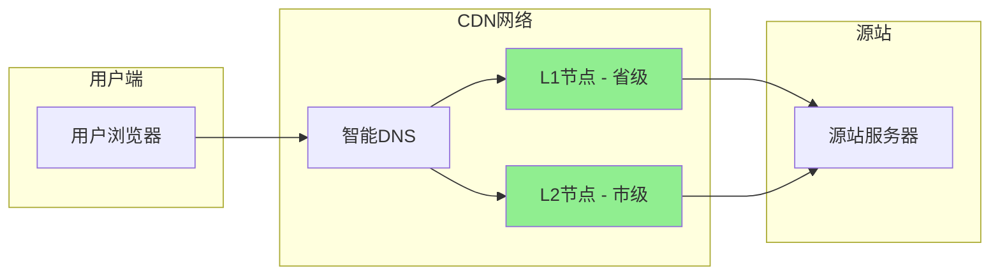

# CDN原理与架构

> 目标级别：P6

面试官问：「CDN 是怎么工作的？」你回答「把静态资源放到离用户最近的节点」——然后面试官追问：「CDN 的缓存是怎么更新的？」「CDN 和 DNS 是什么关系？」「CDN 如何实现跨运营商加速？」

CDN（Content Delivery Network）是现代互联网基础设施的重要组成部分，理解 CDN 原理对于系统设计和性能优化至关重要。

## 快速自测

面试前先问自己这三个问题：

1. **CDN 的核心原理是什么？** 为什么能加速访问？
2. **CDN 的缓存是怎么工作的？** 缓存失效策略是什么？
3. **CDN 和 DNS 是怎么配合的？** 智能 DNS 是什么？

---

## 一、CDN 基础

### 1.1 什么是 CDN

CDN（Content Delivery Network）内容分发网络，通过部署在全球各地的边缘服务器，将内容缓存到离用户最近的位置，提升访问速度。

```
没有 CDN：
用户（北京）→ 源站（美国）→ 延迟 200ms

有 CDN：
用户（北京）→ CDN 节点（北京）→ 缓存命中 → 延迟 10ms
```

### 1.2 CDN 的价值

| 价值 | 说明 |
|------|------|
| 加速访问 | 就近访问，减少延迟 |
| 减轻源站压力 | 大量请求由 CDN 承担 |
| 提高可用性 | 多节点冗余，单点故障不影响 |
| 节省带宽成本 | CDN 节点分担流量费用 |
| 安全防护 | DDoS 防护、WAF 等 |

### 1.3 CDN 适用场景

| 类型 | 内容 | 效果 |
|------|------|------|
| 静态资源 | 图片、CSS、JS、字体 | 高度有效 |
| 视频点播 | mp4、m3u8 | 减少带宽压力 |
| 直播 | flv、hls、rtmp | 降低延迟 |
| 下载分发 | APK、安装包 | 加速下载 |

---

## 二、CDN 工作原理

### 2.1 整体架构



### 2.2 请求流程

```
CDN 请求完整流程：

1. 用户访问 example.com/image.png
2. 浏览器请求 DNS 解析
3. 智能 DNS 返回最优 CDN 节点 IP
4. 浏览器请求 CDN 节点
5. CDN 节点检查缓存
   - 命中：直接返回
   - 未命中：回源获取，缓存后返回
6. 用户获得内容
```

### 2.3 智能调度

CDN 的核心是智能 DNS，根据用户位置返回最优节点：

| 调度策略 | 说明 |
|----------|------|
| 地理位置 | 根据用户 IP 分配最近节点 |
| 运营商 | 匹配用户运营商（同运营商低延迟） |
| 负载 | 选择负载最低的节点 |
| 健康状态 | 跳过故障节点 |
| 就近性 | 基于网络拓扑选择最近路径 |

---

## 三、CDN 缓存机制

### 3.1 缓存层级

```
CDN 多级缓存：
1. 浏览器缓存
   - Cache-Control / Expires
   - 命中则直接使用，不请求 CDN

2. CDN L1 节点缓存（边缘节点）
   - 靠近用户
   - 命中则直接返回

3. CDN L2 节点缓存（区域节点）
   - 覆盖更广
   - 跨区域回源请求

4. 源站
   - 最源头的资源
   - 缓存未命中时回源
```

### 3.2 缓存 key

缓存 key 通常是 URL：

```
URL：https://example.com/image.png
缓存 Key：/image.png

参数影响：
- 无参数：/image.png
- 有参数：/image.png?version=1.0.0
```

### 3.3 缓存策略

| 策略 | 说明 | 适用场景 |
|------|------|----------|
| 基于时间 | TTL 过期后失效 | 有版本控制的资源 |
| 基于版本 | URL 中包含版本号 | CSS/JS/图片 |
| 强制刷新 | 管理员手动刷新 | 紧急更新 |
| 被动失效 | 源站更新触发失效 | 主动推送 |

### 3.4 缓存刷新

```
缓存刷新方式：

1. URL 刷新：刷新指定 URL
   - 适合紧急更新单个资源

2. 目录刷新：刷新指定目录
   - 适合批量更新

3. 正则刷新：按正则匹配刷新
   - 适合批量更新匹配规则

4. 预热：提前将资源加载到 CDN
   - 新品发布前预热
```

---

## 四、CDN 与 DNS 配合

### 4.1 CNAME 解析

```
域名解析流程：

1. 域名 www.example.com 配置 CNAME 到 cdn.example.com
2. DNS 解析 www.example.com
3. 返回 CNAME cdn.example.com
4. 再解析 cdn.example.com
5. 返回 CDN 节点 IP

命令：
dig www.example.com

结果：
www.example.com → cdn.example.com → 1.2.3.4
```

### 4.2 智能 DNS 原理

```
传统 DNS：返回固定 IP
智能 DNS：根据用户情况返回最优 IP

智能 DNS 如何知道用户位置？

1. 用户 IP 库
   - GeoIP 数据库（MaxMind 等）
   - 根据 IP 映射地理位置和运营商

2. Anycast 路由
   - 多个节点使用相同 IP
   - 路由协议自动选择最近路径

3. 实时探测
   - 探测用户到各节点的延迟
   - 选择最优节点
```

### 4.3 CDN 加速效果计算

```
加速效果 = 原始延迟 - CDN 延迟

示例：
- 用户到源站延迟：200ms
- 用户到 CDN 节点延迟：20ms
- 加速效果：180ms（提升 10 倍）

实际效果受以下因素影响：
- 缓存命中率（越高越好）
- 节点分布密度（越密越近）
- 回源距离（源站离 CDN 节点）
- 网络质量（最后一公里）
```

---

## 五、CDN 架构细节

### 5.1 边缘节点

边缘节点是 CDN 网络的最外层，直接服务用户：

```
边缘节点职责：
1. 接收用户请求
2. 查找本地缓存
3. 未命中时回源获取
4. 响应用户请求
5. 写入本地缓存

边缘节点特点：
- 数量多（数千到数万）
- 分布广（覆盖全国/全球）
- 存储有限（无法缓存全部内容）
```

### 5.2 区域节点

区域节点覆盖更大的范围，存储更多内容：

```
区域节点职责：
1. 作为 L2 缓存层
2. 缓存热点内容
3. 减少回源次数
4. 负载均衡多个边缘节点

区域节点特点：
- 存储容量大
- 覆盖省份/区域
- 作为边缘节点的回源目标
```

### 5.3 缓存淘汰策略

```
CDN 缓存淘汰策略：

1. LRU（Least Recently Used）
   - 最近最少使用
   - 淘汰最久未访问的内容

2. LFU（Least Frequently Used）
   - 最不经常使用
   - 淘汰访问次数最少的内容

3. Size-based
   - 优先淘汰大文件
   - 优化存储利用率

4. TTL-based
   - TTL 过期自动淘汰
   - 确保内容时效性
```

---

## 六、面试题精讲

### 🔴 【高频】CDN 工作原理

**问题**：请描述 CDN 的工作原理。

**标准答案**：

```
CDN 通过在全球部署边缘节点，将内容缓存到离用户最近的位置：

1. 用户访问资源，DNS 返回 CDN 节点 IP
2. 智能 DNS 根据用户位置返回最优节点
3. 请求发送到 CDN 边缘节点
4. 边缘节点检查本地缓存：
   - 命中：直接返回
   - 未命中：回源获取，缓存后返回
5. 用户获得内容

核心价值：
- 就近访问，减少延迟
- 减轻源站压力
- 提高可用性
- 节省带宽成本
```

### 🟡 【中频】CDN 缓存失效策略

**问题**：CDN 缓存是怎么失效的？

**标准答案**：

```
CDN 缓存失效策略：

1. TTL 过期
   - 每个资源设置 TTL
   - 过期后重新回源

2. 主动刷新
   - 管理员手动刷新指定 URL
   - 批量刷新目录或正则匹配

3. 被动刷新
   - 源站通过 API 推送更新
   - 源站变更触发失效

4. 强制刷新
   - 用户请求携带 Pragma: no-cache
   - CDN 节点跳过缓存，直接回源

实际使用建议：
- 静态资源设置较长 TTL（一天以上）
- CSS/JS 带版本号，避免缓存失效问题
- 需要立即更新的内容手动刷新
```

### 🟡 【中频】CDN 和 DNS 的关系

**问题**：CDN 和 DNS 是怎么配合工作的？

**标准答案**：

```
CDN 和 DNS 的配合：

1. 域名 CNAME 配置
   - 原域名 www.example.com
   - CNAME 到 cdn.example.com
   - CDN 提供商分配的域名

2. 智能 DNS 解析
   - DNS 收到 cdn.example.com 解析请求
   - 根据用户 IP（GeoIP）判断位置
   - 选择最近的 CDN 边缘节点
   - 返回该节点 IP

3. 请求路由
   - 用户请求发送到 CDN 节点
   - CDN 节点处理请求

关键点：智能 DNS 是 CDN 的「大脑」，负责用户调度。
```

---

## 七、常见陷阱与易错点

### ⚠️ 陷阱一：混淆 CDN 缓存和 DNS 缓存

- **DNS 缓存**：缓存域名解析结果（IP 地址）
- **CDN 缓存**：缓存资源内容（文件）

### ⚠️ 陷阱二：认为 CDN 一定能加速

```
CDN 不一定能加速的情况：
1. 缓存命中率低（首次访问、动态内容）
2. 用户到 CDN 节点延迟高于到源站
3. CDN 节点负载高
4. 回源链路慢

建议：监控 CDN 命中率，选择合适的节点
```

### ⚠️ 陷阱三：忽略缓存一致性

```
缓存带来的问题：
1. 用户看到旧内容（缓存未失效）
2. 更新后部分用户仍访问旧版本

解决方案：
- 使用版本号/哈希：example.com/v1.js
- 设置合理的 TTL
- 需要立即更新时手动刷新
```

### ⚠️ 陷阱四：所有内容都走 CDN

```
不适合 CDN 的内容：
1. 动态内容（个性化页面、实时数据）
2. 私密内容（用户专属数据）
3. 高频更新（秒级更新）

适合 CDN 的内容：
1. 静态资源（图片、CSS、JS、字体）
2. 版本化资源（带 hash 的静态文件）
3. 下载文件（APK、安装包）
```

---

## 八、对比总结

### 有 CDN vs 无 CDN

| 维度 | 无 CDN | 有 CDN |
|------|--------|--------|
| 延迟 | 远（可能跨洲） | 近（就近访问） |
| 源站压力 | 大（全部请求） | 小（仅回源请求） |
| 可用性 | 单点故障风险 | 多节点冗余 |
| 成本 | 带宽费用高 | CDN 费用 + 源站费用 |
| 安全 | 脆弱 | DDoS 防护、WAF |

### CDN 节点层级

| 层级 | 名称 | 覆盖范围 | 存储容量 |
|------|------|----------|----------|
| L1 | 边缘节点 | 地市/区县 | 较小 |
| L2 | 区域节点 | 省份 | 中等 |
| L3 | 源站 | 源站机房 | 最大 |

---

## 九、扩展思考

### 💡 加分话题：CDN 预热

```
CDN 预热：将资源提前加载到 CDN 节点

使用场景：
1. 新品发布（预计大量访问）
2. 重大活动（提前准备）
3. 版本更新（确保所有节点更新）

预热方式：
1. API 预热：调用 CDN 提供商的预热 API
2. 监控预热：监控流量，自动预热
3. 模拟访问：模拟用户请求触发缓存
```

### 💡 加分话题：CDN HTTPS 配置

```
CDN HTTPS 配置：

1. 证书配置
   - 上传证书到 CDN 提供商
   - CDN 提供免费证书（Let's Encrypt）
   - 支持泛域名证书

2. HTTPS 跳转
   - HTTP 请求跳转到 HTTPS
   - 或者直接拒绝 HTTP

3. TLS 版本
   - 建议禁用 TLS 1.0/1.1
   - 启用 TLS 1.2/1.3

4. HSTS 配置
   Strict-Transport-Security: max-age=31536000
```

### 💡 加分话题：CDN 防爬虫

```
CDN 防爬虫策略：

1. Referer 检查
   - 只允许合法来源访问

2. IP 限流
   - 单 IP 请求频率限制

3. 浏览器特征检测
   - 识别非浏览器请求

4. 人机验证
   - 验证码、CAPTCHA

5. 动态内容混淆
   - CSS/JS 混淆，防止爬取
```

> CDN 是现代互联网架构的重要组成部分。理解 CDN 的工作原理、缓存机制和调度策略，能够帮助我们更好地进行性能优化和架构设计。CDN 不仅是加速工具，更是高可用架构的组成部分。