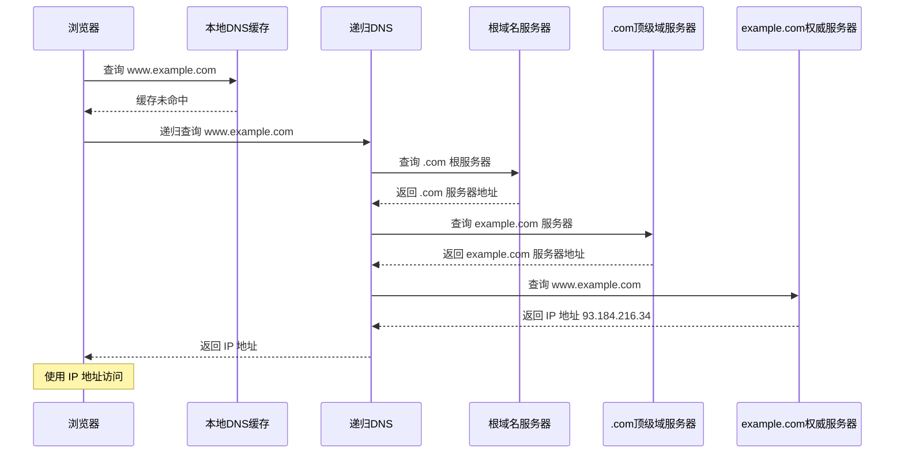

# DNS解析流程

> 目标级别：P5/P6

面试官问：「DNS 是怎么工作的？」你回答「域名解析成 IP 地址」——然后面试官追问：「DNS 有哪些记录类型？」「DNS 为什么要用 UDP 而不是 TCP？」「DNS 缓存是怎么工作的？」

DNS 是互联网的基础设施，理解 DNS 解析流程是理解整个网络体系的重要一环。

## 快速自测

面试前先问自己这三个问题：

1. **DNS 解析的完整流程是什么？** 从浏览器到根域名服务器的递归查询是怎么进行的？
2. **DNS 有哪些记录类型？** A、CNAME、MX 分别是什么？
3. **DNS 为什么用 UDP？** 什么时候会切换到 TCP？

---

## 一、DNS 基础

### 1.1 什么是 DNS

DNS（Domain Name System）是域名系统，将域名解析为 IP 地址。

```
没有 DNS：需要记住 IP 地址访问网站
www.example.com → 93.184.216.34  （数字难记）

有 DNS：使用域名访问网站
www.example.com → 自动解析为 IP  → 访问成功
```

### 1.2 域名结构

域名采用层级结构，从右到左级别递减：

```
www.example.com

com：顶级域（TLD��
example：二级域
www：三级域（主机名）

完整域名结构：
根域（.） → 顶级域（.com） → 二级域（.example） → 子域（www）
```

### 1.3 域名层级

| 层级 | 说明 | 示例 |
|------|------|------|
| 根域 | 顶级，隐藏 | （空，通常省略） |
| 顶级域（TLD） | 第一级 | .com、.org、.cn、.net |
| 二级域 | 注册实体 | example.com |
| 三级域 | 子域名 | www.example.com |
| 主机名 | 具体主机 | www、mail、api |

---

## 二、DNS 解析流程

### 2.1 完整解析流程

DNS 解析采用递归查询，从本地到根服务器逐级查询：



### 2.2 详细步骤

```
1. 浏览器检查自身 DNS 缓存
   - Chrome 缓存约 1 分钟

2. 浏览器检查操作系统 DNS 缓存
   - Windows: ipconfig /displaydns
   - macOS: dscacheutil -flushcache

3. 读取 hosts 文件
   - Linux: /etc/hosts
   - Windows: C:\Windows\System32\drivers\etc\hosts

4. 调用系统解析函数
   - getaddrinfo() 系统调用
   - 发起到本地 DNS 递归服务器的请求

5. 本地 DNS 递归服务器查询
   - 如果没有缓存，进行递归查询

6. 根域名服务器查询
   - .com 顶级域服务器地址

7. 顶级域服务器查询
   - example.com 权威服务器地址

8. 权威服务器查询
   - 返回具体 IP 地址

9. 结果返回并缓存
   - 本地 DNS 缓存结果
   - TTL 时间内后续请求直接返回
```

### 2.3 DNS 缓存层级

| 缓存位置 | 缓存时间 | 说明 |
|----------|----------|------|
| 浏览器 DNS 缓存 | 约 1 分钟 | Chrome、Firefox 等 |
| 操作系统 DNS 缓存 | 可配置 | Windows、Linux 等 |
| hosts 文件 | 永久（直到修改） | 手动配置的映射 |
| 本地 DNS 递归服务器 | TTL 时间 | ISP、路由器等 |

---

## 三、DNS 记录类型

### 3.1 A 记录

A 记录（Address Record）将域名指向 IPv4 地址。

```
类型：A
名称：www.example.com
值：93.184.216.34
TTL：3600（秒）

解析结果：
www.example.com → 93.184.216.34
```

### 3.2 AAAA 记录

AAAA 记录将域名指向 IPv6 地址。

```
类型：AAAA
名称：www.example.com
值：2606:2800:220:1::248:1893
TTL：3600
```

### 3.3 CNAME 记录

CNAME（Canonical Name）记录创建域名别名。

```
类型：CNAME
名称：www.example.com
值：example.com
TTL：3600

解析结果：
www.example.com → example.com → 93.184.216.34
```

### 3.4 MX 记录

MX（Mail Exchange）记录指定邮件服务器。

```
类型：MX
名称：example.com
值：10 mail1.example.com
值：20 mail2.example.com
TTL：3600

优先级：数字越小优先级越高
```

### 3.5 NS 记录

NS（Name Server）记录指定域名服务器。

```
类型：NS
名称：example.com
值：ns1.example.com
值：ns2.example.com
TTL：3600
```

### 3.6 TXT 记录

TXT 记录存储文本信息，常用于验证和 SPF。

```
类型：TXT
名称：example.com
值：v=spf1 include:_spf.example.com ~all
TTL：3600

用途：
- SPF（反垃圾邮件）
- DKIM（邮件签名）
- 域名验证
```

### 3.7 记录类型汇总

| 类型 | 用途 | 示例 |
|------|------|------|
| A | IPv4 地址 | example.com → 93.184.216.34 |
| AAAA | IPv6 地址 | example.com → 2606:2800:220::1 |
| CNAME | 域名别名 | www.example.com → example.com |
| MX | 邮件服务器 | example.com → mail.example.com |
| NS | 域名服务器 | example.com → ns1.example.com |
| TXT | 文本信息 | 验证、反垃圾邮件 |
| PTR | IP 反向查询 | 34.216.184.93 → example.com |

---

## 四、DNS 协议

### 4.1 DNS 使用 UDP

DNS 默认使用 UDP 端口 53，查询响应快，开销小。

```
DNS 使用 UDP 的原因：
1. 速度快：无需握手，直接请求
2. 开销小：UDP 头部 8 字节，TCP 头部 20 字节
3. 查询数据小：大多数 DNS 查询小于 512 字节
4. 高并发：无需维护连接状态
```

### 4.2 DNS 使用 TCP 的场景

| 场景 | 说明 |
|------|------|
| 响应超过 512 字节 | 大响应需要 TCP |
| DNS 区域传输（Zone Transfer） | 主从服务器同步 |
| DNS 动态更新 | 大量记录更新 |
| 客户端检测网络 | 确认 DNS 服务器可达 |

### 4.3 DNS 报文结构

```
DNS 请求报文：
+---+---+---+---+---+---+---+---+
|        Transaction ID          |
+---+---+---+---+---+---+---+---+
| Flags|        QDCOUNT          |
+---+---+---+---+---+---+---+---+
|        ANCOUNT                 |
+---+---+---+---+---+---+---+---+
|        NSCOUNT                 |
+---+---+---+---+---+---+---+---+
|        ARCOUNT                 |
+---+---+---+---+---+---+---+---+
|        Questions...             |
+---+---+---+---+---+---+---+---+

主要字段：
- Transaction ID：请求 ID，用于匹配请求和响应
- Flags：查询/响应标志
- QDCOUNT：问题数
- ANCOUNT：回答数
- NSCOUNT：权威数
- ARCOUNT：附加数
```

---

## 五、DNS 负载均衡

### 5.1 轮询负载均衡

DNS 返回多个 IP，客户端轮询使用。

```
DNS 配置：
example.com → 10.0.0.1
example.com → 10.0.0.2
example.com → 10.0.0.3

DNS 返回顺序（轮换）：
第 1 次：10.0.0.1, 10.0.0.2, 10.0.0.3
第 2 次：10.0.0.2, 10.0.0.3, 10.0.0.1
第 3 次：10.0.0.3, 10.0.0.1, 10.0.0.2
```

### 5.2 地理位置负载均衡

根据客户端位置返回最近服务器的 IP。

```
实现方式：GeoDNS

北京用户：
example.com → 10.0.0.1（华北节点）

上海用户：
example.com → 10.0.0.2（华东节点）

广州用户：
example.com → 10.0.0.3（华南节点）
```

### 5.3 健康检查

DNS 服务器定期检查后端服务器健康状态。

```java
// DNS 健康检查伪代码
public void healthCheck() {
    for (String ip : serverIps) {
        boolean healthy = ping(ip);
        if (healthy) {
            keepInDns(ip);
        } else {
            removeFromDns(ip);
        }
    }
}
```

---

## 六、面试题精讲

### 🔴 【高频】DNS 解析完整流程

**问题**：请描述 DNS 解析的完整流程。

**标准答案**：

```
DNS 解析采用递归查询，从本地到根服务器逐级查询：

1. 浏览器 DNS 缓存
2. 操作系统 DNS 缓存
3. hosts 文件
4. 本地 DNS 递归服务器
   ├── 根域名服务器（返回 .com 服务器）
   ├── .com 顶级域服务器（返回 example.com 服务器）
   └── example.com 权威服务器（返回具体 IP）
5. 返回结果，缓存

结果返回后，浏览器使用 IP 地址建立 TCP 连接。
```

### 🟡 【中频】DNS 记录类型

**问题**：DNS 有哪些常见的记录类型？

**标准答案**：

```
常见 DNS 记录类型：

1. A 记录：域名 → IPv4 地址
   www.example.com → 93.184.216.34

2. AAAA 记录：域名 → IPv6 地址
   www.example.com → 2606:2800:220::1

3. CNAME：域名别名
   www.example.com → example.com

4. MX：邮件服务器
   example.com → mail.example.com

5. NS：域名服务器
   example.com → ns1.example.com

6. TXT：文本信息（SPF、DKIM）
   用于反垃圾邮件和域名验证
```

### 🟡 【中频】DNS 为什么用 UDP

**问题**：DNS 为什么默认使用 UDP 而不是 TCP？

**标准答案**：

```
DNS 使用 UDP 的原因：

1. 速度快：UDP 无需握手，直接发送请求
2. 开销小：UDP 头部 8 字节，TCP 头部 20+ 字节
3. 数据量小：大多数查询小于 512 字节
4. 高并发：UDP 无连接，可以处理大量请求

DNS 使用 TCP 的情况：
1. 响应数据超过 512 字节
2. DNS 区域传输（Zone Transfer）
3. 动态更新
```

---

## 七、常见陷阱与易错点

### ⚠️ 陷阱一：混淆 DNS 缓存和 CDN 缓存

- **DNS 缓存**：解析结果的缓存，缓存的是 IP 地址
- **CDN 缓存**：静态资源的缓存，缓存的是文件内容

### ⚠️ 陷阱二：忽略 DNS TTL 的影响

DNS 记录的 TTL 决定缓存时间。TTL 设置过长，修改记录生效慢；TTL 设置过短，增加 DNS 服务器负载。

### ⚠️ 陷阱三：混淆 DNS 轮询和负载均衡

DNS 轮询是最简单的负载均衡，但没有健康检查，不适合生产环境。

### ⚠️ 陷阱四：认为 DNS 不需要安全

DNS 有安全扩展（DNSSEC），用于验证 DNS 响应的真实性，防止 DNS 欺骗。

---

## 八、对比总结

### DNS 查询方式对比

| 方式 | 说明 | 特点 |
|------|------|------|
| 递归查询 | DNS 服务器完成全部查询 | 客户端简单 |
| 迭代查询 | DNS 服务器返回下一跳 | 客户端复杂 |
| 缓存查询 | 直接返回缓存结果 | 速度快 |

### DNS 记录类型对比

| 类型 | 用途 | 是否必须 |
|------|------|----------|
| A | IPv4 地址 | 是 |
| AAAA | IPv6 地址 | 否 |
| CNAME | 别名 | 否 |
| MX | 邮件 | 否 |
| NS | 域名服务器 | 是 |

---

## 九、扩展思考

### 💡 加分话题：DNS over HTTPS（DoH）

```
传统 DNS：明文传输，容易被劫持
DNS over HTTPS：加密传输，保护隐私

浏览器启用 DoH 后：
- DNS 查询通过 HTTPS 加密
- ISP 无法查看/拦截 DNS 请求
- 提高隐私性和安全性

缺点：
- 绕过了系统 DNS 配置
- 可能导致 DNS 策略失效
```

### 💡 加分话题：HTTPDNS

HTTPDNS 使用 HTTP API 进行 DNS 解析，绕过传统 DNS：

```
传统 DNS：
客户端 → 运营商 DNS → DNS 服务器

HTTPDNS：
客户端 → 直接调用 HTTP API → DNS 服务器

优点：
- 绕过运营商 DNS，防止劫持
- 支持移动端精确调度
- 绕过 LocalDNS 缓存，准确率高
```

### 💡 加分话题：DNS 污染与欺骗

```
DNS 污染：返回错误的 IP 地址
DNS 欺骗：伪造 DNS 响应

防御措施：
1. DNSSEC：验证 DNS 签名
2. DNS over HTTPS/TLS：加密传输
3. 使用可信的 DNS 服务器
```

> DNS 是互联网的基础服务，理解其工作原理对于排查网络问题和设计高可用系统至关重要。DNS 解析看似简单，但涉及多级缓存、多种记录类型和多种查询方式，是一个复杂的系统。