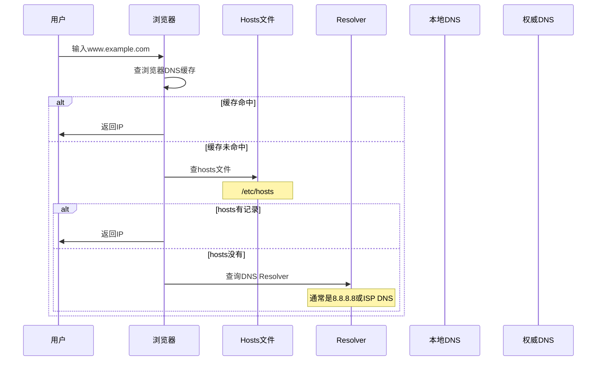
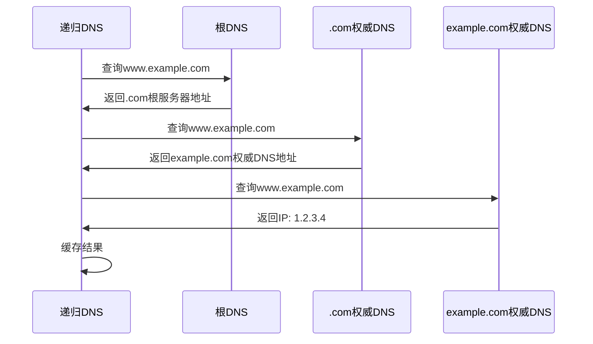
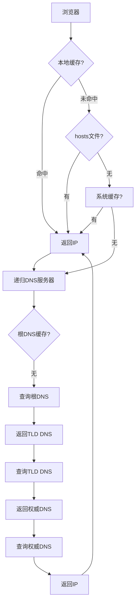
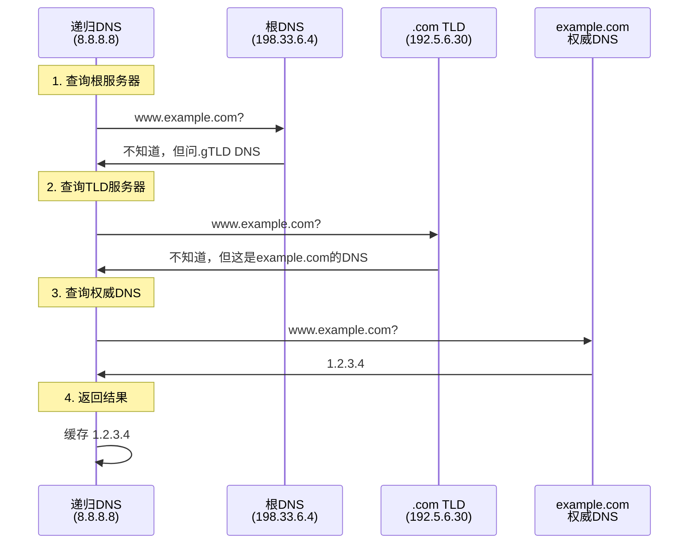
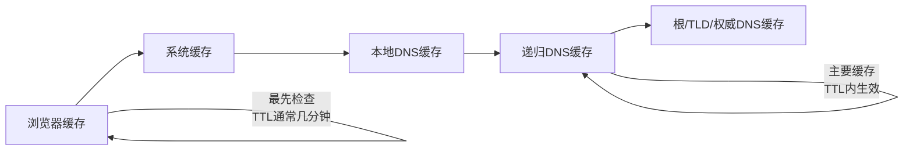
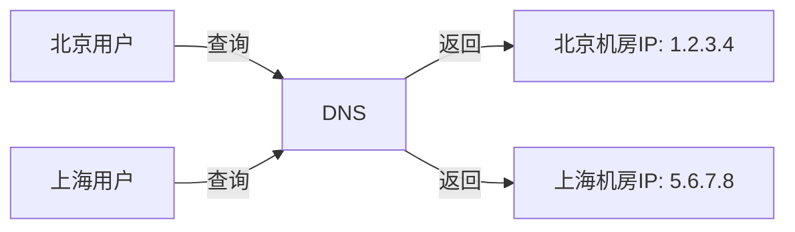
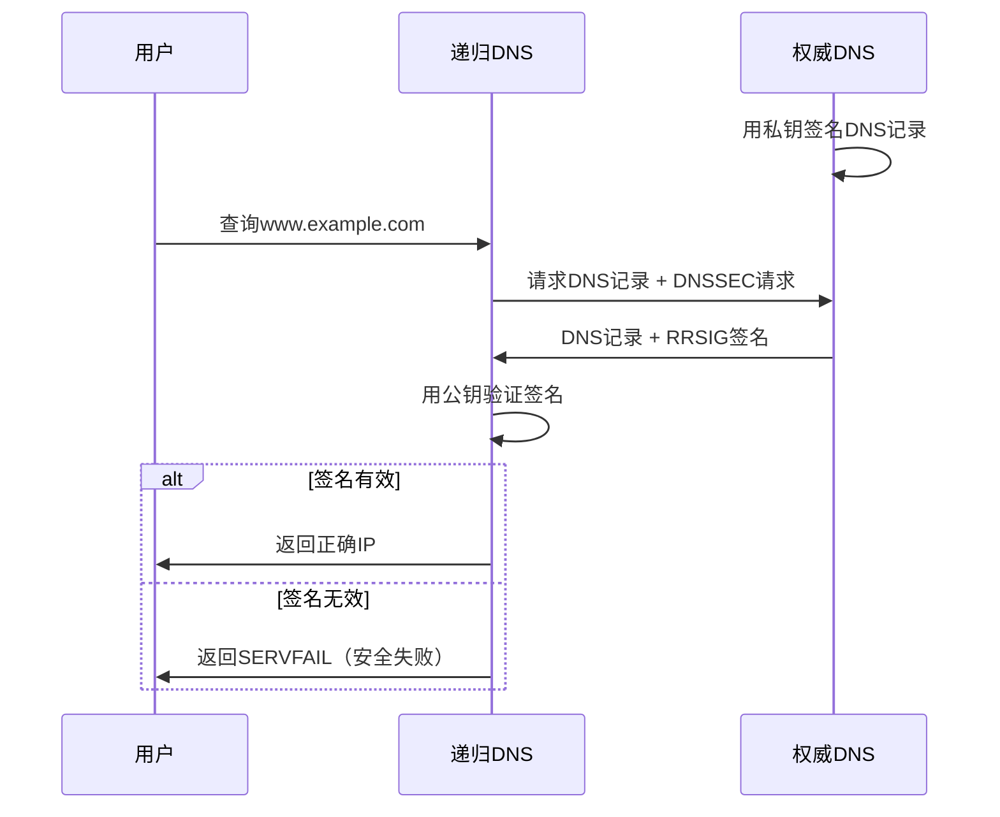

# DNS解析流程与域名解析机制

小王在阿里三面，面试官问：

"用户输入`www.taobao.com`，浏览器是怎么找到对应的服务器IP的？"

小张："DNS解析？查一下域名对应的IP？"

面试官追问："那DNS解析的完整流程是什么？有哪些缓存？为什么要用UDP？"

小张支支吾吾答不上来。

【直观类比】

把DNS想象成**手机通讯录**：

- 你想打电话给"张三"（域名）
- 通讯录帮你查"张三"对应的手机号（IP地址）
- 如果通讯录里没有，就问"中国移动"（DNS服务器）
- "中国移动"没有，就一级级往上问

DNS就是互联网的"通讯录"。

## DNS核心概念

### 域名结构

```
www.taobao.com
├── 子域名   域名   顶级域
```

| 层级 | 示例 | 说明 |
|------|------|------|
| 根域名 | `.` | DNS树形结构根部 |
| 顶级域（TLD） | `.com` `.cn` `.org` | 按机构/地区分类 |
| 二级域 | `taobao.com` | 可注册购买的域名 |
| 子域名 | `www.taobao.com` | 企业自由定义的子站点 |

### 域名解析记录类型

| 记录类型 | 作用 | 示例 |
|----------|------|------|
| A | 域名指向IPv4地址 | `www.example.com → 1.2.3.4` |
| AAAA | 域名指向IPv6地址 | `www.example.com → ::1` |
| CNAME | 域名别名 | `www.example.com → example.com` |
| MX | 邮件交换服务器 | `@example.com → mail.example.com` |
| NS | 域名服务器 | `example.com → ns1.example.com` |
| TXT | 文本记录 | 用于验证、SPF等 |
| PTR | IP反向解析 | `4.3.2.1.in-addr.arpa → www.example.com` |

## DNS解析完整流程

### 1. 浏览器DNS缓存

浏览器最先检查自己的缓存：

```javascript
// 浏览器DNS缓存（Chrome可查看）
chrome://net-internals/#dns
```



### 2. 系统DNS缓存与hosts文件

Linux系统检查`/etc/hosts`：

```bash
# hosts文件格式
127.0.0.1   localhost
::1         localhost
1.2.3.4     www.example.com
```

```bash
# 查看系统DNS缓存（需安装nscd）
# Debian/Ubuntu
apt install nscd
service nscd restart

# 查看DNS缓存
# Windows
ipconfig /displaydns

# Linux
# systemd-resolve --statistics
# 或 nscd -g
```

### 3. 递归DNS查询

如果没有命中缓存，请求发送到**递归DNS服务器**（Resolver），通常是你配置的DNS（如8.8.8.8或ISP DNS）。



**完整解析链路**：



### 4. DNS迭代查询详解

DNS服务器之间的查询是**迭代的**，每一步告诉对方"我不知道，但你应该问这个服务器"。



**DNS记录缓存时间**：

```bash
# TTL (Time To Live) 控制缓存时间
# DNS记录设置
www.example.com.  300  IN  A  1.2.3.4
# 300秒 = 5分钟

# 生产环境通常设置较长的TTL（如3600秒）
# 但变更时需要等待TTL过期
```

:::tip 💡
面试官追问"DNS用UDP还是TCP"，答案是：**主要用UDP（53端口）**，因为快、开销小。但如果响应超过512字节（UDP限制），会切换到TCP。DNS区域传输（主从同步）也用TCP。
:::

## DNS缓存机制

### 多级缓存



### 缓存失效问题

DNS变更时，旧缓存可能导致问题：

```
场景：example.com的IP从1.2.3.4变更为5.6.7.8

问题：
1. 全球递归DNS还在缓存1.2.3.4
2. 部分用户访问到旧IP
3. 服务不可用

解决方案：
1. 提前降低TTL（如从3600降到300）
2. 等待旧TTL过期
3. 新旧IP同时运行一段时间
```

## DNS负载均衡

### 1. 轮询负载均衡

DNS返回多个IP，随机选择：

```bash
# DNS配置
www.example.com.  300  IN  A  1.2.3.4
www.example.com.  300  IN  A  1.2.3.5
www.example.com.  300  IN  A  1.2.3.6
```

**问题**：无法感知服务器健康状态，客户端会缓存所有IP。

### 2. 智能DNS

根据用户来源返回最近服务器：



### 3. GeoDNS

基于地理位置的DNS，根据用户IP判断归属地：

```bash
# DNS配置
# 按区域返回不同IP
北京用户 → www.example.com → 1.2.3.4
上海用户 → www.example.com → 5.6.7.8
海外用户 → www.example.com → 9.9.9.9
```

## DNSSEC：DNS安全扩展

### DNS劫持问题

```
攻击场景：
1. 用户请求www.example.com
2. 黑客拦截DNS响应，返回恶意IP: 2.3.4.5
3. 用户访问黑客服务器，被钓鱼
```

### DNSSEC原理

DNS响应带上**数字签名**：



## DNS常用命令

```bash
# dig命令（推荐）
dig www.example.com
dig @8.8.8.8 www.example.com  # 指定DNS服务器
dig +trace www.example.com    # 追踪完整解析链路

# nslookup
nslookup www.example.com
nslookup -type=A www.example.com

# host
host www.example.com

# 查看DNS缓存（Linux需nscd）
nscd -g

# 刷新系统DNS缓存
# Windows
ipconfig /flushdns

# Linux (systemd-resolved)
systemd-resolve --flush-caches

# macOS
sudo dscacheutil -flushcache
```

## 边界与特例

### 1. DNS泛解析

```bash
# *.example.com 都解析到同一个IP
*.example.com.  300  IN  A  1.2.3.4
```

访问任何不存在的子域名，都会解析到这个IP。

### 2. CNAME与A记录冲突

```bash
# CNAME和A记录冲突
# 不能在同一个记录上同时设置
www.example.com.  300  IN  CNAME  cdn.example.com.
www.example.com.  300  IN  A  1.2.3.4  # ❌ 冲突
```

### 3. DNS TTL的影响

```
TTL设置过长的问题：
- DNS变更生效慢
- 服务器故障时切流慢
- 无法动态调整

TTL设置过短的问题：
- DNS查询压力大
- 解析延迟增加
- 权威DNS负载高
```

:::warning ⚠️
面试官追问"为什么DNS用UDP而不是TCP"，答案是：
1. UDP开销小，速度快
2. DNS查询通常很小（`<512`字节）
3. TCP需要三次握手，增加延迟
4. 但DNS支持TCP，用于区域传输和大响应
5. DNS over HTTPS (DoH) 和 DNS over TLS (DoT) 是趋势
:::

## 常见误区

### 误区一：DNS只在启动时解析一次

**错！** 每个请求都可能触发DNS解析（除非应用程序自己缓存）。但通常操作系统会缓存一段时间。

### 误区二：修改DNS记录立即生效

**错！** DNS有TTL传播时间。递归DNS会缓存到TTL过期才更新。全球完全生效可能需要24-48小时。

### 误区三：DNS只负责域名解析

**错！** DNS还负责：
- 邮件路由（MX记录）
- 反向解析（PTR记录）
- SPF验证（TXT记录）
- 负载均衡（多A记录）

### 误区四：DNS解析很快不需要优化

**错！** DNS解析通常需要20-100ms：
- 预解析（dns-prefetch）：`<link rel="dns-prefetch" href="//static.example.com">`
- 预连接：`<link rel="preconnect" href="https://api.example.com">`

## 记忆技巧

### DNS查询类型口诀

> "A找地址，AAAA找IPv6，CNAME是别名，MX管邮件"
> - A：Address，IPv4地址
> - AAAA：IPv6地址（4个A）
> - CNAME：Canonical Name，别名
> - MX：Mail Exchange，邮件交换

### DNS解析链路

> "浏览器先缓存，没有问系统，系统问递归，递归迭代查"
> - 浏览器缓存 → 系统缓存 → 递归DNS
> - 递归DNS → 根DNS → TLD DNS → 权威DNS

### DNS记录优先级

> "A最高，CNAME其次，MX最低"
> - A记录和CNAME冲突（不能共存）
> - MX记录的priority字段决定优先级（数字越小优先级越高）

## 实战检验

### 自测题一

**问题**：用户反馈"域名能ping通但浏览器打不开"，怎么排查？

**解析**：
1. ping通 ≠ DNS解析正确，可能是ICMP和HTTP走不同路径
2. 排查步骤：
   - `nslookup www.example.com` 确认DNS解析返回的IP
   - `curl -I https://IP` 测试IP是否对应正确域名（可能有IP被墙）
   - `curl -v https://www.example.com` 查看TLS握手是否成功
   - 检查是否被劫持（DNS污染）

### 自测题二

**问题**：生产环境变更DNS需要注意什么？

**解析**：
1. **提前降低TTL**：提前24-48小时把TTL降到300秒
2. **新IP先上线**：确保新服务器正常工作
3. **灰度切流**：先切10%流量，观察监控
4. **旧IP保留一段时间**：TTL过期后继续保持旧IP可访问
5. **回滚预案**：准备快速切回旧IP的操作

### 自测题三

**问题**：如何防止DNS劫持？

**解析**：
1. **DNSSEC**：启用DNS安全扩展
2. **DoH/DoT**：DNS over HTTPS/TLS，防止中间人篡改
3. **使用可信DNS**：如Google 8.8.8.8、Cloudflare 1.1.1.1
4. **监控告警**：DNS异常变化时及时发现

```bash
# Chrome启用DoH
# 设置 → 安全 → 使用安全DNS → 选择提供商

# 命令行测试DoH
curl -H 'accept: application/dns-json' \
  'https://cloudflare-dns.com/dns-query?name=www.example.com&type=A'
```

---

| 级别 | 考察重点 | 期望回答 | 判分标准 |
|------|----------|----------|----------|
| P5 | 域名结构和记录类型 | 能说出A/CNAME/MX记录 | 死记硬背 |
| P6 | 解析流程 | 能解释完整解析链路和多级缓存 | 理解原理 |
| P7 | 安全与优化 | 能说出DNSSEC、DoH、生产DNS变更注意事项 | 有实战经验 |
