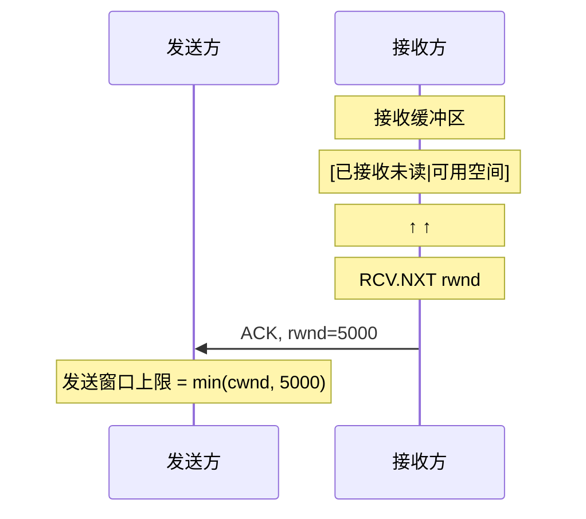
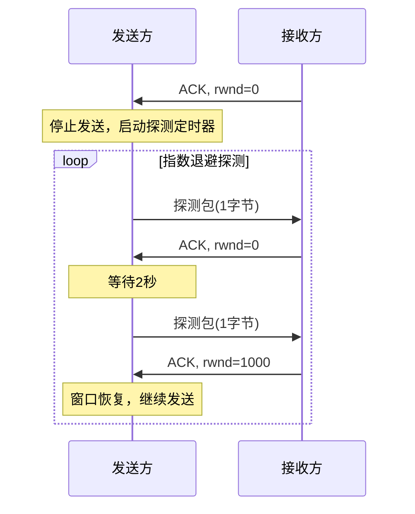
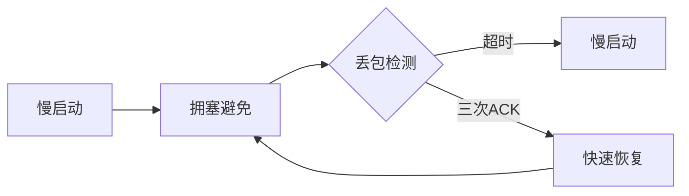
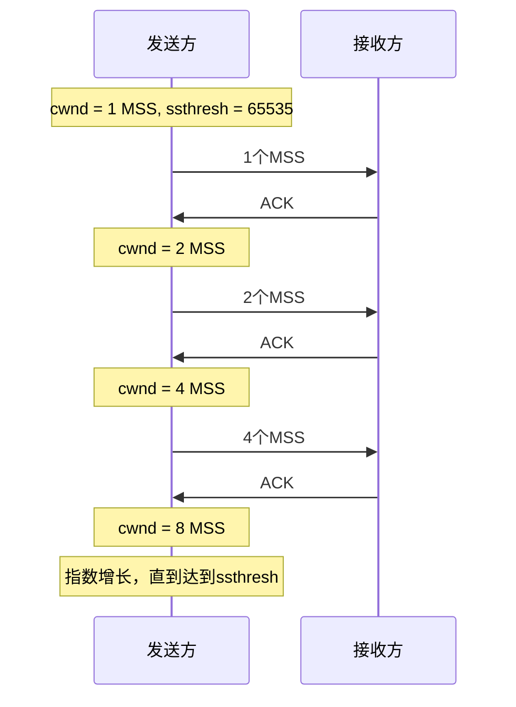
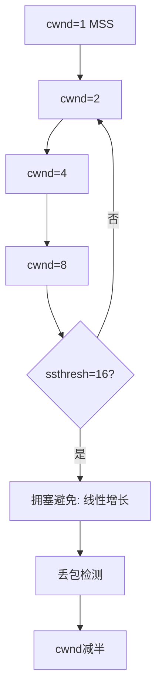
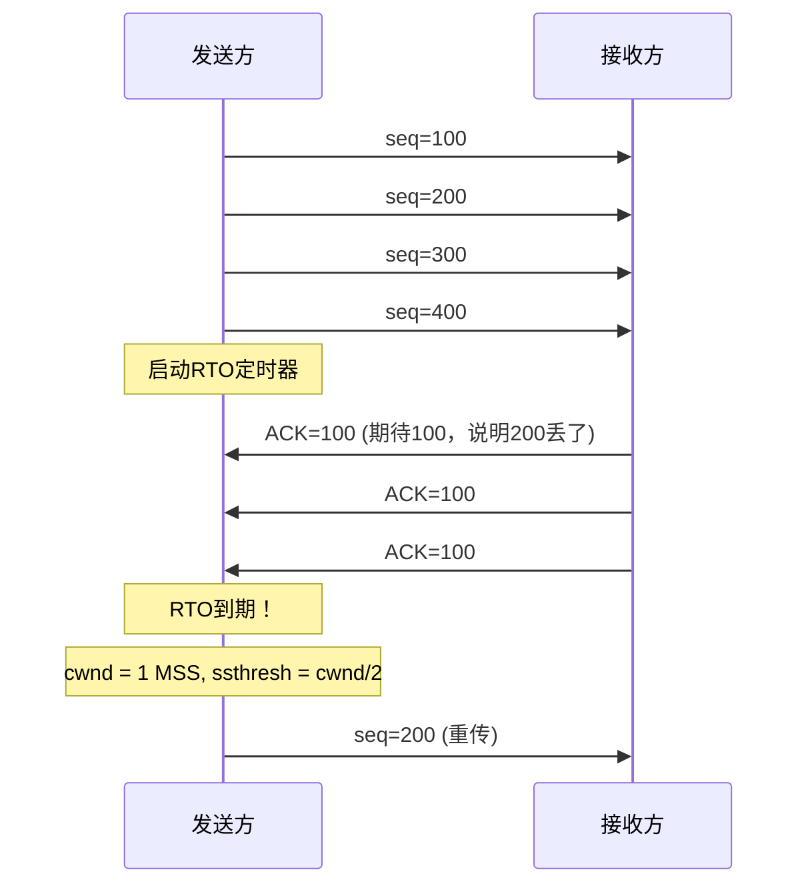
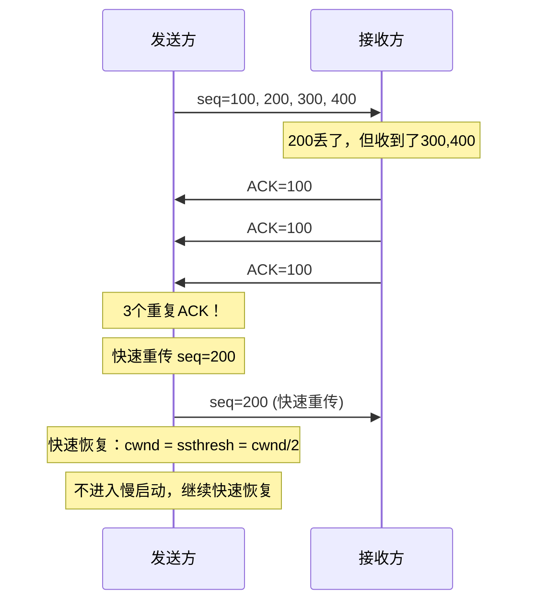
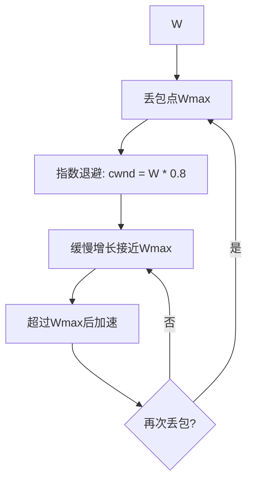

# 流量控制与拥塞控制

面试官问：

"TCP是怎么控制流量的？流量控制和拥塞控制有什么区别？"

小张："流量控制是让发送方不要发太快，拥塞控制是...防止网络堵车？"

面试官："那拥塞控制有哪些算法？慢启动是慢慢启动的意思吗？"

小张："是的，从小的窗口开始..."

面试官追问："cwnd是什么？为什么初始化为1或2个MSS？"

小张支支吾吾答不上来。

【直观类比】

把网络想象成高速公路：

- **流量控制**：收费用站的能力。收费站能处理多少车，你就放多少车进来，别把收费站堵死。
- **拥塞控制**：整条高速的承载能力。如果高速上车太多，大家都开不动，你就得减速，别把整条路堵死。

收费站（接收方）告诉你"我只能处理这么多"，这是流量控制。
整条高速（网络）告诉你"我已经堵了"，这是拥塞控制。

## 流量控制（Flow Control）

### 核心问题

发送方发得太快，接收方处理不过来，会导致：

- 接收缓冲区溢出
- 丢包重传（恶性循环）
- 资源浪费

### 滑动窗口与rwnd

还记得上一节讲的发送窗口吗？窗口大小由两部分决定：

```
发送窗口 = min(拥塞窗口cwnd, 接收窗口rwnd)
```

**rwnd（receive window）**：接收方告诉发送方"我还有多少缓冲区空间"。



### Zero Window与窗口探测

如果接收方缓冲区满了，`rwnd=0`，发送方停止发送。

问题：缓冲区清空后，怎么通知发送方？

**窗口探测（Window Probe）**：发送方定期发送1字节探测包，接收方回应ACK并告知当前窗口大小。



探测间隔：1秒 → 2秒 → 4秒 → 8秒 → ... → 60秒（最大）

:::warning ⚠️
Zero Window + 长肥管道（高带宽延迟）是性能杀手。如果你的应用在高延迟网络中性能差，检查一下是不是接收窗口太小了。
:::

### 糊涂窗口综合症（Silly Window Syndrome）

如果接收方每次只释放少量空间（如1字节），发送方每次只发1字节，大量小报文会浪费网络资源。

**RFC 3462 定义了解决方案**：

- **接收方**：只有当缓冲区达到MSS或一半空间时才通知窗口
- **发送方**：使用Nagle算法合并小报文

## 拥塞控制（Congestion Control）

### 核心问题

网络中有太多数据在传，导致：

- 路由器缓冲区溢出丢包
- 排队延迟增大
- 恶性循环：丢包→重传→更堵

### 拥塞控制四件套

TCP拥塞控制有四个核心算法：



| 算法 | 作用 | 触发条件 |
|------|------|----------|
| 慢启动（Slow Start） | 探索网络容量 | 连接建立、丢包后恢复 |
| 拥塞避免（Congestion Avoidance） | 线性增长 | cwnd达到ssthresh |
| 快速重传（Fast Retransmit） | 快速恢复 | 收到3个重复ACK |
| 快速恢复（Fast Recovery） | 减少停顿 | 快速重传后 |

### 慢启动（Slow Start）

**核心思想**：不要一开始就发太多数据，先探测网络容量。

**cwnd初始值**：RFC 5681规定为1-2个MSS（Linux 2.6.39之前是1，之后是10）。

**增长规则**：每收到一个ACK，cwnd增加1个MSS。

```
cwnd_new = cwnd_old + MSS (每收到一个ACK)
```

如果MSS=1460字节：
- 第1个ACK后：cwnd = 2920（2个MSS）
- 第2个ACK后：cwnd = 4380（3个MSS）
- 第3个ACK后：cwnd = 5840（4个MSS）

**指数增长**：1 → 2 → 4 → 8 → 16 → ...



**退出慢启动条件**：
- cwnd达到ssthresh（慢启动阈值）
- 或者检测到丢包

### 拥塞避免（Congestion Avoidance）

**核心思想**：接近网络容量了，要小心翼翼地试探。

**增长规则**：每经过一个RTT，cwnd增加1个MSS（而不是每个ACK）。

```
cwnd_new = cwnd_old + MSS * MSS / cwnd_old
```

如果cwnd = 10 MSS，每收到一个ACK只增加0.1 MSS，一个RTT（约10个ACK）后增加1个MSS。

**线性增长**：慢启动是指数增长，到达ssthresh后变成线性增长。



### 丢包检测与恢复

TCP通过两种方式检测丢包：

| 丢包类型 | 触发条件 | 处理方式 |
|----------|----------|----------|
| 超时丢包 | RTO定时器到期 | 严重，cwnd重置为1 MSS |
| 快速丢包 | 收到3个重复ACK | 较轻，cwnd减半 |

#### 超时丢包处理



**超时意味着什么？**：
- 网络可能严重拥塞
- 丢包太多/延迟太大
- 需要"从头开始"慢慢试探

#### 快速重传与快速恢复



**Tahoe vs Reno**：

| 版本 | 3个ACK | 超时 |
|------|--------|------|
| Tahoe | cwnd=ssthresh, 快速重传 | cwnd=1 |
| Reno | cwnd=ssthresh, 快速恢复 | cwnd=1 |

**Reno的快速恢复**：收到3个ACK后，只重传1个包，然后继续发新包，直到收到新的ACK确认丢包已修复。

### 拥塞控制演进

#### TCP Cubic（Linux默认）



Cubic的核心思想：
- 以丢包点Wmax为对称轴
- 平缓地探测丢包点附近
- 超过丢包点后加速增长

```bash
# 查看当前拥塞控制算法
cat /proc/sys/net/ipv4/tcp_congestion_control
# 查看可用算法
cat /proc/sys/net/ipv4/tcp_available_congestion_control
```

#### BBR（Bottleneck Bandwidth and RTT）

BBR不再依赖丢包来判断拥塞，而是主动测量：

```
吞吐量 = 带宽
延迟 = 往返时间
BBR目标：max 吞吐量 / min 延迟
```

**核心洞察**：丢包不等于拥塞，高吞吐低延迟的网络也会丢包。

```
BBR流程：
1. 探测带宽：不断增加发送速率，直到不能再增加
2. 探测延迟：检测RTT变化，RTT增大说明有缓冲
3. 调整：带宽↑且RTT↑时减少发送
```

:::tip 💡
BBR在丢包率高的网络（如无线网络）表现更好。但在对延迟敏感的场景（如视频会议），BBR可能不如Cubic。
:::

## 边界与特例

### 1. 带宽延迟积（BDP）

```
BDP = 带宽(bps) × 延迟(s) = 管道容量(比特)
```

**为什么重要？**：

- 如果cwnd `<` BDP，管道没填满，带宽浪费
- 如果cwnd `>` BDP，数据在路由器缓冲区排队，延迟增大

```
例：100 Mbps带宽，50ms RTT
BDP = 100 * 0.05 = 5 Mbits = 625 KB

接收窗口至少需要 625KB 才能充分利用带宽
```

### 2. 高带宽延迟网络（Long Fat Network）

卫星网络、深海光缆等高带宽×高延迟的网络，称为LFN（Long Fat Network）。

**问题**：传统TCP在LFN上性能极差，因为：

- 窗口太小填不满管道
- 丢包后重传代价太大
- 带宽×延迟积可能达到几十MB

**解决方案**：

- 增大窗口：`tcp_window_scaling`
- BDP友好的拥塞控制算法：HSTCP、SCTP
- 并行TCP连接

### 3. 丢包不等于拥塞

**误区**：丢包 = 拥塞。

**真相**：
- 无线网络丢包多（信号干扰）
- 网络抖动丢包（临时拥塞）
- 但这些丢包不是真正的"网络承受不了"

BBR就是基于这个洞察设计的。

## 常见误区

### 误区一：流量控制就是拥塞控制

**错！** 流量控制保护**接收方**，拥塞控制保护**网络**。

| | 流量控制 | 拥塞控制 |
|---|---|---|
| 保护对象 | 接收方缓冲区 | 网络资源（路由器等） |
| 依据 | rwnd | cwnd、丢包、RTT |
| 触发 | 接收方告知 | 检测网络状态 |

### 误区二：慢启动真的很"慢"

**不完全对**。慢启动是相对于"发送方认为网络能承受的最大值"而言的。实际上它是指数增长的，开始可能很慢，但增长很快。

**真正的"慢"**：初始化cwnd只有1-2个MSS，在高带宽网络中需要很长时间才能填满管道。

### 误区三：cwnd越大越好

**错！** cwnd太大会导致：
- 路由器缓冲区爆满
- 排队延迟增加
- 丢包率上升
- 恶性循环

最优cwnd ≈ BDP。

### 误区四：所有TCP拥塞控制都一样

**错！** Linux支持多种算法：

```bash
# 查看可用算法
ls /proc/sys/net/ipv4/tcp_congestion_control
```

主流算法：Tahoe、Reno、NewReno、Cubic、BBR、Hybla等。

## 记忆技巧

### 慢启动到拥塞避免

> "爬楼梯 vs 走平地"
> - 慢启动：爬楼梯，每步翻倍
> - 拥塞避免：走平地，每步一步

### cwnd增长规律

> "慢启动指数跳，拥塞避免线性长"
> - 慢启动：1→2→4→8（指数）
> - 拥塞避免：+1 per RTT（线性）

### 丢包处理

> "超时大地震，三ACK小地震"
> - 超时：cwnd重置为1，ssthresh减半
> - 三ACK：cwnd减半，快速恢复

### BDP公式

> "带宽乘延迟，等于管道容量"
> - BDP = 带宽 × RTT
> - 填满管道需要 cwnd `>=` BDP

## 实战检验

### 自测题一

**问题**：为什么在高延迟网络中，TCP吞吐量上不去？

**解析**：
因为TCP发送窗口受限于：
1. rwnd（接收窗口）
2. cwnd（拥塞窗口）
3. BDP = 带宽 × RTT

如果RTT很大，即使带宽很高，窗口太小也填不满管道。需要启用窗口扩大（tcp_window_scaling）或使用BBR等BDP友好的算法。

### 自测题二

**问题**：生产环境中如何调整拥塞控制算法？

**解析**：

```bash
# 查看当前算法
sysctl net.ipv4.tcp_congestion_control

# 临时切换到BBR
sysctl -w net.ipv4.tcp_congestion_control=bbr

# 永久生效（写入/etc/sysctl.conf）
echo "net.ipv4.tcp_congestion_control=bbr" >> /etc/sysctl.conf

# 查看BBR参数
sysctl net.ipv4.tcp_available_congestion_control
sysctl net.ipv4.tcp_congestion_control
```

### 自测题三

**问题**：如何排查拥塞控制导致的性能问题？

**解析**：

```bash
# 查看TCP重传统计
netstat -s | grep -i retransmit

# 查看当前拥塞窗口
ss -ti

# 查看连接详情
netstat -tn | grep :80

# 抓包分析拥塞
tcpdump -i eth0 -w capture.pcap
# 然后用Wireshark分析重传、窗口大小等
```

---

| 级别 | 考察重点 | 期望回答 | 判分标准 |
|------|----------|----------|----------|
| P5 | 基本概念区分 | 能区分流量控制和拥塞控制 | 死记硬背 |
| P6 | 算法原理 | 能解释慢启动、拥塞避免、快速恢复 | 理解机制 |
| P7 | 算法选型与优化 | 能根据场景选择拥塞控制算法 | 有实战经验 |
