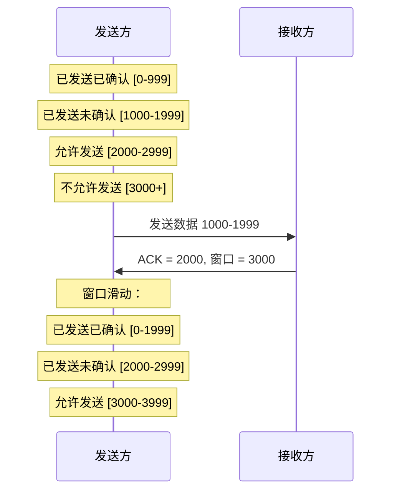
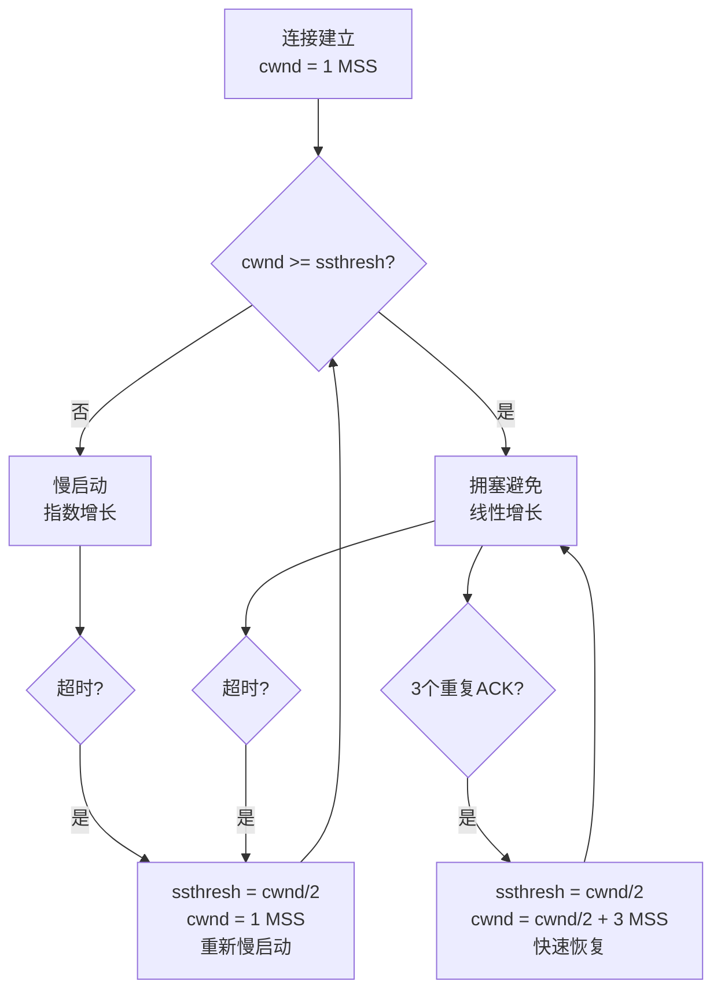

# 流量控制与拥塞控制

> 目标级别：P6

面试官问：「TCP 的流量控制和拥塞控制有什么区别？」你回答「流量控制是防止接收方淹没，拥塞控制是防止网络压垮」——然后面试官追问：「滑动窗口是怎么实现的？」「拥塞控制的四个算法是什么？」「快速重传为什么是 3 个重复 ACK 而不是 2 个？」

流量控制和拥塞控制是 TCP 协议中最容易混淆的两个概念，也是面试高频追问点。

## 快速自测

面试前先问自己这三个问题：

1. **流量控制和拥塞控制的本质区别是什么？** 谁来控制？控制谁？
2. **滑动窗口是怎么工作的？** 窗口收缩和扩展的时机是什么？
3. **拥塞控制的慢启动是怎么指数增长的？** 什么时候切换到拥塞避免？

---

## 一、核心概念区分

### 1.1 流量控制 vs 拥塞控制

| 维度 | 流量控制 | 拥塞控制 |
|------|----------|----------|
| **目的** | 防止发送方过快，淹没接收方 | 防止发送方过快，压垮整个网络 |
| **控制者** | 接收方 | 发送方 |
| **依据** | 接收方缓冲区大小 | 网络拥塞程度（丢包率、RTT） |
| **实现** | 滑动窗口 | 慢启动、拥塞避免、快速重传 |
| **范围** | 点对点（两个端点之间） | 端到端（整个网络路径） |
| **关系** | 必须启用 | 必须启用 |

**生活类比**：

- **流量控制**就像给水壶倒水：你不能倒太快，否则水壶会溢出来。水壶的容量就是接收缓冲区。
- **拥塞控制**就像道路通行：即使你的车性能再好，前面堵车你也得慢慢开。网络就是那条道路。

### 1.2 为什么需要两者？

```
没有流量控制：
- 接收方缓冲区只有 10KB
- 发送方发送 100KB 数据
- 接收方溢出，数据丢失
- 发送方重传，再次溢出
- 恶性循环

没有拥塞控制：
- 发送方无限制发送
- 网络路由器缓冲区爆满
- 大量丢包
- 发送方超时重传
- 网络更拥塞
- 全网崩溃
```

---

## 二、流量控制详解

### 2.1 滑动窗口原理

滑动窗口是 TCP 流量控制的核心机制。发送方维护一个窗口，表示「可以发送但未确认」的数据范围。



**窗口结构**：

```
发送方视图：
| 已发送已确认 | 已发送未确认 | 允许发送（窗口内） | 不允许发送（窗口外） |
   [0-999]       [1000-1999]        [2000-2999]            [3000+]

窗口左边界移动条件：收到 ACK
窗口右边界移动条件：收到 ACK + 窗口更新
```

### 2.2 窗口字段

TCP 头部有一个 16 位的窗口字段（Window Size），用于告诉对方自己的接收能力。

```
窗口字段 = 接收缓冲区可用空间
最大值为 65535 字节

但可以通过 Window Scale 选项扩展到 1GB
实际窗口大小 = 窗口字段 * 2^scale_factor
```

### 2.3 零窗口与窗口探测

当接收方缓冲区满了，窗口字段为 0，发送方停止发送。

**问题**：如果接收方应用程序消费了数据，窗口打开，但 ACK 丢失了怎么办？

**解决方案**：窗口探测（Window Probe）

```java
// 发送方行为
while (发送方窗口 == 0) {
    等待一段时间（通常是 2*RTT）
    发送 1 字节的探测数据  // 强制对方回复 ACK
    if (收到 ACK && 窗口 > 0) {
        恢复发送
    }
}
```

**糊涂窗口综合征（Silly Window Syndrome）**：

如果每次只发送很少的数据（如 1 字节），会有大量小数据报文的开销。

```
发送方策略（Nagle 算法）：
- 如果窗口足够大，直接发送
- 如果有未确认的数据，等待确认后再发
- 直到数据积累到一定程度或确认到达

接收方策略（Clark 策略）：
- 直到窗口达到一定大小（如 MSS）才通知窗口打开
- 避免发送小的窗口更新
```

---

## 三、拥塞控制详解

### 3.1 拥塞窗口（cwnd）

拥塞控制的核心是**拥塞窗口（cwnd）**。发送方根据网络状况动态调整 cwnd。

```
发送量的限制：
发送窗口 = min(接收方窗口, 拥塞窗口)

两种限制取较小值：
- 接收方告诉我的窗口大小（流量控制）
- 我自己探测到的网络容量（拥塞控制）
```

### 3.2 拥塞控制四算法



| 算法 | cwnd 变化 | 进入条件 |
|------|-----------|----------|
| 慢启动 | cwnd = cwnd * 2（指数） | 连接建立、超时后 |
| 拥塞避免 | cwnd = cwnd + 1（线性） | cwnd >= ssthresh |
| 快速重传 | 不改变 cwnd | 收到 3 个重复 ACK |
| 快速恢复 | cwnd = ssthresh + 3*MSS | 快速重传后 |

### 3.3 慢启动详解

慢启动不是「慢慢启动」，而是从小窗口开始，快速探测网络容量。

```
慢启动过程（假设 MSS = 1460 字节）：
cwnd = 1 MSS = 1460 字节
↓
收到 1 个 ACK，cwnd = 2 MSS
↓
收到 2 个 ACK，cwnd = 4 MSS
↓
收到 4 个 ACK，cwnd = 8 MSS
↓
...

指数增长：1 → 2 → 4 → 8 → 16 → ...
```

**什么时候退出慢启动？**

```
两个退出条件：
1. cwnd >= ssthresh（慢启动阈值）
2. 发生丢包（超时或重复 ACK）

进入拥塞避免：cwnd = ssthresh，然后线性增长
触发超时：重新慢启动，cwnd = 1 MSS
```

### 3.4 拥塞避免

当 cwnd 达到 ssthresh，进入拥塞避免，cwnd 从指数增长变为线性增长。

```
拥塞避免过程（每收到一个 ACK）：
cwnd = cwnd + MSS * MSS / cwnd

假设 cwnd = 10 MSS：
- 收到 1 个 ACK：cwnd += 1460 * 1460 / (10 * 1460) = 146 字节
- 收到 10 个 ACK：cwnd += 1 MSS = 1460 字节
- 每 RTT 增长约 1 MSS
```

### 3.5 快速重传与快速恢复

**快速重传触发条件**：收到 3 个重复 ACK

**为什么是 3 个？**

```
1 个重复 ACK：可能是网络抖动
2 个重复 ACK：可能是乱序，概率较低
3 个重复 ACK：几乎确定是丢包，不是乱序

RFC 建议使用 3 个，但在高延迟网络中可能使用更高的值。
```

**快速恢复流程**：

```
1. ssthresh = cwnd / 2
2. cwnd = ssthresh + 3 * MSS  // 3 个 ACK 已确认了 3 个数据包
3. 快速重传丢失的数据包
4. 进入拥塞避免阶段
```

**超时重传 vs 快速重传**：

| 维度 | 超时重传 | 快速重传 |
|------|----------|----------|
| 触发条件 | RTO 到期 | 3 个重复 ACK |
| 严重程度 | 更严重 | 相对轻微 |
| cwnd 处理 | cwnd = 1 MSS | cwnd = ssthresh + 3*MSS |
| 后续行为 | 重新慢启动 | 快速恢复后进入拥塞避免 |

---

## 四、面试题精讲

### 🔴 【高频】流量控制和拥塞控制的区别

**问题**：TCP 的流量控制和拥塞控制有什么区别？

**标准答案**：

```
流量控制：
- 目的：防止发送方过快，淹没接收方
- 控制者：接收方（通过窗口字段告知）
- 依据：接收方缓冲区剩余空间
- 机制：滑动窗口

拥塞控制：
- 目的：防止发送方过快，压垮整个网络
- 控制者：发送方（自己判断）
- 依据：网络拥塞程度（丢包率、RTT）
- 机制：慢启动、拥塞避免、快速重传

两者同时生效：发送量受 min(接收方窗口, 拥塞窗口) 限制。
```

### 🟡 【中频】滑动窗口机制

**问题**：请描述 TCP 滑动窗口的工作原理。

**标准答案**：

```
滑动窗口是流量控制的实现机制：

发送方维护三个指针：
1. SND.UNA（已发送未确认的第一个字节）
2. SND.NXT（窗口内下一个可发送的字节）
3. SND.WND（窗口大小）

窗口内包含「已发送未确认」和「允许发送但未发送」两部分。

工作过程：
1. 发送窗口内的数据
2. 收到 ACK，窗口滑动
3. 窗口滑动后，发送新数据

零窗口：接收方缓冲区满时，窗口字段为 0，发送方停止发送。
后续通过窗口探测探测窗口是否打开。
```

### 🟡 【中频】慢启动过程

**问题**：TCP 慢启动是怎么工作的？

**标准答案**：

```
慢启动用于连接建立初期，快速探测网络容量：

1. 初始 cwnd = 1 MSS（约 1KB）
2. 每收到一个 ACK，cwnd 增加 1 MSS
3. cwnd 指数增长：1 → 2 → 4 → 8 → 16 → ...

退出慢启动的条件：
- cwnd >= ssthresh（进入拥塞避免）
- 发生丢包（重新慢启动）
```

### 🟢 【低频】拥塞窗口和接收窗口的关系

**问题**：发送方同时受到拥塞窗口和接收窗口限制，两者是什么关系？

**标准答案**：

```
发送窗口 = min(接收窗口, 拥塞窗口)

例如：
- 接收窗口 = 10 MSS
- 拥塞窗口 = 5 MSS
- 实际发送窗口 = 5 MSS（取较小值）

拥塞窗口由发送方根据网络状况调整
接收窗口由接收方通过 ACK 告知

两者共同决定发送速率，既不能太快（淹没接收方），
也不能太快（压垮网络）。
```

---

## 五、常见陷阱与易错点

### ⚠️ 陷阱一：混淆流量控制和拥塞控制

这是最常见的错误。记住：

- **流量控制**：保护**接收方**（一对一）
- **拥塞控制**：保护**网络**（端到端）

### ⚠️ 陷阱二：认为慢启动真的「慢」

慢启动的 cwnd 初始值虽然小（1 MSS），但增长非常快（指数增长）。实际上「慢启动」指的是初始窗口小，不是增长速度慢。

### ⚠️ 陷阱三：混淆 cwnd 和 ssthresh

| 变量 | 含义 | 变化 |
|------|------|------|
| cwnd | 拥塞窗口 | 动态变化 |
| ssthresh | 慢启动阈值 | 丢包时减半 |

### ⚠️ 陷阱四：忽略零窗口问题

零窗口会导致发送方停止发送数据，但接收方恢复后如果 ACK 丢失，会导致死锁。解决方案是窗口探测。

---

## 六、对比总结

### 流量控制 vs 拥塞控制

| 维度 | 流量控制 | 拥塞控制 |
|------|----------|----------|
| 目的 | 接收方不被淹没 | 网络不被压垮 |
| 控制依据 | 接收方缓冲区 | 网络状态（丢包/RTT） |
| 控制位置 | 接收方告知发送方 | 发送方自行控制 |
| 范围 | 点对点 | 端到端 |
| 实现机制 | 滑动窗口 | 慢启动、拥塞避免、快速重传 |

### 拥塞控制行为对比

| 丢包类型 | ssthresh | cwnd | 后续状态 |
|----------|----------|------|----------|
| 超时 | cwnd / 2 | 1 MSS | 重新慢启动 |
| 3 个重复 ACK | cwnd / 2 | ssthresh + 3*MSS | 快速恢复后进入拥塞避免 |

### TCP Reno vs TCP Tahoe

| 算法 | 丢包处理 |
|------|----------|
| TCP Tahoe | 超时或 3 个重复 ACK 都重新慢启动 |
| TCP Reno | 超时重新慢启动，3 个重复 ACK 快速恢复 |

---

## 七、扩展思考

### 💡 加分话题：BBR 拥塞控制算法

Google 提出的 BBR（Bottleneck Bandwidth and RTT）改变了拥塞控制范式：

```
传统算法 vs BBR：
- 传统算法：丢包 = 拥塞，降低发送速率
- BBR：实时估计带宽和 RTT，主动调整速率

BBR 优势：
- 不需要等丢包才降速
- 在高带宽高延迟网络中性能显著提升
- 丢包率不再是拥塞信号
```

### 💡 加分话题：CUBIC 算法

Linux 默认的拥塞控制算法是 CUBIC，是对 Reno/Tahoe 的改进：

```
CUBIC 特点：
- 使用三次函数而非线性增长
- 窗口增长与 RTT 无关，更公平
- 快速恢复后不重新慢启动
```

> 流量控制和拥塞控制是 TCP 的两大保护机制：流量控制保护接收方，拥塞控制保护网络。理解两者的区别和协同工作方式，才能真正掌握 TCP 的传输控制。