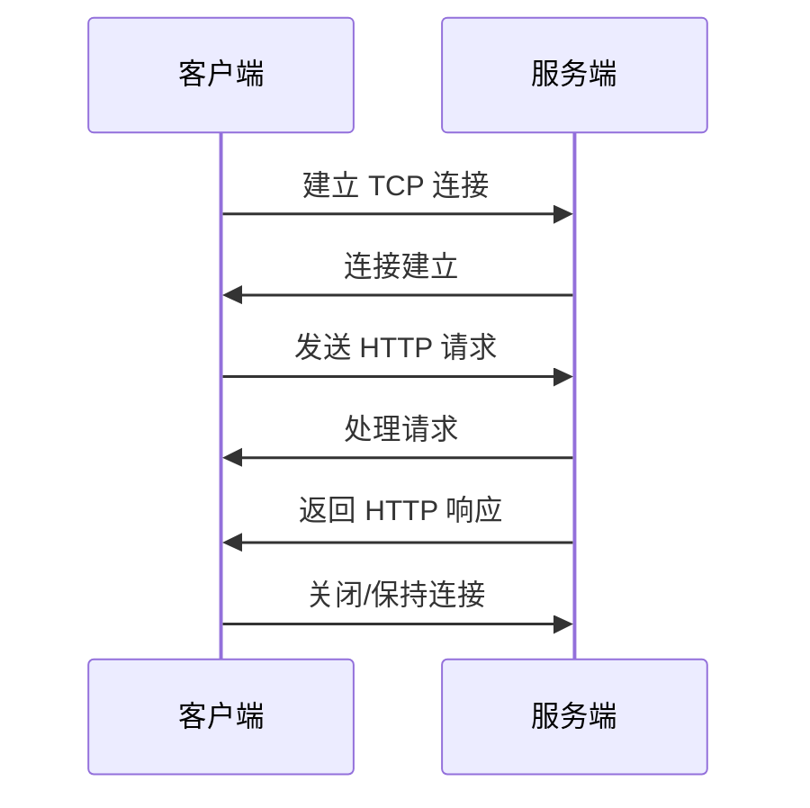

# HTTP/1.1 特性

> 目标级别：P5/P6

面试官问：「HTTP/1.1 有什么特点？」你回答「Keep-Alive 支持持久连接」——然后面试官追问：「持久连接具体是怎么工作的？」「队头阻塞是什么？」「HTTP/1.1 有哪些性能问题？」

HTTP 是互联网的基石，理解 HTTP/1.1 的特性是理解 HTTP/2 和 HTTP/3 的基础。

## 快速自测

面试前先问自己这三个问题：

1. **HTTP/1.1 的持久连接是怎么实现的？** Connection: Keep-Alive 是什么意思？
2. **队头阻塞问题是什么？** HTTP/1.1 有哪些性能瓶颈？
3. **HTTP/1.1 的请求方法有哪些？** GET 和 POST 的区别是什么？

---

## 一、HTTP 基础回顾

### 1.1 HTTP 是什么？

HTTP（HyperText Transfer Protocol）是超文本传输协议，是 Web 的基础。

```
HTTP 的本质：
- 客户端-服务器协议
- 请求-响应模式
- 无状态协议（不保存客户端状态）
```

### 1.2 HTTP 工作流程



---

## 二、HTTP/1.1 核心特性

### 2.1 持久连接（Persistent Connections）

**问题背景**：

HTTP/1.0 每次请求都需要建立新的 TCP 连接，连接建立和关闭开销大。

**解决方案**：

HTTP/1.1 引入了持久连接（Keep-Alive），一个 TCP 连接可以发送多个 HTTP 请求。

```
HTTP/1.0：
连接1 → 请求1 → 响应1 → 关闭
连接2 → 请求2 → 响应2 → 关闭
连接3 → 请求3 → 响应3 → 关闭

HTTP/1.1：
连接1 → 请求1 → 响应1 → 请求2 → 响应2 → 请求3 → 响应3 → 关闭
```

**工作原理**：

```
请求头：
Connection: Keep-Alive

响应头：
Connection: Keep-Alive
Keep-Alive: timeout=5, max=100

说明：
- timeout=5：连接保持 5 秒无活动后关闭
- max=100：最多处理 100 个请求后关闭
```

**优点**：

1. 减少 TCP 连接建立/关闭的开销
2. 减少慢启动的影响
3. 提高网络利用率

### 2.2 管道化（Pipeline）

HTTP/1.1 支持管道化，即在一个连接上连续发送多个请求，不需要等待前一个请求的响应。

```
没有管道化：
请求1 → 响应1 → 请求2 → 响应2 → 请求3 → 响应3

管道化：
请求1 → 请求2 → 请求3 → 响应1 → 响应2 → 响应3
```

**问题**：服务器必须按照请求顺序返回响应（**队头阻塞**）。

### 2.3 分块传输编码（Chunked Transfer Encoding）

当响应内容无法预先确定大小时（如动态内容），可以使用分块传输。

```
响应头：
Transfer-Encoding: chunked

响应体格式：
A\r\n          # 长度（十进制 10）
0123456789\r\n # 数据
B\r\n
abcdefghij\r\n
0\r\n          # 最后一个 chunk，长度为 0
\r\n           # 结束

最终数据：
A
0123456789
B
abcdefghij
（空行表示结束）
```

### 2.4 Host 头域

HTTP/1.1 要求请求必须包含 Host 头，支持虚拟主机。

```
请求：
GET / HTTP/1.1
Host: www.example.com

请求：
GET / HTTP/1.1
Host: api.example.com
```

这样一台服务器可以托管多个域名（虚拟主机）。

---

## 三、HTTP 请求方法

| 方法 | 说明 | 幂等性 | 安全性 |
|------|------|--------|--------|
| GET | 获取资源 | 幂等 | 安全 |
| POST | 提交数据 | 非幂等 | 不安全 |
| PUT | 上传资源 | 幂等 | 不安全 |
| DELETE | 删除资源 | 幂等 | 不安全 |
| HEAD | 获取响应头 | 幂等 | 安�� |
| OPTIONS | 查询支持的方法 | 幂等 | 安全 |
| PATCH | 部分更新 | 非幂等 | 不安全 |

### 3.1 GET vs POST

| 维度 | GET | POST |
|------|-----|------|
| 用途 | 获取资源 | 提交数据 |
| 参数位置 | URL 查询参数 | 请求体 |
| 长度限制 | URL 长度限制（浏览器约 2KB） | 无限制 |
| 缓存 | 可缓存 | 通常不可缓存 |
| 幂等性 | 幂等 | 非幂等 |
| 数据类型 | ASCII | 任意类型 |

```
GET 请求示例：
GET /search?q=keyword&page=1 HTTP/1.1
Host: www.example.com

POST 请求示例：
POST /api/login HTTP/1.1
Host: www.example.com
Content-Type: application/json

{"username": "admin", "password": "123456"}
```

### 3.2 PUT vs PATCH

| 方法 | 说明 |
|------|------|
| PUT | 完整替换资源（幂等） |
| PATCH | 部分更新资源（非幂等） |

```
PUT 示例：替换整个用户信息
PUT /users/123
{"name": "张三", "age": 30, "city": "北京"}

PATCH 示例：只更新年龄
PATCH /users/123
{"age": 31}
```

---

## 四、HTTP 状态码

### 4.1 状态码分类

| 类别 | 范围 | 说明 |
|------|------|------|
| 1xx | 100-199 | 信息性状态码 |
| 2xx | 200-299 | 成功状态码 |
| 3xx | 300-399 | 重定向状态码 |
| 4xx | 400-499 | 客户端错误状态码 |
| 5xx | 500-599 | 服务端错误状态码 |

### 4.2 常见状态码

| 状态码 | 说明 | 典型场景 |
|--------|------|----------|
| 200 | OK | 请求成功 |
| 201 | Created | 资源创建成功 |
| 204 | No Content | 请求成功但无返回内容 |
| 301 | Moved Permanently | 永久重定向 |
| 302 | Found | 临时重定向 |
| 304 | Not Modified | 资源未修改，使用缓存 |
| 400 | Bad Request | 请求语法错误 |
| 401 | Unauthorized | 需要认证 |
| 403 | Forbidden | 拒绝访问 |
| 404 | Not Found | 资源不存在 |
| 500 | Internal Server Error | 服务器内部错误 |
| 502 | Bad Gateway | 网关错误 |
| 503 | Service Unavailable | 服务不可用 |

---

## 五、HTTP/1.1 的性能问题

### 5.1 队头阻塞（Head-of-Line Blocking）

**问题描述**：

HTTP/1.1 的持久连接虽然可以发送多个请求，但响应必须按请求顺序返回。如果第一个请求很慢，后续请求都会被阻塞。

```
请求1（大文件下载）→ 响应1（很慢）
请求2（快速API）→ 响应2（被迫等待）
请求3（快速API）→ 响应3（被迫等待）
```

**队头阻塞**：队首（第一个响应）阻塞了后续响应。

**解决方案**（HTTP/1.1）：

1. **多个域名**：将资源分散到多个域名（域名分片）
2. **内联资源**：将小资源内联到 HTML 中
3. **雪碧图**：将多个小图片合并为一个大图片

### 5.2 重复传输

每次请求都需要传输相同的头部信息。

```
请求1：
GET /index.html HTTP/1.1
Host: www.example.com
User-Agent: Mozilla/5.0
Accept: text/html
Cookie: session_id=abc123

请求2：
GET /style.css HTTP/1.1
Host: www.example.com
User-Agent: Mozilla/5.0  // 重复
Accept: text/css        // 重复
Cookie: session_id=abc123  // 重复
```

### 5.3 低效的缓存机制

HTTP/1.1 的缓存机制较为简单：

- **ETag**：基于内容哈希判断是否变化
- **Last-Modified**：基于时间戳判断

每次请求仍需要与服务端通信确认缓存是否有效（**条件请求**）。

---

## 六、面试题精讲

### 🔴 【高频】HTTP/1.1 的持久连接

**问题**：什么是 HTTP 持久连接？它是怎么工作的？

**标准答案**：

```
HTTP 持久连接（Keep-Alive）允许在单个 TCP 连接上发送多个 HTTP 请求和响应。

工作原理：
1. 客户端在请求头添加 Connection: Keep-Alive
2. 服务端在响应头添加 Connection: Keep-Alive
3. 连接保持打开，可以复用
4. 任何一方发送 Connection: close 关闭连接

优点：
- 减少 TCP 连接建立/关闭的开销
- 减少慢启动的影响
- 提高网络利用率

限制：
- HTTP/1.1 默认开启，但可以通过 Connection: close 关闭
- 服务器可能设置 max 属性限制连接复用次数
```

### 🔴 【高频】GET 和 POST 的区别

**问题**：GET 和 POST 请求有什么区别？

**标准答案**：

```
1. 用途：
   - GET：获取资源（幂等、安全）
   - POST：提交数据（非幂等、不安全）

2. 参数位置：
   - GET：URL 查询参数（?key=value&key2=value2）
   - POST：请求体（body）

3. 长度限制：
   - GET：URL 长度有限（约 2KB，浏览器限制）
   - POST：无限制（但服务器可能限制）

4. 缓存：
   - GET：可缓存（浏览器会缓存 GET 请求）
   - POST：通常不可缓存

5. 编码方式：
   - GET：ASCII
   - POST：任意编码（通过 Content-Type 指定）

6. 历史记录：
   - GET：参数会留在浏览器历史记录中
   - POST：参数不会留在历史记录中

7. 书签：
   - GET：可以收藏为书签
   - POST：不能收藏为书签
```

### 🟡 【中频】HTTP 状态码分类

**问题**：HTTP 状态码有哪些类别？每类代表什么含义？

**标准答案**：

```
1xx（信息性）：请求正在处理
   - 100 Continue：客户端可以继续发送请求体

2xx（成功）：请求成功
   - 200 OK：成功
   - 201 Created：资源创建成功
   - 204 No Content：成功但无返回内容

3xx（重定向）：需要进一步操作
   - 301 Moved Permanently：永久重定向
   - 302 Found：临时重定向
   - 304 Not Modified：使用缓存

4xx（客户端错误）：请求有问题
   - 400 Bad Request：请求语法错误
   - 401 Unauthorized：需要认证
   - 403 Forbidden：拒绝访问
   - 404 Not Found：资源不存在

5xx（服务端错误）：服务器问题
   - 500 Internal Server Error：服务器内部错误
   - 502 Bad Gateway：网关错误
   - 503 Service Unavailable：服务不可用
```

---

## 七、常见陷阱与易错点

### ⚠️ 陷阱一：混淆持久连接和管道化

持久连接允许复用连接，管道化允许在连接上发送多个请求。但管道化的响应必须按顺序返回，这是队头阻塞的根源。

### ⚠️ 陷阱二：认为 GET 请求不能带 body

HTTP 规范没有禁止 GET 带 body，只是浏览器很少这样做。理论上 `GET /api?q=1` 可以带 body，但服务端可能不支持。

### ⚠️ 陷阱三：忽略 HTTP 的无状态性

HTTP 是无状态协议，每次请求相互独立。如果需要保持状态，需要使用 Cookie/Session 或 Token 机制。

### ⚠️ 陷阱四：混淆 301 和 302

| 状态码 | 含义 | 缓存 |
|--------|------|------|
| 301 | 永久移动，URL 变了 | 浏览器会缓存，搜索引擎会更新索引 |
| 302 | 临时移动，URL 暂时变 | 浏览器不会缓存，搜索引擎可能保留原 URL |

---

## 八、对比总结

### HTTP/1.0 vs HTTP/1.1

| 特性 | HTTP/1.0 | HTTP/1.1 |
|------|----------|----------|
| 持久连接 | 不支持（默认短连接） | 支持（默认开启） |
| 管道化 | 不支持 | 支持（但响应按序） |
| 分块传输 | 不支持 | 支持 |
| Host 头 | 可选 | 必须 |
| 100 Continue | 不支持 | 支持 |
| 缓存机制 | 基础 | 完善（ETag、条件请求） |

### GET vs POST 详细对比

| 维度 | GET | POST |
|------|-----|------|
| 用途 | 查询/获取资源 | 创建/更新资源 |
| 参数位置 | URL | Body |
| URL 长度 | 约 2KB（浏览器限制） | 无限制 |
| 数据类型 | ASCII | 任意 |
| 幂等 | 是 | 否 |
| 安全 | 是（不修改数据） | 否 |
| 缓存 | 可缓存 | 通常不可缓存 |
| 历史记录 | 会记录 | 不会记录 |
| 书签 | 可收藏 | 不可收藏 |

---

## 九、扩展思考

### 💡 加分话题：HTTP 队头阻塞的解决方案

HTTP/1.1 的队头阻塞催生了多个优化方案：

```
1. 域名分片（Domain Sharding）
   - 将资源分散到多个域名
   - 绕过单连接队头阻塞
   - 缺点：增加 DNS 解析开销，TCP 连接数增多

2. 资源内联（Resource Inlining）
   - 将小资源内联到 HTML/CSS/JS 中
   - 减少请求数
   - 缺点：无法独立缓存

3. 雪碧图（Sprite Sheet）
   - 将多个小图片合并为一个大图
   - 通过 CSS 定位显示不同部分
   - 缺点：更新麻烦，缓存粒度大

4. 合并文件（Concatenation）
   - 将多个 JS/CSS 文件合并为一个
   - 缺点：更新一个文件导致整体缓存失效
```

### 💡 加分话题：Connection: Keep-Alive vs Connection: close

```
Connection: Keep-Alive
- 请求保持连接
- 服务端同意则响应同样的头
- 连接复用

Connection: close
- 请求完成后立即关闭连接
- 显式要求关闭

HTTP/1.1 默认行为：
- 所有连接默认 Keep-Alive
- 可以显式关闭：Connection: close
- 服务端也可以关闭：timeout 后自动关闭
```

> HTTP/1.1 是现代 Web 的基础，它的特性（如持久连接、管道化）奠定了后续版本的基础。虽然 HTTP/2 和 HTTP/3 解决了队头阻塞问题，但理解 HTTP/1.1 的工作原理，才能真正理解为什么需要它们。