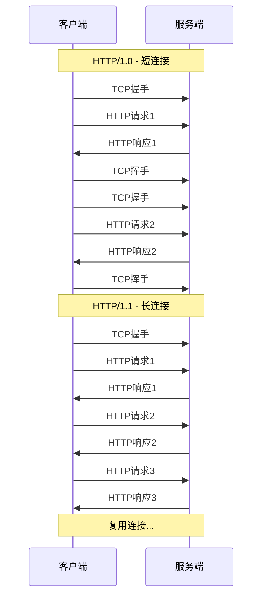
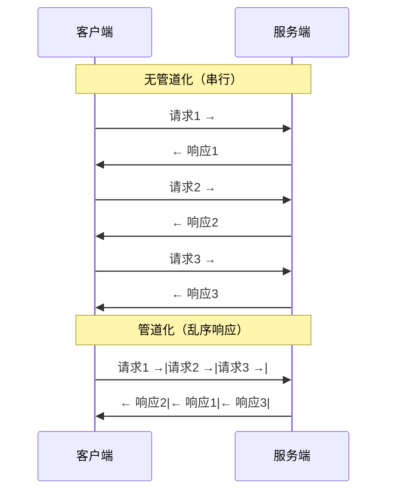
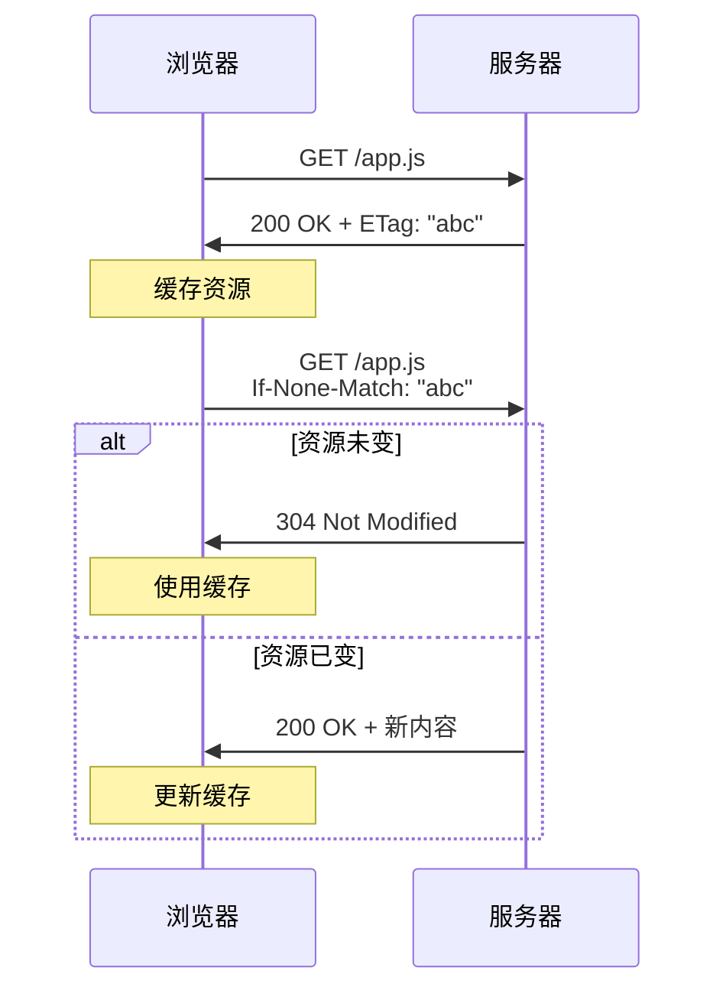
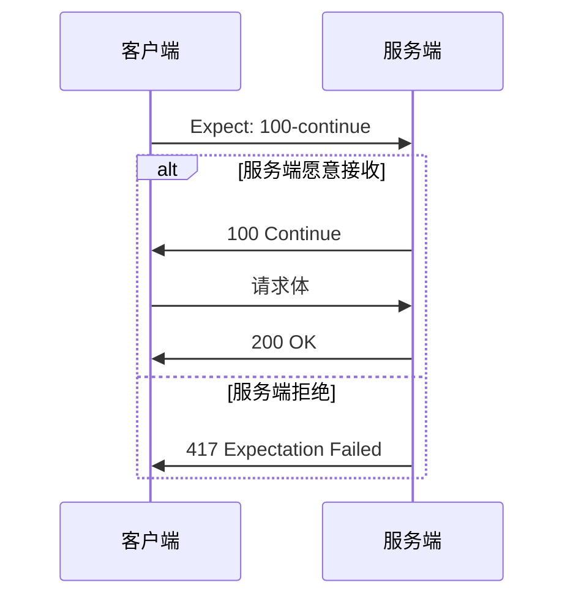

# HTTP/1.1 特性与性能瓶颈

面试官问：

"你在项目中遇到过网页加载慢的问题吗？怎么排查的？"

小张："压缩资源、减少请求..."

面试官："HTTP/1.1有哪些特性是导致性能问题的根源？"

小张愣了一下："它...是文本协议？"

面试官："那为什么文本协议就成了瓶颈？"

小张答不上来。

【直观类比】

把HTTP/1.1想象成一条**单车道的高速公路**：

- 所有车（请求）只能在这条道上排队
- 每辆车到了收费站（服务器）才能下高速
- 如果前面有辆慢车（响应慢的请求），后面的全得等

这就是HTTP/1.1的核心问题：**并行能力极差**。

## HTTP/1.1核心特性

### 1. 持久连接（Keep-Alive）

HTTP/1.0的痛点：每次请求都要建立TCP连接，三次握手四次挥手，浪费资源。



**HTTP/1.1默认开启Keep-Alive**，一个TCP连接可以处理多个HTTP请求/响应对。

```http
# 请求头中会默认包含
Connection: keep-alive

# 可以主动关闭
Connection: close
```

**但这只是解决了连接复用问题，没有解决"并行"问题**。

### 2. 管道化（Pipelining）

Keep-Alive让连接可复用，但请求还是串行的：等第一个响应回来，才能发第二个请求。

管道化试图解决这个问题：允许客户端不等响应，**一口气发多个请求**。



**问题**：服务端必须按顺序返回响应，因为客户端是根据请求顺序匹配响应的。如果响应2比响应1先回来，客户端会混乱。

**现实**：浏览器默认关闭管道化，因为代理服务器兼容性太差。

### 3. 队头阻塞（Head-of-Line Blocking）

这是HTTP/1.1最致命的问题。

```mermaid
graph LR
    A[请求1] --> B{服务端}
    C[请求2] --> B
    D[请求3] --> B
    
    B -->|响应1| E[正常]
    B -->|响应2| F[等待请求1完成]
    B -->|响应3| G[等待请求1完成]
    
    Note over F,G: 队头阻塞：请求1卡住，后续全部等待
```

**队头阻塞的本质**：第一个请求（队头）没完成之前，后续请求都在等待，哪怕服务端已经处理完了。

:::warning ⚠️
面试官追问"队头阻塞怎么解决"，答案是：**并发连接**（浏览器允许6-8个并发连接）、**资源合并**（雪碧图、文件打包）、**域名分片**。这些"hack"都是因为HTTP/1.1的队头阻塞问题太严重。
:::

### 4. Host头与虚拟主机

HTTP/1.1强制要求请求包含Host头，支持在一台服务器上托管多个网站（虚拟主机）。

```http
GET / HTTP/1.1
Host: www.example.com
```

```http
GET / HTTP/1.1
Host: api.example.com
```

同一个IP和端口，可以根据Host头返回不同网站。

### 5. 缓存新鲜度（Cache-Control）

HTTP/1.1定义了更完善的缓存机制：

```http
# 服务端响应
Cache-Control: max-age=3600        # 缓存有效期（秒）
Cache-Control: no-cache            # 每次都要验证
Cache-Control: no-store            # 不缓存
Cache-Control: private             # 只有浏览器能缓存
Cache-Control: public              # CDN等中间节点也能缓存

ETag: "abc123"                    # 资源版本标识
Last-Modified: Wed, 21 Oct 2015 07:28:00 GMT
```

**验证流程**：



## HTTP/1.1的性能瓶颈

### 瓶颈一：文本协议开销

HTTP/1.1是纯文本协议，每个请求/响应都包含大量重复的头部信息：

```http
GET /api/users HTTP/1.1
Host: api.example.com
User-Agent: Mozilla/5.0...
Accept: */*
Accept-Language: zh-CN,zh;q=0.9
Accept-Encoding: gzip, deflate
Connection: keep-alive
Cookie: session_id=xxx; user_pref=yyy
Referer: https://example.com/page
Cache-Control: no-cache
```

假设Cookie有2KB，每个请求都要带着走。这就是为什么移动端对文本协议深恶痛绝。

### 瓶颈二：并发连接数限制

浏览器对单个域名的并发连接数有限制（通常6-8个）。

**为什么限制？**：
- 服务器承受不住无限并发
- 网络带宽固定，多了也快不了

**常见的"绕限制"方法**：

```javascript
// 域名分片：把资源分布在多个子域名
// www.example.com -> static1.example.com, static2.example.com, static3.example.com
```

### 瓶颈三：明文传输

HTTP/1.1没有加密，所有的请求/响应都是明文。

这意味着：
- 内容可被中间人篡改
- Cookie可被窃取
- 请求内容可被窥探

:::tip 💡
面试官问"HTTP/1.1和HTTPS的区别"，答案是：HTTPS = HTTP + TLS。HTTP/1.1本身不加密，是TLS层在加密。HTTP/2可以在TLS上运行，也可以在TCP上运行（但浏览器只支持TLS）。
:::

### 瓶颈四：无法主动推送

HTTP/1.1是"请求-响应"模式，服务端不能主动推送数据。

**解决方案**（在HTTP/1.1时代）：
- 轮询：定时发请求
- 长轮询：请求挂起，有数据再返回
- WebSocket：建立双向通道

## 边界与特例

### 1. Connection: keep-alive的隐含问题

Keep-Alive不是银弹：

```bash
# 超时时间（服务器配置）
KeepAliveTimeout 5

# 最大请求数（Apache）
MaxKeepAliveRequests 100
```

如果服务端响应慢，连接会一直占用，后面的请求只能排队。

### 2. 分块传输编码（Chunked Transfer）

HTTP/1.1支持流式响应，不需要知道内容长度：

```http
HTTP/1.1 200 OK
Transfer-Encoding: chunked

# 响应体
7\r\n
Mozilla\r\n
B\r\n
Developer\r\n
0\r\n
\r\n
```

每个块前面有16进制长度，最后以`0\r\n\r\n`结束。

### 3. 100 Continue

客户端可以先发请求头，确认服务端愿意接收后再发body：



**典型场景**：上传大文件，避免浪费带宽。

## 常见误区

### 误区一：HTTP/1.1支持并行请求

**错！** HTTP/1.1支持的是**并发连接**（多个TCP连接），不是**并行请求**。

每个TCP连接内部，请求还是串行的。多开连接是"作弊"，不是HTTP/1.1本身的特性。

### 误区二：Keep-Alive连接不会断开

**错！** Keep-Alive有超时限制，通常是几秒钟到几分钟不等。

如果在这个时间内没有请求，连接会自动关闭。

### 误区三：HTTP/1.1是安全的

**错！** HTTP/1.1本身没有加密机制。安全是TLS层提供的，不是HTTP协议的一部分。

### 误区四：Gzip压缩解决了文本协议开销

**部分对**。Gzip压缩了body，但header还是明文。每个请求的header还是原样传输。

## 记忆技巧

### HTTP/1.1核心特性

> "长连、管道、分块、虚拟、缓存"
> - 长连：Keep-Alive复用TCP
> - 管道：允许一口气发请求（但很少用）
> - 分块：流式响应
> - 虚拟：Host头支持虚拟主机
> - 缓存：Cache-Control + ETag

### 性能瓶颈口诀

> "文本开销大，并发有限制，明文不安全，队头阻塞死"
> - 文本协议header大
> - 浏览器并发限制
> - 没有加密
> - 队头阻塞

### HTTP/1.x版本演进

> "0.9看HTML，1.0标准出，1.1完善好"
> - HTTP/0.9：只有GET和HTML
> - HTTP/1.0：引入请求头/响应头、MIME类型
> - HTTP/1.1：长连接、缓存、虚拟主机、分块传输

## 实战检验

### 自测题一

**问题**：为什么浏览器要限制单个域名的并发连接数？

**解析**：
1. TCP连接本身有开销（内存、CPU）
2. 网络带宽有限，多了反而抢带宽
3. 服务器承受不住无限并发
4. 防止DDoS攻击

实际解决方法是域名分片，把资源分散到多个子域名。

### 自测题二

**问题**：Cookie过大会影响什么？

**解析**：
1. 每个HTTP请求都要带上Cookie，不管是否需要
2. Cookie是明文传输（除非HTTPS）
3. 如果Cookie有10KB，100个请求就是1MB额外开销
4. 移动端尤其敏感，浪费流量和电池

### 自测题三

**问题**：生产环境如何排查HTTP/1.1性能问题？

**解析**：

```bash
# 查看请求瀑布图（Chrome DevTools）
# 观察：哪个请求慢、是否有队头阻塞

# 查看请求头大小
curl -I https://example.com

# 查看连接是否复用
curl -v https://example.com

# 检查是否开启压缩
curl -H "Accept-Encoding: gzip" -I

# 检查Keep-Alive配置
curl -I --http1.1 https://example.com
```

---

| 级别 | 考察重点 | 期望回答 | 判分标准 |
|------|----------|----------|----------|
| P5 | 基本特性名称 | 能说出Keep-Alive、管道化、队头阻塞 | 死记硬背 |
| P6 | 性能瓶颈分析 | 能解释队头阻塞原因、Cookie开销 | 理解机制 |
| P7 | 优化方案 | 能说出域名分片、资源合并、升级HTTP/2 | 有实战经验 |
