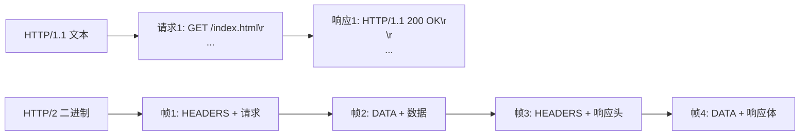
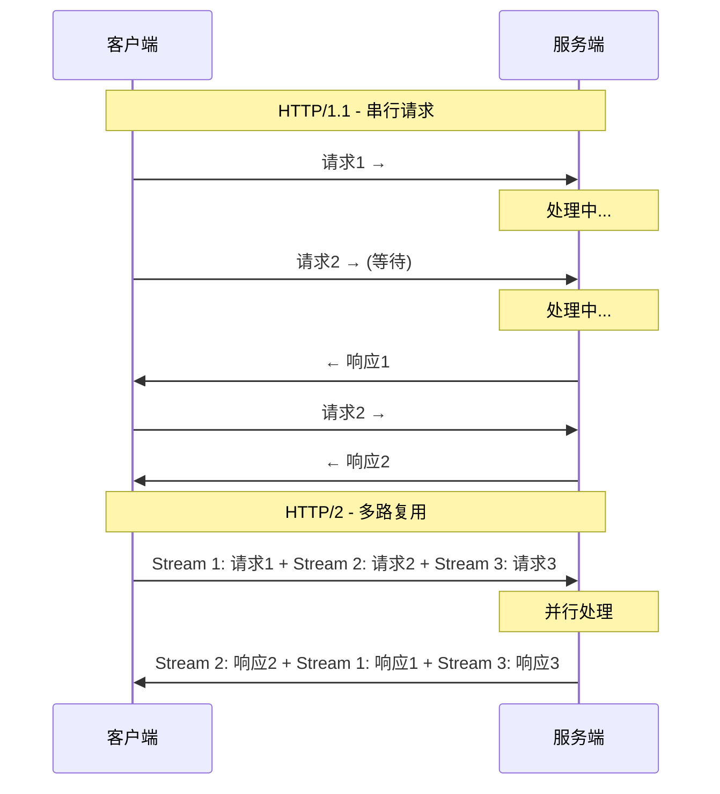
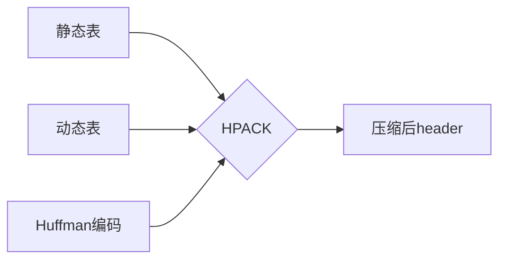
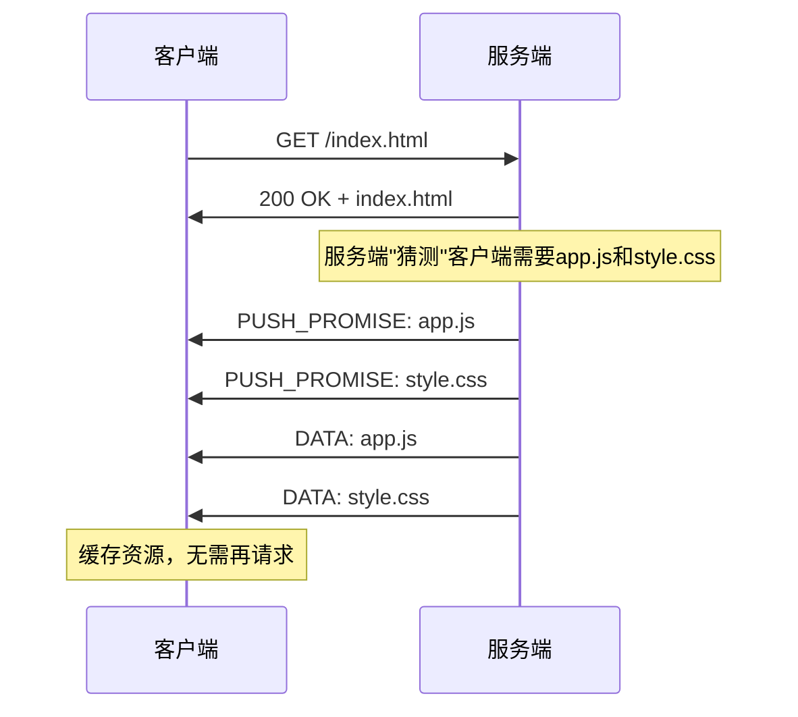
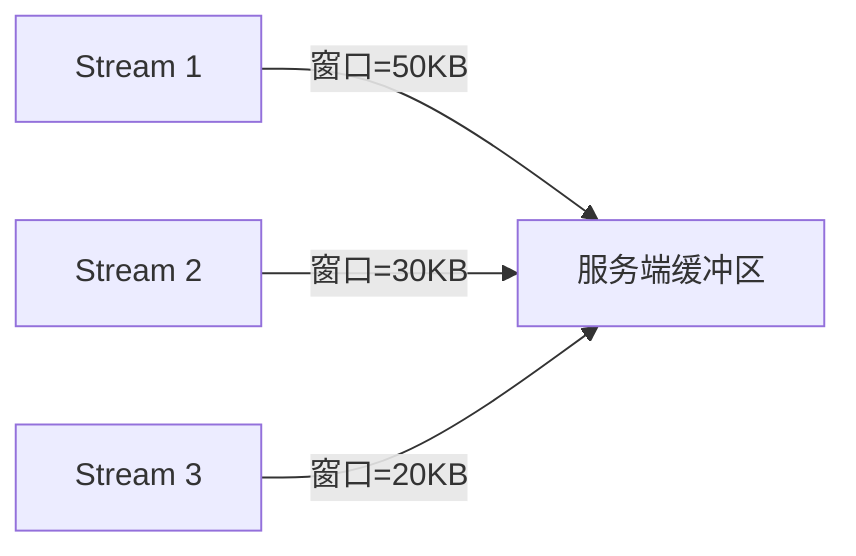
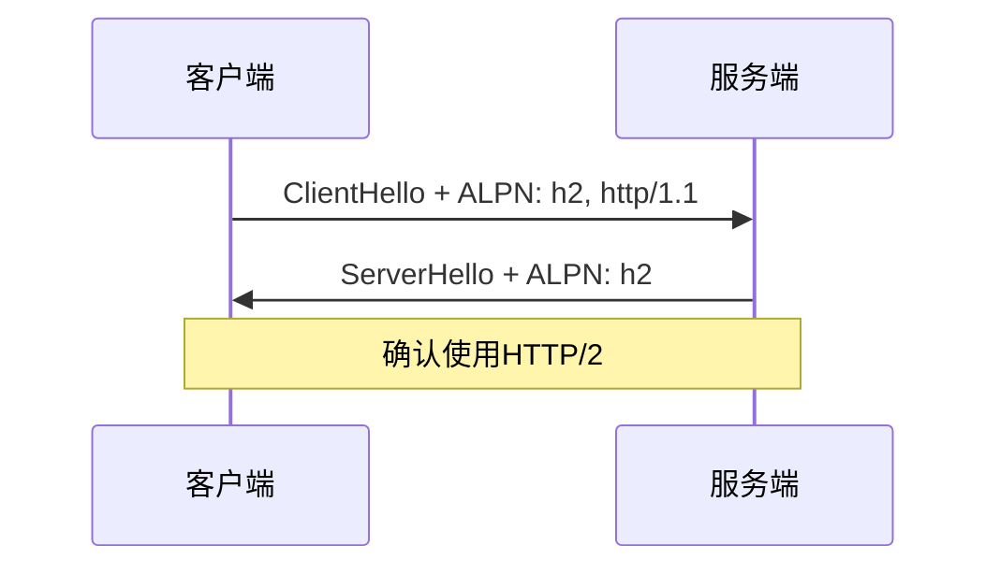
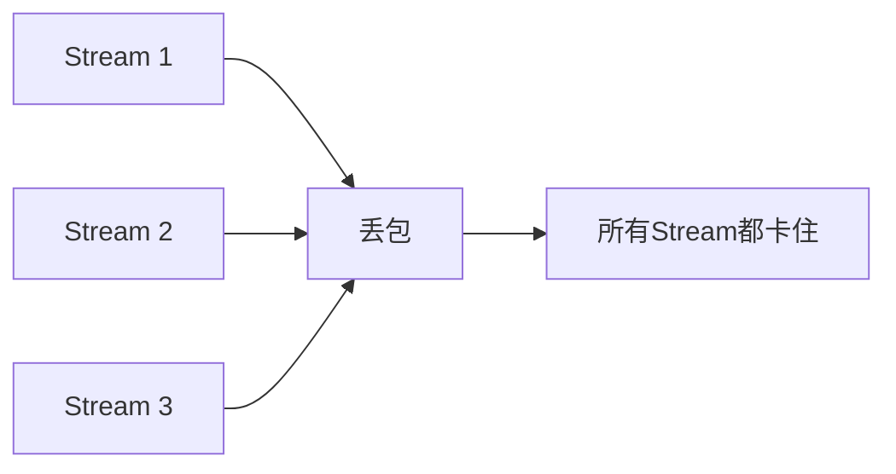

# HTTP/2 多路复用与头部压缩

小张在面试字节，面试官问：

"HTTP/2相比HTTP/1.1最大的改进是什么？"

小张："多了个2。"

面试官："...那多路复用是什么？"

小张："可以并行发请求？"

面试官追问："那为什么HTTP/1.1不能并行？HTTP/2是怎么实现的？"

小张支支吾吾答不上来。

【直观类比】

把HTTP/1.1想象成**只有一个收费站的单车道高速**：

- 所有车必须排队过这一个站
- 如果前面的车（慢请求）卡住了，后面全等

把HTTP/2想象成**同一个收费站的多车道高速**：

- 每个请求是一个车道，互不干扰
- 慢请求不影响快请求
- 而且每个车道还有**数据压缩器**，减少车辆重量

## HTTP/2核心特性

### 1. 二进制分帧（Binary Framing）

HTTP/1.x是**文本协议**，解析困难。HTTP/2把数据切成**二进制帧**。



**帧类型**：

| 帧类型 | 作用 |
|--------|------|
| DATA | 传输数据（请求/响应体） |
| HEADERS | 传输头部 |
| SETTINGS | 连接参数 |
| WINDOW_UPDATE | 流量控制 |
| RST_STREAM | 错误/取消 |

**为什么用二进制？**

1. **解析效率高**：直接按位读取，不用字符串解析
2. **可靠性高**：文本解析有二义性，二进制没有
3. **紧凑**：同样内容，二进制更小

### 2. 多路复用（Multiplexing）

这是HTTP/2的**核心杀招**。

**HTTP/1.1的问题**：队头阻塞。一个TCP连接内，请求必须串行。

**HTTP/2的解决**：在同一个TCP连接上，通过Stream ID区分不同的请求/响应，互不干扰。



**帧结构**：

```
+---------------+
| Length (24)   |  帧长度
+---------------+
| Type (8)      |  帧类型
| Flags (8)     |  标志位
+---------------+
| R| Stream ID (31) |  Stream标识
+---------------+
| Frame Payload  |  帧载荷
```

**Stream ID的作用**：同一个TCP连接内，每个请求/响应对应一个唯一ID，客户端和服务端各维护一个Stream表。

:::tip 💡
面试官追问"HTTP/2解决了TCP的队头阻塞吗"，答案是：**没有**。HTTP/2解决的是**HTTP层的队头阻塞**。TCP层面，一个丢包还是会影响整个TCP连接（所有Stream）。这就是HTTP/3改用QUIC的原因。
:::

### 3. 头部压缩（HPACK）

HTTP/1.x的header是纯文本，每个请求都带着大量重复信息：

```http
GET /api/users HTTP/1.1
Host: api.example.com
User-Agent: Mozilla/5.0 (Macintosh; Intel Mac OS X 10_15_7)
Accept: application/json
Authorization: Bearer xxx
Cookie: session_id=abc123
Referer: https://example.com
```

假设：Cookie有2KB，User-Agent有500字节。100个请求 = 250KB的重复header。

**HPACK压缩方案**：



**1. 静态表**：预定义常用的header name和value

| Index | Header Name | Header Value |
|-------|-------------|--------------|
| 1 | :method | GET |
| 2 | :method | POST |
| 3 | :scheme | http |
| 4 | :scheme | https |
| 5 | :status | 200 |
| 6 | :status | 204 |
| ... | ... | ... |

**2. 动态表**：记录本次连接中出现过的header

如果第一次请求发送了`Cookie: session_id=abc`，动态表会增加一条记录，后续请求只需发送索引。

**3. Huffman编码**：高频字符用更少的位表示

```javascript
// Huffman编码示例
// 普通ASCII：'a' = 01100001 (8位)
// Huffman：'a' = 0 (1位)

"Authorization: Bearer xxx"
// Huffman编码后可能只有20-30位
```

**压缩效果**：

```bash
# 压缩前：Cookie + User-Agent ≈ 2.5KB
# 压缩后：动态表索引 + Huffman ≈ 50-100字节
# 压缩率：约95%
```

### 4. 服务器推送（Server Push）

HTTP/1.x是"请求-响应"模式。HTTP/2允许服务端**主动推送**资源。



**使用场景**：

```javascript
// Nginx配置server push
location / {
    http2_push /style.css;
    http2_push /app.js;
    http2_push /logo.png;
}
```

**问题**：服务端推送会增加带宽消耗。如果客户端已经缓存了，推送就是浪费。

### 5. 流控制（Stream Control）

HTTP/2在应用层实现了流控制，不像TCP那样是整条连接级别的。



**每条Stream有独立的窗口**，可以精细控制每条流的流量。

## HTTP/2的伪头（伪头部）

HTTP/2没有请求行和状态行，用伪头部代替：

```http
# HTTP/1.1
GET /api/users HTTP/1.1
Host: api.example.com
HTTP/1.1 200 OK

# HTTP/2
HEADERS
:method = GET
:path = /api/users
:scheme = https
:authority = api.example.com

# 响应
:status = 200
```

## HTTP/2的握手过程

### ALPN协商

HTTP/2在TLS握手时通过ALPN（Application-Layer Protocol Negotiation）协商协议：



**Nginx启用HTTP/2**：

```nginx
server {
    listen 443 ssl http2;
    ssl_certificate cert.pem;
    ssl_certificate_key key.pem;
}
```

## 边界与特例

### 1. HTTP/2并不总是更快

以下场景HTTP/2可能更慢：

| 场景 | 原因 |
|------|------|
| 小文件、低并发 | TLS握手+HPACK开销 > HTTP/1.1优势 |
| 高丢包率网络 | TCP层队头阻塞严重 |
| 服务器配置差 | CPU消耗更高 |

:::warning ⚠️
面试官追问"HTTP/2在什么场景下比HTTP/1.1慢"，答案是：网络质量差（丢包多）、小文件（压缩收益低）、单连接场景。HTTP/2适合高延迟、多资源的场景。
:::

### 2. TCP队头阻塞依然存在

HTTP/2用多路复用解决了HTTP层的队头阻塞，但TCP层的问题还在：



如果Stream 1丢了一个包，TCP需要重传。这个过程中，Stream 2和Stream 3的数据虽然没丢，但必须等重传完成才能交付给应用层。

**这就是HTTP/3选择QUIC的原因**：QUIC在用户态实现可靠传输，单Stream丢包不影响其他Stream。

### 3. 浏览器限制

浏览器对HTTP/2的并发Stream数有限制：

| 浏览器 | 最大并发Stream |
|--------|---------------|
| Chrome | 100 |
| Firefox | 100 |
| Safari | 50 |

实际很少达到这个限制。

## 常见误区

### 误区一：HTTP/2不需要合并资源了

**错！** HTTP/2虽然解决了HTTP层的队头阻塞，但：
- TCP层队头阻塞依然存在
- 大量小文件还是需要多次帧封装
- 服务器处理每个Stream也有开销

资源合并（如雪碧图）仍然有收益，只是没那么关键了。

### 误区二：HTTP/2是明文的

**错！** 浏览器只支持基于TLS的HTTP/2（h2）。虽然HTTP/2规范支持明文（h2c），但没有浏览器实现。

### 误区三：多路复用可以无限并发

**错！** 受限于：
- TCP拥塞控制
- 服务器资源
- 浏览器最大Stream数限制

### 误区四：HPACK是安全可靠的

**不完全对。** HPACK有安全风险：
- 伪头部可以被压缩
- CRIME攻击利用HPACK压缩
- 后续引入Dynamic Table Size Limit来缓解

## 记忆技巧

### HTTP/2核心特性口诀

> "二进制分帧，多路复用香，头部压缩强，推送不用等"
> - 二进制：帧结构
> - 多路复用：一条TCP，多个Stream
> - 头部压缩：HPACK静态表+动态表+Huffman
> - 推送：服务端主动推送

### 帧类型速记

> "HEADERS管头，DATA管体，SETTINGS管配置，WINDOW管流量"

### HTTP/2 vs HTTP/1.1

| 维度 | HTTP/1.1 | HTTP/2 |
|------|----------|--------|
| 传输格式 | 文本 | 二进制帧 |
| 并发 | 多TCP连接 | 单TCP多Stream |
| 队头阻塞 | 有 | 有（TCP层） |
| Header压缩 | 无 | HPACK |
| 服务器推送 | 无 | 有 |

## 实战检验

### 自测题一

**问题**：为什么HTTP/2需要HPACK压缩？HTTP/1.1为什么不压缩header？

**解析**：
1. HTTP/1.1的header是纯文本，每个请求都带着大量重复内容
2. Cookie、User-Agent等header很大，100个请求就是几十KB开销
3. HTTP/1.1时代没有统一的header压缩方案，各家自己搞
4. HPACK是HTTP/2的标配，专为header设计，且安全（防止CRIME攻击）

### 自测题二

**问题**：HTTP/2解决了什么问题？没解决什么问题？

**解析**：
- **解决了**：
  - HTTP层队头阻塞（多路复用）
  - Header重复开销（HPACK）
  - 连接数过多（单连接多Stream）

- **没解决**：
  - TCP层队头阻塞
  - TLS握手延迟（需要1-RTT）
  - 服务器推送带宽浪费

### 自测题三

**问题**：如何判断网站是否使用了HTTP/2？

**解析**：

```bash
# 方法1：Chrome DevTools
# 打开Network面板，看Protocol列显示"h2"就是HTTP/2

# 方法2：curl命令
curl -I --http2 https://example.com

# 方法3：在线工具
# https://http2.pro/

# 方法4：查看ALPN支持
openssl s_client -alpn h2 -connect example.com:443
```

---

| 级别 | 考察重点 | 期望回答 | 判分标准 |
|------|----------|----------|----------|
| P5 | 核心特性名称 | 能说出多路复用、头部压缩 | 死记硬背 |
| P6 | 原理与机制 | 能解释Stream ID、HPACK静态/动态表 | 理解实现 |
| P7 | 局限与演进 | 能说出TCP队头阻塞问题、HTTP/3的改进 | 有全局视野 |
