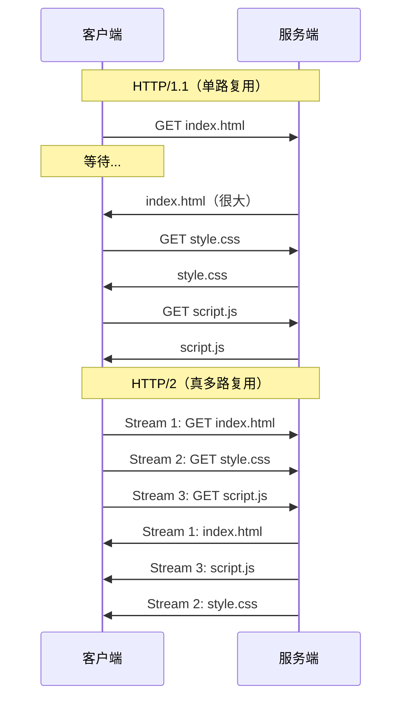

# HTTP/2 多路复用

> 目标级别：P6

面试官问：「HTTP/2 相比 HTTP/1.1 有什么改进？」你回答「多路复用」——然后面试官追问：「多路复用是怎么实现的？」「HPACK 头压缩是怎么回事？」「什么是服务端推送？」

HTTP/2 是 HTTP 协议自 1999 年（HTTP/1.1）以来的首次重大升级，彻底解决了 HTTP/1.1 的队头阻塞问题。

## 快速自测

面试前先问自己这三个问题：

1. **HTTP/2 的多路复用是什么？** 相比 HTTP/1.1 有什么优势？
2. **HPACK 头压缩是怎么工作的？** 为什么需要专门的压缩算法？
3. **HTTP/2 还有哪些新特性？** 服务端推送是怎么工作的？

---

## 一、HTTP/1.1 的问题

### 1.1 队头阻塞（Head-of-Line Blocking）

HTTP/1.1 的持久连接允许复用 TCP 连接，但响应必须按请求顺序返回。如果第一个请求很慢，后续请求都会被阻塞。

```
HTTP/1.1 请求流程：
请求1 → 响应1（慢）
请求2 → 响应2（被迫等待）  // 阻塞
请求3 → 响应3（被迫等待）  // 阻塞
```

### 1.2 解决方案的副作用

为了解决队头阻塞，HTTP/1.1 催生了多个变通方案：

| 方案 | 说明 | 问题 |
|------|------|------|
| 域名分片 | 将资源分散到多个域名 | 增加 DNS 解析，TCP 连接增多 |
| 资源内联 | 小资源内联到 HTML 中 | 无法独立缓存 |
| 雪碧图 | 多张小图合并为一张 | 更新麻烦，缓存粒度大 |
| 文件合并 | 多个文件合并为一个 | 更新导致整体缓存失效 |

这些方案只是**规避**问题，而不是**解决**问题。

---

## 二、HTTP/2 核心特性

### 2.1 二进制分帧（Binary Framing）

HTTP/2 引入二进制分帧层，将所有消息分割成更小的帧，以二进制格式传输。

```
HTTP/1.1：文本协议
GET /index.html HTTP/1.1\r\n
Host: example.com\r\n
\r\n

HTTP/2：二进制帧
[Stream ID: 1][HEADERS frame]
[Stream ID: 1][DATA frame]
```

**帧结构**：

```
+-----------------------------------+
|         Length (24 bits)          |
+---+---+---+---+---+---+---+-------+
|R|W|E|         Stream (7)          |
+---+---+---+---+---+---+---+-------+---+
|    Type (8)       |   Flags (8)         |
+-------------------+---------------------+
|                Stream ID (31)          |
+---------------------------------------+
|               Payload ...             |
+---------------------------------------+
```

| 字段 | 说明 |
|------|------|
| Length | 帧长度（24 位，最大 2^24 - 1 = 16MB） |
| Type | 帧类型（DATA, HEADERS, SETTINGS 等） |
| Flags | 标志位（END_STREAM, END_HEADERS 等） |
| Stream ID | 流标识符（31 位，0 表示控制帧） |

### 2.2 多路复用（Multiplexing）

多路复用是 HTTP/2 最重要的特性。它允许在同一个 TCP 连接上并行传输多个请求和响应，互不阻塞。



**工作原理**：

1. 每个请求/响应称为一个**流（Stream）**
2. 每个流有唯一的 Stream ID
3. 消息被分割成多个**帧（Frame）**
4. 不同流的帧可以**交错**传输
5. 接收端根据 Stream ID **组装**消息

```
交错传输示例：
Stream 1 的 HEADERS 帧
Stream 2 的 HEADERS 帧
Stream 1 的 DATA 帧
Stream 3 的 HEADERS 帧
Stream 2 的 DATA 帧
Stream 1 的 DATA 帧
...
```

### 2.3 头压缩（HPACK）

HTTP/1.1 每次请求都需要传输大量重复的头部（如 User-Agent、Cookie），造成浪费。

HPACK 是 HTTP/2 专门设计的头部压缩算法。

**压缩策略**：

| 策略 | 说明 |
|------|------|
| 静态表 | 常用头部（Method: GET, :method: GET 等）预定义索引 |
| 动态表 | 同一个连接中出现的头部，维护动态列表 |
| 哈夫曼编码 | 常见字符串使用变长编码（HPACK） |

**静态表示例**：

| 索引 | 头部名称 | 值 |
|------|----------|-----|
| 1 | :method | GET |
| 2 | :method | POST |
| 3 | :scheme | http |
| 4 | :scheme | https |
| ... | ... | ... |

**编码示例**：

```
传统方式：
GET / HTTP/1.1
Host: example.com
User-Agent: Mozilla/5.0
Accept: text/html

HPACK 方式（伪代码）：
[索引 1] GET /  // :method: GET
[索引 4] example.com  // Host
[引用] User-Agent
[引用] Mozilla/5.0
[索引 36] text/html  // Accept
```

**通过索引引用而非完整传输**，大幅减少头部大小。

### 2.4 服务端推送（Server Push）

HTTP/2 支持服务端推送，���务端可以在客户端请求之前主动推送资源。

```
传统方式：
客户端请求 index.html
服务端返回 index.html（包含 link: style.css, script.js）
客户端发现需要 style.css 和 script.js，再请求
服务端返回 style.css 和 script.js

HTTP/2 服务端推送：
客户端请求 index.html
服务端同时推送 index.html + style.css + script.js
```

**PUSH_PROMISE 帧**：

```
服务端发送 PUSH_PROMISE 帧，声明将要推送的资源
客户端可以选择拒绝（拒绝后不接收）
```

### 2.5 流控制（Stream Control）

HTTP/2 提供流级别的流量控制，与 TCP 的流量控制独立。

```
TCP 流量控制：控制整个连接的发送速率
HTTP/2 流控制：控制每个流的发送速率

应用场景：
- 视频流需要更高的带宽
- 图片请求可以等待
```

---

## 三、HTTP/2 的问题

### 3.1 TCP 队头阻塞

HTTP/2 在 TCP 层面仍然存在队头阻塞：

```
HTTP/2 多路复用：请求/响应不阻塞（应用层）
TCP 层：丢包导致重传，所有流都阻塞（传输层）
```

如果一个 TCP 包丢失，TCP 会重传该包，在重传完成之前，所有 HTTP/2 流都被阻塞。

### 3.2 TLS 连接建立延迟

HTTP/2 建议使用 TLS（浏览器实现必须基于 TLS），TLS 1.2 需要 2-RTT：

```
TLS 1.2 连接建立：
1. 客户端发送 ClientHello
2. 服务端发送 ServerHello + 证书 + KeyExchange
3. 客户端发送 KeyExchange + ChangeCipherSpec
4. 服务端发送 ChangeCipherSpec
→ 2-RTT 才能开始加密通信

TLS 1.3 改善：
1. 客户端发送 ClientHello（包含支持的密码套件）
2. 服务端发送 ServerHello + 证书 + KeyExchange
→ 1-RTT 建立连接
```

---

## 四、面试题精讲

### 🔴 【高频】HTTP/2 多路复用原理

**问题**：请解释 HTTP/2 的多路复用是怎么实现的。

**标准答案**：

```
HTTP/2 的多路复用通过二进制分帧实现：

1. 将消息分割成多个帧（Frame）
2. 每个帧包含流 ID（Stream ID）
3. 不同流的帧可以交错传输
4. 接收端根据 Stream ID 组装消息

关键点：
- 二进制分帧：将文本协议转为二进制协议
- 流（Stream）：每个请求/响应对应一个流
- 帧（Frame）：消息的最小单元
- 交错传输：不同流的帧可以穿插

优势：
- 同一个连接上可以并行传输多个请求/响应
- 不再有 HTTP/1.1 的队头阻塞问题
- 减少 TCP 连接数
```

### 🟡 【中频】HPACK 头压缩

**问题**：HTTP/2 的头压缩是怎么工作的？

**标准答案**：

```
HPACK 是 HTTP/2 专用的头压缩算法，包含三种压缩策略：

1. 静态表
   - 预定义 61 个常用头部（GET、POST、:method 等）
   - 传输时用索引代替完整字符串

2. 动态表
   - 同一个连接中出现的头部维护一个列表
   - 新出现的头部添加到动态表
   - 后续请求可以引用动态表中的条目

3. 哈夫曼编码
   - 常见字符串使用变长编码
   - 减少字符传输的比特数

优势：
- 避免重复传输相同的头部
- 显著减少请求头大小（从几百字节到几字节）
```

### 🟡 【中频】HTTP/2 的问题

**问题**：HTTP/2 解决了 HTTP/1.1 的哪些问题？还有什么问题？

**标准答案**：

```
HTTP/2 解决的问题：

1. 队头阻塞
   - HTTP/1.1：响应必须按顺序返回
   - HTTP/2：不同流交错传输，互不阻塞

2. 重复传输头部
   - HTTP/1.1：每次请求都要传完整头部
   - HTTP/2：HPACK 压缩，大量减少头部大小

3. TCP 连接数过多
   - HTTP/1.1：使用多个连接绕过队头阻塞
   - HTTP/2：一个连接支持多路复用

HTTP/2 遗留的问题：

1. TCP 队头阻塞
   - HTTP/2 应用层无阻塞，但 TCP 层丢包仍会阻塞所有流
   - 丢包率高时性能反而不如 HTTP/1.1

2. TLS 连接建立延迟
   - HTTP/2 基于 TLS，连接建立需要额外 RTT
   - TLS 1.2 需要 2-RTT，TLS 1.3 需要 1-RTT
```

---

## 五、常见陷阱与易错点

### ⚠️ 陷阱一：混淆 HTTP/2 和 HTTP/2 over TLS

HTTP/2 规范允许非加密传输，但所有浏览器实现都只支持 HTTPS 的 HTTP/2。所以实际上 HTTP/2 总是基于 TLS。

### ⚠️ 陷阱二：认为 HTTP/2 不需要压缩

HTTP/2 的多路复用解决的是请求阻塞问题，头压缩解决的是头部重复传输问题。两者是独立的，需要同时启用。

### ⚠️ 陷阱三：忽略 Stream 优先级

HTTP/2 支持设置流的优先级，重要资源（如 HTML）可以优先传输。如果不设置，所有流优先级相同。

### ⚠️ 陷阱四：混淆帧和消息

- **帧（Frame）**：HTTP/2 的最小传输单元
- **消息（Message）**：一个完整的请求或响应
- 一个消息由多个帧组成

---

## 六、对比总结

### HTTP/1.1 vs HTTP/2

| 维度 | HTTP/1.1 | HTTP/2 |
|------|----------|--------|
| 传输格式 | 文本 | 二进制帧 |
| 多路复用 | 不支持（单路） | 支持（真多路复用） |
| 队头阻塞 | 应用层队头阻塞 | 无应用层队头阻塞 |
| 头部压缩 | 无 | HPACK |
| 服务端推送 | 不支持 | 支持 |
| 流优先级 | 不支持 | 支持 |
| TLS 强制要求 | 否 | 浏览器强制要求 |

### HTTP/2 vs HTTP/3

| 维度 | HTTP/2 | HTTP/3 |
|------|--------|--------|
| 传输层 | TCP | QUIC（基于 UDP） |
| 连接建立 | TCP + TLS | QUIC 内置加密 |
| 队头阻塞 | TCP 层队头阻塞 | 无（QUIC 层独立） |
| 连接迁移 | 不支持 | 支持（切换网络保持连接） |

---

## 七、扩展思考

### 💡 加分话题：Stream 优先级

HTTP/2 支持设置流的优先级：

```
优先级高的流先传输
例如：
- 主页面 HTML（高优先级）
- CSS（高优先级）
- 图片（低优先级）
- 分析脚本（低优先级）
```

### 💡 加分话题：HTTP/2 服务器推送实现

```nginx
# Nginx 配置 HTTP/2 服务端推送
server {
    http2_push_preload on;
}

# 或者手动推送
add_header Link "</style.css>; rel=preload; as=style" preload;
```

### 💡 加分话题：HTTP/2 伪头

HTTP/2 没有请求行和状态行，使用伪头（pseudo-header）：

```
HTTP/1.1：
GET / HTTP/1.1
Host: example.com

HTTP/2：
:method: GET
:path: /
:scheme: https
:authority: example.com
```

> HTTP/2 解决了 HTTP/1.1 的核心痛点：队头阻塞和头部冗余。但它没有解决 TCP 层面的队头阻塞问题，这个问题最终要靠 HTTP/3 基于 QUIC 协议来解决。