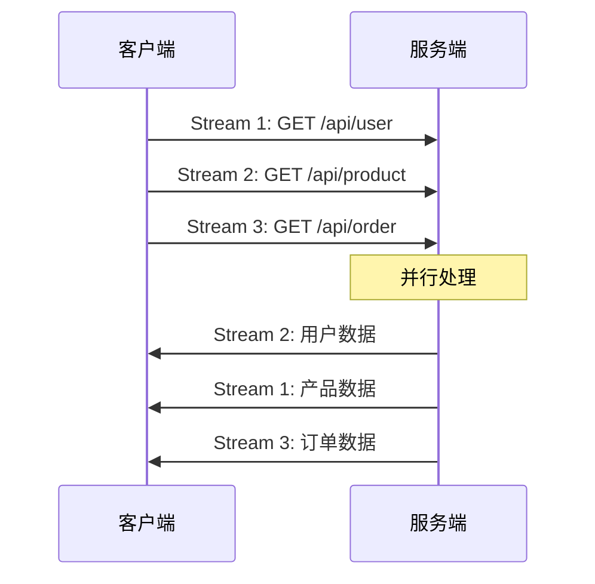
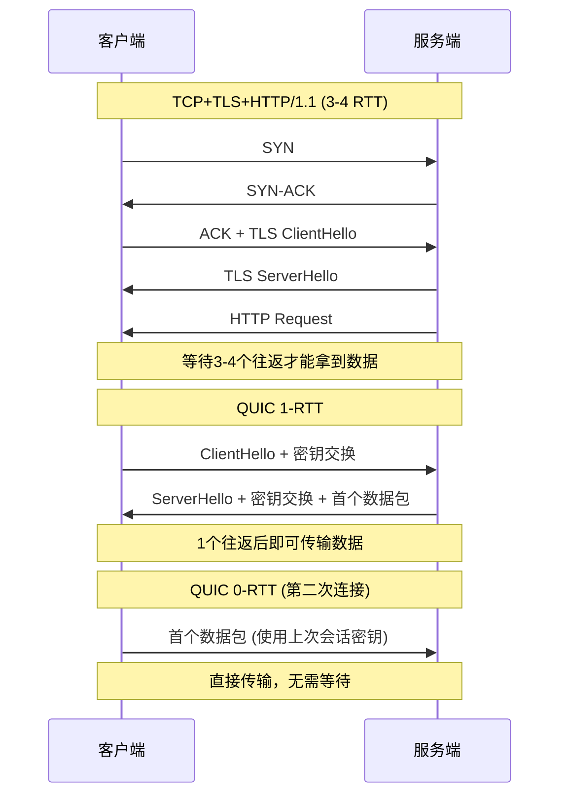
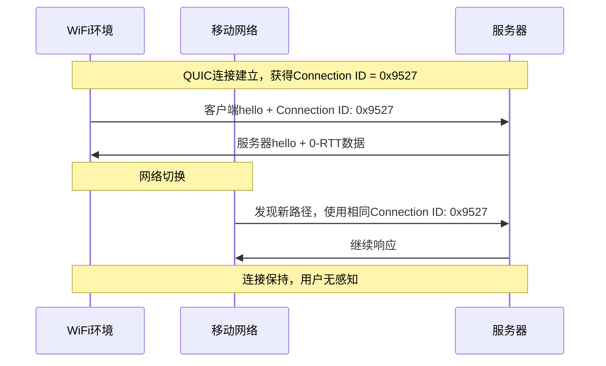
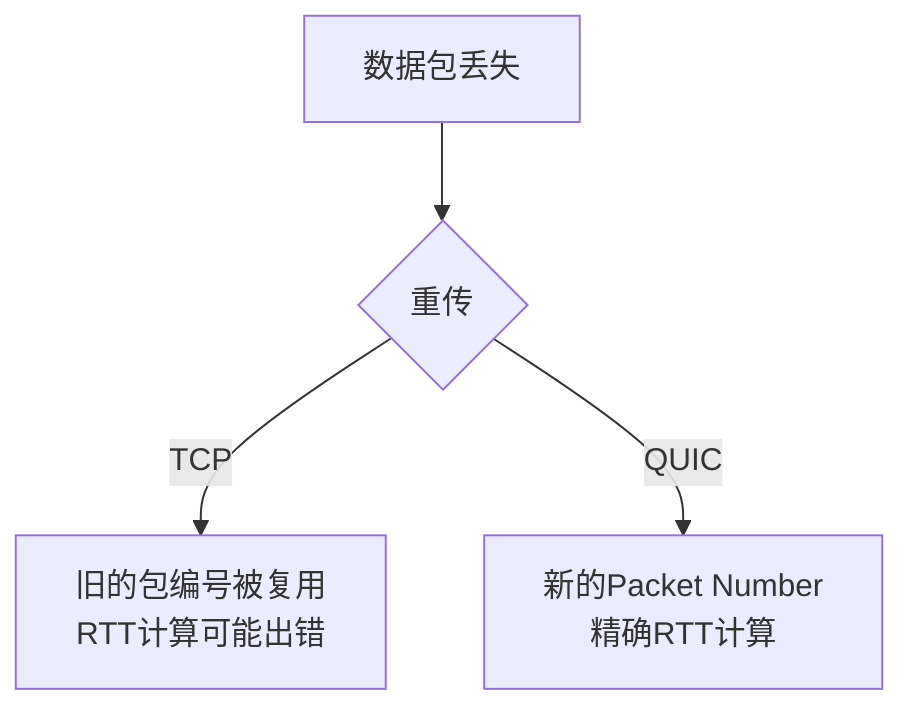
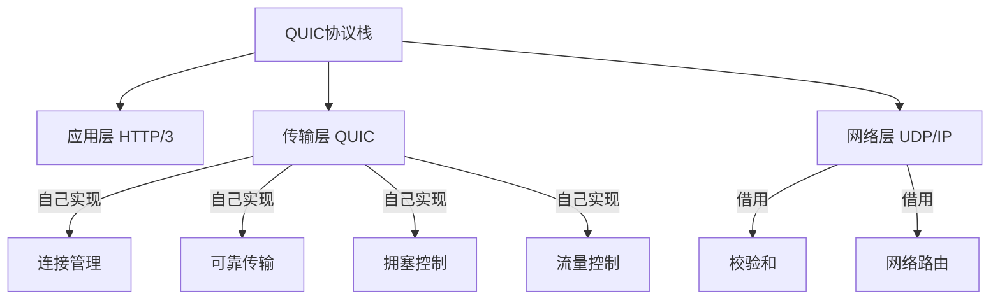

# HTTP/3 QUIC协议

小李在面试一家做实时通信的公司，面试官问：

"你们平时用UDP做音视频传输，知道为什么Google要基于UDP搞一个新的QUIC协议吗？"

小李："因为UDP快？"

面试官追问："那为什么不用UDP直接跑HTTP？"

小李："...因为UDP不可靠？"

面试官："那QUIC怎么保证可靠性的？"

小李彻底卡住。

【直观类比】

把TCP连接想象成**一条固定的电话线路**：

- 通话前必须拨号等待接通
- 通话中如果信号不好，声音会"卡住"等你重说
- 你从家里走到公司，电话就断了

把QUIC想象成**微信语音通话**：

- 接通很快，不需要漫长的等待
- 网络不好时，只会丢失当前数据包，不会"卡住"整条通话
- 你从WiFi切换到4G，通话继续，完全无感

TCP的问题，QUIC用用户态的方法解决了。

## 从一个问题开始

HTTP/2引入了多路复用，解决了HTTP层的队头阻塞问题。但面试官最爱追问的下一句是：

"HTTP/2解决了TCP的队头阻塞吗？"

答案是：**没有。**

这个问题要从HTTP协议演进说起。

## HTTP协议的演进之路

### HTTP/1.0：单请求-单响应

最早的HTTP非常简单：客户端发请求，服务器返回响应，连接关闭。

每个请求都要重新建立TCP连接，SSL还要再来一次。网页一张图要一个来回，加载10张图就要折腾20次握手。

**这个时代的网页很简单，没有多少资源要加载。**

### HTTP/1.1：持久连接与管道化

HTTP/1.1引入了`Connection: keep-alive`，复用TCP连接。但问题来了：

```mermaid
graph LR
    A[请求1] --> B{排队等待}
    C[请求2] --> B
    D[请求3] --> B
    
    B --> E["响应1 (慢)"
    subgraph 慢请求阻塞
        F["响应2 (快)"]
        G["响应3 (快)"]
    end]
```

**队头阻塞**：第一个请求慢，后面所有的请求都要等着。这就是著名的HOL（Head of Line）阻塞问题。

为了解决这个问题，前端工程师发明了"资源合并"：雪碧图、把CSS/JS打包、data URI内联。都是被逼出来的招数。

### HTTP/2：多路复用

HTTP/2用Stream ID在同一个TCP连接里并行传输多个请求/响应：



HTTP/2解决了吗？**部分解决。**

解决了应用层的队头阻塞。但TCP层的队头阻塞依然存在：

```mermaid
graph LR
    A[Stream 1] -->|帧1-帧5| B[TCP层]
    C[Stream 2] -->|帧A-帧D| B
    D[Stream 3] -->|帧①-帧③| B
    
    B -->|丢包| E[重传Stream 1的帧3]
    
    E --> F["所有Stream卡住等待"
    subgraph TCP重传阻塞
        G["Stream 2: 已收到但不能交付"]
        H["Stream 3: 已收到但不能交付"]
    end]
```

Stream 1丢了一个包？对不起，Stream 2和Stream 3的数据虽然已经收到，但TCP不敢交给应用层，因为要保证顺序。

**这就是HTTP/2的阿喀琉斯之踵。**

### HTTP/3：另起炉灶

2013年，Google公开了QUIC协议。2018年，QUIC正式被标准化为HTTP/3。

QUIC的核心思路是：**既然TCP改不动，那就绕过它。**

## QUIC协议核心优势

### 1. 0-RTT/1-RTT连接建立

TCP需要3次握手，如果用TLS还要再加1-2个RTT。HTTPS一次完整的连接建立：

```
TCP握手: 1-RTT
TLS握手: 1-2-RTT
HTTP请求: 1-RTT
--------
总计: 3-4-RTT
```

QUIC把连接建立和加密握手合并，最快可以0-RTT开始传输数据。



**0-RTT的前提**：客户端之前连接过服务器，缓存了会话密钥。

:::tip 💡
第一次连接：1-RTT（密钥交换必须）
第二次连接：0-RTT（复用缓存密钥）
这就是QUIC握手能做到"秒开"的原因。
:::

### 2. 真正的无队头阻塞

这是QUIC最核心的改进。

TCP的可靠传输是**连接级别**的。丢一个包，整条连接等重传。

QUIC的可靠传输是**Stream级别**的。每个Stream独立编号，丢包只影响当前Stream：

```mermaid
graph LR
    A[Stream 1] -->|数据包1-5| B[QUIC层]
    C[Stream 2] -->|数据包A-D| B
    D[Stream 3] -->|数据包①-③| B
    
    B -->|数据包3丢失| E["Stream 1等待重传"
    style E fill:#ffcccc
    
    B -->|数据包A-D正常| F["Stream 2立即交付
    style F fill:#ccffcc
    
    B -->|数据包①-③正常| G["Stream 3立即交付
    style G fill:#ccffcc
```

数据包3丢了？Stream 1重传。Stream 2和Stream 3的数据已经到了，直接交给应用层。

**这是QUIC真正解决TCP队头阻塞的地方。**

### 3. 连接迁移（Connection Migration）

TCP用四元组（源IP、源端口、目标IP、目标端口）标识连接。手机从WiFi切换到4G，IP地址变了？连接断。

QUIC用**连接ID**标识连接：



手机从办公室WiFi走到地铁4G？Connection ID不变，连接继续。看视频、打游戏完全无感。

### 4. 丢包检测与拥塞控制优化

TCP的拥塞控制是在内核实现的，改不了。

QUIC的拥塞控制是在用户态实现的，想怎么改就怎么改。

**更细粒度的拥塞控制**：

| 特性 | TCP | QUIC |
|------|-----|------|
| 拥塞控制 | 内核实现 | 用户态实现 |
| 包编号 | 重传后编号复用 | 递增Packet Number，避免歧义 |
| 延迟ACK | 可能误判 | 更精确的RTT计算 |
| 恢复策略 | 受限于内核 | 可定制 |



**TCP的隐式编号**：包丢了，重传的编号和原来一样，无法区分是旧包还是新包。

**QUIC的显式编号**：每个包都有唯一的递增编号，RTT计算更准确。

## 与TCP/UDP的关系

这是最容易被问懵的问题。

### QUIC是什么？

QUIC = UDP +可靠机制 + TLS + HTTP



### 为什么选UDP？

| 考量 | TCP | UDP | QUIC选择 |
|------|-----|-----|----------|
| 穿越NAT | 成熟 | 简单 | UDP |
| 内核绕过 | 不行 | 可以 | 选择UDP |
| 可靠传输 | 内置 | 无 | 自己实现 |
| TLS | openssl | 无 | 自己实现 |
| 拥塞控制 | 内置 | 无 | 自己实现 |

**核心原因**：TCP在内核，改不了。UDP在内核，但功能少，正好用来"白手起家"。

:::warning ⚠️
QUIC不是替代TCP的。QUIC是运行在UDP之上的"新TCP"。它的目标是解决TCP在现代互联网中的痛点，但在某些场景下TCP仍然更合适。
:::

### QUIC vs TCP对比

|| TCP | QUIC |
|------|-----|------|
| 传输层 | 内核 | 用户态 |
| 协议头 | 固定 | 可扩展 |
| 队头阻塞 | TCP层有 | Stream层独立，无 |
| 连接迁移 | 不支持 | 支持 |
| 拥塞控制 | 内核固定 | 用户态可定制 |
| 握手延迟 | 1-RTT + TLS 1-2RTT | 0-1-RTT |
| NAT穿透 | 成熟 | 需额外处理 |

## 边界与特例

### 1. QUIC的0-RTT不是万能的

0-RTT有安全风险：重放攻击。

攻击者截获0-RTT数据包，可能让服务器重复执行操作。

**解决方案**：0-RTT只能传输幂等数据（如GET请求），不能传输非幂等操作（如POST提交）。

### 2. 中间设备兼容性问题

TCP经过几十年打磨，所有路由器、防火墙都认识它。

QUIC太新，部分网络设备会：

- 丢UDP包（防火墙规则）
- 限速UDP流量
- 不认识QUIC包头，导致解密失败

Chrome的做法是：**如果QUIC建立连接失败，自动回退到HTTP/2。**

### 3. 手机耗电问题

QUIC的ACK机制比TCP更细粒度。在移动设备上，可能比TCP更耗电。

**这是为什么移动端HTTP/3的收益没有桌面端明显的原因。**

### 4. 服务器资源消耗

QUIC需要在用户态维护连接状态，相比TCP在内核实现，消耗更多CPU和内存。

高并发场景下，QUIC的服务器成本比TCP高。

## 常见误区

### 误区一：QUIC是TCP的替代品

**错。** QUIC解决的是TCP在特定场景下的问题，不是全面替代。在可靠传输、顺序保证等基础能力上，TCP依然是最优选择。

### 误区二：UDP不可靠，QUIC也不可靠

**错。** QUIC虽然基于UDP，但实现了完整的可靠传输机制：序号、确认、重传、拥塞控制。**QUIC比TCP更可靠。**

### 误区三：QUIC不需要TLS

**错。** QUIC强制使用TLS 1.3加密。QUIC packet payload是加密的，只有Connection ID等元数据是明文。

### 误区四：HTTP/3一定比HTTP/2快

**不一定。** QUIC的收益在：
- 高延迟网络（如移动网络）
- 高丢包率环境
- 需要连接迁移的场景

在低延迟、稳定的WiFi环境下，HTTP/2可能更省资源。

:::tip 💡
HTTP/3的价值不是"更快"，而是"更稳定"。在真实网络环境下，QUIC的连接迁移和无队头阻塞特性让用户体验更一致。
:::

## 记忆技巧

### QUIC三大核心优势口诀

> "快连0-RTT，无阻多路用，迁移不断线"
>
> - 快连：0-RTT/1-RTT连接建立
> - 无阻：Stream级别无队头阻塞
> - 迁移：连接迁移保持连接

### QUIC vs TCP对比口诀

> "TCP在内核卡死，QUIC用户态自由"
>
> - 内核改不了 → TCP限制多
> - 用户态随便改 → QUIC更灵活

### HTTP版本演进口诀

> "HTTP/1排队等，HTTP/2分帧用，HTTP/3 QUIC通"
>
> - HTTP/1.1：队头阻塞，资源合并
> - HTTP/2：多路复用，但TCP层阻塞
> - HTTP/3：Stream级无阻塞，连接迁移

## 实战检验

### 自测题一

**问题**：QUIC如何解决TCP的队头阻塞问题？

**解析**：
1. TCP的可靠传输是连接级别的，丢包影响整条连接
2. QUIC的可靠传输是Stream级别的，丢包只影响当前Stream
3. 不同Stream可以独立传输、互不等待
4. Stream 1丢包重传时，Stream 2、Stream 3的数据已到即可交付

### 自测题二

**问题**：为什么QUIC选择基于UDP而不是TCP？

**解析**：
1. TCP在内核实现，无法定制和优化
2. UDP在内核实现简单，正好用来"白手起家"
3. QUIC可以自己实现可靠传输、拥塞控制、TLS
4. 可以绕过内核，实现用户态的灵活控制

### 自测题三

**问题**：QUIC的0-RTT有什么限制？

**解析**：
1. 首次连接必须1-RTT，0-RTT需要之前缓存的密钥
2. 0-RTT只能传输幂等数据
3. 存在重放攻击风险

### 自测题四

**问题**：HTTP/3一定比HTTP/2好吗？

**解析**：
- 不一定。HTTP/3的优势在于：
  - 高延迟场景（移动网络）
  - 高丢包环境
  - 需要连接迁移的场景
- 在低延迟稳定网络下，HTTP/2更省资源
- 实际部署需要测试验证

---

| 级别 | 考察重点 | 期望回答 | 判分标准 |
|------|----------|----------|----------|
| P5 | QUIC基于UDP | 能说出QUIC在UDP之上实现可靠传输 | 基础概念 |
| P6 | 核心优势原理 | 能解释队头阻塞解决、连接迁移原理 | 深度理解 |
| P7 | 演进与权衡 | 能对比TCP/UDP，分析适用场景与局限 | 全局视野 |
