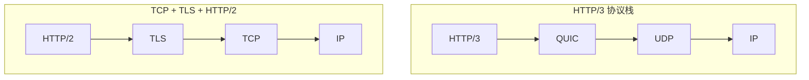
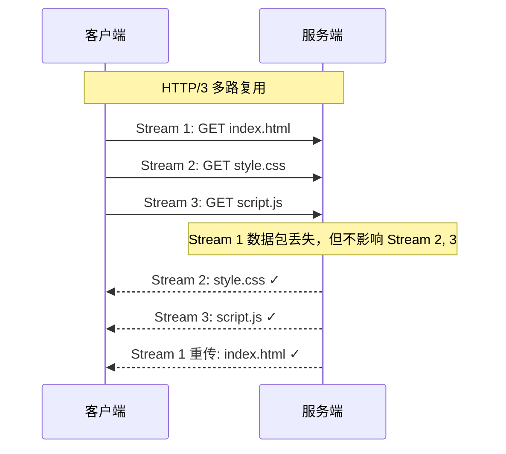

# HTTP/3 QUIC协议

> 目标级别：P6

面试官问：「HTTP/3 相比 HTTP/2 有什么改进？」你回答「基于 QUIC 协议」——然后面试官追问：「QUIC 是什么？为什么用 UDP 而不是 TCP？」「HTTP/3 是怎么解决队头阻塞的？」「0-RTT 是怎么实现的？」

HTTP/3 是 HTTP 协议的最新版本，它彻底解决了 TCP 层面的队头阻塞问题。

## 快速自测

面试前先问自己这三个问题：

1. **QUIC 为什么用 UDP 而不是 TCP？** 它在 UDP 之上实现了什么？
2. **HTTP/3 是怎么解决 TCP 队头阻塞的？** 为什么 UDP 可以避免丢包阻塞？
3. **0-RTT 握手是什么？** 它是怎么实现提前发送数据的？

---

## 一、HTTP/3 的诞生背景

### 1.1 HTTP/2 的遗留问题

HTTP/2 通过多路复用解决了应用层的队头阻塞，但 TCP 层面的队头阻塞问题仍然存在。

```
HTTP/2 队头阻塞问题：

请求A（Stream 1）███████████████（大文件）
请求B（Stream 2）→ （被迫等待）
请求C（Stream 3）→ （被迫等待）

如果 Stream 1 的数据包丢失（TCP 重传）：
TCP 重传丢失的包
所有 Stream 都被阻塞 ← TCP 队头阻塞
```

### 1.2 解决方案

| 方案 | 说明 |
|------|------|
| SCTP/DTLS | 在 TLS 上运行 SCTP（实验性，未标准化） |
| QUIC | Google 提出的方案，基于 UDP，最终标准化为 HTTP/3 |

---

## 二、QUIC 协议详解

### 2.1 QUIC 是什么？

QUIC（Quick UDP Internet Connections）是 Google 在 2012 年提出的协议，运行在 UDP 之上，实现类似 TCP 的可靠传输。

```
TCP 问题：
- 队头阻塞（丢包阻塞所有流）
- TLS 连接建立延迟
- 连接迁移困难（切换网络需重新建立）

QUIC 解决方案：
- 基于 UDP，无 TCP 队头阻塞
- 内置 TLS 1.3，0-RTT 或 1-RTT
- 连接使用 Connection ID，切换网络保持连接
```

### 2.2 QUIC 架构



| 层 | HTTP/2 栈 | HTTP/3 栈 |
|------|-----------|-----------|
| 应用层 | HTTP/2 | HTTP/3 |
| 加密层 | TLS 1.2/1.3 | QUIC 内置 |
| 传输层 | TCP | UDP + QUIC |

### 2.3 QUIC 连接建立

QUIC 内置加密，支持 0-RTT 和 1-RTT 握手：

```
1-RTT 握手（首次连接）：
1. 客户端发送 ClientHello（连接 ID，支持的加密套件）
2. 服务端发送 ServerHello + 证书 + 加密参数
3. 双方建立加密通道，开始传输数据

0-RTT 握手（重连）：
1. 客户端使用上次会话的加密参数，直接发送数据
2. 服务端使用缓存的参数解密
3. 无法加密新数据（向前保密限制）
```

### 2.4 QUIC 流（Streams）

QUIC 支持多流并行传输，每个流独立可靠：

```
QUIC 流 vs TCP 连接：

TCP：一个连接，所有数据共享拥塞控制
QUIC：多个流，每个流独立可靠

丢包场景（TCP）：
Stream 1 丢包 → 所有流阻塞

丢包场景（QUIC）：
Stream 1 丢包 → 只有 Stream 1 阻塞
Stream 2, 3 正常传输
```

---

## 三、HTTP/3 核心特性

### 3.1 真正的多路复用

HTTP/3 基于 QUIC，彻底解决了 TCP 队头阻塞：



### 3.2 连接迁移（Connection Migration）

TCP 连接由四元组（源IP, 源端口, 目标IP, 目标端口）标识。切换网络时，四元组变化，连接断开。

QUIC 使用 Connection ID，连接迁移不影响通信：

```
场景：从 WiFi 切换到 4G

TCP：
WiFi 连接断开 → 新连接建立 → 所有 HTTP 请求重新开始

QUIC：
Connection ID 不变 → 切换网络后继续使用同一连接
HTTP 请求不受影响
```

### 3.3 改进的拥塞控制

QUIC 可以实现更精细的拥塞控制：

```
TCP 拥塞控制：
- 所有流共享一个拥塞窗口
- 丢包检测基于超时和重复 ACK

QUIC 拥塞控制：
- 可以为每个流设置独立的拥塞控制策略
- 更准确的 RTT 测量（不依赖 ACK）
- Packet-based 检测，更快发现丢包
```

### 3.4 丢包恢复

QUIC 使用 ACK Range，精确确认收到的数据包：

```
TCP ACK：
ACK = 1000 表示「1000 之前的数据都收到了」

QUIC ACK Range：
ACK = [0-500], [600-800] 表示「有两个连续区间收到了」
更精确地反馈丢包范围
```

---

## 四、HTTP/3 vs HTTP/2

### 4.1 性能对比

| 维度 | HTTP/2 | HTTP/3 |
|------|--------|--------|
| 传输层 | TCP | QUIC（UDP） |
| 多路复用 | 应用层（被 TCP 阻塞） | 传输层（独立流） |
| 队头阻塞 | 有（TCP 层） | 无 |
| TLS 版本 | TLS 1.2/1.3 | TLS 1.3（强制） |
| 连接建立 | 1-2 RTT | 0-1 RTT |
| 连接迁移 | 不支持 | 支持 |
| 丢包影响 | 所有流阻塞 | 只影响丢包流 |

### 4.2 队头阻塞对比

```
HTTP/2（TCP 队头阻塞）：
Stream 1: ████████████（数据包丢失）████████████████
Stream 2: ████████████████████████████████████████
Stream 3: ████████████████████████████████████████
         ↑ 丢包导致所有流阻塞

HTTP/3（独立流）：
Stream 1: ████████████（数据包丢失）████████████████
         ↑ 只阻塞 Stream 1
Stream 2: ████████████████████████████████████████
Stream 3: ████████████████████████████████████████
         ↑ Stream 2, 3 不受影响
```

---

## 五、面试题精讲

### 🔴 【高频】HTTP/3 相比 HTTP/2 的改进

**问题**：HTTP/3 相比 HTTP/2 有什么改进？

**标准答案**：

```
1. 传输层改变：TCP → QUIC（基于 UDP）
   - 彻底解决 TCP 队头阻塞
   - 每个流独立可靠传输

2. 多路复用：
   - HTTP/2：应用层多路复用，但受 TCP 队头阻塞影响
   - HTTP/3：传输层多路复用，丢包只影响对应流

3. 连接建立：
   - HTTP/2 + TLS 1.3：1-RTT
   - HTTP/3：0-RTT（重连）或 1-RTT（首次）

4. 连接迁移：
   - HTTP/2：切换网络需重新建立连接
   - HTTP/3：使用 Connection ID，切换网络保持连接

5. 拥塞控制：
   - HTTP/2：TCP 统一拥塞控制
   - HTTP/3：可实现更精细的流级别拥塞控制
```

### 🟡 【中频】QUIC 怎么解决队头阻塞

**问题**：为什么 QUIC 可以避免 TCP 的队头阻塞？

**标准答案**：

```
TCP 队头阻塞的原因：
- TCP 是单流协议，一个连接传输所有数据
- 丢包后，TCP 重传丢失的包，丢失包之后的数据都要等待

QUIC 的解决方案：
- QUIC 在 UDP 之上实现多流
- 每个流（Stream）独立可靠传输
- 丢包只影响丢失包所属的流，其他���正常传输

例如：
- Stream 1 丢包 → 只阻塞 Stream 1
- Stream 2, Stream 3 正常传输
- 不需要等待 Stream 1 的重传完成
```

### 🟡 【中频】0-RTT 握手

**问题**：什么是 0-RTT 握手？它是怎么工作的？

**标准答案**：

```
0-RTT 允许客户端在第一次发送数据时就开始加密传输，无需等待握手完成。

工作原理：
1. 首次连接时，客户端和服务端协商加密参数
2. 服务端缓存加密参数（0-RTT 相关材料）
3. 重连时，客户端直接使用缓存参数发送数据
4. 服务端使用缓存参数解密

限制：
- 只能发送之前已经发送过的数据
- 不能加密新的请求（向前保密限制）
- 可能受到重放攻击
```

---

## 六、常见陷阱与易错点

### ⚠️ 陷阱一：混淆 QUIC 和 HTTP/3

- **QUIC**：传输层协议，提供可靠传输、拥塞控制、TLS
- **HTTP/3**：应用层协议，HTTP over QUIC

HTTP/3 基于 QUIC，但 QUIC 也可以承载其他协议。

### ⚠️ 陷阱二：认为 HTTP/3 不需要加密

HTTP/3 强制要求加密（基于 QUIC 的 TLS）。

### ⚠️ 陷阱三：混淆 0-RTT 和 1-RTT

| 场景 | HTTP/2 + TLS 1.3 | HTTP/3 |
|------|-------------------|--------|
| 首次连接 | 1-RTT | 1-RTT（QUIC 握手） |
| 重连 | 1-RTT | 0-RTT |

### ⚠️ 陷阱四：忽略 QUIC 的部署复杂度

QUIC 需要在用户态实现，比使用内核实现的 TCP 更复杂。部署成本高。

---

## 七、对比总结

### HTTP 各版本对比

| 维度 | HTTP/1.1 | HTTP/2 | HTTP/3 |
|------|----------|--------|--------|
| 发布年份 | 1999 | 2015 | 2022 |
| 传输格式 | 文本 | 二进制帧 | 二进制帧 |
| 传输层 | TCP | TCP | QUIC/UDP |
| 多路复用 | 无 | 应用层 | 传输层 |
| 队头阻塞 | HTTP 层 | TCP 层 | 无 |
| 头部压缩 | 无 | HPACK | QPACK |
| 服务端推送 | 无 | 有 | 有 |
| TLS | 可选 | 可选 | 强制 |
| 0-RTT | 无 | 可选 | 支持 |

### QUIC vs TCP

| 维度 | TCP | QUIC |
|------|-----|------|
| 传输层 | 内核 | 用户态 |
| 可靠性 | TCP | 自定义（类似 TCP） |
| 队头阻塞 | 有（丢包阻塞） | 无（独立流） |
| 连接建立 | TCP 三次握手 + TLS | QUIC 握手（内置 TLS） |
| 连接迁移 | 不支持 | 支持 |
| 拥塞控制 | 统一 | 可分层控制 |

---

## 八、扩展思考

### 💡 加分话题：QPACK 头压缩

HTTP/3 使用 QPACK 替代 HTTP/2 的 HPACK：

```
QPACK vs HPACK：

HPACK：
- 动态表在发送和接收端独立维护
- 需要 ACK 确认接收到的条目
- 无序帧可能导致引用失败

QPACK：
- 使用双向流同步动态表
- 引用延迟较小
- 针对高延迟网络优化
```

### 💡 加分话题：HTTP/3 部署现状

```
HTTP/3 部署情况（截至 2024）：
- Cloudflare：已全面支持
- Google：已全面支持
- Nginx：支持（1.25+）
- CDN 覆盖率：超过 25%

用户端支持：
- Chrome、Firefox、Safari 均已支持
- 现代浏览器默认启用 HTTP/3
```

### 💡 加分话题：HTTP/3 的局限性

```
HTTP/3 的问题：
1. UDP 丢包风险
   - 中间网络设备可能限制 UDP 流量
   - UDP 拥塞控制不如 TCP 成熟

2. 高丢包率场景
   - 在丢包率极高的网络，QUIC 可能比 TCP 更差
   - 因为 QUIC 的丢包检测更敏感

3. 部署成本
   - 需要用户态实现 QUIC
   - 比 TCP 复杂度高
```

> HTTP/3 是 HTTP 协议的重大升级，它通过 QUIC 彻底解决了 TCP 层面的队头阻塞问题。0-RTT 握手和连接迁移是另外两个重要特性，使得 HTTP/3 在移动网络场景下性能显著优于 HTTP/2。