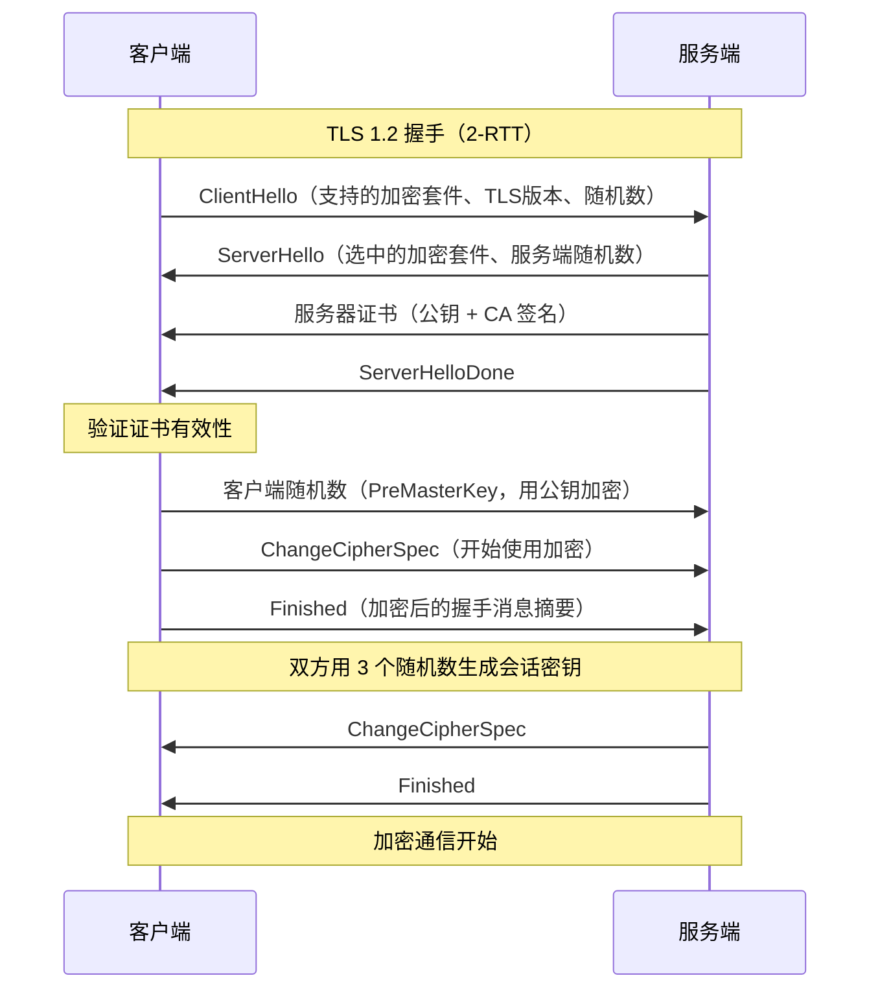
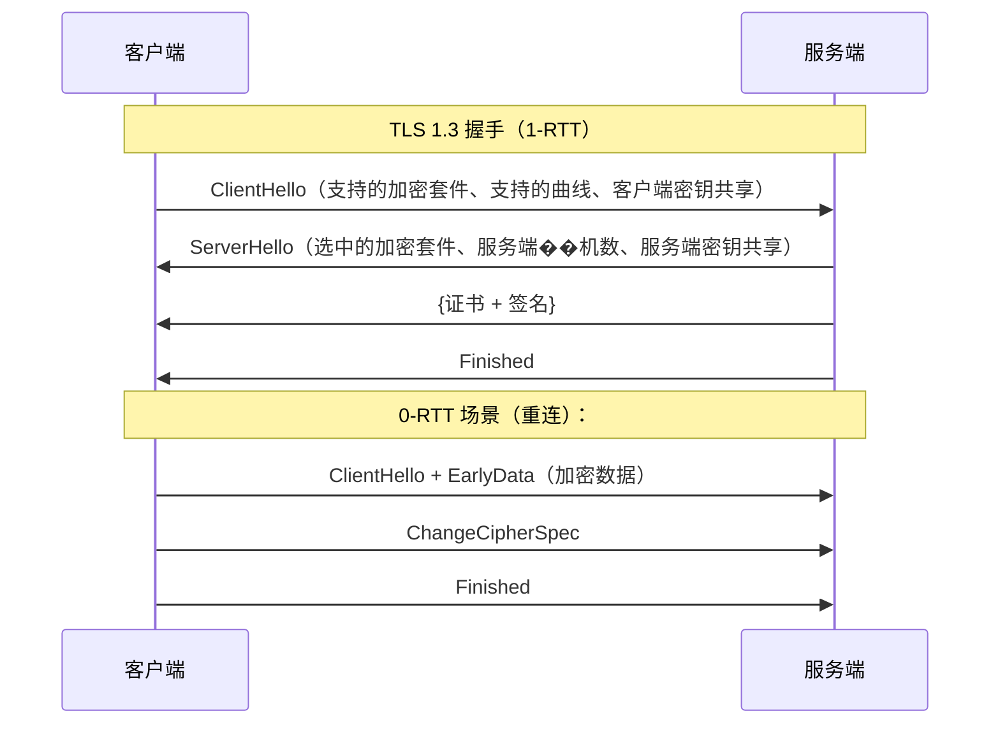

# HTTPS加密过程

> 目标级别：P5/P6

面试官问：「HTTPS 是怎么加密的？」你回答「SSL/TLS 加密」——然后面试官追问：「对称加密和非对称加密有什么区别？」「为什么 HTTPS 要混合使用两种加密？」「证书是用来干什么的？」

HTTPS 是面试中的高频问题，考察候选人对安全通信原理的理解深度。

## 快速自测

面试前先问自己这三个问题：

1. **HTTPS 的加密过程是怎样的？** 对称和非对称加密各自起什么作用？
2. **数字证书的作用是什么？** CA 签名为什么能防伪造？
3. **TLS 1.2 和 TLS 1.3 有什么区别？** 为什么 1.3 更快？

---

## 一、HTTPS 基础

### 1.1 HTTP 的问题

HTTP 是明文传输协议，数据在传输过程中可能被窃听、篡改。

```
HTTP 传输过程：
客户端 → [明文数据] → 服务端
          ↑
      路由器、代理服务器可以查看/修改
```

**常见威胁**：

| 威胁 | 说明 |
|------|------|
| 窃听（Eavesdropping） | 中间人可以看到传输内容 |
| 篡改（Tampering） | 中间人可以修改传输内容 |
| 伪装（Impersonation） | 中间人可以伪装成服务端 |

### 1.2 HTTPS 解决方案

HTTPS = HTTP + TLS/SSL

```
HTTPS 传输过程：
客户端 → [加密数据] → 服务端
          ↑
      中间人无法解密
```

HTTPS 解决的问题：

1. **保密性**：加密传输，第三方无法查看
2. **完整性**：检测数据是否被篡改
3. **认证**：验证服务端身份（通过证书）

---

## 二、加密算法基础

### 2.1 对称加密（Symmetric Encryption）

加密和解密使用同一个密钥。

```
对称加密：
明文 + 密钥 → 密文
密文 + 密钥 → 明文

示例算法：AES、DES、3DES、ChaCha20

优点：速度快，适合大量数据传输
缺点：密钥传输困难（怎么安全传输密钥？）
```

**AES 对称加密示例**：

```java
import javax.crypto.Cipher;
import javax.crypto.spec.SecretKeySpec;

public class AESExample {
    public static void main(String[] args) throws Exception {
        String key = "0123456789ABCDEF"; // 128 位密钥
        String plaintext = "Hello HTTPS";

        // 加密
        Cipher cipher = Cipher.getInstance("AES/ECB/PKCS5Padding");
        SecretKeySpec keySpec = new SecretKeySpec(key.getBytes(), "AES");
        cipher.init(Cipher.ENCRYPT_MODE, keySpec);
        byte[] encrypted = cipher.doFinal(plaintext.getBytes());

        // 解密
        cipher.init(Cipher.DECRYPT_MODE, keySpec);
        byte[] decrypted = cipher.doFinal(encrypted);
        System.out.println(new String(decrypted)); // "Hello HTTPS"
    }
}
```

### 2.2 非对称加密（Asymmetric Encryption）

加密和解密使用不同的密钥：公钥和私钥。

```
非对称加密：
明文 + 公钥 → 密文
密文 + 私钥 → 明文

示例算法：RSA、ECDSA、ECC

优点：密钥传输安全（只需传输公钥）
缺点：计算慢，不适合大量数据
```

**RSA 非对称加密示例**：

```java
import java.security.KeyPair;
import java.security.KeyPairGenerator;

public class RSAExample {
    public static void main(String[] args) throws Exception {
        // 生成密钥对
        KeyPairGenerator keyGen = KeyPairGenerator.getInstance("RSA");
        keyGen.initialize(2048);
        KeyPair keyPair = keyGen.generateKeyPair();

        byte[] publicKey = keyPair.getPublic().getEncoded();
        byte[] privateKey = keyPair.getPrivate().getEncoded();

        // 使用公钥加密
        Cipher cipher = Cipher.getInstance("RSA");
        cipher.init(Cipher.ENCRYPT_MODE, keyPair.getPublic());
        byte[] encrypted = cipher.doFinal("Hello".getBytes());

        // 使用私钥解密
        cipher.init(Cipher.DECRYPT_MODE, keyPair.getPrivate());
        byte[] decrypted = cipher.doFinal(encrypted);
        System.out.println(new String(decrypted)); // "Hello"
    }
}
```

### 2.3 混合加密

HTTPS 使用混合加密：非对称加密传输对称密钥，对称加密传输实际数据。

```
为什么混合使用？
- 非对称加密：安全但慢，适合传输密钥
- 对称加密：快速但密钥传输不安全

解决方案：
1. 客户端用公钥加密对称密钥
2. 服务端用私钥解密得到对称密钥
3. 双方用对称密钥加密实际数据
```

---

## 三、TLS 握手过程

### 3.1 TLS 1.2 握手流程



**握手详细步骤**：

```
第一步：ClientHello
- 客户端发送支持的 TLS 版本、加密套件列表
- 客户端生成随机数（Client Random）

第二步：ServerHello
- 服务端选择加密套件
- 服务端生成随机数（Server Random）

第三步：Certificate
- 服务端发送证书链（包含公钥）

第四步：CertificateRequest（可选）
- 服务端要求客户端提供证书（双向认证）

第五步：ClientKeyExchange
- 客户端生成 PreMasterSecret（用服务端公钥加密）
- 双方用 Client Random + Server Random + PreMasterSecret 生成会话密钥

第六步：Finished
- 双方发送加密的握手消息摘要，验证握手完整性
```

### 3.2 TLS 1.3 改进

TLS 1.3 大幅简化握手过程，从 2-RTT 减少到 1-RTT：



**TLS 1.3 改进点**：

| 改进 | TLS 1.2 | TLS 1.3 |
|------|---------|---------|
| RTT | 2-RTT（首次） | 1-RTT（首次） |
| 0-RTT | 不支持 | 支持（重连时） |
| 加密套件 | 多种 | 仅支持 5 种（强制带前向保密） |
| RSA 密钥交换 | 支持 | 移除（不安全） |
| 握手消息加密 | 部分不加密 | 全部加密 |

### 3.3 证书验证流程

```
证书链验证步骤：

1. 提取证书信息
   - 域名是否匹配
   - 证书是否在有效期内

2. 验证签名
   - 用 CA 公钥解密签名
   - 对比证书内容的哈希

3. 验证证书链
   - 逐级向上验证，直到根 CA
   - 根 CA 通常内置在操作系统/浏览器中

4. CRL/OCSP 检查（可选）
   - 检查证书是否被吊销
```

---

## 四、HTTPS 加密过程完整流程

### 4.1 整体流程

```
1. TCP 连接建立（三次握手）

2. TLS 握手
   a. 交换随机数
   b. 交换加密算法
   c. 交换密钥（DH 或 RSA）
   d. 验证证书

3. 加密通信
   - 使用会话密钥进行对称加密通信
```

### 4.2 会话密钥生成

```
会话密钥生成公式：
master_secret = PRF(pre_master_secret, "master secret", client_random + server_random)

PRF（伪随机函数）基于 HMAC/SHA-256

会话密钥（对称密钥）：
- 客户端写入密钥（Client Write Key）
- 服务端写入密钥（Server Write Key）
```

### 4.3 加密通信

```
握手完成后，使用对称加密传输数据：

HTTP 请求 + 会话密钥 → 加密数据 → 服务端
服务端 → 加密数据 + 会话密钥 → HTTP 响应
```

---

## 五、面试题精讲

### 🔴 【高频】HTTPS 加密过程

**问题**：请描述 HTTPS 的加密过程。

**标准答案**：

```
HTTPS 加密采用混合加密方式：

1. 非对称加密交换密钥
   - 服务端发送证书（含公钥）
   - 客户端验证证书有效性
   - 客户端用公钥加密对称密钥发给服务端

2. 对称加密传输数据
   - 双方用对称密钥加密实际数据
   - 非对称加密计算量大，只用于密钥交换

完整流程：
1. TCP 三次握手建立连接
2. TLS 握手：交换随机数、验证证书、协商加密算法
3. 用非对称加密传输对称密钥
4. 用对称密钥加密 HTTP 数据
```

### 🔴 【高频】对称加密和非对称加密的区别

**问题**：对称加密和非对称加密有什么区别？HTTPS 为什么混合使用？

**标准答案**：

```
对称加密：
- 加密解密用同一密钥
- 速度快，适合大量数据
- 密钥传输不安全

非对称加密：
- 公钥加密，私钥解密（或反过来）
- 速度慢，不适合大量数据
- 公钥可以公开传输

HTTPS 混合使用的原因：
- 非对称加密用于安全传输对称密钥
- 对称密钥用于加密实际数据（速度快）

这样既保证了密钥传输安全，又保证了数据传输效率。
```

### 🟡 【中频】数字证书的作用

**问题**：数字证书是用来干什么的？为什么需要 CA？

**标准答案**：

```
数字证书的作用：
1. 证明服务端身份（域名 + 公钥绑定）
2. 提供服务端公钥
3. 通过 CA 签名防止伪造

为什么需要 CA？
- 如果没有 CA，任何人都可以声称自己是 "example.com"
- CA 是可信第三方，对证书签名
- 浏览器内置根 CA 证书，可以验证签名

证书验证流程：
1. 浏览器用根 CA 公钥解密签名
2. 验证证书内容（域名、有效期等）
3. 检查证书是否被吊销
```

### 🟡 【中频】TLS 1.2 vs TLS 1.3

**问题**：TLS 1.3 相比 TLS 1.2 有什么改进？

**标准答案**：

```
TLS 1.3 改进：

1. 握手优化
   - TLS 1.2：2-RTT
   - TLS 1.3：1-RTT（首次），0-RTT（重连）

2. 移除不安全特性
   - 移除 RSA 密钥交换（不支持前向保密）
   - 移除 3DES、CBC 模式等

3. 简化加密套件
   - 强制带前向保密
   - 只支持 5 种套件

4. 加密更多握手消息
   - TLS 1.2：ClientKeyExchange 等不加密
   - TLS 1.3：所有握手消息都加密

代价：
- 0-RTT 存在重放攻击风险
- 不兼容旧版客户端
```

---

## 六、常见陷阱与易错点

### ⚠️ 陷阱一：混淆 HTTPS 和 HTTP over TLS

HTTPS 是 HTTP over TLS 的简称，而不是两个不同的协议。

### ⚠️ 陷阱二：认为 HTTPS 只有加密

HTTPS 还包括认证（证书）和完整性校验（MAC）。

### ⚠️ 陷阱三：混淆证书和私钥

- **证书**：包含公钥和 CA 签名，是公开的
- **私钥**：服务端保管，用于解密，泄露会导致安全问题

### ⚠️ 陷阱四：忽略证书链验证

面试中常被问到「证书怎么验证」，需要回答完整流程：域名匹配 → 有效期 → 签名验证 → 证书链 → CRL/OCSP。

---

## 七、对比总结

### HTTP vs HTTPS

| 维度 | HTTP | HTTPS |
|------|------|-------|
| 传输方式 | 明文 | 加密 |
| 端口 | 80 | 443 |
| 认证 | 无 | 证书认证 |
| 完整性 | 无保证 | MAC 校验 |
| 性能 | 较快 | 略慢（加密开销） |
| 成本 | 无 | 证书费用 |

### TLS 1.2 vs TLS 1.3

| 维度 | TLS 1.2 | TLS 1.3 |
|------|----------|--------|
| RTT | 2-RTT | 1-RTT |
| 0-RTT | 不支持 | 支持 |
| 密钥交换 | RSA/DH/ECDHE | 仅 ECDHE（强制前向保密） |
| 加密套件 | 多种 | 仅 5 种 |
| 握手加密 | 部分 | 全部 |
| 兼容性 | 好 | 需要客户端支持 |

### 对称加密 vs 非对称加密

| 维度 | 对称加密 | 非对称加密 |
|------|----------|------------|
| 密钥 | 同一密钥 | 公钥 + 私钥 |
| 速度 | 快 | 慢 |
| 用途 | 数据加密 | 密钥交换、签名 |
| 安全性 | 密钥泄露则不安全 | 公钥可公开 |
| 典型算法 | AES、ChaCha20 | RSA、ECDSA |

---

## 八、扩展思考

### 💡 加分话题：前向保密（Forward Secrecy）

```
前向保密：即使长期私钥泄露，历史通信仍然安全。

TLS 1.2 支持前向保密（使用 ECDHE 密钥交换）
TLS 1.3 强制前向保密（移除 RSA 密钥交换）

RSA 密钥交换的问题：
- 服务端私钥泄露后，攻击者可以解密之前捕获的通信（没有��向保密）
- 因为 RSA 密钥交换中，PreMasterSecret 用服务端公钥加密

ECDHE 密钥交换：
- 使用临时密钥对（每次握手不同）
- 即使长期私钥泄露，也无法解密历史通信
```

### 💡 加分话题：OCSP 在线证书状态检查

```
OCSP（Online Certificate Status Protocol）：
- 允许客户端实时查询证书是否被吊销
- 避免维护 CRL（证书吊销列表）

问题：
- 增加握手延迟
- CA 服务器可能不可用

解决方案：OCSP Stapling
- 服务端提前从 CA 获取 OCSP 响应
- 握手时直接发送给客户端
```

### 💡 加分话题：HSTS（HTTP Strict Transport Security）

```
HSTS 头：
Strict-Transport-Security: max-age=31536000; includeSubDomains

作用：
- 告诉浏览器强制使用 HTTPS
- 防止 HTTP → HTTPS 重定向时被劫持
- 减少首次访问的明文请求
```

> HTTPS 的核心是混合加密：用非对称加密安全地交换对称密钥，用对称密钥高效地加密数据。理解这个设计思想，就能理解为什么 TLS 1.3 要强制使用前向保密的 ECDHE 密钥交换。