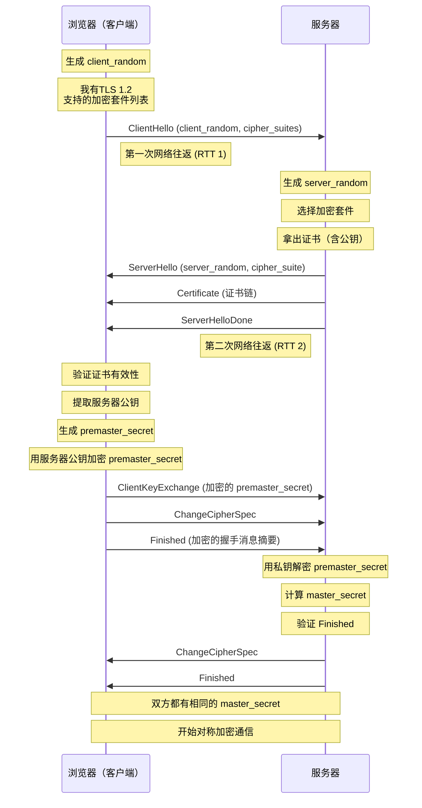
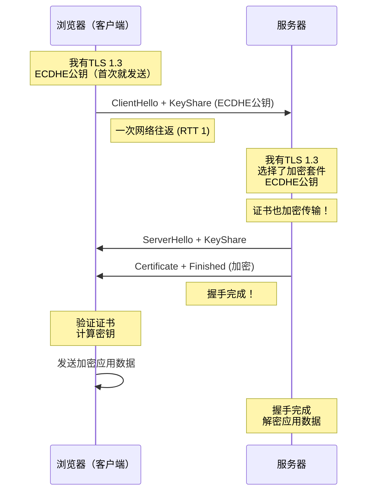
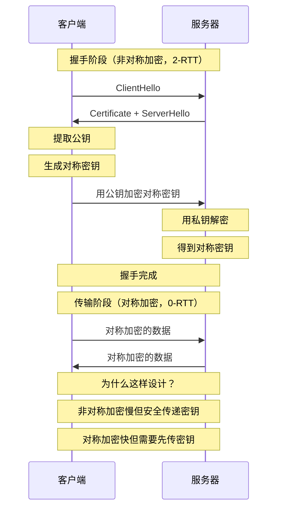

# HTTPS加密过程与TLS握手

面试官问："HTTPS是怎么加密的？TLS握手流程是什么？"

候选人小张说："HTTPS就是用SSL/TLS加密，浏览器和服务器握手后就建立安全连接了。"

面试官追问："握手中具体交换了什么？怎么确定对方身份？怎么防止数据被篡改？"

小张愣了一下："就是...交换密钥？"

面试官继续问："对称加密和非对称加密有什么区别？为什么HTTPS要混合使用？"

小张额头开始冒汗...

这个问题看起来基础，但能完整讲清楚加密过程、TLS握手细节、以及为什么这么设计的人，其实不多。

今天我们就来把这个彻底讲清楚。

## 从一个问题开始

HTTPS到底是什么？它比HTTP多了什么？

简单说：**HTTPS = HTTP + TLS**

```
┌─────────────────────────────────────────┐
│                  HTTPS                   │
├─────────────────────────────────────────┤
│  应用层：HTTP请求/响应                   │
├─────────────────────────────────────────┤
│  安全层：TLS协议                         │
│    ├─ 加密：数据机密性                  │
│    ├─ 认证：身份验证                    │
│    └─ 完整性：防篡改                    │
├─────────────────────────────────────────┤
│  传输层：TCP                             │
├─────────────────────────────────────────┤
│  网络层：IP                              │
└─────────────────────────────────────────┘
```

HTTP本身是明文传输，任何中间人都能截获、查看、篡改数据。HTTPS就是在HTTP下面加了一层TLS，让数据在传输过程中是加密的。

## 【直观类比】

### 快递包裹的加密进化

**HTTP时代**：寄明信片

```
小明 --明信片--> 小红
   ↑
   |
 邮递员能看见内容
```

问题：明信片上的内容谁都能看，太危险了。

**HTTPS时代**：寄加密箱子

```
小明 --加密箱子--> 小红
   ↑
   |
 邮递员看见的是密封箱子
 不知道里面装的什么
```

流程是这样的：
1. 小明和小红先约定好一个暗号（密钥交换）
2. 小明用暗号把东西锁在箱子里
3. 小红用暗号打开箱子
4. 邮递员只能看到密封的箱子，不知道里面是什么

这就是HTTPS加密的基本原理。

### 为什么不能只用一种加密？

你可能会问：既然对称加密这么快，为什么不全程用对称加密？

问题出在**密钥交换**上：

```
问题：对称加密需要双方有相同的密钥

场景：小明和小红在两个不同的城市
     他们怎么安全地传递密钥？

方案1：派人送密钥
       → 太麻烦，成本高

方案2：用非对称加密传递对称密钥
       → 非对称加密慢，但只需要传一次
       → 之后用对称加密快
```

这就是HTTPS的**混合加密**策略：
- 握手阶段：用非对称加密安全传递对称密钥
- 传输阶段：用对称加密快速传输实际数据

【直观类比】就像你去银行：
1. 你用身份证（公钥）证明身份
2. 银行给你一个保险箱钥匙（对称密钥）
3. 以后你都用这个钥匙开保险箱（对称加密）
4. 身份证平时锁在银行金库里，不用每次都用

## 核心原理

### 对称加密：简单的共享密钥

**对称加密**就像一把钥匙同时开锁和上锁：

```python
# 对称加密示例：AES
# 加密
ciphertext = AES_encrypt(plaintext, shared_key)

# 解密
plaintext = AES_decrypt(ciphertext, shared_key)

# 特点：
# - 加密解密用同一把钥匙
# - 速度快，适合大量数据传输
# - 密钥配送问题：怎么安全传递密钥？
```

常见对称加密算法：AES、ChaCha20、DES（已废弃）

### 非对称加密：公钥私钥配对

**非对称加密**用一对密钥：公钥和私钥

```python
# 非对称加密示例：RSA
# 加密（用公钥）
ciphertext = RSA_encrypt(plaintext, public_key)

# 解密（用私钥）
plaintext = RSA_decrypt(ciphertext, private_key)

# 特点：
# - 公钥加密，私钥解密
# - 或者反过来：私钥签名，公钥验证
# - 速度慢，不适合大量数据
# - 解决了密钥配送问题：我把公钥公开，私钥自己留着
```

常见非对称加密算法：RSA、ECDSA、Ed25519

### TLS握手流程

TLS握手是HTTPS建立安全连接的核心过程，目的是在不可信的网络上安全地协商出对称密钥。

#### TLS 1.2 握手（2-RTT）

TLS 1.2需要两次网络往返才能完成握手：



握手详细步骤：

**第一步：ClientHello**

```python
ClientHello = {
    "tls_version": "TLS 1.2",
    "client_random": random(32 bytes),  # 客户端随机数
    "cipher_suites": [                  # 支持的加密套件
        "TLS_ECDHE_RSA_WITH_AES_256_GCM_SHA384",
        "TLS_ECDHE_RSA_WITH_AES_128_GCM_SHA256",
        # ... 更多套件
    ],
    "extensions": {
        "sni": "www.example.com",       # 服务器名称指示
        "alpn": ["h2", "http/1.1"],     # HTTP/2协议协商
    }
}
```

**第二步：ServerHello + Certificate**

```python
ServerHello = {
    "tls_version": "TLS 1.2",
    "server_random": random(32 bytes),  # 服务器随机数
    "cipher_suite": "TLS_ECDHE_RSA_WITH_AES_128_GCM_SHA256",
}

Certificate = {
    "server_cert": {...},    # 服务器证书（含公钥、域名、有效期）
    "intermediate_ca": {...}, # 中间证书
    # ... 证书链
}
```

**第三步：密钥生成**

```python
# 客户端生成 premaster_secret
premaster_secret = random(48 bytes)

# 用服务器公钥加密
encrypted_pms = RSA_encrypt(premaster_secret, server_public_key)

# 双方各自计算 master_secret
master_secret = PRF(
    premaster_secret,
    "master secret",
    client_random + server_random
)

# 派生出会话密钥
session_keys = {
    "client_write_key": ...,   # 客户端加密密钥
    "server_write_key": ...,   # 服务器加密密钥
    "client_write_mac": ...,   # 客户端认证密钥
    "server_write_mac": ...,   # 服务器认证密钥
}
```

#### TLS 1.3 握手（1-RTT）

TLS 1.3做了重大优化，把握手从2-RTT降到1-RTT：



**TLS 1.3的核心改进**：

| 特性 | TLS 1.2 | TLS 1.3 |
| --- | --- | --- |
| 握手RTT | 2-RTT | 1-RTT |
| 密钥交换 | RSA/DH/ECDHE可选 | 仅ECDHE |
| 证书传输 | 明文 | 加密 |
| 0-RTT | 可选 | 支持 |
| 前向安全 | 可选 | 强制 |

### 混合加密的完整流程



## 边界与特例

### 证书验证的边界条件

#### 1. 自签名证书

```python
# 自签名证书：自己给自己签发
# 根证书不在浏览器信任列表中

场景：内网环境、测试环境
问题：浏览器会显示"证书不受信任"
解决：
- 手动添加到信任列表
- 使用内部CA签发的证书
- 开发环境用 mkcert 工具生成本地信任证书
```

#### 2. 证书过期

```
证书有效期检查：
├── 证书生效时间 > 当前时间 → 证书未生效
├── 证书过期时间 < 当前时间 → 证书已过期
└── 浏览器会阻止访问
```

#### 3. 域名不匹配

```python
# 场景：证书是 *.example.com
#      但用户访问 api.example.com

检查顺序：
1. 检查 Subject Alternative Names (SAN)
2. *.example.com 匹配 www.example.com
3. *.example.com 不匹配 example.com（通配符不能跨层级）
4. 降级检查 Common Name（已废弃）
```

#### 4. 证书链不完整

```
证书链验证：
浏览器 --验证--> 服务器证书
服务器证书 --验证--> 中间证书
中间证书 --验证--> 根证书
根证书 --内置--> 浏览器/系统

问题：服务器没有配置中间证书
解决：配置证书链，或使用包含中间证书的完整包
```

### HTTPS不能防止什么

:::warning ⚠️
HTTPS的保护是有边界的：

**HTTPS能防止**：
- 中间人窃听（数据加密）
- 中间人篡改（完整性保护）
- 钓鱼网站（证书验证）

**HTTPS不能防止**：
- 服务器被入侵（数据在服务器上是明文）
- 客户端被病毒感染（本地解密）
- 用户被社会工程攻击（主动泄露密码）
- 服务器端数据泄露（数据库被拖库）
:::

## 常见误区

### 误区1：HTTPS是完全安全的

**错误**。HTTPS只保护传输过程：

```
HTTPS的保护范围：
├── 传输路径加密（从浏览器到服务器）
├── 中间人攻击防护
└── 身份认证（服务器身份）

HTTPS的保护盲区：
├── 服务器端：数据库、文件系统的数据
├── 客户端：浏览器缓存、内存中的数据
├── 应用层：SQL注入、XSS等攻击
└── 用户行为：钓鱼网站、弱密码
```

### 误区2：HTTPS比HTTP慢很多

**错误**。现代HTTPS的性能开销很小：

```
实测数据（Chrome）：
├── TLS 1.3握手：~50ms（1-RTT）
├── AES加密：CPU开销增加 < 3%
└── 实际体感：几乎无差异

优化手段：
├── TLS会话恢复：跳过握手
├── 0-RTT：首次就发数据
├── HTTP/2多路复用：一次握手多次使用
└── OCSP装订：减少证书验证延迟
```

### 误区3：有了HTTPS就不需要其他安全措施

**错误**。HTTPS是安全方案的一部分，不是全部：

```
纵深防御：
├── HTTPS：传输加密
├── WAF：Web应用防火墙（防SQL注入、XSS）
├── CSP：内容安全策略（防XSS）
├── 输入验证：服务端校验
└── 最小权限：数据库、API权限控制
```

### 误区4：通配符证书可以无限使用

**错误**。通配符证书有严格限制：

```
*.example.com 的限制：
├── 匹配：www.example.com、api.example.com
├── 不匹配：example.com（根域名）
├── 不匹配：www.sub.example.com（多一层子域）
└── 不匹配：*.com（通配符不能跨太多层级）
```

### 误区5：所有HTTPS网站都一样安全

**错误**。HTTPS配置的好坏直接影响安全性：

```
弱配置示例：
├── TLS 1.0/1.1（已废弃）
├── RC4、3DES等弱加密算法
├── 1024位RSA密钥
└── 无SNI支持

强配置示例：
├── TLS 1.2/1.3
├── AES-256-GCM、ChaCha20
├── 2048位RSA或256位ECDSA
└── 完整证书链 + OCSP装订
```

## 记忆技巧

### 口诀

> **HTTPS握手记口诀**
> 
> 一问：ClientHello，带上随机数和套件
> 二答：ServerHello，证书公钥都给你
> 三算：双方各自算，master_secret
> 四完：Finished验证，密钥到手开始传

> **加密算法记口诀**
> 
> 非对称加密RSA，密钥交换顶呱呱
> 对称加密用AES，速度快来处理它
> 混合加密最完美，安全效率两手抓

> **TLS版本记口诀**
> 
> TLS 1.2两往返，RSA可选前向难
> TLS 1.3一次完，ECDHE强制前向安
> 加密套件大精简，五种算法全覆盖

### 对比速查表

| 特性 | 对称加密 | 非对称加密 |
| --- | --- | --- |
| 密钥数量 | 一把密钥 | 公钥+私钥 |
| 加密速度 | 快（100倍） | 慢 |
| 适用场景 | 大量数据传输 | 密钥交换、签名 |
| 密钥配送 | 困难 | 简单（公开公钥） |
| 代表算法 | AES、ChaCha20 | RSA、ECDSA |

| TLS版本 | 握手RTT | 前向安全 | 证书加密 |
| --- | --- | --- | --- |
| 1.2 | 2-RTT | 可选 | 明文 |
| 1.3 | 1-RTT | 强制 | 加密 |

## 实战检验

### 检验1：抓包分析HTTPS握手

**工具**：Wireshark + Chrome开发者工具

**步骤**：

```bash
# 1. Chrome开发者工具 -> Security Tab
#    可以看到证书信息、 TLS版本、加密套件

# 2. Wireshark抓包
#    过滤条件：tls.handshake

# 3. 分析ClientHello
#    - TLS版本
#    - 支持的加密套件
#    - SNI域名

# 4. 分析ServerHello
#    - 选择的加密套件
#    - 证书链完整性
```

### 检验2：排查HTTPS连接失败

**场景**：用户反馈"网站打不开，显示证书错误"

**排查步骤**：

```
1. 检查证书有效期
   openssl s_client -connect example.com:443 -no-CAfile -no-CApath
   # 看 Not Before / Not After

2. 检查证书链
   openssl s_client -connect example.com:443 -showcerts
   # 看是否缺少中间证书

3. 检查域名匹配
   openssl x509 -in cert.pem -text | grep -A 2 SAN
   # 看 SAN 是否包含访问的域名

4. 检查证书吊销
   openssl ocsp -issuer chain.pem -cert server.pem -url http://ocsp.example.com
   # 看证书是否被吊销
```

### 检验3：评估HTTPS配置安全性

**工具**：SSL Labs SSL Test

```
评分维度：
├── 证书有效性
├── 支持的TLS版本
├── 密钥交换算法
├── 加密算法强度
├── 前向安全配置
└── 已知漏洞防护

常见问题：
⚠️ TLS 1.0/1.1启用 → 扣分
⚠️ 弱加密套件启用 → 扣分
⚠️ 无前向安全 → 扣分
⚠️ 证书链不完整 → 扣分
```

### 检验4：理解0-RTT的实际影响

**场景**：考虑是否启用TLS 1.3的0-RTT

```
0-RTT的优点：
├── 首次连接就发数据
├── 握手延迟降为0
└── 用户体验更好

0-RTT的风险：
├── 重放攻击风险
├── 非幂等请求不能使用
└── 攻击者可以重放请求

适用场景：
✅ 幂等的GET请求（静态资源）
✅ 预加载（Preload）
❌ 非幂等POST请求（支付、下单）
❌ 需要强一致性的操作
```

---

## 延伸阅读

- [TLS握手流程](/cs/security/tls-handshake) - 握手详细过程与优化
- [HTTPS与HTTP区别](/cs/security/https-vs-http) - HTTPS的整体安全机制
- [对称加密 vs 非对称加密](/cs/security/symmetric-asymmetric) - 加密原理详解
