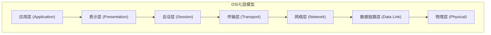
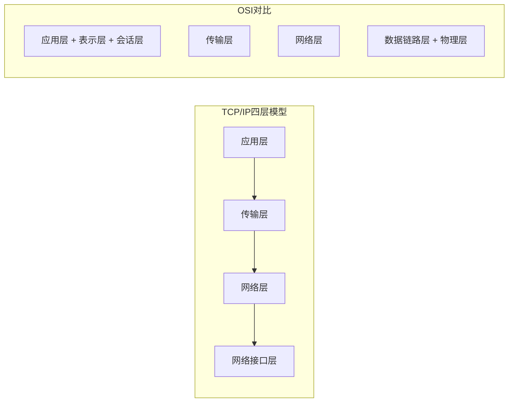
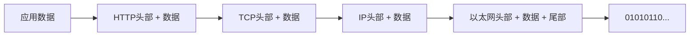

# OSI七层模型与TCP/IP四层模型

> 目标级别：P5/P6

面试官问：「网络协议分层有什么好处？」「TCP/IP 和 OSI 模型有什么区别？」「为什么有些教材说五层模型？」——这些问题看似基础，但很多人只能背出各层名称，说不出分层的原因和面试官真正想听的深层含义。

## 快速自测

面试前先问自己这三个问题：

1. **为什么要分层？** 不分层行不行？分层的真正好处是什么？
2. **OSI 七层和 TCP/IP 四层的对应关系是什么？** 每一层有哪些代表性协议？
3. **数据是如何从一台主机传递到另一台主机的？** 每一层都做了什么？

---

## 一、为什么要分层？

分层是计算机领域最重要的设计思想之一。网络协议分层的好处不仅是为了「好理解」，而是解决真实问题的方案。

### 1.1 分层解决的核心问题

```
面试官追问：为什么要分层？单纯为了好理解吗？

真实原因：
1. 每一层只需要关注自己的职责，不需要了解其他层的实现
2. 某一层的技术升级不影响其他层（比如升级光纤不影响 HTTP 协议）
3. 每一层可以独立选择最优实现（WiFi 和有线以太网都可以传输 IP 包）
4. 问题定位更简单（网络故障排查时，逐层检查而不是整体排查）
```

### 1.2 分层的基本原则

| 原则 | 说明 |
|------|------|
| 单一职责 | 每一层只完成特定功能 |
| 独立实现 | 层间通过接口交互，内部实现可替换 |
| 逐层构建 | 每一层建立在前一层的基础上 |
| 对等通信 | 对等层之间使用相同的协议 |

---

## 二、OSI 七层模型

OSI（Open Systems Interconnection）模型是国际标准化组织（ISO）在 1984 年提出的理论模型，虽然没有在实际互联网中广泛使用，但作为教学模型被广泛引用。

### 2.1 七层详解



| 层级 | 名称 | 核心功能 | 典型协议/设备 |
|------|------|----------|--------------|
| 7 | 应用层 | 为应用程序提供网络服务 | HTTP、DNS、FTP、SMTP |
| 6 | 表示层 | 数据格式转换、加密解密 | TLS、SSL、JPEG、GIF |
| 5 | 会话层 | 管理通信会话 | NetBIOS、RPC |
| 4 | 传输层 | 端到端可靠传输 | TCP、UDP |
| 3 | 网络层 | IP 寻址和路由 | IP、ICMP、路由器 |
| 2 | 数据链路层 | 帧封装、MAC 地址寻址 | Ethernet、PPP、交换机 |
| 1 | 物理层 | 比特流传输 | 光纤、铜线、集线器 |

### 2.2 每一层的核心职责

**应用层**：用户与网络之间的接口，提供 HTTP、SMTP、SSH 等应用协议。

**表示层**：负责数据格式转换，比如字符编码、压缩、加密。TLS 发生在这一层。

**会话层**：管理通信会话，负责建立、维护、终止会话。

**传输层**：提供端到端的逻辑通信，负责数据可靠性和流量控制。TCP 和 UDP 是这一层的核心。

**网络层**：负责 IP 寻址和路由选择，决定数据包从源到目的地的路径。

**数据链路层**：将网络层的数据封装成帧，使用 MAC 地址在局域网内寻址。

**物理层**：将比特流转换为电信号或光信号，通过物理介质传输。

---

## 三、TCP/IP 四层模型

TCP/IP 模型是实际使用的协议栈，被广泛称为「因特网协议族」。它比 OSI 模型更简洁，只有四层。

### 3.1 四层详���



| 层级 | 名称 | 说明 | 对应 OSI 层 |
|------|------|------|------------|
| 4 | 应用层 | HTTP、DNS、FTP、SMTP 等应用协议 | 7+6+5 |
| 3 | 传输层 | TCP、UDP，端到端数据传输 | 4 |
| 2 | 网络层（Internet层） | IP、ARP、ICMP，IP 寻址和路由 | 3 |
| 1 | 网络接口层（链路层） | Ethernet、WiFi，物理地址寻址 | 2+1 |

### 3.2 OSI 与 TCP/IP 对应关系

| TCP/IP 四层 | OSI 七层 | 合并原因 |
|--------------|----------|----------|
| 应用层 | 应用层 + 表示层 + 会话层 | 这三层在实际中界限不明显，HTTP 既处理表示也处理会话 |
| 传输层 | 传输层 | 一一对应 |
| 网络层 | 网络层 | 一一对应 |
| 网络接口层 | 数据链路层 + 物理层 | 物理传输的细节对上层透明 |

---

## 四、数据封装与解封装

理解分层模型的关键是理解数据是如何逐层封装的。

### 4.1 封装过程



| 层级 | 封装单位 | 头部包含 |
|------|----------|----------|
| 应用层 | Data | HTTP、DNS 等应用协议数据 |
| 传输层 | Segment（段） | 源端口、目的端口、序列号、Flag |
| 网络层 | Packet（包） | 源 IP、目的 IP、协议号 |
| 数据链路层 | Frame（帧） | 源 MAC、目的 MAC、帧校验 |

### 4.2 解封装过程

接收端的处理是封装的逆过程：

```
1. 物理层：接收比特流，交由数据链路层
2. 数据链路层：解析帧头，获取 MAC 地址，校验后交给网络层
3. 网络层：解析 IP 头，获取目的 IP，路由转发后交给传输层
4. 传输层：解析 TCP/UDP 头，获取端口号，交给应用层
5. 应用层：解析应用层数据（如 HTTP）
```

### 4.3 封装过程代码示例

```java
public class DataEncapsulation {
    public static void main(String[] args) {
        // 应用层数据
        String httpData = "GET /index.html HTTP/1.1\r\nHost: example.com\r\n\r\n";

        // 传输层：添加 TCP 头
        String tcpSegment = "TCP[src=12345,dst=80]" + httpData;

        // 网络层：添加 IP 头
        String ipPacket = "IP[src=192.168.1.100,dst=93.184.216.34]" + tcpSegment;

        // 数据链路层：添加以太网头
        String ethernetFrame = "ETH[src=AA:BB:CC:DD:EE:FF,dst=11:22:33:44:55:66]" + ipPacket;

        System.out.println("最终发送的帧: " + ethernetFrame);
    }
}
```

---

## 五、面试题精讲

### 🔴 【高频】OSI 七层模型

**问题**：请描述 OSI 七层模型每一层的名称和核心功能。

**记忆口诀**：应表会传网数物（Application, Presentation, Session, Transport, Network, Data Link, Physical）

**标准答案**：

| 层级 | 名称 | 核心功能 | 典型协议 |
|------|------|----------|----------|
| 7 | 应用层 | 为应用程序提供网络服务 | HTTP、DNS、FTP |
| 6 | 表示层 | 数据格式转换、加密解密 | TLS、JPEG |
| 5 | 会话层 | 管理通信会话 | RPC |
| 4 | 传输层 | 端到端可靠传输 | TCP、UDP |
| 3 | 网络层 | IP 寻址和路由 | IP、ICMP |
| 2 | 数据链路层 | 帧封装、MAC 寻址 | Ethernet |
| 1 | 物理层 | 比特流传输 | 光纤、铜线 |

### 🔴 【高频】TCP/IP 四层模型与 OSI 对应关系

**问题**：TCP/IP 四层模型和 OSI 七层模型的区别是什么？

**标准答案**：

```
TCP/IP 四层模型：
- 应用层：对应 OSI 的应用层、表示层、会话层（HTTP、DNS、FTP）
- 传输层：对应 OSI 的传输层（TCP、UDP）
- 网络层：对应 OSI 的网络层（IP）
- 网络接口层：对应 OSI 的数据链路层和物理层（Ethernet、WiFi）

主要区别：OSI 将前三层分开，而 TCP/IP 合并为一层，因为实际应用中这三层界限不明显。
```

### 🟡 【中频】为什么要分层？

**问题**：网络协议为什么要分层？分层有什么好处？

**标准答案**：

```
分层的好处：
1. 职责分离：每一层只需关注自己的功能，不需要了解其他层实现
2. 解耦与独立演进：某一层技术升级不影响其他层（比如升级光纤不影响 HTTP）
3. 标准化：不同厂商可以在同一层使用不同实现，只要符合接口标准
4. 简化排查：网络故障时逐层检查，而不是整体排查

就像寄快递一样：寄件人（应用层）只需要填写地址（网络层），不需要了解快递公司内部流程（其他层）。
```

### 🟡 【中频】数据封装过程

**问题**：当你在浏览器输入 URL 并回车，数据是如何从你的电脑传输到目标服务器的？

**标准答案**：

```
以 HTTP 请求为例：

1. 应用层：浏览器生成 HTTP 请求
2. 传输层：TCP 添加源端口和目的端口，封装为 Segment
3. 网络层：IP 添加源 IP 和目的 IP，封装为 Packet
4. 数据链路层：以太网添加源 MAC 和目的 MAC，封装为 Frame
5. 物理层：转换为电信号/光信号，在物理介质上传输

目标服务器收到后，逐层解封装，最终将 HTTP 响应返回给浏览器。
```

---

## 六、常见陷阱与易错点

### ⚠️ 陷阱一：混淆 OSI 和 TCP/IP 模型层级数

有些人记不清到底是四层还是七层。记住：**OSI 是七层，TCP/IP 是四层**。面试官可能会故意问「你说一下五层模型」——这是 TCP/IP 四层模型加上物理层的简化说法，实际面试中不常用。

### ⚠️ 陷阱二：混淆不同层的数据单位

| 层 | 数据单位 | 头部 |
|------|----------|------|
| 应用层 | Data（数据） | 无（取决于应用协议） |
| 传输层 | Segment（段） | TCP/UDP 头 |
| 网络层 | Packet（包） | IP 头 |
| 数据链路层 | Frame（帧） | Ethernet 头 + 尾 |

### ⚠️ 陷阱三：认为所有层都必须经过

对于本地通信（如同一台机器上的进程间通信），有些层可能被跳过。例如 Linux 的 localhost 通信可能绕过网络接口层直接通过 loopback 设备传输。

### ⚠️ 陷阱四：忽略了各层设备的对应关系

| 层 | 设备 | 说明 |
|------|------|------|
| 物理层 | 集线器、中继器 | 放大信号，不解析数据 |
| 数据链路层 | 交换机、网桥 | 基于 MAC 地址转发 |
| 网络层 | 路由器、三层交换机 | 基于 IP 地址路由 |
| 应用层 | 网关 | 协议转换 |

---

## 七、对比总结

### OSI 七层模型 vs TCP/IP 四层模型

| 维度 | OSI 七层 | TCP/IP 四层 |
|------|----------|-------------|
| 提出时间 | 1984 年 | 1970 年代（ARPANET） |
| 层数 | 7 | 4 |
| 应用范围 | 理论模型，教学用 | 实际标准，Internet 使用 |
| 分工 | 划分更细 | 合并相关层 |
| 协议无关性 | 协议无关 | 与 TCP/IP 协议绑定 |

### 各层典型协议汇总

| 层级 | TCP/IP 协议 | OSI 扩展协议 |
|------|------------|-------------|
| 应用层 | HTTP, DNS, FTP, SMTP, SSH | SNMP, Telnet |
| 表示层 | TLS, SSL | MPEG, ASCII |
| 会话层 | - | NetBIOS, PPTP |
| 传输层 | TCP, UDP | SPX |
| 网络层 | IP, ICMP, ARP | IPX |
| 数据链路层 | Ethernet, PPP | Frame Relay |
| 物理层 | - | RS-232 |

---

## 八、扩展思考

### 💡 加分话题：五层模型

有些教材提出「五层模型」，即 TCP/IP 四层加上物理层：

- 应用层（Application）
- 传输层（Transport）
- 网络层（Network）
- 数据链路层（Data Link）
- 物理层（Physical）

这是为了更精确地描述实际网络通信过程。

### 💡 加分话题：PDU（Protocol Data Unit）

每一层的数据单元有不同的名称：

| 层 | PDU 名称 | 说明 |
|------|----------|------|
| 应用层 | Data | 应用数据 |
| 传输层 | Segment | TCP/UDP 段 |
| 网络层 | Packet | IP 包 |
| 数据链路层 | Frame | 以太网帧 |
| 物理层 | Bit | 比特流 |

> 分层不是目的，而是手段。理解每一层「做什么」比背诵名称更重要。面试中能画出封装图、能解释每一层的作用，比背出七层名称更有说服力。