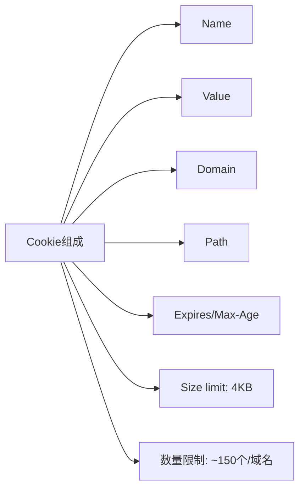
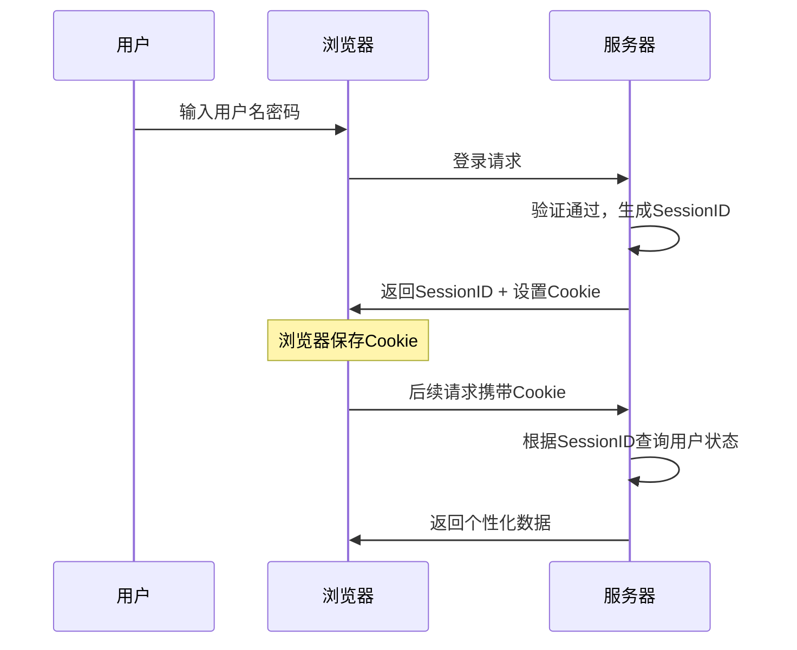
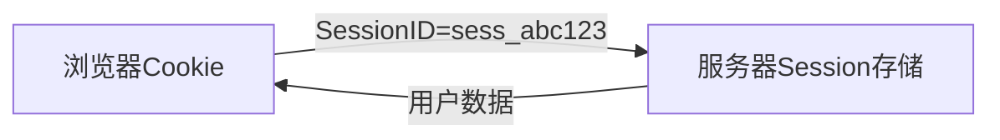
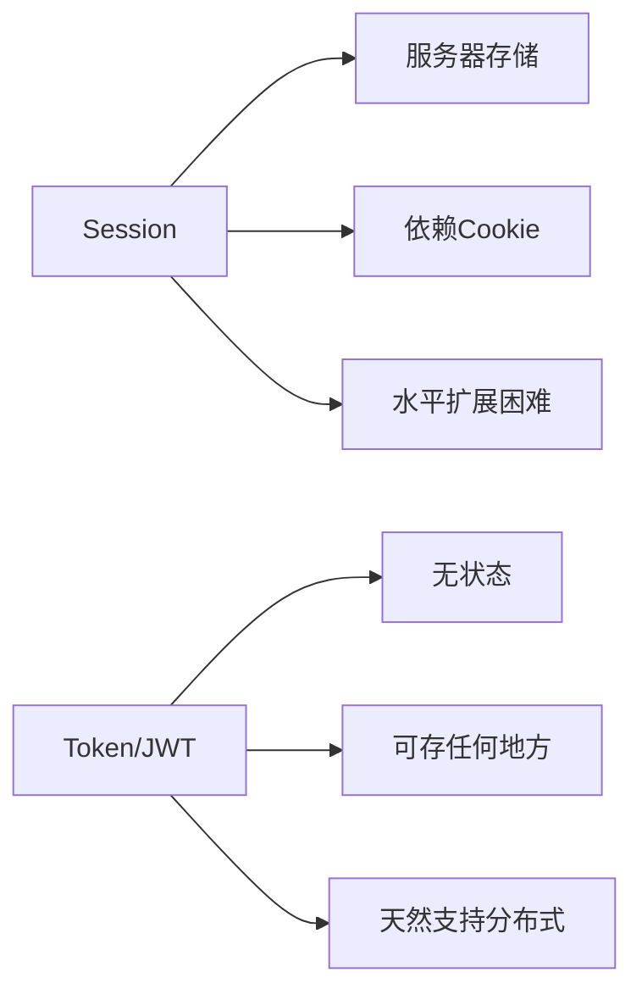

# Session与Cookie的区别与协作

小王在美团二面，面试官问：

"用户登录后，你怎么判断他是登录状态？"

小张："存一个token在Cookie里。"

面试官："那为什么要存Cookie？直接存Session不行吗？"

小张愣了一下："Session是存...服务器上的？"

面试官继续追问："那Session怎么和客户端关联起来？Session的缺点是什么？"

小张答不上来。

【直观类比】

把Session和Cookie想象成**酒店房卡系统**：

- **Cookie**：房卡本身。你拿着房卡证明你是这个房间的客人
- **Session**：酒店前台系统。记录哪个房卡对应哪个房间、住了几天、有没有加早餐

房卡（Cookie）可以丢、可以被人偷、有效期可以设短一点。
前台记录（Session）存在酒店数据库里，丢了房卡可以补办。

## 核心概念

### Cookie是什么？

Cookie是**存储在浏览器端**的一小段文本数据，由服务器生成，浏览器自动携带在后续请求中。

```http
# 服务器通过响应头设置Cookie
Set-Cookie: user_id=123; Path=/; Max-Age=3600; HttpOnly; Secure

# 浏览器后续请求自动携带
GET /api/profile HTTP/1.1
Cookie: user_id=123
```

**Cookie的构成**：



### Session是什么？

Session是**存储在服务器端**的用户会话数据，用于记录用户状态。

```javascript
// 服务器端Session存储示例
const sessionStore = {
    'sess_abc123': {
        userId: 123,
        username: 'zhangsan',
        loginTime: '2024-01-15 10:30:00',
        role: 'admin',
        // ...其他用户数据
    },
    'sess_def456': {
        userId: 456,
        username: 'lisi',
        loginTime: '2024-01-15 11:00:00',
        role: 'user'
    }
}
```

**Session的生命周期**：



## 关联机制

### SessionID：连接两端的桥梁

Session存在服务器，Cookie存在浏览器。它们通过**SessionID**关联：



**工作流程**：

```
1. 用户登录 → 服务器生成Session + SessionID
2. 服务器返回SessionID给浏览器 → 浏览器存到Cookie
3. 后续请求 → 浏览器自动带上Cookie(含SessionID)
4. 服务器根据SessionID找到对应Session → 获取用户状态
```

### 为什么不直接存用户信息在Cookie？

**安全性问题**：

```javascript
// ❌ 危险做法：用户信息直接存Cookie
Set-Cookie: user={"id":123,"role":"admin"}; HttpOnly

// 问题：Cookie是明文的，用户可以修改
// 如果改成 role=admin，直接获得管理员权限
```

**正确做法**：

```javascript
// ✅ 安全做法：只存SessionID
Set-Cookie: SESSION_ID=sess_abc123; HttpOnly; Secure

// SESSION_ID对应服务器端的Session对象
// 用户无法伪造Session对象
```

:::tip 💡
面试官追问"HttpOnly是什么意思"，答案是：禁止JavaScript访问Cookie，防止XSS攻击盗取Cookie。没有HttpOnly的Cookie可以被`document.cookie`读取。
:::

## Session的存储方案

### 1. 内存存储

适用于单机部署，简单但无法扩展：

```javascript
// Node.js 内存存储
const sessions = new Map();

// 问题：
// 1. 重启服务器Session丢失
// 2. 多服务器无法共享
```

### 2. Redis存储（推荐）

分布式系统的首选方案：

```javascript
// Redis存储Session
await redis.setex(`session:${sessionId}`, 3600, JSON.stringify(sessionData));

// 优点：
// 1. 高性能
// 2. 支持集群
// 3. 可以设置过期时间
```

```nginx
# Nginx配置Session粘贴
upstream backend {
    ip_hash;  # 同一IP固定到同一服务器
    server 127.0.0.1:3000;
    server 127.0.0.1:3001;
}
```

### 3. 数据库存储

MySQL、MongoDB等，但性能不如Redis：

```sql
-- MySQL存储Session
CREATE TABLE sessions (
    session_id VARCHAR(128) PRIMARY KEY,
    data TEXT,
    expires INT,
    INDEX idx_expires (expires)
);
```

## Cookie的属性详解

### 必知属性

| 属性 | 作用 | 示例 |
|------|------|------|
| `Name=Value` | Cookie的名称和值 | `session_id=abc123` |
| `Domain` | 生效域名 | `Domain=example.com` |
| `Path` | 生效路径 | `Path=/api` |
| `Expires` | 绝对过期时间 | `Expires=Wed, 21 Oct 2025 07:28:00 GMT` |
| `Max-Age` | 相对过期时间（秒） | `Max-Age=3600` |

### 安全属性

| 属性 | 作用 |
|------|------|
| `HttpOnly` | 禁止JavaScript访问 |
| `Secure` | 仅HTTPS传输 |
| `SameSite` | 防止CSRF攻击 |

```http
# 完整的安全Cookie示例
Set-Cookie: session_id=sess_abc123; 
    HttpOnly;  # JS无法访问
    Secure;    # HTTPS only
    SameSite=Strict;  # 同站请求才发送
    Path=/; 
    Max-Age=3600
```

### SameSite详解

| 值 | 行为 | 适用场景 |
|----|------|----------|
| `Strict` | 仅同站请求发送 | 严格要求的安全操作 |
| `Lax` | 同站 + 导航请求发送 | 大多数场景（默认） |
| `None` | 所有请求都发送 | 需要跨域API调用（需配合Secure） |

```http
# 登录Cookie应该用Strict或Lax
Set-Cookie: session_id=sess_abc123; SameSite=Strict

# 第三方嵌入的Cookie用None
Set-Cookie: tracking_id=xyz; SameSite=None; Secure
```

## 常见问题与解决方案

### 问题一：Session过期

**现象**：用户操作一半，莫名其妙跳转到登录页

**原因**：
1. Session默认过期时间到了（通常20-30分钟）
2. 服务器重启导致内存中的Session丢失
3. 负载均衡导致请求到另一台没有这个Session的服务器

**解决方案**：

```javascript
// 1. 延长Session有效期
session.cookie.maxAge = 7 * 24 * 60 * 60 * 1000; // 7天

// 2. 续命：访问时自动延长有效期
app.use((req, res, next) => {
    if (req.session) {
        req.session.touch(); // 更新最后访问时间
    }
    next();
});
```

### 问题二：Cookie被禁用

**场景**：用户浏览器禁用了Cookie

**解决方案**：URL重写（SessionID放在URL参数里）

```http
# 服务器自动重写URL
# 原URL: /api/profile
# 重写后: /api/profile;jsessionid=sess_abc123

# Express配置
app.use(require('express-session')({
    cookie: {
        resave: false,
        saveUninitialized: false
    }
}));
```

:::warning ⚠️
URL重写方式不推荐，因为SessionID会暴露在URL中，存在安全风险。如果必须用，确保是HTTPS + 短期过期。
:::

### 问题三：跨域Session

**场景**：前后端分离，API域名和前端域名不同

**解决方案**：

```javascript
// 前端：设置credentials
fetch('https://api.example.com/user', {
    credentials: 'include'  // 携带Cookie
});

// 后端：设置CORS
app.use(cors({
    origin: 'https://www.example.com',
    credentials: true  // 允许Cookie
}));
```

## 边界与特例

### 1. Token vs Session

现代应用越来越多用Token替代Session：



| 维度 | Session | Token/JWT |
|------|---------|-----------|
| 存储位置 | 服务器 | 客户端 |
| 扩展性 | 需共享存储 | 无状态，易扩展 |
| 失效机制 | 服务端控制 | 客户端丢弃或黑名单 |
| 数据量 | 可存大量数据 | 受Cookie/Header大小限制 |
| 适用场景 | 传统Web应用 | 前后端分离、API |

### 2. 多Tab登录问题

用户打开多个Tab，后登录的Tab会把之前Tab的Session顶掉吗？

**取决于Session存储方式**：

```javascript
// 如果SessionID存在Cookie中
// 新Tab使用同一个Cookie，Session相同
// 但如果新登录刷新了Session，旧的Tab会受影响

// 解决方案：存储多个Session
Set-Cookie: session_id=tab1; Path=/; SameSite=Lax
Set-Cookie: session_id=tab2; Path=/; SameSite=Lax
```

### 3. CSRF攻击与Cookie

Cookie在发送请求时自动携带，即使请求来自恶意网站。这就是CSRF（跨站请求伪造）攻击的原理。

```html
<!-- 恶意网站 -->

```

用户登录了银行网站后，访问这个恶意页面，会自动发起转账请求，Cookie自动携带。

**防护措施**：

```javascript
// 1. CSRF Token（最常用）
// 服务器生成随机Token，表单和Session各存一份
<input type="hidden" name="csrf_token" value="abc123">

// 2. SameSite Cookie
Set-Cookie: session_id=sess_abc; SameSite=Strict

// 3. 验证Referer/Origin
if (!['https://example.com'].includes(req.headers.origin)) {
    return res.status(403).send('CSRF攻击拦截');
}
```

## 常见误区

### 误区一：Cookie比Session安全

**错！** Cookie存客户端，用户可以修改。Session存服务端，服务端控制。敏感数据应该存Session。

### 误区二：Cookie有大小限制所以没用

**错！** Cookie的4KB限制是针对Cookie本身的，数据可以存Session里。Cookie只存SessionID。

### 误区三：Session可以无限存数据

**错！** Session虽然没明确大小限制，但：
1. 每个Session占用服务器内存
2. 大量Session会影响服务器性能
3. Redis等存储有内存限制

只存必要数据，过期数据及时清理。

### 误区四：Cookie过期就安全了

**错！** Cookie过期只是浏览器不发送了，但：
1. 恶意网站可能已经读取过Cookie
2. 网络传输过程中可能被截获（没有Secure属性）
3. XSS攻击可能已经获取了Cookie内容

## 记忆技巧

### Session vs Cookie对比

> "Cookie是房卡，Session是酒店记录"
> - 房卡（Cookie）：随身带、自动用、可能丢
> - 酒店记录（Session）：服务器存、安全、可注销

### Cookie属性口诀

> "Name值、Domain域、Path路径、Expires过期、HttpOnly防JS、Secure防截获、SameSite防CSRF"

### 安全Cookie三件套

> "HttpOnly、Secure、SameSite"
> - HttpOnly：JS别碰
> - Secure：只走HTTPS
> - SameSite：别乱发送

## 实战检验

### 自测题一

**问题**：分布式环境下，如何解决Session共享问题？

**解析**：
1. **Redis集中存储**（推荐）：所有服务器连接同一个Redis
2. **Session粘性**：Nginx ip_hash，同一用户固定到同一服务器
3. **JWT替代**：无状态Token，不需要服务端存储

### 自测题二

**问题**：Cookie的Secure属性和HttpOnly属性有什么区别？

**解析**：
- `Secure`：要求Cookie只能在HTTPS连接中传输，HTTP连接不发送。防止中间人攻击。
- `HttpOnly`：禁止JavaScript通过`document.cookie`访问Cookie。防止XSS攻击盗取Cookie。

两者互补，都应该启用。

### 自测题三

**问题**：如何设计一个"记住我"功能？

**解析**：

```javascript
// 1. 短期Session：关闭浏览器即失效
// 2. 长期Token：存数据库，用于自动登录

// 实现流程：
// 登录时勾选"记住我"
if (rememberMe) {
    // 生成长期Token
    const token = crypto.randomBytes(32).toString('hex');
    await db.saveToken(token, userId, { expires: 30 * 24 * 3600 });
    
    // 设置长期Cookie
    res.cookie('remember_token', token, {
        maxAge: 30 * 24 * 3600 * 1000,
        httpOnly: true,
        secure: true,
        sameSite: 'strict'
    });
}

// 下次访问
if (cookie.remember_token && !session.userId) {
    const token = await db.findToken(cookie.remember_token);
    if (token && !token.expired) {
        req.session.userId = token.userId;
    }
}
```

---

| 级别 | 考察重点 | 期望回答 | 判分标准 |
|------|----------|----------|----------|
| P5 | 基本概念 | 能说出Session存服务端、Cookie存客户端 | 死记硬背 |
| P6 | 关联机制 | 能解释SessionID连接两者、Cookie属性含义 | 理解原理 |
| P7 | 安全与扩展 | 能说出CSRF防护、分布式Session共享方案 | 有实战经验 |
