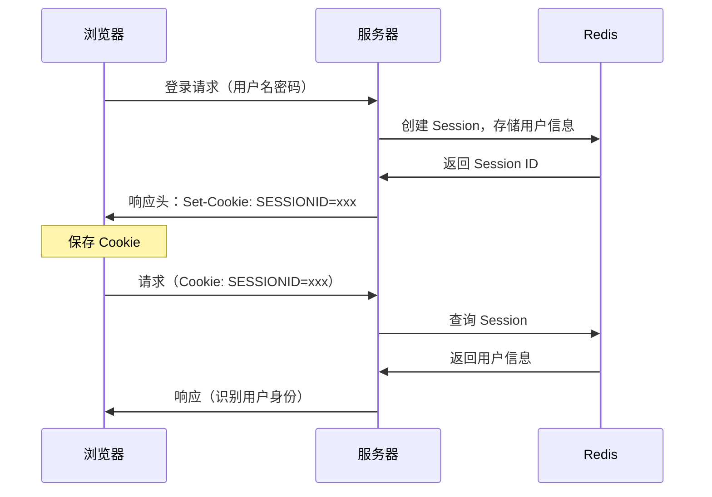

# Session与Cookie

> 目标级别：P5/P6

面试官问：「Session 和 Cookie 有什么区别？」你回答「Cookie 存在客户端，Session 存在服务端」——然后面试官追问：「Session 的 ID 是怎么传递的？」「Session 和 Token 有什么区别？」「分布式 Session 怎么管理？」

Session 和 Cookie 是 Web 开发中最基础也最重要的概念，是理解认证机制的入门。

## 快速自测

面试前先问自己这三个问题：

1. **Session 和 Cookie 的本质区别是什么？** 它们各自存储在哪里？
2. **Session ID 是怎么传递的？** 为什么 Cookie 能实现无状态 HTTP 的会话管理？
3. **Session 和 Token（如 JWT）有什么区别？** 各自适用什么场景？

---

## 一、Cookie 基础

### 1.1 什么是 Cookie

Cookie 是服务端发送到用户浏览器并存储在本地的小块数据。浏览器后续请求会自动携带 Cookie。

```
Cookie 工作流程：

1. 客户端首次请求服务器
2. 服务器在响应头 Set-Cookie 中设置 Cookie
3. 浏览器保存 Cookie
4. 后续请求自动在请求头 Cookie 中携带 Cookie
```

### 1.2 Cookie 属性

| 属性 | 说明 | 示例 |
|------|------|------|
| name | Cookie 名称 | session_id |
| value | Cookie 值 | abc123xyz |
| domain | 生效域名 | .example.com |
| path | 生效路径 | / |
| expires | 过期时间 | Thu, 01 Jan 2030 00:00:00 GMT |
| max-age | 有效期（秒） | 3600 |
| httpOnly | 是否可被 JS 访问 | true/false |
| secure | 是否仅 HTTPS 传输 | true/false |
| SameSite | 跨站请求限制 | Strict/Lax/None |

### 1.3 Cookie 工作流程

```mermaid
sequenceDiagram
    participant C as 浏览器
    participant S as 服务器

    C->>S: 第一次请求（无 Cookie）
    S->>C: 响应头：Set-Cookie: session=abc123; HttpOnly
    Note over C: 保存 Cookie

    C->>S: 第二次请求（自动携带 Cookie）
    Note over C: 请求头：Cookie: session=abc123
    S->>C: 响应（识别用户身份）
```

---

## 二、Session 基础

### 2.1 什么是 Session

Session 是服务端存储的用户会话数据，用于在无状态的 HTTP 协议上维护用户状态。

```
Session 工作流程：

1. 用户登录，服务器创建 Session（存储用户信息）
2. 服务器返回 Session ID 给客户端
3. 客户端后续请求携带 Session ID
4. 服务器通过 Session ID 找到用户数据
```

### 2.2 Session 存储

Session 数据存储在服务端，通常有以下方式：

| 存储方式 | 说明 | 优点 | 缺点 |
|----------|------|------|------|
| 内存 | 存储在进程内存中 | 速度快 | 重启丢失，无法跨进程 |
| 文件 | 存储在磁盘文件 | 持久化 | 速度慢 |
| Redis | 存储在 Redis | 高性能，可分布式 | 需要额外服务 |
| 数据库 | 存储在数据库 | 持久化，可靠 | 速度慢 |

### 2.3 Session 工作流程



---

## 三、Session ID 传递

### 3.1 通过 Cookie 传递

最常用的方式，浏览器自动处理。

```
响应头：
Set-Cookie: SESSIONID=abc123xyz; HttpOnly; Secure; SameSite=Lax

请求头：
Cookie: SESSIONID=abc123xyz
```

### 3.2 通过 URL 传递

当 Cookie 被禁用时使用。

```
URL 方式：
http://example.com/page?session_id=abc123xyz

优点：不依赖 Cookie
缺点：
- 需要在所有链接中追加 Session ID
- 容易被分享泄露
- SEO 不友好
```

### 3.3 隐藏表单传递

用于表单提交场景。

```html
<form action="/submit" method="POST">
  <input type="hidden" name="session_id" value="abc123xyz" />
  <!-- 其他表单字段 -->
</form>
```

---

## 四、Session 与 Cookie 的关系

### 4.1 本质区别

| 维度 | Session | Cookie |
|------|---------|--------|
| 存储位置 | 服务端 | 客户端（浏览器） |
| 存储内容 | 用户数据（如用户信息、购物车） | Session ID 或少量数据 |
| 大小限制 | 无限制（取决于存储） | 每个 Cookie `<= 4KB` |
| 安全性 | 较高（数据在服务端） | 较低（数据在客户端） |
| 生命周期 | 可配置，通常 30 分钟 | 可配置，可长期有效 |

### 4.2 配合使用

实际应用中，Session 和 Cookie 通常配合使用：

```
Cookie：存储 Session ID
Session：存储用户数据

用户数据存储在服务端，只有 Session ID 存在客户端。
这样既保证了安全性（用户数据不泄露），又减少 Cookie 大小。
```

---

## 五、分布式 Session

### 5.1 问题背景

在分布式系统中，同一用户的请求可能发送到不同服务器。

```
问题场景：
1. 用户请求被负载均衡到 Server A，Session 创建在 A
2. 后续请求被负载均衡到 Server B
3. Server B 没有该用户的 Session

解决方案：
- Session 复制
- Session 粘性
- Session 集中存储
```

### 5.2 解决方案

| 方案 | 说明 | 优点 | 缺点 |
|------|------|------|------|
| Session 复制 | 集群间同步 Session | 无需修改代码 | 同步开销大 |
| Session 粘性 | 同一用户路由到同一服务器 | 简单 | 负载不均，服务器故障丢 Session |
| Session 集中存储 | Session 存储在 Redis/MySQL | 支持水平扩展 | 需要额外服务 |

### 5.3 Redis 集中存储

```java
// Spring Session + Redis 配置
@Configuration
@EnableRedisHttpSession(maxInactiveIntervalInSeconds = 1800)
public class SessionConfig {
    // 自动将 Session 存储到 Redis
}

// 应用代码（无感知使用 Session）
@RestController
public class UserController {
    @GetMapping("/user")
    public String getUser(HttpSession session) {
        String userId = (String) session.getAttribute("userId");
        return "User: " + userId;
    }
}
```

### 5.4 Token vs Session

Token（如 JWT）是另一种无状态认证方式：

| 维度 | Session + Cookie | Token |
|------|------------------|-------|
| 存储位置 | Session 在服务端，Cookie 在客户端 | 完全在客户端 |
| 状态 | 有状态（服务端需存储） | 无状态（自包含） |
| 扩展性 | 分布式需额外处理 | 天生支持分布式 |
| 注销 | 服务端删除 Session | 需要黑名单或短有效期 |
| 体积 | 小（只有 Session ID） | 较大（包含用户信息） |

---

## 六、面试题精讲

### 🔴 【高频】Session 和 Cookie 的区别

**问题**：Session 和 Cookie 有什么区别？

**标准答案**：

```
1. 存储位置：
   - Cookie：客户端浏览器
   - Session：服务端

2. 存储内容：
   - Cookie：少量数据（Session ID 或业务数据）
   - Session：大量数据（用户信息、购物车等）

3. 安全性：
   - Cookie：数据在客户端，可被篡改
   - Session：数据在服务端，安全性高

4. 大小限制：
   - Cookie：每个最大 4KB
   - Session：无限制（取决于存储）

5. 生命周期：
   - Cookie：可设置长期有效
   - Session：通常有超时时间

实际使用：
- Cookie 存储 Session ID
- Session 存储用户数据
- 两者配合使用
```

### 🟡 【中频】Session 的工作流程

**问题**：请描述 Session 的工作流程。

**标准答案**：

```
Session 工作流程：

1. 用户首次访问服务器
2. 服务器创建 Session 对象，生成唯一 Session ID
3. 服务器将 Session ID 通过响应头 Set-Cookie 发送给客户端
4. 客户端浏览器保存 Cookie

5. 用户后续请求时，浏览器自动携带 Cookie
6. 服务器根据 Cookie 中的 Session ID 找到对应 Session
7. 获取/修改 Session 中的数据

8. Session 过期或注销后，Session 数据失效
```

### 🟡 【中频】分布式 Session 怎么解决

**问题**：分布式系统中 Session 怎么管理？

**标准答案**：

```
分布式 Session 问题：
同一用户的请求可能路由到不同服务器，导致 Session 找不到。

解决方案：

1. Session 复制
   - 集群间实时同步 Session
   - 缺点：同步开销大，不适合大规模集群

2. Session 粘性（Sticky Session）
   - 负载均衡器保证同一用户路由到同一服务器
   - 缺点：负载不均，服务器故障时 Session 丢失

3. Session 集中存储（推荐）
   - 将 Session 存储在 Redis/MySQL 等共享存储
   - 所有服务器从共享存储读写 Session
   - 优点：支持水平扩展，Session 持久化

4. Token 方案
   - 使用 JWT 等自包含 Token
   - Token 包含用户信息，无需服务端存储
   - 缺点：Token 一旦签发难以注销
```

---

## 七、常见陷阱与易错点

### ⚠️ 陷阱一：混淆 Session 和 Cookie 的用途

Cookie 不仅用于 Session ID 传递，也可以直接存储少量数据（如记住用户名、主题设置）。

### ⚠️ 陷阱二：忽略 Cookie 安全属性

开发中常见错误：敏感 Cookie 没有设置 HttpOnly、Secure、SameSite 属性。

```
敏感 Cookie 应该设置：
Set-Cookie: session=xxx; HttpOnly; Secure; SameSite=Lax

HttpOnly：防止 JavaScript 访问（防 XSS）
Secure：仅 HTTPS 传输
SameSite：防止 CSRF 攻击
```

### ⚠️ 陷阱三：Session 超时设置不合理

- Session 超时太短：用户体验差
- Session 超时太长：安全性风险

### ⚠️ 陷阱四：Session 泄漏

Session ID 生成需要使用安全的随机数，防止被预测或暴力破解。

---

## 八、对比总结

### Session vs Cookie vs Token

| 维度 | Session | Cookie | Token |
|------|---------|--------|-------|
| 存储位置 | 服务端 | 客户端 | 客户端 |
| 数据大小 | 大 | 小（`< 4KB`） | 中（包含数据） |
| 安全性 | 高 | 中 | 中（依赖签名） |
| 状态 | 有状态 | 无状态 | 无状态 |
| 跨域 | 受 Cookie 限制 | 受 SameSite 限制 | 天然支持 |
| 注销控制 | 服务端删除 | 删除 Cookie | 困难 |
| 扩展性 | 需额外方案 | 简单 | 好 |

### Cookie 属性详解

| 属性 | 作用 | 安全建议 |
|------|------|----------|
| HttpOnly | 防止 JS 读取 | 敏感 Cookie 必须设置 |
| Secure | 仅 HTTPS 传输 | 生产环境必须设置 |
| SameSite | 跨站请求限制 | Lax（大多数场景） |
| expires/max-age | 过期时间 | 根据业务需求设置 |

---

## 九、扩展思考

### 💡 加分话题：Cookie 的 SameSite 属性

```
SameSite 属性：
- Strict：完全禁止跨站请求
- Lax：允许部分跨站请求（导航 GET 请求）
- None：允许所有跨站请求（需配合 Secure）

使用场景：
- 严格安全：SameSite=Strict
- 平衡体验和安全：SameSite=Lax
- 需要跨站功能：SameSite=None（必须 Secure）
```

### 💡 加分话题：Session  fixation 攻击

```
Session Fixation 攻击：
攻击者诱使受害者使用攻击者指定的 Session ID，受害者登录后，
攻击者使用同样的 Session ID 劫持会话。

防御措施：
1. 登录后更换 Session ID
2. 定期更换 Session ID
3. 启用 Session 绑定（如绑定 IP、User-Agent）
```

### 💡 加分话题：Session 和 JWT 的选择

```
选择 Session：
- 需要快速注销用户
- Session 数据量大
- 服务端可控性强

选择 JWT：
- 需要支持分布式/微服务
- 需要跨域认证
- 无需即时注销
```

> Session 和 Cookie 是 Web 认证的基础。理解它们的配合使用方式、各自的优缺点，以及在分布式场景下的处理方式，才能设计出既安全又高效的认证系统。