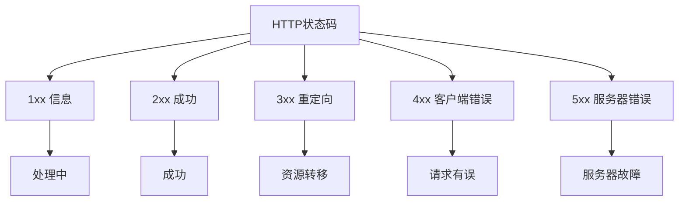
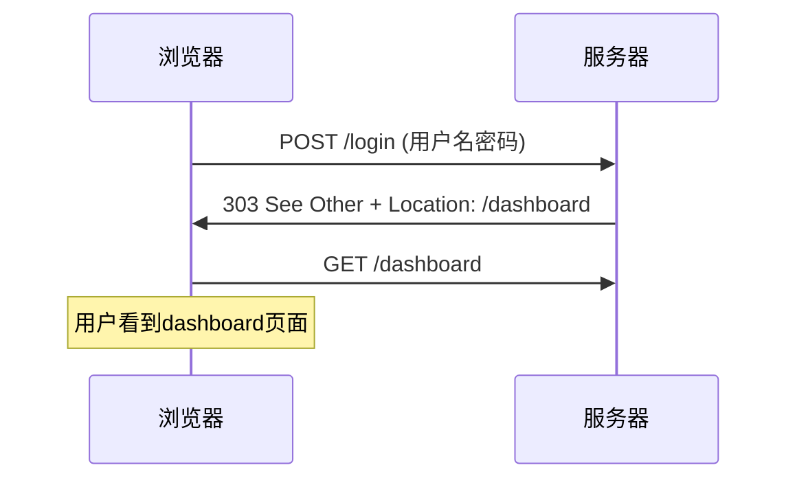
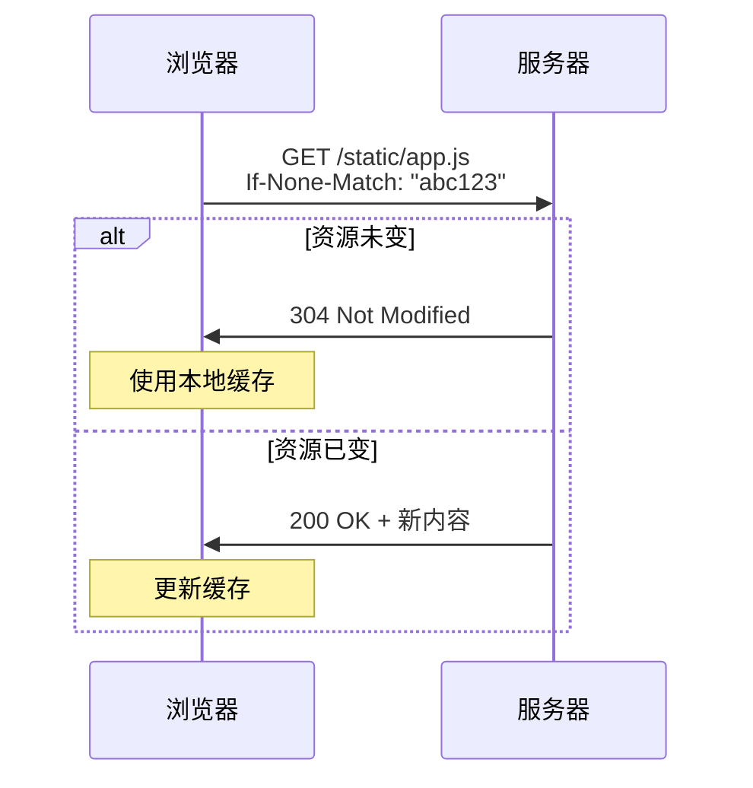
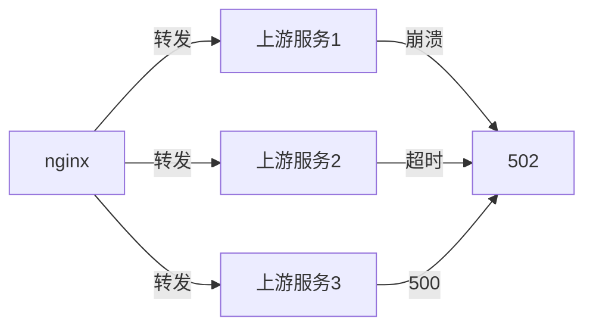
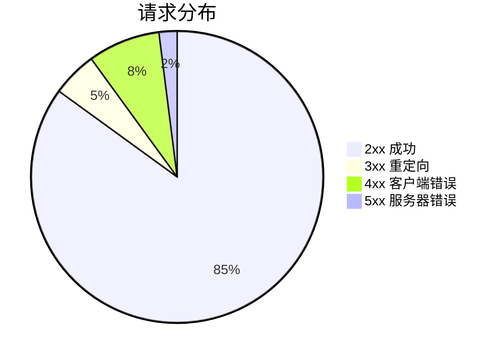

# HTTP状态码分类与常见场景

凌晨两点，监控报警：

"全站502！大量用户无法访问！"

小张爬起来一看nginx日志：

```
2024/01/15 02:00:00 [error] 12345#0: *6789 connect() failed 
to upstream while connecting to upstream
```

小张慌了："502是什么来着？服务器炸了？"

【直观类比】

HTTP状态码就像医院的**检查报告编号**：

- **2xx**：体检合格，各项指标正常
- **3xx**：需要进一步检查（重定向）
- **4xx**：你有问题（客户端错误）
- **5xx**：医院有问题（服务器错误）

知道编号，才能对症下药。

## 状态码分类概览

### 五类状态码



| 类别 | 含义 | 典型场景 |
|------|------|----------|
| 1xx | 信息状态，接收中 | WebSocket升级、100 Continue |
| 2xx | 成功 | 200 OK、201 Created、204 No Content |
| 3xx | 重定向 | 301/302跳转、304缓存 |
| 4xx | 客户端错误 | 400参数错、401未认证、403禁止、404找不到 |
| 5xx | 服务器错误 | 500崩了、502网关错误、503服务不可用、504超时 |

## 2xx 成功状态码 🔴高频

### 200 OK（最常见）

请求成功，返回资源。

```http
HTTP/1.1 200 OK
Content-Type: application/json

{"code": 0, "data": {"name": "张三"}}
```

### 201 Created

资源创建成功，通常用在POST请求。

```http
POST /api/users HTTP/1.1
Content-Type: application/json

{"username": "zhangsan", "email": "zhangsan@example.com"}

# 响应
HTTP/1.1 201 Created
Location: /api/users/123
Content-Type: application/json

{"id": 123, "username": "zhangsan"}
```

**面试追问**：什么时候用200，什么时候用201？

- GET/POST操作已有资源 → 200
- POST真正创建了新资源 → 201

### 204 No Content

成功，但**不返回任何内容**。通常用于DELETE操作。

```http
DELETE /api/users/123 HTTP/1.1

# 响应
HTTP/1.1 204 No Content
```

:::tip 💡
面试官追问"204和200的区别"，答案是：204表示"成功了但没内容给你"，客户端不需要更新页面。比如删除操作，页面上已经删了，不需要再刷新数据。
:::

### 206 Partial Content

范围请求成功，用于断点续传。

```http
# 请求
GET /api/download/large-file.zip HTTP/1.1
Range: bytes=0-1023

# 响应
HTTP/1.1 206 Partial Content
Content-Range: bytes 0-1023/1048576
Content-Length: 1024

[前1KB数据]
```

## 3xx 重定向状态码 🟡常考

### 301 Moved Permanently（永久重定向）

资源**永久**移动到新位置，搜索引擎会更新索引。

```http
# 原URL
GET /old-page HTTP/1.1

# 响应
HTTP/1.1 301 Moved Permanently
Location: https://example.com/new-page
```

**场景**：
- 网站改版，URL结构变化
- 域名切换
- HTTP强制跳HTTPS

**注意**：搜索引擎会传递约90%的PageRank到新URL。

### 302 Found（临时重定向）

资源临时在另一个位置，搜索引擎**不会**更新索引。

```http
HTTP/1.1 302 Found
Location: /temp-page
```

**场景**：
- 维护期间临时跳转
- A/B测试流量分配
- 登录后跳转回来源页

:::warning ⚠️
面试官追问"302和301的区别"，答案是：**301告诉搜索引擎和浏览器"永久搬家了"**，可以缓存，搜索引擎更新索引。**302是"临时住这里"**，不缓存，搜索引擎不更新。

实际使用中的坑：很多老业务代码错误地使用302做登录后跳转，导致POST变GET（有些浏览器会把302的POST转成GET），应该用303 See Other。
:::

### 303 See Other

强制POST转GET，用于登录后跳转。



**为什么不用302？** HTTP/1.0时期，浏览器会把302的POST自动转成GET，但302的设计意图是"临时重定向，不改变请求方法"。303是HTTP/1.1专门解决这个问题。

### 304 Not Modified

资源未修改，使用本地缓存。

```http
# 请求
GET /static/app.js HTTP/1.1
If-None-Match: "abc123"

# 响应（未修改）
HTTP/1.1 304 Not Modified
ETag: "abc123"
```

**304是性能优化**，告诉浏览器"你缓存的版本还能用"，不用再下载一遍。



## 4xx 客户端错误状态码 🔴高频

### 400 Bad Request

请求格式有误，服务器无法理解。

```http
POST /api/users HTTP/1.1
Content-Type: application/json

{"username": 123}  # username应该是字符串

# 响应
HTTP/1.1 400 Bad Request
Content-Type: application/json

{"error": "username must be a string"}
```

**常见场景**：
- JSON格式错误
- 参数类型不对
- 必填参数缺失

### 401 Unauthorized

**未认证**，即"你还没有登录"。

```http
GET /api/profile HTTP/1.1

# 响应
HTTP/1.1 401 Unauthorized
WWW-Authenticate: Bearer realm="api"

{"error": "请先登录"}
```

:::tip 💡
面试官追问"401和403的区别"，答案是：**401是你没有身份证明**（没登录/Token失效），**403是你有身份但权限不够**（登录了但没有这个操作的权限）。
:::

### 403 Forbidden

**已认证但无权限**，或者"服务器拒绝处理这个请求"。

```http
GET /api/admin/users HTTP/1.1
Authorization: Bearer xxx

# 响应（普通用户访问管理接口）
HTTP/1.1 403 Forbidden

{"error": "权限不足"}
```

**注意**：有时候服务器返回403是为了隐藏404（防止恶意扫描）。

### 404 Not Found

资源不存在。

```http
GET /api/users/99999 HTTP/1.1

# 响应
HTTP/1.1 404 Not Found

{"error": "用户不存在"}
```

**常见误区**：不是所有404都真的是"找不到"。有时候是：
- 权限控制：故意返回404而不是403（防止泄露资源存在）
- 服务不可用：某些服务挂了，返回404糊弄过去

### 405 Method Not Allowed

请求方法不支持。

```http
GET /api/users HTTP/1.1

# 响应（该接口只支持POST）
HTTP/1.1 405 Method Not Allowed
Allow: POST

{"error": "该接口只支持POST方法"}
```

### 409 Conflict

资源冲突，常用于并发操作。

```http
POST /api/orders HTTP/1.1
Content-Type: application/json

{"product_id": 123, "quantity": 1}

# 响应（库存不足）
HTTP/1.1 409 Conflict

{"error": "库存不足"}
```

**典型场景**：
- 创建用户时用户名已存在
- 库存扣减时数量不够
- 版本冲突（Optimistic Lock）

### 422 Unprocessable Entity

请求格式正确，但语义错误。

```http
POST /api/users HTTP/1.1
Content-Type: application/json

{"username": "a", "email": "not-an-email"}

# 响应
HTTP/1.1 422 Unprocessable Entity

{"errors": {
    "username": "用户名至少3个字符",
    "email": "邮箱格式不正确"
}}
```

### 429 Too Many Requests

请求过于频繁，触发限流。

```http
HTTP/1.1 429 Too Many Requests
Retry-After: 60
X-RateLimit-Limit: 100
X-RateLimit-Remaining: 0
X-RateLimit-Reset: 1705312800

{"error": "请求过于频繁，请60秒后重试"}
```

## 5xx 服务器错误状态码 🔴高频

### 500 Internal Server Error

服务器内部错误，未知原因崩溃。

```http
HTTP/1.1 500 Internal Server Error
Content-Type: application/json

{"error": "服务器内部错误，请稍后重试"}
```

**这是最不想看到的500**。500表示服务器自己也不知道发生了什么，可能是：
- 代码Bug
- 异常未捕获
- 依赖服务挂了

### 502 Bad Gateway 🔴生产高危

**网关错误**，上游服务器返回了无效响应。



**典型场景**：
- Nginx代理到后端Java/Python服务，后端服务崩溃
- 后端服务内存溢出
- 数据库连接超时

:::warning ⚠️
面试官追问"502和504的区别"，答案是：**502是上游服务器响应了但无效**（崩溃/返回错误），**504是上游服务器响应超时**（没来得及响应）。
:::

### 503 Service Unavailable

服务暂时不可用，通常是过载或维护。

```http
HTTP/1.1 503 Service Unavailable
Retry-After: 300
X-Load-Average: 15.8

{"error": "服务繁忙，请稍后重试"}
```

**典型场景**：
- 服务器过载，触发熔断
- 定时维护窗口
- 突发流量超过承载能力

### 504 Gateway Timeout

网关超时，上游服务响应太慢。

```http
HTTP/1.1 504 Gateway Timeout

{"error": "请求处理超时，请稍后重试"}
```

**典型场景**：
- 数据库查询太慢
- 第三方API超时
- Nginx的proxy_read_timeout配置太短

## 生产问题排查指南

### 状态码分布图



### 常见故障排查

```bash
# 502 Bad Gateway
# 1. 检查上游服务是否存活
curl -f http://upstream:8080/health

# 2. 查看nginx错误日志
tail -f /var/log/nginx/error.log

# 3. 检查上游服务日志
kubectl logs -f deployment/app

# 504 Gateway Timeout
# 1. 增加超时时间
proxy_read_timeout 300;

# 2. 优化上游服务响应速度
# 3. 检查数据库是否慢查询

# 429 Too Many Requests
# 1. 检查限流配置
limit_req_zone $binary_remote_addr zone=api:10m rate=10r/s;

# 2. 实现退避重试策略
```

## 常见误区

### 误区一：404一定是真的找不到

**错！** 有些服务故意返回404来隐藏资源：
- 防止恶意扫描
- 权限控制：没有权限的人看到404而不是403

### 误区二：500比404严重

**不一定。** 500是服务器错误，但可能是：
- 单个接口有问题
- 可以快速降级

而404如果是核心资源，说明路由配置错了。

### 误区三：重定向都是302

**错！** 不同场景用不同的重定向：
- 永久搬迁 → 301
- 临时跳转 → 302（不推荐）
- POST后GET → 303
- 缓存验证 → 304

### 误区四：429说明被攻击了

**不一定。** 429可能是正常的高并发场景：
- 秒杀活动
- API限流保护

要结合业务场景和频率判断。

## 记忆技巧

### 状态码分类口诀

> "1消息、2成功、3重定向、4客户端、5服务器"
> - 1xx：收到请求，继续处理
> - 2xx：处理成功，皆大欢喜
> - 3xx：要搬家，先等等
> - 4xx：你有问题，自己解决
> - 5xx：我有问题，别怪我

### 常见状态码速查

| 状态码 | 含义 | 场景 |
|--------|------|------|
| 200 | OK | 正常成功 |
| 201 | Created | 创建资源成功 |
| 204 | No Content | 删除成功 |
| 301 | 永久重定向 | 域名/URL永久变更 |
| 302 | 临时重定向 | 临时跳转（慎用） |
| 303 | POST转GET | 登录后跳转 |
| 304 | 缓存有效 | 使用本地缓存 |
| 400 | 请求有误 | 参数错误 |
| 401 | 未认证 | 没登录 |
| 403 | 无权限 | 登录了但没权限 |
| 404 | 找不到 | 资源不存在 |
| 429 | 请求过多 | 限流 |
| 500 | 服务器崩了 | 内部错误 |
| 502 | 网关错误 | 上游服务挂了 |
| 503 | 服务不可用 | 过载/维护 |
| 504 | 网关超时 | 上游服务太慢 |

### 4xx/5xx区别

> "4开头是你错，5开头是我错"
> - 4xx：客户端问题，请求格式/参数/权限
> - 5xx：服务端问题，服务崩溃/超时/过载

## 实战检验

### 自测题一

**问题**：登录接口应该返回什么状态码？

**解析**：
- 登录成功 → 200 OK + Token
- 用户不存在 → 401 Unauthorized（而不是404，防止用户名枚举攻击）
- 密码错误 → 401 Unauthorized（和用户名不存在返回相同）
- 账户被禁用 → 403 Forbidden

### 自测题二

**问题**：POST请求创建资源成功，应该返回什么状态码？

**解析**：
- 200 OK + 资源数据：表示"成功处理了请求"
- 201 Created + Location头：表示"创建了新的资源"
- 204 No Content：表示"成功了但没有返回内容"

RESTful规范推荐：
- POST创建资源 → 201 Created
- PUT更新资源 → 200 OK 或 204 No Content

### 自测题三

**问题**：如何设计一个健壮的重试机制？

**解析**：

```javascript
// 根据状态码决定是否重试
const RETRYABLE_STATUS = [408, 429, 500, 502, 503, 504];

async function fetchWithRetry(url, options, maxRetries = 3) {
    for (let i = 0; i < maxRetries; i++) {
        try {
            const response = await fetch(url, options);
            
            if (response.ok) {
                return response.json();
            }
            
            if (!RETRYABLE_STATUS.includes(response.status)) {
                // 4xx客户端错误，不重试
                throw new Error(`HTTP ${response.status}`);
            }
            
            // 检查Retry-After头
            const retryAfter = response.headers.get('Retry-After');
            const delay = retryAfter ? parseInt(retryAfter) * 1000 : Math.pow(2, i) * 1000;
            
            await sleep(delay);
        } catch (error) {
            if (i === maxRetries - 1) throw error;
        }
    }
}
```

---

| 级别 | 考察重点 | 期望回答 | 判分标准 |
|------|----------|----------|----------|
| P5 | 状态码分类 | 能区分2xx/3xx/4xx/5xx | 死记硬背 |
| P6 | 常见状态码含义 | 能说出各场景对应的状态码 | 理解语义 |
| P7 | 生产排查 | 能根据状态码快速定位问题 | 有实战经验 |
