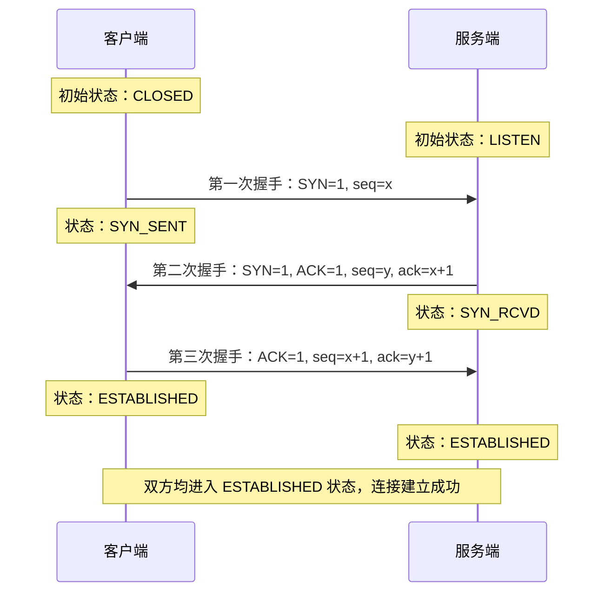
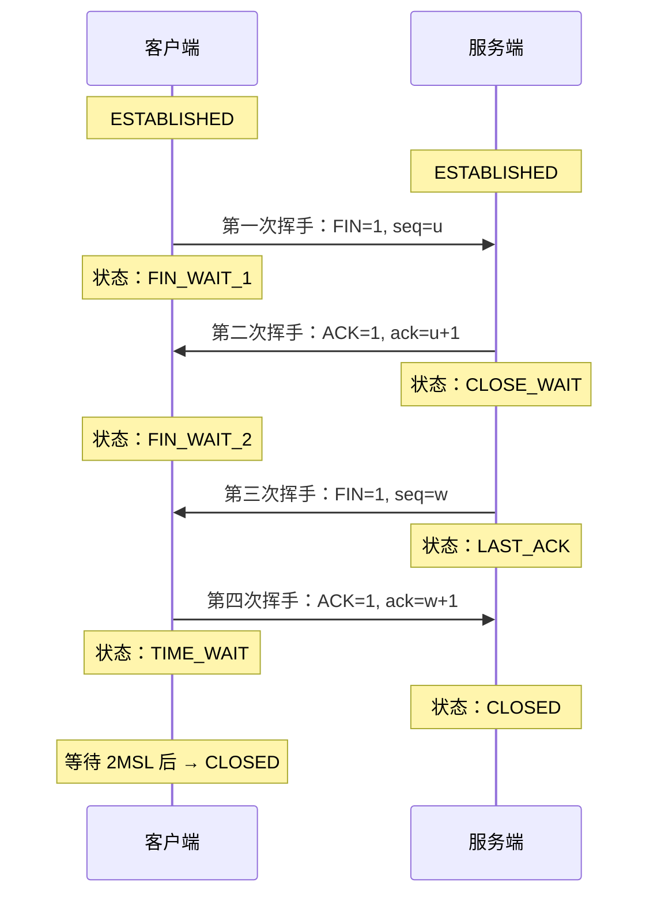

# TCP三次握手与四次挥手

> 目标级别：P5/P6

面试官问：「TCP 是怎么建立连接的？」你回答「三次握手」——然后面试官追问：「为什么是三次而不是两次？」「第三次握手能携带数据吗？」「四次挥手能不能变成三次？」「TIME_WAIT 状态为什么要等 2MSL？」

这些问题如果答不上来，TCP 相关的面试基本就卡住了。

## 快速自测

面试前先问自己这三个问题：

1. **TCP 握手为什么需要三次？** 两次够不够？四次呢？
2. **四次挥手为什么需要等待 2MSL？** MSL 是多少？TIME_WAIT 状态会带来什么问题？
3. **TCP 第三次握手能携带数据吗？** 为什么？

---

## 一、TCP 连接建立：三次握手

### 1.1 握手过程图解



### 1.2 各状态说明

| 状态 | 说明 |
|------|------|
| CLOSED | 初始状态，连接关闭 |
| LISTEN | 服务端监听端口，等待连接 |
| SYN_SENT | 客户端发送 SYN 后进入此状态 |
| SYN_RCVD | 服务端收到 SYN 并回复后进入此状态 |
| ESTABLISHED | 连接建立成功，双方可以传输数据 |

### 1.3 为什么必须是三次？

这是 TCP 面试中出现频率最高的问题。很多候选人能背出「三次握手建立连接」，但被追问「为什么是三次」就答不上来了。

**核心原因：双向通信至少需要三次交互**

TCP 是全双工协议，通信双方都需要确认对方的发送能力和接收能力正常：

| 握手次数 | 能确认的内容 | 结论 |
|----------|--------------|------|
| 1 次 | 客户端能发送、服务端能接收 | 不够 |
| 2 次 | 服务端确认了客户端发送和接收能力，但客户端不知道服务端发送能力 | 不够 |
| 3 次 | 双方互相确认了对方的发送和接收能力 | 够了 |

**两次握手的问题**：如果网络延迟导致旧连接的数据包先到达服务端，服务端会错误地建立连接，而客户端并不需要这个连接。

**四次握手的问题**：三次已经足够确认双方能力，四次是浪费。

### 1.4 面试追问链

> **第一层**：TCP 三次握手的过程是怎样的？
>
> **第二层**：为什么是三次而不是两次？
>
> **第三层**：第三次握手能携带数据吗？为什么？
>
> **第四层**：如果第三次握手丢失，会发生什么？

### 1.5 第三次握手能否携带数据？

**可以**。但只有在连接建立之后（ESTABLISHED 状态）的数据包才能携带数据。

第三次握手时的 ACK 确认包理论上可以携带业务数据，但通常不会这样做，原因：

1. 此时连接刚建立，双方还没有真正的业务数据需要传输
2. 携带数据会增加握手复杂度和延迟
3. 实际应用中，数据传输是在连接建立后才开始

---

## 二、TCP 连接释放：四次挥手

### 2.1 挥手过程图解



### 2.2 为什么是四次挥手？

四次挥手是因为 TCP 的**半关闭**特性。当一方发送 FIN 表示不再发送数据，但仍能接收数据，需要另一方单独回应。

| 次数 | 内容 | 说明 |
|------|------|------|
| 第一次 | 客户端发送 FIN | 客户端不再发送数据，但仍可接收 |
| 第二次 | 服务端回复 ACK | 确认收到，但服务端可能还有数据要发送 |
| 第三次 | 服务端发送 FIN | 服务端数据发送完毕，同意关闭 |
| 第四次 | 客户端回复 ACK | 确认关闭 |

**不能合并的原因**：服务端在收到 FIN 后，可能还需要时间处理缓冲区中的数据，所以先回复 ACK 表示收到了，等处理完再发 FIN。这个过程不能合并。

### 2.3 TIME_WAIT 状态深度解析

TIME_WAIT 是面试中的高频追问点，很多候选人只知道「要等 2MSL」，但不知道为什么、MSL 是多少、有什么问题。

**TIME_WAIT 的两个作用**：

1. **确保迟到的数据包被丢弃**：如果第四次挥手的 ACK 丢失，服务端会重发 FIN。客户端在 TIME_WAIT 期间收到重发的 FIN，能够正常回复 ACK。

2. **让本连接的所有数据包在网络中消失**：防止旧连接的数据包干扰新连接。

**MSL（Maximum Segment Lifetime）**：

- 报文段最大生存时间，Linux 中通常定义为 60 秒
- 2MSL = 120 秒（Linux 默认值）

```c title="Linux MSL 定义"
#define TCP_TIMEWAIT_LEN (60*HZ)  // 60 秒
// 2MSL = TCP_TIMEWAIT_LEN * 2 = 120 秒
```

### 2.4 TIME_WAIT 带来的问题

在高并发服务器上，TIME_WAIT 状态会导致端口耗尽：

| 问题 | 说明 |
|------|------|
| 端口耗尽 | 大量连接关闭后处于 TIME_WAIT，无法创建新连接 |
| 资源占用 | 每个 TIME_WAIT 连接占用一个文件描述符和内存 |

**解决方案**：

```bash
# 1. 调整 TIME_WAIT 超时时间
echo 30 > /proc/sys/net/ipv4/tcp_tw_timeout

# 2. 开启 tcp_tw_reuse，允许重用 TIME_WAIT 状态的连接
echo 1 > /proc/sys/net/ipv4/tcp_tw_reuse

# 3. 开启 tcp_timestamps
echo 1 > /proc/sys/net/ipv4/tcp_timestamps

# 4. 设置 tcp_max_tw_buckets
echo 5000 > /proc/sys/net/ipv4/tcp_max_tw_buckets
```

**服务端最佳实践**：

- 客户端使用短连接，服务端主动关闭连接 → 服务端产生大量 TIME_WAIT
- 解决方案：让客户端主动关闭连接，或者使用连接池复用连接

---

## 三、面试题精讲

### 🔴 【高频】TCP 三次握手过程

**问题**：请描述 TCP 三次握手的过程。

**标准答案**：

```
第一次握手：客户端发送 SYN=1, seq=x，进入 SYN_SENT 状态
第二次握手：服务端收到 SYN，回复 SYN=1, ACK=1, seq=y, ack=x+1，进入 SYN_RCVD 状态
第三次握手：客户端收到服务端的 SYN-ACK，回复 ACK=1, seq=x+1, ack=y+1，进入 ESTABLISHED 状态
服务端收到客户端的 ACK，也进入 ESTABLISHED 状态
```

**加分回答**：

> 如果第三次握手丢失，服务端会重传 SYN-ACK（最多 5 次，每次间隔 1s/2s/4s/8s/16s），之后会断开连接。客户端在发送完 ACK 后会等待一段时间，如果超时则认为连接建立失败。

### 🔴 【高频】为什么是三次握手而不是两次

**问题**：TCP 建立连接为什么需要三次握手？两次不够吗？

**标准答案**：

```
TCP 是全双工协议，双方都需要确认对方的发送和接收能力。

两次握手只能确认一端的发送能力和另一端的接收能力：
- 客户端发送 SYN，服务端回复 ACK → 客户端知道自己的发送能力和服务端的接收能力
- 但客户端不知道服务端的发送能力，服务端也不知道自己的接收能力是否正常

三次握手能够确保双方互相确认对方的发送和接收能力，足够建立可靠的连接。
```

**追问**：如果第三次握手丢失了怎么办？

**答案**：服务端会重传 SYN-ACK，客户端在超时后会重传 ACK。如果多次重传失败，连接建立失败。

### 🟡 【中频】四次挥手为什么需要等待 2MSL

**问题**：四次挥手后为什么要等待 2MSL？

**标准答案**：

```
2MSL 的作用有两个：

1. 确保四次挥手的最后一个 ACK 能到达对端。如果 ACK 丢失，对端会重发 FIN，
   此时客户端需要处于 TIME_WAIT 状态来回复 ACK。

2. 确保本连接的所有数据包都在网络中消失，防止旧连接的数据包干扰新连接。
   如果客户端直接关闭，端口立刻被新连接使用，旧连接的数据包可能在新连接中造成混乱。
```

**追问**：TIME_WAIT 状态会带来什么问题？

**答案**：高并发场景下，大量 TIME_WAIT 连接会占用文件描述符和内存，可能导致端口耗尽。可以使用 tcp_tw_reuse 参数来复用 TIME_WAIT 连接。

### 🟡 【中频】CLOSE_WAIT 状态过多怎么办

**问题**：服务器出现大量 CLOSE_WAIT 状态是什么原因？

**标准答案**：

```
CLOSE_WAIT 状态表示对方已关闭连接，但本端还没有关闭 socket。

原因是代码中没有调用 close() 来关闭连接。可能的情况：
1. 代码逻辑问题：对方关闭了连接，但程序没有正确处理
2. 连接泄漏：某些异常情况下没有释放资源
3. 资源未释放：数据库连接、文件句柄等未关闭

解决方案：
1. 检查代码，确保每次连接使用后都调用 close()
2. 使用连接池管理连接，确保连接正确释放
3. 设置 CLOSE_WAIT 超时时间，强制关闭连接
```

---

## 四、常见陷阱与易错点

### ⚠️ 陷阱一：混淆三次握手和四次挥手的状态变化

很多人把 SYN_SENT 和 SYN_RCVD 的顺序搞混。记住：

- **SYN_SENT**：客户端发送 SYN 后进入
- **SYN_RCVD**：服务端收到 SYN 并回复后进入

### ⚠️ 陷阱二：认为第三次握手不能携带数据

实际上，第三次握手可以携带数据。但在实际应用中，连接刚建立时通常没有业务数据需要传输，所以一般不携带。

### ⚠️ 陷阱三：忽略了 TIME_WAIT 的实际影响

很多候选人只知道 TIME_WAIT 要等 2MSL，但不知道这会导致高并发场景下的端口耗尽问题。这是生产环境中真实存在的问题。

### ⚠️ 陷阱四：把 MSL 当成固定值

MSL 不是固定 60 秒，不同系统可能有不同的默认值。Linux 默认 60 秒，Windows 可能不同。面试时如果被问到，可以说明「通常为 60 秒，但可配置」。

---

## 五、对比总结

### 三次握手 vs 四次挥手

| 对比维度 | 三次握手 | 四次挥手 |
|----------|----------|----------|
| 目的 | 建立连接 | 关闭连接 |
| 能否合并 | 不能合并（需要三次） | 可能合并（四次不能变三次） |
| 半关闭 | 不涉及 | 涉及（TCP 特性） |
| 等待状态 | 无特殊等待 | TIME_WAIT（2MSL） |

### TIME_WAIT vs CLOSE_WAIT

| 状态 | TIME_WAIT | CLOSE_WAIT |
|------|-----------|------------|
| 位置 | 主动关闭方 | 被动关闭方 |
| 含义 | 等待对方确认关闭 | 等待本端关闭连接 |
| 持续时间 | 2MSL（通常 120 秒） | 直到调用 close() |
| 问题 | 端口耗尽、资源占用 | 连接泄漏、资源未释放 |

---

## 六、扩展思考

### 💡 加分话题一：TCP 半打开连接

如果一方崩溃但另一方不知道，连接处于「半打开」状态。TCP 使用心跳机制检测对方是否存活：

```java
// 设置 TCP keepalive
Socket option = new Socket();
option.setKeepAlive(true); // 开启保活
option.setSoTimeout(30000); // 30 秒无响应则检测
```

### 💡 加分话题二：TCP 快速打开（TFO）

TCP Fast Open (TFO) 允许在第三次握手时携带数据，减少握手延迟：

1. 首次连接：正常三次握手
2. 后续连接：客户端可以在 SYN 包中携带数据

### 💡 加分话题三：SYN Flood 攻击与防御

SYN Flood 利用三次握手的缺陷：攻击者发送大量 SYN 但不完成握手，导致服务端维护大量 SYN_RCVD 状态的半开连接。

**防御方案**：

- SYN Cookies：在 SYN-RCVD 时不分配资源，而是用 Cookie 验证
- 减少 SYN-RCVD 超时时间
- 启用 tcp_syncookies

```bash
# 开启 SYN cookies
echo 1 > /proc/sys/net/ipv4/tcp_syncookies
```

> 回到开头的问题：「TCP 为什么是三次握手？」因为 TCP 是全双工协议，双方需要互相确认对方的发送和接收能力，三次交互是理论上的最小值。两次不够，四次浪费。