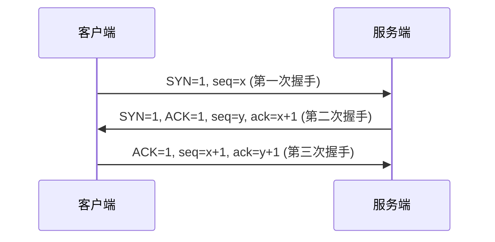
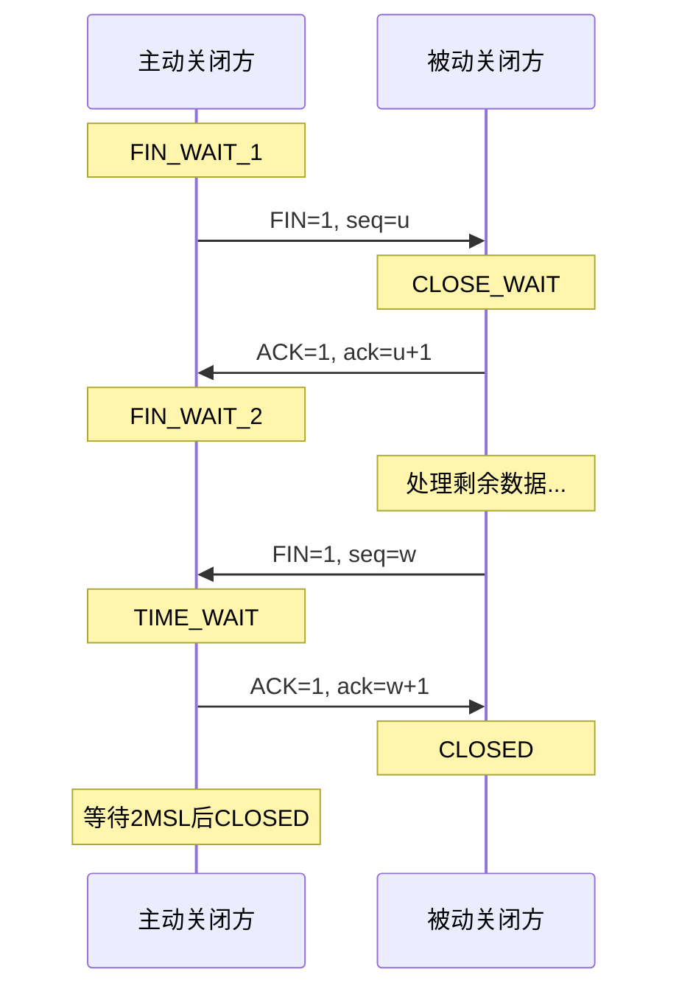

# TCP三次握手与四次挥手

小李在字节面试现场，面试官问：

"TCP是怎么建立连接的？为什么是三次握手而不是两次或四次？"

小张："三次握手是为了确认双方的收发能力都正常。"

面试官追问："那四次挥手呢？挥手过程中为什么要等2MSL？"

小张支支吾吾："为了...确保对方收到？"

面试官："那为什么不是三次挥手？"

小张彻底卡住。

【直观类比】

**三次握手就像打电话**：

1. **你拨打电话**（第一次握手）：你说"喂？"，对方知道你能发、我能收
2. **对方接起电话**（第二次握手）：对方说"你好"，对方知道你收得到、我能发
3. **你说"我是XX"**（第三次握手）：你确认双方都能正常通信，握手完成

**四次挥手就像挂电话**：

1. **你说"我说完了"**：主动关闭方发送FIN，进入FIN_WAIT_1
2. **对方说"知道了"**：被动关闭方发送ACK，进入CLOSE_WAIT
3. **对方说"我也说完了"**：被动关闭方发送FIN，进入LAST_ACK
4. **你说"好的，再见"**：主动关闭方发送ACK，进入TIME_WAIT

## 为什么需要握手？

TCP是**面向连接**的协议，UDP是**无连接**的。

"连接"本质上是双方协商一致的一个**状态**：

1. **确认对方存在**：我能联系到你
2. **协商参数**：最大报文段长度、窗口大小等
3. **分配资源**：为连接分配缓冲区、变量

没有握手，后面的数据传输就是"盲发"——不知道对方在不在、收不收得到、能不能处理。

:::tip 💡
面试官追问"UDP能不能实现可靠传输"，答案是"能"，但需要在自己应用层实现确认、重传、排序等机制。比如QUIC就是基于UDP实现可靠传输的。
:::

## 三次握手详解

### 握手过程图解



### 三次握手的具体含义

**第一次握手：SYN**

客户端发送SYN包（SYN=1），带上初始序列号`seq=x`。

**服务端收到后知道**：客户端想建立连接，客户端的发送能力正常。

**第二次握手：SYN+ACK**

服务端发送SYN+ACK包（SYN=1, ACK=1），带上服务端初始序列号`seq=y`，确认号`ack=x+1`。

**客户端收到后知道**：服务端接收能力正常（能收到我的SYN），服务端的发送能力正常（我能收到它的响应）。

**第三次握手：ACK**

客户端发送ACK包（ACK=1），序列号`seq=x+1`，确认号`ack=y+1`。

**服务端收到后知道**：客户端接收能力正常（能收到我的SYN+ACK），双方收发能力都OK，连接建立成功。

### 关键问题：为什么是三次？

**两次握手的致命问题**：无法确认双向通信是否畅通。

如果网络延迟导致第一次握手的SYN包"幽灵送信"（服务端以为客户端要建立连接），服务端建立连接并分配资源，但客户端根本没收到这个响应，连接就废了。

**三次握手保证**：
- 第一次：客户端确认自己能发
- 第二次：客户端确认服务端能收+能发
- 第三次：服务端确认客户端能收

四次握手？理论上可以，但没必要——第三次握手已经完成了双向确认，第四次是冗余的。

### 半连接队列与全连接队列

服务端有两个队列：

1. **半连接队列（SYN Queue）**：完成第一次握手，等待第二次握手
2. **全连接队列（Accept Queue）**：完成三次握手，等待应用层accept

**生产问题**：

```
# 查看队列溢出
netstat -s | grep -i "overflow"
```

如果全连接队列满了，新连接会被丢弃，客户端会超时重试。

```java
// 解决方案：调大队列+快速回收
// /proc/sys/net/core/somaxconn
// /proc/sys/net/ipv4/tcp_tw_reuse
```

:::warning ⚠️
面试官追问"SYN Flood攻击"，这是经典的DDoS攻击。攻击者发送大量SYN包但不完成握手，占满半连接队列。解决方案：SYN Cookie、减少SYN+ACK重试次数、升级内核。
:::

## 四次挥手详解

### 挥手过程图解



### 为什么是四次？

**因为TCP是全双工协议**。连接关闭时，每一方都需要单独发送FIN，对方单独确认。

主动关闭方说"我没数据要发了"，但被动关闭方可能还有数据没发完，所以：

1. 主动方发送FIN：表示"我发完了"
2. 被动方发送ACK：表示"收到，等我处理完"
3. 被动方发送FIN：表示"我也发完了"
4. 主动方发送ACK：表示"收到，再见"

### 2MSL的意义

**MSL（Maximum Segment Lifetime）**：报文最大生存时间，Linux默认为60秒。

2MSL = 120秒（可以配置）

**为什么等待2MSL？**：

1. **确保被动关闭方收到最后的ACK**：如果ACK丢了，被动关闭方会重发FIN，主动关闭方需要在这个窗口内重新发送ACK
2. **让旧连接的报文在网络中消散**：防止新连接收到旧连接的延迟报文

```bash
# 查看和修改MSL
cat /proc/sys/net/ipv4/tcp_fin_timeout  # 查看TIME_WAIT超时时间
echo 30 > /proc/sys/net/ipv4/tcp_fin_timeout  # 改为30秒
```

### 挥手状态机

| 主动方状态 | 含义 |
|----------|------|
| FIN_WAIT_1 | 已发送FIN，等待ACK |
| FIN_WAIT_2 | 已收到ACK，等待对方FIN |
| TIME_WAIT | 收到对方FIN并发送ACK，等待2MSL |
| CLOSING | 双方同时发起关闭（少见） |

| 被动方状态 | 含义 |
|----------|------|
| CLOSE_WAIT | 收到FIN，等待应用层关闭 |
| LAST_ACK | 等待最后的ACK |

## 边界与特例

### 1. 同时打开（Simultaneous Open）

两台机器同时向对方发送SYN并收到对方的SYN，这种情况下会进入SYN_SENT和SYN_RECEIVED状态的组合，最终建立连接。

### 2. 同时关闭（Simultaneous Close）

双方同时发送FIN，导致同时进入CLOSING状态。

### 3. 连接复位（RST）

RST是一种强制终止连接的方式，不走正常挥手流程：

- 收到不存在的连接
- 应用程序主动调用close()并设置SO_LINGER
- 服务端崩溃重启

```java
// 发送RST的场景
socket.setSoLinger(true, 0);  // 强制关闭，发送RST
```

### 4. 保活机制（Keep-Alive）

TCP Keep-Alive不是HTTP Keep-Alive！

- **TCP Keep-Alive**：空闲时发送探测包，检测连接是否存活
- **HTTP Keep-Alive**：复用TCP连接，减少握手开销

```
# Linux TCP保活参数
/proc/sys/net/ipv4/tcp_keepalive_time      # 默认7200秒
/proc/sys/net/ipv4/tcp_keepalive_intvl     # 重试间隔
/proc/sys/net/ipv4/tcp_keepalive_probes    # 重试次数
```

:::warning ⚠️
面试官追问"什么时候用TCP保活"，答案是：长连接场景、检测对端崩溃或网络中断。但默认不开启，因为会产生额外开销。
:::

## 常见误区

### 误区一：握手时交换的是"数据"

**错！** 三次握手交换的是**控制信息**（SYN、ACK、seq），不携带应用层数据。真正的数据传输是在三次握手完成之后。

### 误区二：seq是递增的序号

**不完全对**。seq是初始序列号，是随机的（防止攻击），不是从0或1开始的。seq的变化规律是：发送N字节数据，seq增加N。

### 误区三：四次挥手后连接立即关闭

**错！** 主动关闭方会进入TIME_WAIT状态，等待2MSL后才真正关闭。这是容易被忽略的性能瓶颈——高并发短连接场景下，TIME_WAIT连接会占满端口。

### 误区四：RST关闭不需要等待

**对！** RST是强制关闭，不走挥手流程，不需要等待2MSL。但RST可能造成数据丢失。

## 记忆技巧

### 握手口诀

> "一问二答三确认"
> - 一问：客户端发SYN
> - 二答：服务端发SYN+ACK
> - 三确认：客户端发ACK

### 挥手口诀

> "主动先FIN，被动先ACK；被动再FIN，主动再ACK"
> - 主动方先进先出
> - 被动方"等我处理完再挥手"

### 状态转移图

```
客户端：                  服务端：
CLOSED → SYN_SENT → FIN_WAIT_1 → FIN_WAIT_2 → TIME_WAIT → CLOSED
            ↑                                        ↓
            └────────────────────────────────────────┘
                LISTEN → SYN_RECEIVED → ESTABLISHED
                                              ↓
                                    CLOSE_WAIT → LAST_ACK → CLOSED
```

## 实战检验

### 自测题一

**问题**：为什么服务端更容易受到SYN Flood攻击？

**解析**：
服务端在收到SYN后分配资源并放入半连接队列。如果攻击者发送大量SYN但不完成握手，队列会被占满，服务端无法响应正常请求。

### 自测题二

**问题**：如果第三次握手失败，服务端会怎么做？

**解析**：
服务端发送SYN+ACK后等待客户端的ACK，超时后重试（默认5次）。如果一直收不到ACK，服务端会关闭这个半连接。

### 自测题三

**问题**：在高并发场景下，如何处理TIME_WAIT过多的问题？

**解析**：
1. 客户端：启用`tcp_tw_reuse`（复用TIME_WAIT连接）
2. 服务端：调大本地端口范围`ip_local_port_range`
3. 服务端：使用连接池避免频繁创建连接
4. 服务端：设置`socket`选项`SO_LINGER`强制发送RST

```bash
# 常用优化参数
echo 1 > /proc/sys/net/ipv4/tcp_tw_reuse
echo 60000 > /proc/sys/net/ipv4/ip_local_port_range
echo 262144 > /proc/sys/net/core/somaxconn
```

---

| 级别 | 考察重点 | 期望回答 | 判分标准 |
|------|----------|----------|----------|
| P5 | 握手/挥手基本流程 | 能画出三次握手和四次挥手图 | 死记硬背 |
| P6 | 状态转换和原因 | 能解释为什么是三次/四次，2MSL含义 | 理解原理 |
| P7 | 生产问题与优化 | 能说出SYN Flood、TIME_WAIT等问题的解决方案 | 有实战经验 |
