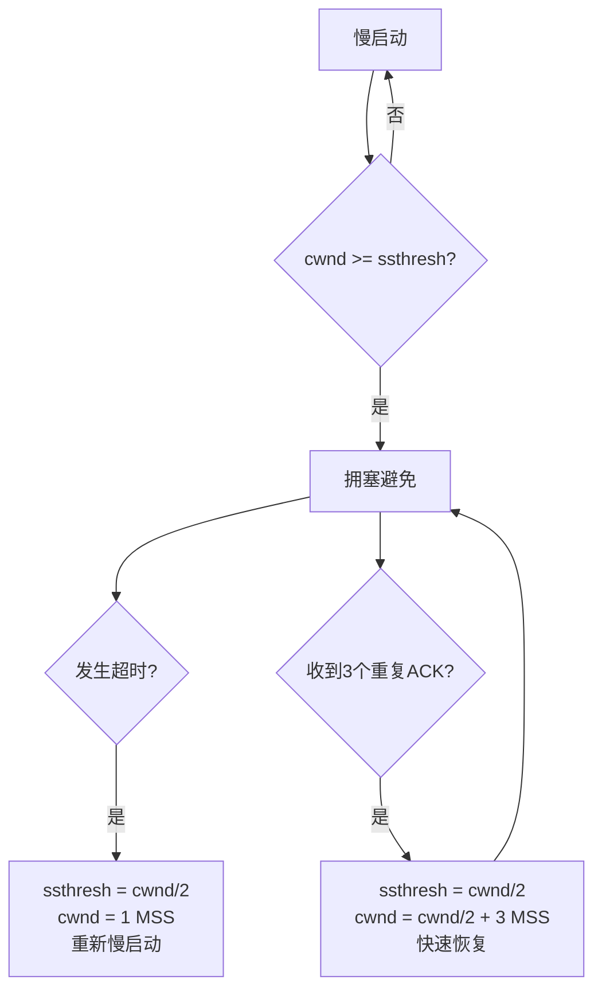

# TCP可靠传输机制

> 目标级别：P6

面试官问：「TCP 是怎么保证可靠传输的？」你回答「确认应答、超时重传」——然后面试官追问：「序列号是怎么设计的？」「RTO 是怎么计算的？」「流量控制和拥塞控制是一回事吗？」

TCP 的可靠传输是面试中的高频追问点，考察候选人对协议底层的理解深度。

## 快速自测

面试前先问自己这三个问题：

1. **TCP 可靠传输的核心机制有哪些？** 光说确认应答和重传够不够？
2. **序列号是怎么设计的？** 为什么初始序列号 ISN 是随机值？
3. **RTO（超时重传时间）是怎么计算的？** 为什么不能固定？

---

## 一、可靠传输的四大机制

TCP 通过以下四种机制保证可靠传输：

| 机制 | 说明 |
|------|------|
| 校验和 | 检测数据在传输过程中的损坏 |
| 序列号 | 解决乱序问题和重复数据问题 |
| 确认应答（ACK） | 确认收到的数据 |
| 超时重传 | 数据丢失时自动重传 |

### 1.1 校验和（Checksum）

TCP 在头部包含一个 16 位的校验和字段，用于检测数据在传输过程中的损坏。

```
TCP 校验和计算范围：
- TCP 头部
- TCP 数据部分
- 伪头部（源 IP、目的 IP、协议号、TCP 长度）
```

如果校验和失败，TCP 会丢弃该数据段，不发送 ACK，等待超时重传。

### 1.2 序列号（Sequence Number）

序列号是 TCP 可靠传输的核心。每一个字节的数据在传输时都会被分配一个序列号。

**序列号的作用**：

1. **解决乱序问题**：接收端可以根据序列号重新排序
2. **去除重复数据**：接收端根据序列号丢弃重复数据
3. **确认应答的基础**：ACK 确认的是「下一个期望收到的序列号」

**初始序列号 ISN（Initial Sequence Number）**：

TCP 连接建立时，双方会随机选择一个初始序列号。RFC 793 规定 ISN 需要随机生成。

```java
// ISN 随机化的重要性：防止旧连接的数据包干扰新连接
// 如果 ISN 是固定值，攻击者可以伪造序列号进行连接欺骗
```

**为什么 ISN 要随机？**

```
如果 ISN 是固定值（如每次都从 0 开始）：
- 假设客户端与服务端建立连接，传输数据后关闭
- 旧连接的数据包可能延迟到达
- 如果新连接的 ISN 和旧连接相同，延迟的数据包可能被当作新连接的数据

随机 ISN 使得旧连接的序列号与新连接的序列号空间不重叠，
极大降低了旧数据包被误认为新数据的可能性。
```

### 1.3 确认应答（ACK）

TCP 采用**累计确认**机制：ACK 确认的是「下一个期望收到的字节序列号」，而不是每个包都确认。

```
举例：
发送方发送了 0-999 字节的数据
接收方回复 ACK = 1000，表示「前 1000 字节都收到了，下一个期望 1000」
这叫做累计确认（Cumulative ACK）

好处：
- 如果 ACK=1000 到达，说明 0-999 全部收到
- 即使中间某些 ACK 丢失，只要最后一个 ACK 到达即可
```

**超时情况**：

如果发送方发送了 1000-1999，没有收到 ACK（超时），会重传 1000-1999。
接收方收到后会再次回复 ACK = 2000。

### 1.4 超时重传（Retransmission）

当发送的数据在一定时间内没有收到 ACK，就会触发重传。

**重传触发条件**：

| 条件 | 说明 |
|------|------|
| 超时 | RTO 时间内没收到 ACK |
| 快速重传 | 收到 3 个重复 ACK（表示数据丢失） |

**快速重传机制**：

```
正常情况：发送方发送 1,2,3,4,5
丢失情况：数据包 2 丢失

接收方收到 1，回复 ACK = 2（下一个期望 2）
收到 3，回复 ACK = 2（重复 ACK）
收到 4，回复 ACK = 2（重复 ACK）
收到 5，回复 ACK = 2（重复 ACK）

发送方收到 3 个重复 ACK = 2，触发快速重传，立即重传数据包 2
```

---

## 二、超时重传时间（RTO）

RTO（Retransmission Timeout）是 TCP 可靠传输的关键参数，设得太长会延迟恢复，设得太短会触发大量不必要的重传。

### 2.1 RTT 与 RTO

- **RTT（Round Trip Time）**：往返时间，从发送数据到收到 ACK 的时间
- **RTO（Retransmission Timeout）**：超时时间，通常略大于 RTT

```java
// RTO 计算公式
RTO = RTT + 时延抖动(RTTVAR) * 4

// 经典算法：Jacobson 算法
RTT = (1 - α) * 旧RTT + α * 新RTT  // α 通常取 0.125
RTTVAR = (1 - β) * 旧RTTVAR + β * |RTT - 旧RTT|  // β 通常取 0.25
RTO = RTT + 4 * RTTVAR
```

### 2.2 RTT 测量

```
第一次测量 RTT：
发送 SYN，收到 SYN-ACK，记录时间 t1
RTT = t1 - t0

后续测量：
发送数据段，收到 ACK，记录时间
RTT = 新测量的值
```

### 2.3 Karn 算法

如果数据段超时重传，收到 ACK 后无法判断这个 ACK 是对应哪次发送：

- 重传前的数据 ACK？
- 重传后的数据 ACK？

**Karn 算法**：当发生重传时，不更新 RTT 估计，避免 RTO 计算不准确。同时使用「退避系数」增大 RTO。

```java
// Karn 算法伪代码
if (数据段超时重传) {
    // 不更新 RTT
    // 退避 RTO
    RTO = RTO * 2;  // 指数退避
} else {
    // 正常更新 RTT 和 RTO
    updateRTT();
    updateRTO();
}
```

---

## 三、流量控制（Flow Control）

流量控制和拥塞控制经常被混淆。实际上这是两个不同的概念：

| 概念 | 目的 | 控制者 | 依据 |
|------|------|--------|------|
| 流量控制 | 防止发送方过快，淹没接收方 | 接收方 | 接收方缓冲区大小 |
| 拥塞控制 | 防止发送方过快，压垮网络 | 发送方 | 网络拥塞程度 |

### 3.1 滑动窗口（Sliding Window）

TCP 通过滑动窗口机制实现流量控制。

```
发送方窗口示意：
[已发送已确认][已发送未确认][允许发送][不允许发送]
   0-999      1000-1999    2000-2999   3000+

窗口大小 = 1000（允许发送的范围）
```

**窗口收缩小技巧**：当接收方窗口缩小时，不能直接缩小窗口，而是通知发送方「你的可用窗口变小了」，发送方自然减慢速度。

### 3.2 窗口字段

TCP 头部有一个 16 位的窗口字段，用于通知对方自己的接收窗口大小。

```
窗口字段：16 位，最大值 65535 字节
但在 TCP 选项中有 Window Scale 选项，可以扩展到 1GB
```

```java
// 窗口扩展因子
// 发送方和接收方协商 Window Scale 选项
// 实际窗口大小 = 窗口字段 * 2^scale_factor
// scale_factor 最大为 14
```

### 3.3 零窗口与窗口探测

当接收方缓冲区满了，窗口字段为 0，发送方停止发送数据。

**问题**：如果接收方应用程序消费了数据，窗口打开，但通知丢失了怎么办？

**解决方案**：发送方会定期发送**窗口探测（Window Probe）**，强制接收方回复当前窗口大小。

```
发送方发送窗口探测（1 字节数据）
接收方回复 ACK，窗口字段 = 0 或 窗口大小
如果窗口打开，发送方立即发送数据
```

---

## 四、拥塞控制（Congestion Control）

拥塞控制是 TCP 最重要的机制之一，防止发送方压垮整个网络。

### 4.1 拥塞控制四算法



| 算法 | 说明 | 触发条件 |
|------|------|----------|
| 慢启动（Slow Start） | 初始 cwnd = 1 MSS，之后指数增长 | 连接建立时、超时重传后 |
| 拥塞避免（Congestion Avoidance） | 线性增长 | cwnd >= ssthresh |
| 快速重传（Fast Retransmit） | 收到 3 个重复 ACK 时立即重传 | 收到 3 个重复 ACK |
| 快速恢复（Fast Recovery） | 重传后进入拥塞避免 | 快速重传后 |

### 4.2 慢启动详解

**慢启动的目的**：不要一开始就用大窗口发送数据，先探测网络的承载能力。

```
cwnd（拥塞窗口）增长曲线：
cwnd = 1 MSS
↓
cwnd = 2 MSS     (ACK 确认后翻倍)
↓
cwnd = 4 MSS
↓
cwnd = 8 MSS
↓
...
直到 cwnd >= ssthresh，进入拥塞避免
```

**ssthresh（慢启动阈值）**：

- 当 cwnd 达到 ssthresh 时，从指数增长切换到线性增长
- 初始值通常很大（65535 字节或更大）

### 4.3 拥塞避免

在拥塞避免阶段，每收到一个 ACK，cwnd 增加 1 MSS。

```
线性增长：cwnd += MSS * MSS / cwnd
假设 cwnd = 10 MSS，收到 10 个 ACK
cwnd 增加约 1 MSS
```

### 4.4 快速重传与快速恢复

**快速重传触发条件**：收到 3 个重复 ACK（表示数据可能丢失）

**为什么是 3 个？**

```
- 1 个重复 ACK：可能是网络抖动
- 2 个重复 ACK：可能是乱序，不一定丢失
- 3 个重复 ACK：几乎确定是丢包，不是乱序
```

**快速恢复流程**：

```
1. ssthresh = cwnd / 2
2. cwnd = ssthresh + 3 * MSS  (3 个 ACK 已确认了 3 个数据包)
3. 快速重传丢失的数据包
4. 进入拥塞避免阶段
```

---

## 五、面试题精讲

### 🔴 【高频】TCP 可靠传输机制

**问题**：TCP 是如何保证可靠传输的？

**标准答案**：

```
TCP 通过以下机制保证可靠传输：

1. 校验和：TCP 头部包含校验和，检测数据损坏
2. 序列号：每个字节分配序列号，解决乱序和重复问题
3. 确认应答（ACK）：采用累计确认，ACK=n 表示 n 之前的数据都收到了
4. 超时重传：当数据在 RTO 时间内未收到 ACK，自动重传
5. 流量控制：通过滑动窗口限制发送速率，防止接收方淹没
6. 拥塞控制：慢启动、拥塞避免、快速重传等算法控制网络负载
```

### 🟡 【中频】TCP 滑动窗口

**问题**：什么是 TCP 滑动窗口？有什么作用？

**标准答案**：

```
滑动窗口是 TCP 流量控制的核心机制：

1. 发送方维护一个窗口，表示「已发送未确认」+ 「允许发送」的范围
2. 收到 ACK 后，窗口向前滑动，允许发送新的数据
3. 接收方通过窗口字段告知发送方自己的接收能力

窗口大小动态调整：
- 接收方缓冲区满时，窗口字段为 0，发送方停止发送
- 应用程序消费数据后，窗口打开，发送方继续发送
```

### 🟡 【中频】拥塞控制四算法

**问题**：TCP 拥塞控制有哪些算法？

**标准答案**：

```
1. 慢启动：初始 cwnd = 1 MSS，指数增长，直到达到 ssthresh
2. 拥塞避免：cwnd >= ssthresh 后，线性增长
3. 快速重传：收到 3 个重复 ACK，立即重传丢失的数据包
4. 快速恢复：快速重传后，进入拥塞避免而非重新慢启动

发生超时时：ssthresh = cwnd/2，cwnd = 1 MSS，重新慢启动
收到 3 个重复 ACK：ssthresh = cwnd/2，cwnd = ssthresh + 3 MSS，快速恢复
```

### 🟢 【低频】RTO 是怎么计算的

**问题**：TCP 的 RTO（超时重传时间）是如何计算的？

**答案**：TCP 使用 Jacobson 算法计算 RTO，结合 RTT 和 RTTVAR（往返时延抖动）。公式为 `RTO = RTT + 4 * RTTVAR`。当发生重传时，使用 Karn 算法，不更新 RTT，并采用指数退避策略。

---

## 六、常见陷阱与易错点

### ⚠️ 陷阱一：混淆流量控制和拥塞控制

这是最常见的混淆点：

- **流量控制**：保护**接收方**不被淹没（接收方缓冲区）
- **拥塞控制**：保护**网络**不被压垮（整个网络路径）

### ⚠️ 陷阱二：认为 RTO 固定不变

RTO 是动态计算的，根据网络状况调整。如果 RTO 固定，网络拥塞时会雪上加霜。

### ⚠️ 陷阱三：忽略累计确认的含义

很多候选人知道「确认应答」，但不理解累计确认的深层含义。累计确认使得部分 ACK 丢失时不影响传输，只要最后一个 ACK 到达即可。

### ⚠️ 陷阱四：混淆快速重传和超时重传

| 机制 | 触发条件 | 时机 |
|------|----------|------|
| 快速重传 | 3 个重复 ACK | 数据丢失后很快触发（毫秒级） |
| 超时重传 | RTO 到期 | 数据丢失后较晚触发（取决于 RTO） |

---

## 七、对比总结

### 流量控制 vs 拥塞控制

| 维度 | 流量控制 | 拥塞控制 |
|------|----------|----------|
| 目的 | 防止接收方淹没 | 防止网络压垮 |
| 控制者 | 接收方 | 发送方 |
| 依据 | 接收方缓冲区大小 | 网络拥塞程度 |
| 实现 | 滑动窗口 | 慢启动、拥塞避免、快速重传 |
| 范围 | 点对点（两个端点） | 端到端（整个网络路径） |

### 拥塞控制策略对比

| 事件 | 慢启动阈值 | 拥塞窗口 | 后续行为 |
|------|-----------|----------|----------|
| 超时 | ssthresh = cwnd/2 | cwnd = 1 MSS | 重新慢启动 |
| 3 个重复 ACK | ssthresh = cwnd/2 | csthresh + 3 MSS | 快速恢复 |

---

## 八、扩展思考

### 💡 加分话题：BBR 拥塞控制算法

Google 提出的 BBR（Bottleneck Bandwidth and RTT）是一种新的拥塞控制算法，不基于丢包检测，而是基于带宽和 RTT 探测。

```
BBR vs 传统算法：
- 传统算法：基于丢包，丢包 → 拥塞 → 降低速率
- BBR：基于模型，实时估计可用带宽和最小 RTT

BBR 的优势：
- 在高带宽高延迟网络中性能更好
- 不需要等到丢包才降速
```

### 💡 加分话题：TCP 保活机制（Keepalive）

TCP 有 Keepalive 机制，用于检测半开连接（对方崩溃但本端不知道）：

```
保活定时器：
- 7200 秒无活动，发送保活探测包
- 每 75 秒探测一次，最多 9 次
- 对方无响应则断开连接
```

> TCP 的可靠传输不是单一机制，而是多个机制的协同：校验和检测损坏、序列号解决乱序、确认应答确认接收、超时重传恢复丢失、流量控制和拥塞控制调节速率。理解这些机制如何协同工作，才是真正掌握 TCP 可靠传输的关键。