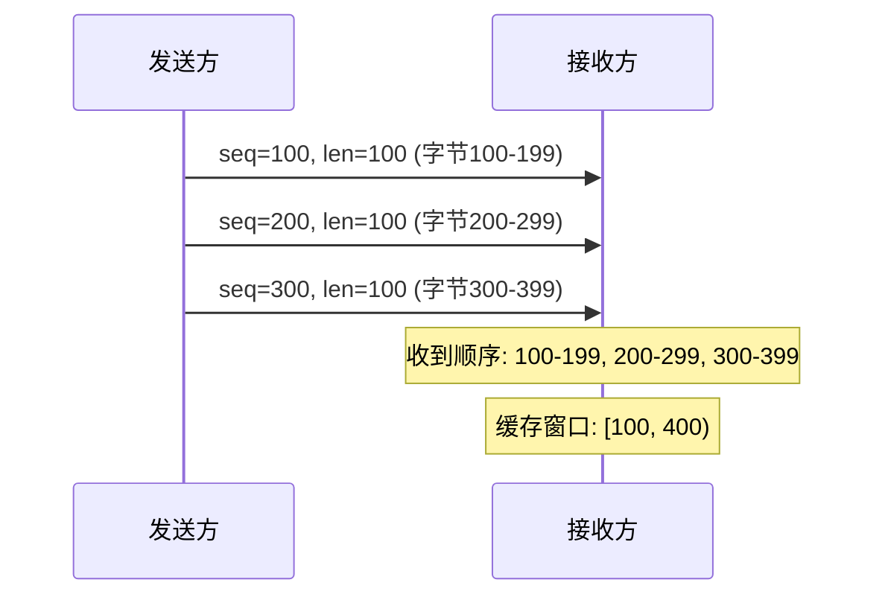
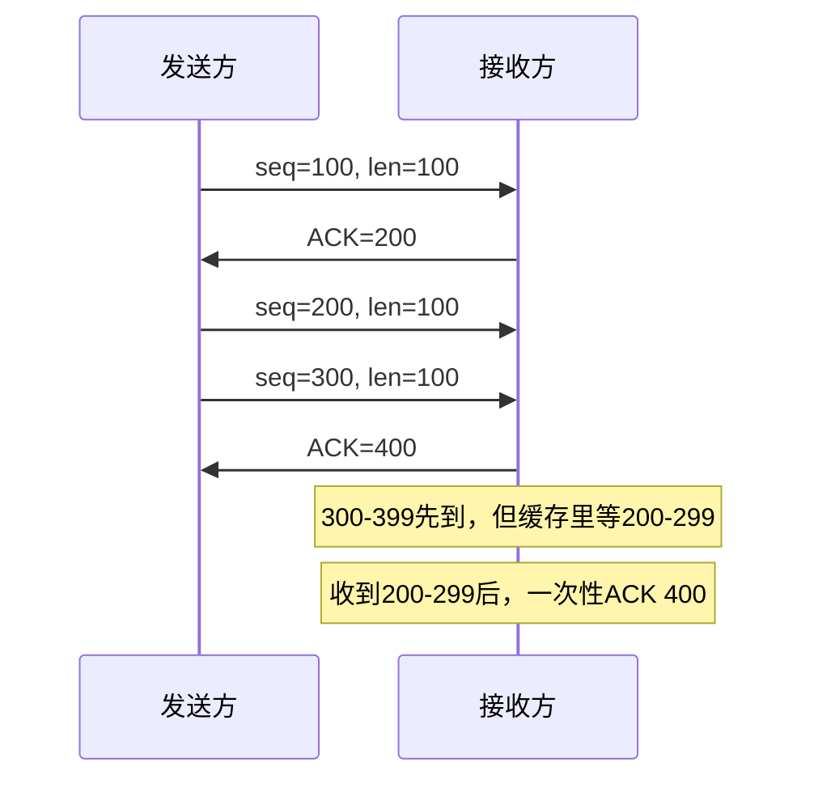
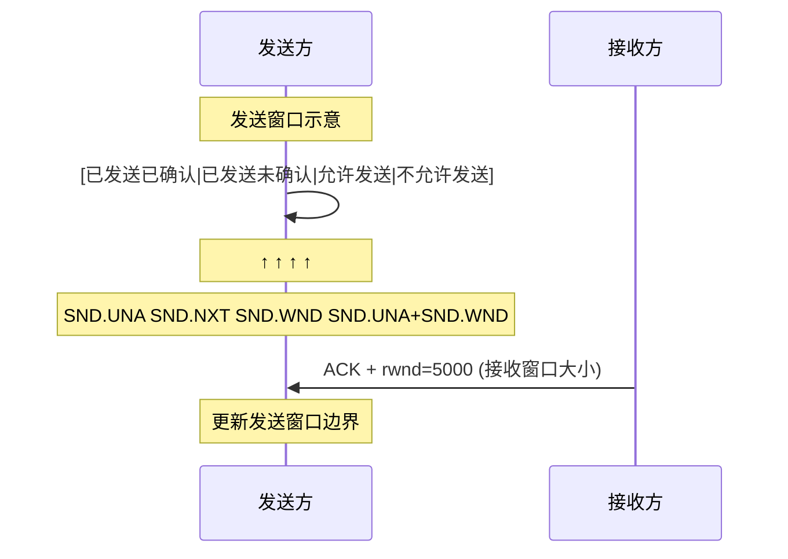
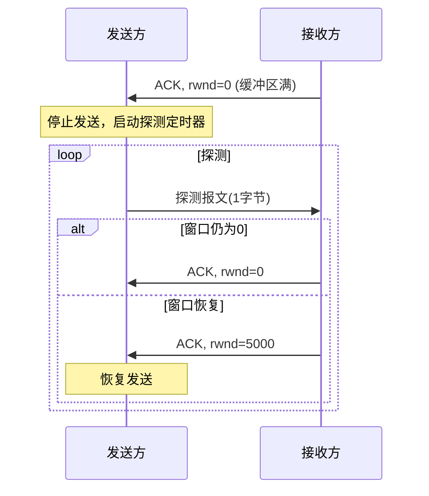
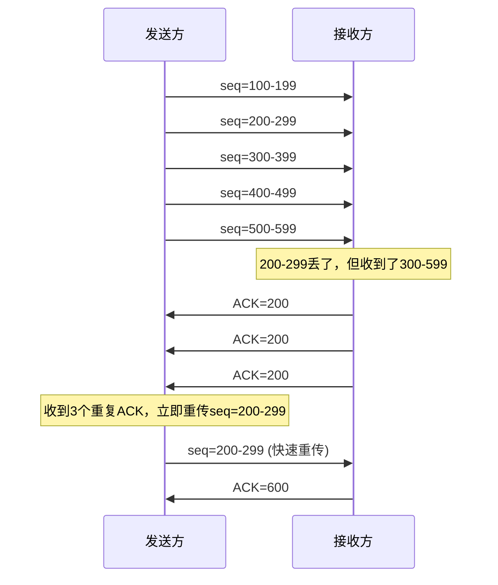
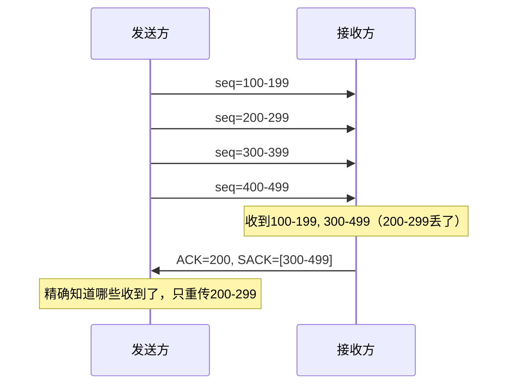

# TCP可靠传输机制

小王在美团面试，面试官问：

"你发了一个红包，对方说没收到，你怎么排查？"

小王："查日志、看监控..."

面试官："那网络层面呢？如果是TCP传输丢包，怎么发现、怎么恢复？"

小张愣了一下："TCP不是可靠的吗？怎么会丢包？"

面试官："可靠不等于不丢包。TCP是怎么保证可靠的？"

小张支支吾吾答不上来。

【直观类比】

**TCP可靠传输就像寄挂号信**：

1. **确认回执**：对方收到后要签字回执，没收到就重发
2. **编号排序**：每封信有编号，乱序的帮你排好
3. **丢失检测**：长时间没收到回执，就认为丢了，重发
4. **校验封口**：信封有封条，拆开过一眼就能看出来

这四步，就是TCP可靠传输的核心机制。

## TCP可靠性的四大支柱

### 1. 序列号（Sequence Number）

每个TCP报文段都有一个序列号，用于：

- **字节计数**：seq表示当前报文段第一个字节的序号
- **排序**：接收方根据seq重新组装乱序的报文
- **去重**：重复的报文可以识别并丢弃



**初始序列号（ISN）**：第一次握手时协商，不是0也不是1，而是随机数。这是安全考虑，防止攻击者伪造报文。

```
ISN = 固定常量 + 计时器 * 动态常量
```

### 2. 确认机制（ACK）

TCP采用**累计确认**（Cumulative ACK）：

- 接收方告诉发送方：**下一个期望收到的字节序号**
- 例如：收到0-99字节，发送ACK=100，表示"100之前的都收到了"
- 如果后续收到200-299而不是100-199，ACK仍然是100



:::tip 💡
为什么用累计确认而不是逐个确认？因为累计确认的ACK丢了也没关系，后续的ACK能覆盖。比如ACK=200丢了，ACK=300同样表示"200之前都收到了"。
:::

### 3. 超时重传（Retransmission）

发送方发送数据后，启动**定时器**，等待ACK：

- **收到ACK**：重置定时器，继续发送
- **超时未收到ACK**：认为丢包，重新发送

**关键问题：超时时间怎么定？**

太短：频繁误判重传
太长：丢包恢复太慢

**解决方案：自适应超时（RTT + RTTVAR）**

```
RTT（Round Trip Time）：往返时延
RTTVAR（RTT Variation）：RTT偏差
RTO（Retransmission Timeout）= RTT + 4 * RTTVAR
```

```java
// 简化版RTO计算
public class RTOCalculator {
    private double srtt;      // 平滑RTT
    private double rttvar;    // RTT偏差
    private double rto;
    
    public void update(double rtt) {
        // RFC 6298 标准计算
        if (srtt == 0) {
            srtt = rtt;
            rttvar = rtt / 2;
        } else {
            rttvar = 0.75 * rttvar + 0.25 * Math.abs(rtt - srtt);
            srtt = 0.875 * srtt + 0.125 * rtt;
        }
        rto = srtt + 4 * rttvar;
    }
}
```

** Karn算法**：避免重传导致的RTT采样污染。只用没有重传的样本计算RTT。

### 4. 校验和（Checksum）

每个TCP报文段都有校验和，用于检测传输中的比特错误：

- 发送方：计算Header + Data的校验和，填入TCP头部
- 接收方：重新计算校验和，不一致则丢弃

```
校验范围：伪首部 + TCP头部 + TCP数据
伪首部 = 源IP(32位) + 目标IP(32位) + 协议号(8位) + TCP长度(16位)
```

**为什么需要伪首部？** 因为TCP没有IP地址，它需要借助IP层的信息来校验"这一段数据确实是从A发到B的"。

:::warning ⚠️
TCP校验和是必选项，即使接收方校验失败也会丢弃，不会发送NAK。发送方必须重传。这和UDP不同，UDP校验和是可选的。
:::

## 流量控制与滑动窗口

上一节讲了"丢包怎么办"，这一节讲"发太快怎么办"。

### 滑动窗口（Sliding Window）

TCP用滑动窗口控制发送速度：

- **发送窗口**：发送方可以连续发送的未确认数据量
- **接收窗口**：接收方缓冲区剩余空间



**核心字段**：

| 字段 | 含义 |
|------|------|
| SND.UNA | 已发送未确认的第一个字节 |
| SND.NXT | 下一个可发送的字节 |
| SND.WND | 发送窗口大小（来自接收方的ACK） |
| RCV.NXT | 期望接收的下一个字节 |

### 窗口扩大（Window Scaling）

原始TCP头部窗口字段只有16位，最大只能表示65535字节。对于高带宽高延迟的网络（如光纤），这成为瓶颈。

```
窗口大小 = TCP头部窗口字段 * 窗口扩大因子
扩大因子 = 2^shift，每一方在 SYN 中协商（最大14，即2^14）
```

实际应用中：
- `cat /proc/sys/net/ipv4/tcp_window_scaling` 查看是否启用
- `cat /proc/sys/net/ipv4/tcp_rmem` 查看接收缓冲区配置

### 零窗口与窗口探测

当接收方缓冲区满了，会告诉发送方"rwnd=0"（零窗口），发送方停止发送。

如果接收方应用程序消费了数据，窗口恢复时怎么通知发送方？

**窗口探测（Window Probe）**：



探测间隔：指数增长，从1秒开始，最大60秒。如果探测多次都不响应，连接会被关闭。

## 快速重传与选择确认

### 快速重传（Fast Retransmit）

超时重传太慢，TCP引入了"三次重复ACK"机制：

```
发送方收到3个相同的ACK，立即重传对应报文，不等超时
```

为什么是3个？不是1个也不是5个？

- 1个：可能是乱序引起的误判
- 5个：太保守，恢复太慢
- 3个：平衡误判率和及时性



### 选择确认（SACK，Selective Acknowledgment）

累计ACK的缺点：只能告诉发送方"下一个期望的字节"，无法精确告诉发送方"哪些字节收到了"。

SACK允许接收方告诉发送方：**我收到了哪些不连续的块**。



**Linux配置**：

```bash
# 查看SACK是否启用
cat /proc/sys/net/ipv4/tcp_sack
```

## 边界与特例

### 1. 最大报文段长度（MSS）

MSS（Maximum Segment Size）是TCP能发送的最大数据量，不包括TCP头部。

- **MTU（Maximum Transmission Unit）**：网络接口一次能发送的最大帧
- **MSS = MTU - IP头(20字节) - TCP头(20字节)**
- 以太网MTU通常为1500，所以MSS通常是1460字节

```bash
# 查看MSS
netstat -i
# 查看路径MTU发现
tracepath www.google.com
```

### 2. Nagle算法与Cork

**Nagle算法**：减少小报文段的发送，提高网络效率。

```
如果发送缓冲区数据 < MSS 且 有未确认的数据
    等待ACK后再发送
否则
    立即发送
```

**问题**：对于实时性要求高的应用（如SSH），Nagle会造成延迟。

**Cork算法**：更激进的合并，把小报文合并成大报文再发送，直到缓冲区满了或被强制打开。

```java
// 设置TCP_NODELAY禁用Nagle
socket.setTcpNoDelay(true);
```

### 3. 延迟确认（Delayed ACK）

接收方不立即发送ACK，而是等一段时间（比如40ms），希望这段时间内能有数据可以"捎带"ACK回去。

```
延迟ACK的好处：
- 减少ACK报文数量
- 发送数据和ACK一起，减少网络往返
```

**问题**：对于请求-响应模式，可能导致发送方等待超时才发第二个请求。

## 常见误区

### 误区一：TCP不会丢包

**错！** TCP是**可靠传输**，不是说它不丢包，而是说它能**发现丢包并重传**。丢包是常态，可靠是机制。

### 误区二：三次重复ACK就一定重传

**不完全对**。收到三个重复ACK后，TCP会"执行"快速重传，但具体行为还取决于拥塞控制（后面会讲）。

### 误区三：校验和能纠错

**错！** 校验和只能**检测**错误，不能**纠正**错误。检测到错误后，TCP直接丢弃，由发送方重传。

### 误区四：窗口越大越好

**错！** 窗口太大会导致突发流量，冲击网络。实际窗口大小受限于：
- 接收方缓冲区大小
- 网络拥塞程度
- 带宽延迟积（BDP）

```java
// BDP计算
BDP = 带宽(Mbps) * 往返延迟(ms) / 8 = 缓冲区大小
// 例如：100Mbps带宽，50ms延迟
// BDP = 100 * 50 / 8 = 625KB
// 窗口应该接近625KB才能充分利用带宽
```

## 记忆技巧

### 可靠传输四件套

> "编（序号）确（确认）超（超时）查（校验）"
> - 编：每个字节都有序号
> - 确：累计确认机制
> - 超：超时自动重传
> - 查：校验和检测错误

### 滑动窗口三指针

> "左（已确认）右（可发送）指（下一个）"
> - 左边界：SND.UNA，已发送已确认
> - 右边界：SND.UNA+SND.WND，允许发送
> - 指针：SND.NXT，下一个可发送

### 快速重传触发条件

> "三ACK，速重传，不等超"
> - 收到3个重复ACK
> - 立即重传对应报文
> - 不等超时定时器

## 实战检验

### 自测题一

**问题**：为什么TCP引入选择确认（SACK）？

**解析**：
累计ACK只能告诉发送方"下一个期望的字节"，如果有多个不连续的块丢了，发送方不知道哪些已经收到了，只能全部重传。SACK允许接收方精确告诉发送方"收到了这些块"，减少不必要的重传。

### 自测题二

**问题**：在高带宽延迟网络中，为什么需要扩大窗口？

**解析**：
带宽延迟积（BDP）= 带宽 × 延迟。如果BDP很大，比如100Mbps × 100ms = 1.25MB，但TCP窗口最大只有64KB，发送方发完64KB就必须等ACK，无法填满管道，浪费带宽。

### 自测题三

**问题**：生产环境中如何排查TCP重传问题？

**解析**：

```bash
# 查看TCP重传统计
netstat -s | grep -i retransmit

# 查看详细连接信息
ss -ti

# 抓包分析
tcpdump -i eth0 'tcp[tcpflags] & tcp-retransmission-segment-ack' != 0

# 查看RTT
netstat -i 1
```

---

| 级别 | 考察重点 | 期望回答 | 判分标准 |
|------|----------|----------|----------|
| P5 | 基本机制名称 | 能说出确认、重传、排序、校验 | 死记硬背 |
| P6 | 滑动窗口原理 | 能解释滑动窗口、快速重传 | 理解机制 |
| P7 | 生产优化 | 能说出高带宽延迟网络优化、SACK配置 | 有实战经验 |
