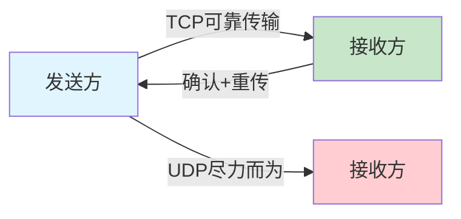
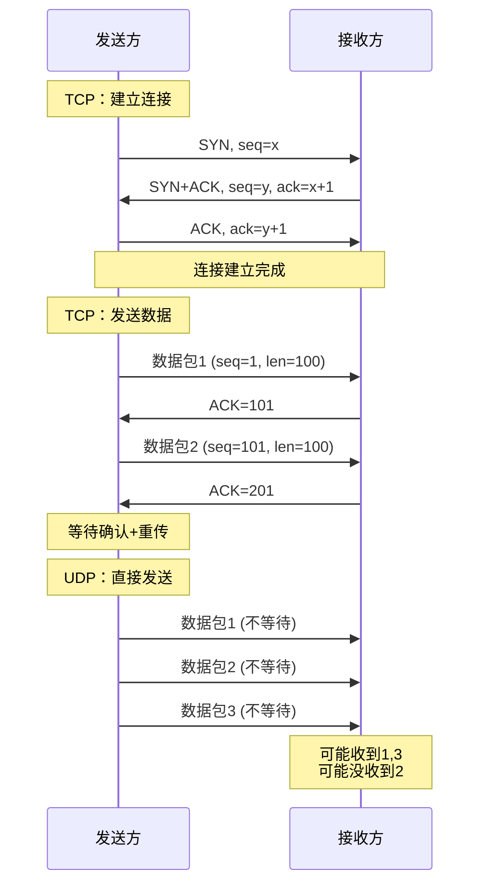
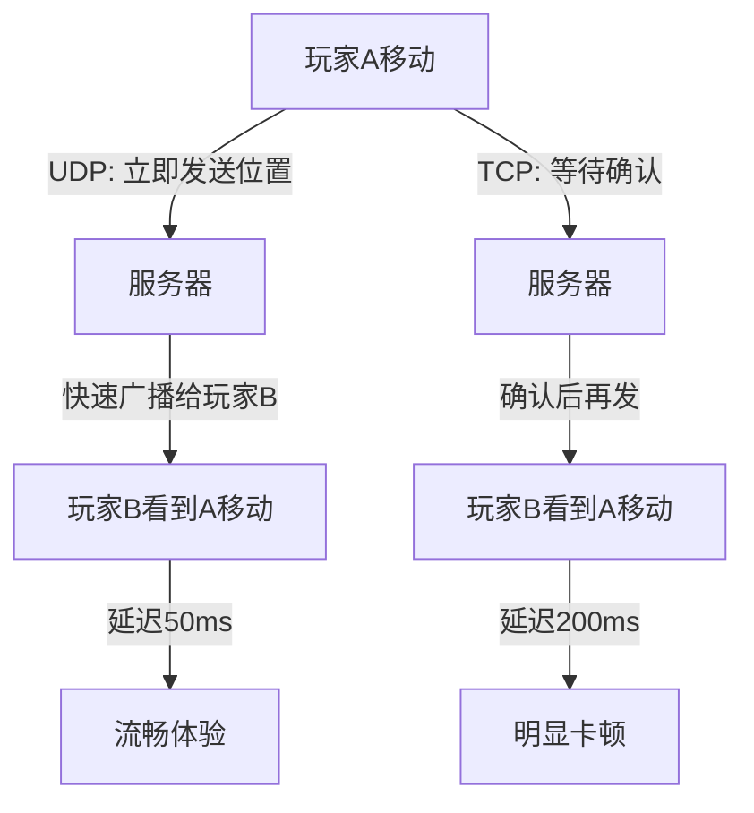
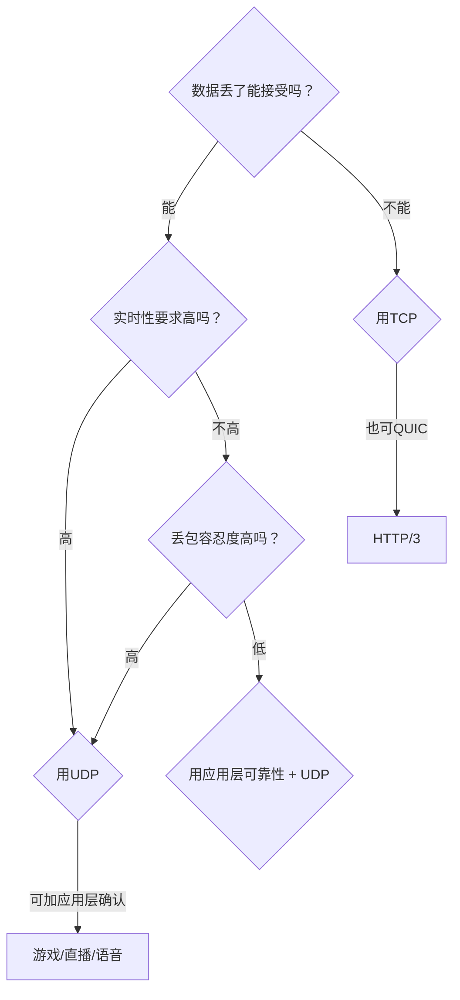

# TCP与UDP对比及场景选型

小张在面试某游戏公司时，面试官问了一个灵魂拷问：

"实时MOBA游戏（比如王者荣耀）用什么协议？为什么不用TCP？"

小张："因为UDP快？"

面试官追问："UDP不是不可靠吗？丢包了怎么办？"

小张："...重发？"

面试官："UDP怎么重发？"

小张彻底卡住。

这个问题，90%的候选人会死在"UDP快"这三个字上。他们只知道UDP比TCP快，却不知道快在哪里、慢在哪里，更不知道什么时候该用UDP、什么时候该用TCP。

今天，我们把这个问题彻底讲透。

## 【直观类比】

### TCP vs UDP：电话 vs 对讲机

**TCP就像打电话**：

1. **建立连接**：拨通、等对方接、确认身份
2. **确认机制**：你说一句话，对方说"听到了"，你才继续说下一句
3. **丢了重说**：对方没听清，你得重说整段话
4. **按顺序听**：先说的先到，后说的排队等着

**优点**：你说的话，对方一定听到了、听清了、听对了顺序
**缺点**：你说一句停一下，网络延迟大的时候，双方都急死人

**UDP就像对讲机**：

1. **不用连接**：按住就说，不管对方在不在线
2. **没有确认**：说完就完，不知道对方收到没有
3. **丢了就丢了**：不会重发，接着说后面的
4. **不保证顺序**：先说的可能后到

**优点**：实时性强，你说的话几乎是零延迟到达
**缺点**：对方可能没收到、可能收到顺序乱的、可能收到一半



### 生活中的类比

**TCP场景**：发送重要文件
你想给客户发一份合同，你会用微信/邮件（基于TCP）。因为你知道：
- 文件不会丢
- 内容不会乱序
- 对方一定能收到完整版本

**UDP场景**：视频通话
你和朋友视频聊天，你愿意：
- 偶尔画面卡一下（丢帧）
- 声音和画面稍微不同步
- 但不能接受"对方说话后好几秒才听到"（高延迟）

**核心区别**：TCP用**延迟换可靠**，UDP用**可靠换延迟**。

## 核心原理对比

### 协议特性对比

| 特性 | TCP | UDP |
|------|-----|-----|
| 连接方式 | 面向连接（三次握手） | 无连接（直接发） |
| 可靠性 | 可靠传输 | 尽力而为 |
| 顺序性 | 保证顺序 | 不保证顺序 |
| 拥塞控制 | 有（慢启动、拥塞避免） | 无 |
| 流量控制 | 有（滑动窗口） | 无 |
| 传输速度 | 相对较慢 | 快 |
| 首部开销 | 20~60字节 | 8字节 |
| 资源消耗 | 较高（维护连接状态） | 较低 |

### 首部结构对比

**TCP头部**（20~60字节）：

```
 0                   1                   2                   3
 0 1 2 3 4 5 6 7 8 9 0 1 2 3 4 5 6 7 8 9 0 1 2 3 4 5 6 7 8 9 0 1
+-+-+-+-+-+-+-+-+-+-+-+-+-+-+-+-+-+-+-+-+-+-+-+-+-+-+-+-+-+-+-+-+
|          Source Port          |       Destination Port        |
+-+-+-+-+-+-+-+-+-+-+-+-+-+-+-+-+-+-+-+-+-+-+-+-+-+-+-+-+-+-+-+-+
|                       Sequence Number                         |
+-+-+-+-+-+-+-+-+-+-+-+-+-+-+-+-+-+-+-+-+-+-+-+-+-+-+-+-+-+-+-+-+
|                   Acknowledgment Number                        |
+-+-+-+-+-+-+-+-+-+-+-+-+-+-+-+-+-+-+-+-+-+-+-+-+-+-+-+-+-+-+-+-+
| Offset |  Reserved | Flags  |             Window             |
+-+-+-+-+-+-+-+-+-+-+-+-+-+-+-+-+-+-+-+-+-+-+-+-+-+-+-+-+-+-+-+-+
|            Checksum            |         Urgent Pointer        |
+-+-+-+-+-+-+-+-+-+-+-+-+-+-+-+-+-+-+-+-+-+-+-+-+-+-+-+-+-+-+-+-+
|                    Options (optional)                         |
+-+-+-+-+-+-+-+-+-+-+-+-+-+-+-+-+-+-+-+-+-+-+-+-+-+-+-+-+-+-+-+-+
```

TCP头部字段解析：

| 字段 | 长度 | 作用 |
|------|------|------|
| 源端口 | 16位 | 发送方端口号 |
| 目标端口 | 16位 | 接收方端口号 |
| 序列号 | 32位 | 标识数据字节顺序 |
| 确认号 | 32位 | 期望收到的下一个字节 |
| 标志位 | 6位 | SYN/ACK/FIN/RST等 |
| 窗口大小 | 16位 | 流量控制 |

**UDP头部**（8字节）：

```
 0                   1                   2                   3
 0 1 2 3 4 5 6 7 8 9 0 1 2 3 4 5 6 7 8 9 0 1 2 3 4 5 6 7 8 9 0 1
+-+-+-+-+-+-+-+-+-+-+-+-+-+-+-+-+-+-+-+-+-+-+-+-+-+-+-+-+-+-+-+-+
|          Source Port          |       Destination Port        |
+-+-+-+-+-+-+-+-+-+-+-+-+-+-+-+-+-+-+-+-+-+-+-+-+-+-+-+-+-+-+-+-+
|           Length              |            Checksum          |
+-+-+-+-+-+-+-+-+-+-+-+-+-+-+-+-+-+-+-+-+-+-+-+-+-+-+-+-+-+-+-+-+
```

UDP只有4个字段，每个字段2字节，总共8字节。这就是UDP"轻量"的原因。

### 工作流程对比



## 典型应用场景

### TCP适用场景

**1. 网页浏览（HTTP/HTTPS）**

```
用户请求网页 → TCP连接 → 完整HTML → 图片/JS/CSS → 渲染页面
```

为什么用TCP？因为网页内容必须完整、少一个CSS文件页面就乱套。

**2. 文件传输（FTP/SFTP）**

下载一个10MB的文件：
- 用TCP：稳稳当当，偶尔断点续传
- 用UDP：收到一半丢了，游戏体验极差

**3. 邮件收发（SMTP/POP3/IMAP）**

发邮件时，你希望对方收到完整内容，还是收到一半？答案不言而喻。

**4. 数据库连接（MySQL/PostgreSQL）**

数据库的每一条SQL、每一个查询结果都必须准确，丢一个字节都是灾难。

:::tip 💡
TCP的本质是"一次发送、一次确认"，这决定了它天然适合"完整性 > 实时性"的场景。
:::

### UDP适用场景

**1. DNS查询**

你输入 `www.google.com`，DNS服务器返回IP地址：

- **用TCP**：需要三次握手，延迟增加
- **用UDP**：直接问、直接答，延迟极低

DNS查询包通常小于512字节，大多数用UDP（port 53）。

```
DNS查询: 某网站IP是什么？
DNS响应: 142.250.xxx.xxx
```

**2. 视频流媒体（直播）**

直播场景：
- **用TCP**：网络卡顿时画面"转圈"（等待重传）
- **用UDP**：偶尔花屏/丢帧，但整体流畅

直播平台（如斗鱼、B站直播）通常用RTMP（基于TCP）拉流，但内部推流可能用私有UDP协议。

**3. 实时游戏**

回到开头的问题：为什么游戏用UDP？



**游戏玩家的需求**：
- **位置同步**：每100ms发送一次位置，丢了就丢了，下一个位置会覆盖
- **攻击判定**：丢包会导致"明明打中了但没掉血"，但可以用"客户端预测"弥补
- **心跳检测**：定期发UDP包，检测玩家是否在线

**4. VoIP语音通话（Skype/微信语音）**

语音通话的特点：
- 实时性要求高（`>=` 100ms延迟用户能感知）
- 可以容忍少量丢包（人耳对短暂静音不敏感）

```java
// UDP语音通话简化流程
public class VoiceCall {
    // 采样音频
    short[] audioData = recordAudio();
    
    // 编码压缩
    byte[] encoded = codec.encode(audioData);
    
    // 直接发送，不等确认
    udpSocket.send(new DatagramPacket(encoded, encoded.length));
    
    // 接收端：播放音频，如果丢包就用前一个包填充
    // 这种技术叫"丢包隐藏"（PLC, Packet Loss Concealment）
}
```

**5. QUIC协议（基于UDP）**

QUIC是Google发明的协议，基于UDP实现了类似TCP的可靠性：

| 特性 | TCP | QUIC（UDP） |
|------|-----|-------------|
| 连接建立 | 3次握手 + TLS握手 = 2~3 RTT | 0~1 RTT |
| 队头阻塞 | 有（丢包阻塞后续所有包） | 无（多流独立） |
| 连接迁移 | 不支持（切换IP需要重建） | 支持（用Connection ID） |
| 拥塞控制 | 内核实现 | 用户态实现，更灵活 |

HTTP/3就是基于QUIC实现的。

:::warning ⚠️
面试官追问"QUIC为什么用UDP却不叫TCP2.0"，答案是：QUIC在用户态实现，不受内核TCP实现的限制，可以更快地迭代和优化。
:::

## 边界与特例

### 1. TCP over UDP的实现

有些场景需要UDP的"快"，又需要TCP的"可靠"，怎么办？

**解决方案**：在应用层实现可靠机制

```
发送方：
1. 给每个数据包编号
2. 发送后启动定时器
3. 收到ACK才删缓存
4. 超时没收到ACK就重发

接收方：
1. 维护一个接收窗口
2. 收到包就ACK
3. 排序后交付给应用
```

这就是QUIC、WireGuard、RTSP等协议的工作原理。

### 2. TCP/UDP端口共存

一台服务器可以同时监听TCP和UDP的同一端口：

```bash
# 查看TCP端口
netstat -tlnp | grep 80

# 查看UDP端口
netstat -ulnp | grep 80

# TCP和UDP可以监听同一端口，互不影响
# 例如：DNS服务器同时监听TCP 53和UDP 53
```

### 3. 分片与MTU

**MTU（Maximum Transmission Unit）**：网络层一次能传输的最大数据

- 以太网MTU：1500字节
- 超过MTU的数据会被分片

**TCP自动分片**：
- TCP会根据MTU自动分片，应用层不感知
- 丢包只丢一个分片，重传这一个分片

**UDP可能分片**：
- UDP自己不分片，由IP层分片
- 如果UDP数据包超过MTU，IP层会分成多个IP包
- 如果任意一个IP包丢了，整个UDP数据包就废了

```bash
# 查看MTU
ifconfig | grep mtu

# 测试路径MTU
tracepath www.google.com
```

这就是为什么UDP数据包太大反而不可靠。

### 4. NAT穿透问题

**TCP穿透**：
- NAT设备会记录TCP连接状态
- 通过端口映射，让外网能访问内网服务
- 需要中继服务器或STUN/TURN技术

**UDP穿透**：
- UDP无连接，NAT处理更复杂
- 但UDP打洞比TCP更容易（UDP的响应包可以复用同一端口）
- P2P应用（如BitTorrent、Skype）常用UDP打洞

## 常见误区

### 误区一：UDP比TCP快很多

**错！** 在可靠网络环境下，TCP和UDP的速度差异可能只有10%~20%。

UDP的优势是**低延迟**和**无连接建立开销**，而不是"更快"。

在丢包率高的网络（如4G/5G弱网），UDP反而可能更慢，因为没有拥塞控制会导致大量丢包和重传。

### 误区二：UDP不可靠所以不能用

**错！** UDP只是"不保证可靠"，不是说它"不能可靠"。

可靠性是应用层的责任，不是传输层的。你完全可以在UDP上实现：
- 确认机制
- 重传机制
- 序列号和排序

QUIC就是最好的例子——基于UDP，实现了比TCP更强的可靠性。

### 误区三：TCP不适合实时应用

**错！** TCP不适合的是**对延迟敏感的实时应用**，不是所有实时应用。

视频播放（点播）用TCP完全可以，因为有缓冲区，等几秒无所谓。

实时游戏用UDP，是因为延迟`>` 100ms玩家就能感知。

### 误区四：TCP头部大所以效率低

**不完全对。** TCP头部虽然大（20~60字节），但它换来的是可靠性。

UDP头部小（8字节），但丢包后没有任何保护机制。

效率要看场景：
- 大文件传输：TCP的确认和重传开销可以忽略不计
- 小数据包高频发送：UDP的8字节开销确实更划算

### 误区五：用TCP就一定安全

**错！** TCP只是传输协议，它不提供加密或认证。

TCP的"可靠"是指"数据能到、顺序对、数据完整"，不是"不会被窃听或篡改"。

真正安全需要TLS（SSL）层，这也是为什么HTTPS比HTTP慢一点——TLS握手增加了额外的网络往返。

## 记忆技巧

### 协议性格速记

```
TCP = 老干部 = 稳重 = 慢 = 可靠
UDP = 年轻人 = 直接 = 快 = 随性
```

### 选择决策树



### 口诀

> "TCP要握手，UDP直接走
> TCP保完整，UDP保速度
> 丢包能容忍，首选UDP
> 丢包要不得，TCP来兜底"

### 首部大小对比

> "TCP头大（20~60），UDP头小（8）
> 头大功能多，头小跑得快"

## 实战检验

### 自测题一

**问题**：为什么DNS查询通常用UDP而不是TCP？

**解析**：
1. DNS查询包小（通常小于512字节），一个UDP包就能装下
2. UDP无需建立连接，延迟更低（DNS响应要快）
3. TCP三次握手增加额外延迟，体验变差
4. 但DNS区域传输（AXFR）必须用TCP，因为数据量大、必须可靠

### 自测题二

**问题**：视频会议（Zoom/Skype）用什么协议？为什么？

**解析**：
1. **信令控制**（建立通话、邀请用户）：用TCP/TLS，命令必须可靠
2. **音视频传输**：用UDP + 自己实现的可靠机制
   - 延迟要求高（`>` 100ms用户能感知）
   - 可以容忍少量丢包（人耳/人眼有容错能力）
   - 使用Jitter Buffer和PLC（丢包隐藏）技术弥补

### 自测题三

**问题**：如何判断一个端口是用TCP还是UDP监听？

**解析**：

```bash
# 方法一：netstat
netstat -tlnp    # TCP监听
netstat -ulnp    # UDP监听

# 方法二：ss（更现代）
ss -tlnp         # TCP监听
ss -ulnp         # UDP监听

# 方法三：lsof
lsof -i :8080    # 查看8080端口的所有连接
```

### 自测题四

**问题**：从浏览器输入URL到页面展示，用了哪些协议？

**解析**：

```
DNS查询：UDP (port 53)
TCP握手：建立HTTP/HTTPS连接
TLS握手：HTTPS加密（如果用HTTPS）
HTTP请求：TCP传输
加载资源：TCP传输（CSS/JS/图片）
WebSocket：TCP长连接（如果用）
QUIC：UDP + 可靠机制（HTTP/3）
```

---

| 级别 | 考察重点 | 期望回答 | 判分标准 |
|------|----------|----------|----------|
| P5 | 基本特性 | 能说出TCP可靠/UDP快的区别 | 死记硬背 |
| P6 | 场景选型 | 能解释为什么游戏用UDP、网页用TCP | 理解原理 |
| P7 | 协议演进 | 能说出QUIC、HTTP/3的优势和应用 | 有技术视野 |

---

## 面试回答模板

当面试官问"TCP和UDP的区别和选型"时，推荐的结构化回答：

```
第一层（基础）：
TCP是面向连接的可靠传输，UDP是无连接的不保证可靠。

第二层（特性）：
TCP通过确认、重传、排序保证可靠性，有拥塞控制；
UDP直接发送，不保证到达和顺序。

第三层（场景）：
文件传输、网页浏览、数据库用TCP（完整性优先）；
DNS、视频通话、实时游戏用UDP（实时性优先）。

第四层（进阶）：
可以用UDP + 应用层可靠机制（如QUIC），兼顾速度和可靠。
```
