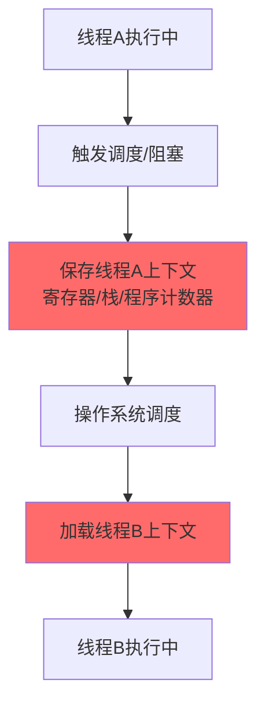
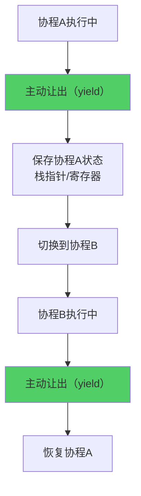
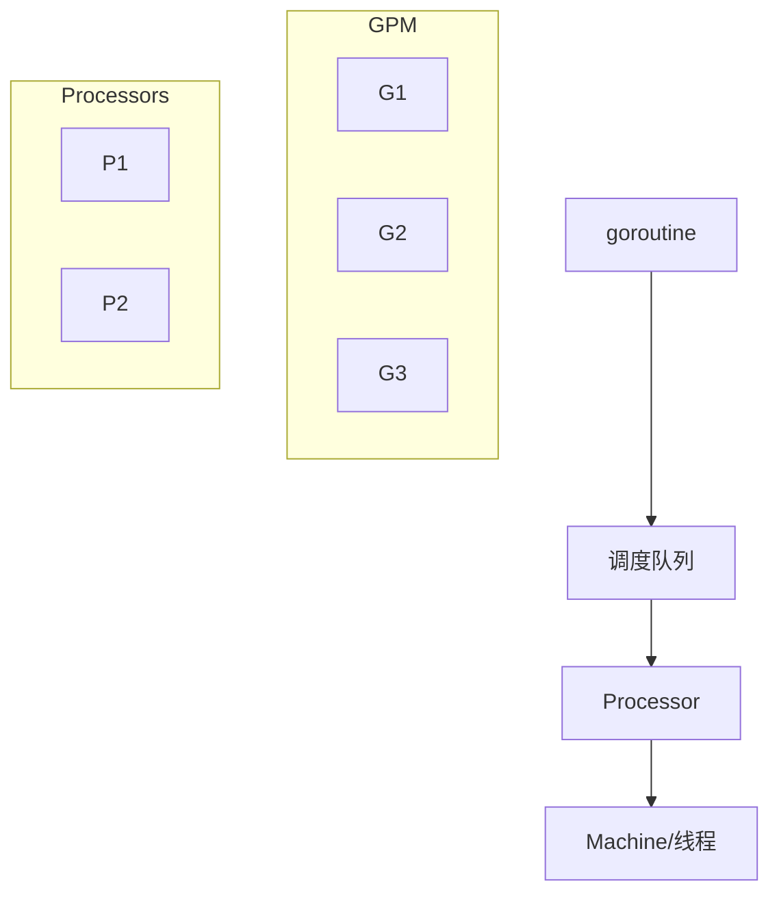

# 协程与线程对比

小李去面试字节后端岗，面试官问了一个看似简单的问题：

"你用过协程吗？为什么协程比线程高效？"

小李说："协程是用户态线程，不需要切换到内核态..."

面试官追问："那用户态切换具体指什么？为什么这样就高效？"

小王开始支支吾吾。

协程这个问题，说起来简单，但很多人只知其然不知其所以然。今天，我们从根子上把这个概念讲透。

## 一、从一个问题开始

先想象一个场景：你经营一家餐厅，只有一个服务员（线程）。

这个服务员的工作流程：
1. 顾客点餐 → 服务员等待厨房做菜（阻塞）
2. 厨房做好了 → 服务员端菜上桌
3. 顾客吃饭 → 服务员闲着

如果只有这一个服务员，餐厅的效率会非常低。因为服务员在等待的时候什么都干不了。

现在，换一个思路：让服务员在等待的时候去招待其他客人。

这就是协程的核心思想：**在等待期间切换执行权**，而不是傻等。

## 【直观类比】

### 线程 = 餐厅服务员

传统多线程模式，就像餐厅里每个客人都有一个专属服务员：

```
场景：10个客人同时点餐

多线程模式：
- 需要10个服务员
- 每个服务员等一道菜
- 菜品完成后服务员端菜

问题：
- 服务员太多（线程开销大）
- 服务员等待时闲着（阻塞）
- 菜做好了没人端（线程调度延迟）
```

### 协程 = 高效服务员

协程模式，就像一个超级服务员：

```
场景：10个客人同时点餐

协程模式：
- 只需要1个服务员
- 服务员记住每个客人的位置（保存状态）
- 服务员巡回检查：谁的菜好了就端谁的

核心：
- 服务员没有傻等（异步非阻塞）
- 记住状态，切换成本极低（用户态）
```

### 关键区别

| 维度 | 餐厅服务员（线程） | 高效服务员（协程） |
| --- | --- | --- |
| 等待方式 | 原地等待（阻塞） | 巡回检查（非阻塞） |
| 状态保存 | 靠系统（内核） | 自己保存（用户态） |
| 切换成本 | 贵（需要内核介入） | 极便宜（纯用户态） |
| 并发能力 | 有限（受线程数限制） | 极高（10K+轻松） |

## 二、核心原理

### 线程切换的本质

线程切换（上下文切换）需要操作系统介入：



每次上下文切换需要：
- 保存当前线程的寄存器状态
- 调用内核调度器
- 加载新线程的状态
- 切换内存地址空间（TLB刷新）

这个过程通常需要 **数百到数千个CPU周期**。

### 协程的本质

协程是**完全在用户态实现的协作式多任务**：



关键点：
- **协作式**：协程自己决定什么时候让出
- **用户态**：不需要进入内核态
- **轻量级**：状态保存在用户空间

### 对比代码

**线程实现**：

```python
import threading

def download(url):
    print(f"开始下载: {url}")
    # 线程会在这里阻塞等待
    response = requests.get(url)
    return response

# 每个下载任务都需要一个线程
threads = []
for url in urls:
    t = threading.Thread(target=download, args=(url,))
    threads.append(t)
    t.start()
```

**协程实现（asyncio）**：

```python
import asyncio

async def download(url):
    print(f"开始下载: {url}")
    # 协程在这里让出控制权
    response = await aiohttp.get(url)
    return response

# 单线程可以处理海量并发
async def main():
    tasks = [download(url) for url in urls]
    await asyncio.gather(*tasks)

asyncio.run(main())
```

### goroutine vs 线程

Go语言的goroutine是协程的典型实现：

```go
func main() {
    // 启动1万个goroutine
    for i := 0; i < 10000; i++ {
        go func() {
            // 每个goroutine只需要2KB栈空间
            fmt.Println("Hello")
        }()
    }
}
```

为什么Go能轻松启动上万个goroutine？

| 维度 | 线程 | goroutine |
| --- | --- | --- |
| 栈大小 | 1-8MB | 2KB（动态增长） |
| 创建成本 | 1-2MB | 2-4KB |
| 切换成本 | ~2μs | ~200ns |
| 最大数量 | ~1000 | ~100000 |

## 三、边界与特例

### 1. 协程的调度器

协程需要调度器来分配执行时间：

**Go调度器（GPM模型）**：



- **G（goroutine）**：待调度的任务
- **P（Processor）**：逻辑处理器，管理G的队列
- **M（Machine）**：实际的系统线程

### 2. 协程的局限性

**无法利用多核CPU**：

```python
# asyncio默认单线程
async def main():
    # 这里的所有代码都在同一个线程执行
    await asyncio.sleep(1)
    print("在主线程")
```

解决方案：配合多进程实现多核利用

### 3. 协程 vs async/await

`async/await`是协程的语法糖：

```python
# 这两段代码是等价的

# 协程函数
async def foo():
    return "result"

# 等价于
def foo():
    return coroutine_object()  # 返回协程对象
```

`await`的本质是：
1. 检查协程是否完成
2. 没完成则挂起当前协程
3. 等待其他协程完成后再恢复

### 4. 常见语言对比

| 语言 | 协程实现 | 特点 |
| --- | --- | --- |
| Python | asyncio/gevent | 生态完善，但有GIL限制 |
| Go | goroutine | 原生支持，最完善 |
| Java | Project Loom（虚拟线程） | 即将主流化 |
| JavaScript | async/await | 单线程异步 |
| Rust | tokio/async-std | 高性能，学习曲线陡 |

## 四、常见误区

### ❌ 误区一：协程可以并行执行

协程是**并发**（Concurrency），不是**并行**（Parallelism）。

```
并发（Concurrency）：
  一个人交替处理多个任务
  时间片轮转，看起来像同时执行
  
并行（Parallelism）：
  多个人同时处理多个任务
  真正的同时执行
```

协程通过协作式调度实现并发，但物理上仍是单线程执行。

### ❌ 误区二：协程完全不需要同步

虽然协程避免了线程切换的锁，但共享资源仍需要同步：

```python
async def increment(counter):
    # 这段代码在await之前和之后可能被打断
    temp = counter.value  # 读取
    temp += 1             # 修改
    await asyncio.sleep(0)  # 让出控制权！
    counter.value = temp  # 写回
```

多个协程同时操作同一个变量，仍会出现竞态条件。

### ❌ 误区三：协程可以无限创建

goroutine虽然轻量，但也有上限：

```go
// Go源码中的限制
const (
    MaxGomaxprocs = 1 << 16  // 65536
)
```

超过限制会导致：
- 内存耗尽（goroutine栈会动态增长）
- 调度开销增大
- 垃圾回收压力增大

### ❌ 误区四：协程一定比线程快

在IO密集型场景下，协程确实更快。

但在CPU密集型场景下，协程没有优势，甚至更慢：

```python
# CPU密集型：用协程反而更慢
async def cpu_task():
    result = 0
    for i in range(1000000):
        result += i
    return result
```

原因：协程是协作式调度，如果某个协程执行CPU密集型任务不主动让出，其他协程会被饿死。

## 五、记忆技巧

### 一句话总结

> 线程靠系统调度，协程靠自觉让位

### 对比速记表

| 记忆点 | 线程 | 协程 |
| --- | --- | --- |
| 调度者 | 操作系统（抢占式） | 协程自己（协作式） |
| 切换位置 | 内核态 | 用户态 |
| 状态保存 | 内核+用户空间 | 用户空间 |
| 阻塞影响 | 整个线程 | 当前协程 |
| 适用场景 | CPU密集 | IO密集 |

### 口诀

> "线程调度靠内核，开销大但省心"
> "协程调度靠自觉，开销小但要配合"
> "IO密集选协程，CPU密集用线程"

## 六、实战检验

### 自检题目

**题目1**：为什么Redis 6.0引入多线程IO但命令执行仍是单线程？

<details>
<summary>点击查看答案</summary>

Redis的命令执行是CPU密集型操作（如HGET、SETNX），单线程足以处理。

引入多线程IO是为了解决网络IO的瓶颈：主线程负责执行命令，多个IO线程负责读取请求和写入响应。

这样既保持了单线程执行的简单性，又提升了网络IO的吞吐能力。
</details>

**题目2**：goroutine的栈为什么是动态伸缩的？

<details>
<summary>点击查看答案</summary>

goroutine创建时只分配2KB栈空间，远小于线程的1-8MB。

当栈空间不足时（通常通过栈顶指针检测），会自动扩容；栈空间利用率低时，会自动缩容。

这是Go在内存效率上的优化，使得可以轻松创建数十万个goroutine。
</details>

**题目3**：协程的调度器需要考虑什么？

<details>
<summary>点击查看答案</summary>

1. **公平性**：避免某个协程长时间占用CPU
2. **优先级**：高优先级任务应该先执行
3. **亲和性**：尽量让任务在同一核心上执行
4. **饥饿问题**：确保低优先级任务最终也能执行
</details>

### 面试追问预测

| 问题 | 考察点 | 进阶追问 |
| --- | --- | --- |
| goroutine调度算法 | Go调度器 | work-stealing是什么 |
| 协程的泄漏 | 资源管理 | 如何避免协程泄漏 |
| asyncio vs threading | 场景选择 | 什么情况必须用线程 |

## 七、生产实战案例

### 案例：Go在微服务中的高并发优势

为什么越来越多的公司选择Go作为微服务开发语言？

```
对比：10K并发连接

Java（线程模型）：
- 需要10000个线程
- 每个线程1MB栈 → 10GB内存
- 上下文切换开销巨大

Go（goroutine模型）：
- 需要10000个goroutine
- 每个goroutine 2KB栈 → 20MB内存
- 上下文切换开销极小
```

### 案例：Python爬虫的协程优化

```python
# 同步爬虫：每秒10个请求
import requests

def crawl(urls):
    for url in urls:
        resp = requests.get(url)
        process(resp)

# 异步爬虫：每秒1000个请求
import aiohttp
import asyncio

async def crawl(urls):
    async with aiohttp.ClientSession() as session:
        tasks = [fetch(session, url) for url in urls]
        await asyncio.gather(*tasks)
```

性能提升：10x - 100x

:::tip 💡
协程的核心价值在于：**用极低的资源开销实现极高的并发能力**。在IO密集型场景下，这是革命性的提升。
:::
