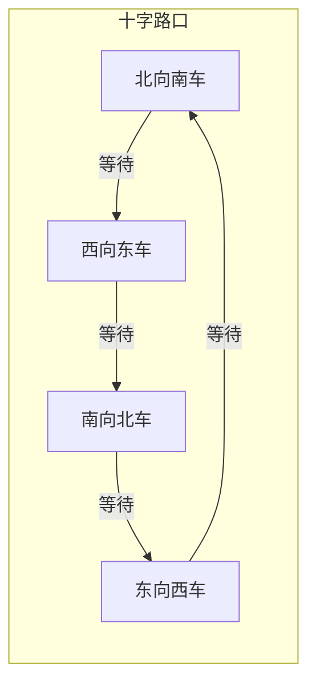
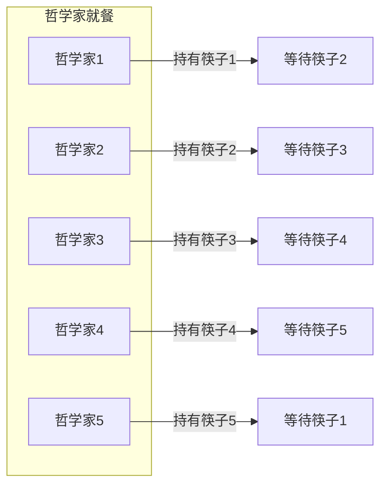
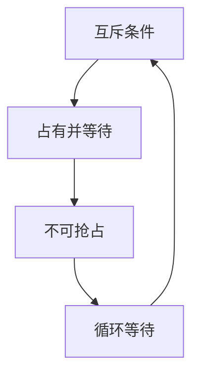
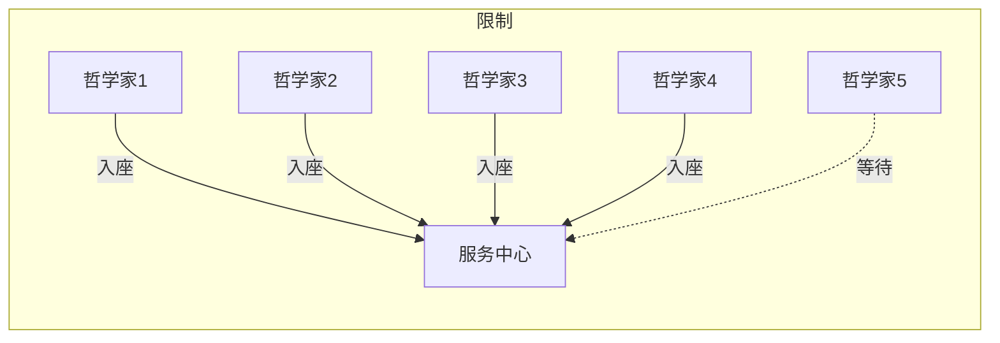
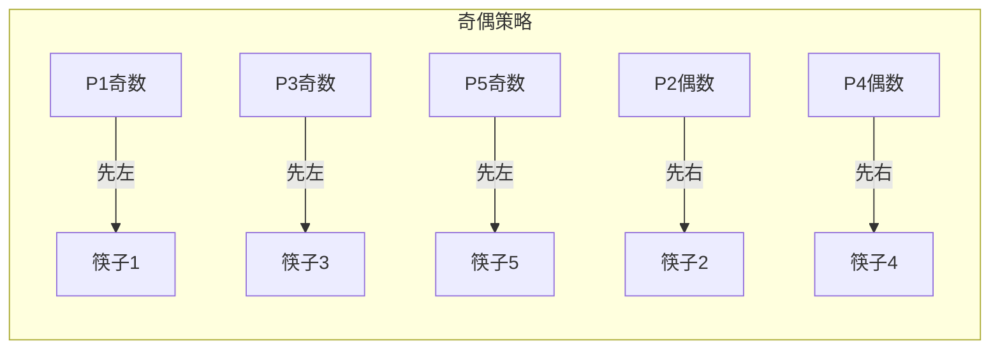

# 死锁的四个必要条件

面试官问："什么是死锁？"

小张脱口而出："就是两个线程互相等待对方释放资源，导致都卡住了。"

面试官点点头，继续追问："那死锁是怎么产生的？需要满足什么条件？"

小张想了想："...互斥？然后..." 开始语无伦次。

面试官又问："哲学家就餐问题为什么会导致死锁？如何解决？"

小张彻底卡住了。

死锁是操作系统和并发编程中最经典的问题之一，但很多人只停留在"互相等待"这个表面理解上。今天，我们把死锁的四个必要条件彻底讲透。

## 一、从一个问题开始

先看一个经典的死锁场景——哲学家就餐问题：

```
5个哲学家围坐一圈，中间放着一盘意面，每两个哲学家之间有一根筷子。

每个哲学家要拿到左右两根筷子才能吃饭。

规则：
- 哲学家先拿起左边的筷子
- 然后拿起右边的筷子
- 吃完后放下两根筷子

问题：想象5个哲学家同时饿了，都拿起了左边的筷子...
```

这就是经典的死锁场景。每个哲学家都在等待右边的筷子，而右边的筷子正被左边的哲学家拿着。大家都在等，但谁都不愿意先放下。

## 【直观类比】

### 死锁 = 十字路口堵死

想象一个没有红绿灯的十字路口：



场景：
- A车要往东走，但被D挡住了
- D车要往南走，但被C挡住了
- C车要往西走，但被B挡住了
- B车要往北走，但又被A挡住了

结果：四个方向全堵死了，谁都走不了。这就是死锁。

### 死锁四条件 = 四把锁

```
┌─────────────────────────────────────────────────────┐
│                    死锁四条件                        │
├─────────────────────────────────────────────────────┤
│  1. 互斥条件：资源只能被一个进程使用                │
│  2. 占有并等待：进程已持有资源，同时请求新资源     │
│  3. 不可抢占：已分配资源不能被强制夺走              │
│  4. 循环等待：进程-资源形成循环链                  │
│                                                     │
│  四个条件必须同时满足才会发生死锁！                  │
└─────────────────────────────────────────────────────┘
```

把这四个条件想象成四把锁：
- **互斥锁**：资源是独占的，一根筷子只能一个人用
- **占有锁**：哲学家已经占有了左边的筷子
- **等待锁**：同时他还想要右边的筷子
- **循环锁**：A等B，B等C，C等D，D等A

四把锁同时"锁上"，死锁就发生了。

## 二、核心原理

### 1. 互斥条件（Mutual Exclusion）

**资源只能被一个进程使用**。

这是最基础的条件。什么叫互斥资源？

```
互斥资源：
- 一把锁同一时刻只能被一个线程持有
- 一个文件同一时刻只能被一个进程写入
- 一根筷子同一时刻只能被一个哲学家使用

非互斥资源：
- 可共享的只读文件
- CPU时间（可以被分时复用）

大多数物理资源都是互斥的：打印机、摄像头、网络连接...
```

:::tip 💡
互斥条件是死锁发生的"土壤"。如果资源可以共享，死锁的可能性就大大降低。但问题是：**很多资源天生就是互斥的**，比如锁、打印机、数据库连接池。
:::

### 2. 占有并等待条件（Hold and Wait）

**进程已持有资源，同时请求新资源**。

这是死锁的"动力"。看看哲学家的问题：



每个哲学家都**持有**一根筷子，同时**等待**另一根筷子。

```
占有所带来的问题：

错误模式（会导致死锁）：
线程A：获取锁1 → 持有锁1 → 等待锁2
线程B：获取锁2 → 持有锁2 → 等待锁1

正确模式（不会死锁）：
方案1：一次性获取所有需要的锁
线程A：获取锁1 → 获取锁2 → 全部完成 → 释放所有

方案2：释放后再获取
线程A：获取锁1 → 释放锁1 → 获取锁2 → ...
```

### 3. 不可抢占条件（No Preemption）

**已分配资源不能被强制夺走**。

这是死锁的"僵持"。如果资源可以被强制抢走，死锁就不会持久。

```
不可抢占的资源：
- synchronized锁：不能从其他线程手里抢
- 数据库事务中的锁：提交或回滚前不能被抢
- 文件锁：必须由持有者显式释放

可抢占的资源：
- CPU时间片：可以被操作系统强制收回
- 内存：可以通过swapOut换到磁盘
- 信号量：可以通过release释放
```

:::warning ⚠️
不可抢占条件是死锁的"定海神针"。正因为资源不能被抢走，持有者才能"有恃无恐"地等待，死锁才能持续下去。
:::

### 4. 循环等待条件（Circular Wait）

**进程-资源形成循环链**。

这是死锁的"闭环"。看看哲学家的情况：


哲学家1等筷子2，筷子2被哲学家2持有；哲学家2等筷子3，筷子3被哲学家3持有...形成一个完美的闭环。

```
循环等待的本质：

没有循环等待（安全）：
线程A：持有锁1，等待锁2
线程B：持有锁2，等待...（不等待锁1）

有循环等待（危险）：
线程A：持有锁1，等待锁2
线程B：持有锁2，等待锁1

关键点：是否存在"等待链"的闭环
```

## 三、四条件的因果关系

四个条件的关系不是简单的并列，而是有因果链条的：



- **互斥条件**是基础：没有互斥，就没有资源争抢
- **占有并等待**是动力：持有资源的同时去抢新资源
- **不可抢占**是保障：保证了持有者的"强势地位"
- **循环等待**是结果：前面三个条件共同导致了循环

### 破坏任一条件即可破死锁

```
┌─────────────────────────────────────────────────────┐
│              破坏死锁四条件                          │
├─────────────────────────────────────────────────────┤
│                                                     │
│  1. 破坏互斥条件：                                   │
│     - 使用共享资源                                   │
│     - 例：读写锁的读操作可以共享                    │
│                                                     │
│  2. 破坏占有并等待：                                │
│     - 一次性获取所有资源                             │
│     - 或者先释放再获取                               │
│     - 例：固定加锁顺序                              │
│                                                     │
│  3. 破坏不可抢占：                                   │
│     - 允许强制抢占                                   │
│     - 使用超时机制                                   │
│     - 例：tryLock(timeout)                          │
│                                                     │
│  4. 破坏循环等待：                                   │
│     - 给资源编号，按顺序获取                         │
│     - 例：哲学家奇偶编号策略                        │
│                                                     │
└─────────────────────────────────────────────────────┘
```

## 四、哲学家就餐问题的解法

既然知道了死锁的四个条件，我们就可以针对性地解决哲学家就餐问题。

### 解法一：破坏占有并等待条件

**最多允许N-1个哲学家同时入座**。

```
方案：
- 5个哲学家，但只有4把椅子
- 同一时刻最多4人参与

效果：
- 至少有一人能够拿到两根筷子
- 吃完后释放筷子，其他人才能继续
- 破坏"占有并等待"的条件
```



### 解法二：破坏循环等待条件

**奇数号先拿左边，偶数号先拿右边**。

```
方案：
- 哲学家1、3、5：先拿左边，再拿右边
- 哲学家2、4：先拿右边，再拿左边

效果：
- 打破循环等待
- 不会形成1→2→3→4→5→1的闭环
```



### 解法三：破坏不可抢占条件

**拿不到右边就放下左边**。

```java
public void run() {
    while (true) {
        // 拿起左边
        pickUp(leftChopstick);
        // 尝试拿右边，拿不到就放弃
        if (!tryPickUp(rightChopstick)) {
            putDown(leftChopstick);
            // 随机等待一下，避免活锁
            sleep(random());
            continue;
        }
        // 吃面
        eat();
        // 放下筷子
        putDown(leftChopstick);
        putDown(rightChopstick);
        think();
    }
}
```

:::warning ⚠️
这个方案有个问题：可能导致**活锁（Livelock）**。如果两个相邻的哲学家节奏完全一致，他们可能永远在"拿-放-拿-放"中循环，但谁都吃不到面。解决方法是加随机等待。
:::

## 五、边界与特例

### 1. 死锁 vs 活锁 vs 饥饿

这三个概念经常被混淆：

```
┌─────────────────────────────────────────────────────┐
│              三种状态对比                             │
├─────────────────────────────────────────────────────┤
│                                                     │
│  死锁（Deadlock）：                                  │
│  - 进程都停下来，完全不动                            │
│  - 互相等待对方的资源                                │
│  - 就像堵死一动不动的十字路口                        │
│                                                     │
│  活锁（Livelock）：                                  │
│  - 进程在动，但永远无法前进                          │
│  - 不断检测冲突、不断让步                            │
│  - 就像两个人互相让路，让了一辈子也过不去            │
│                                                     │
│  饥饿（Starvation）：                               │
│  - 有些进程永远得不到资源                            │
│  - 优先级太低，一直在排队                            │
│  - 就像VIP通道永远不让普通人过                      │
│                                                     │
└─────────────────────────────────────────────────────┘
```

### 2. 单线程永远不会死锁

```
反例验证：
if (只有一个线程/进程) {
    // 不存在资源竞争
    // 不可能死锁
}
```

这是最简单的"死锁排查"：先确认是不是多线程。

### 3. 数据库中的死锁

数据库的死锁稍有不同，它发生在事务层面：

```sql
-- 事务A
BEGIN;
UPDATE accounts SET balance = balance - 100 WHERE id = 1;  -- 锁定id=1
UPDATE accounts SET balance = balance + 100 WHERE id = 2;  -- 等待id=2

-- 事务B（同时执行）
BEGIN;
UPDATE accounts SET balance = balance - 100 WHERE id = 2;  -- 锁定id=2
UPDATE accounts SET balance = balance + 100 WHERE id = 1;  -- 等待id=1

-- 死锁！
```

```
数据库死锁的特点：
1. 通常涉及多个事务
2. 往往是因为操作顺序不一致
3. 数据库有自动检测和回滚机制
4. InnoDB默认会回滚代价最小的事务
```

## 六、常见误区

### ❌ 误区一：死锁只会在代码里出现

死锁可以在多个层面发生：

```
系统层面：
- 进程间的文件锁
- 设备驱动程序中的中断处理
- 内核数据结构

数据库层面：
- 多个事务互相持有锁等待
- 表级锁与行级锁的组合
- 分布式数据库中的跨节点锁

硬件层面：
- 内存分配器的内存池
- 磁盘I/O调度
```

### ❌ 误区二：只要加锁就一定会死锁

死锁需要四个条件**同时满足**：

```
反例1：单线程永远不会死锁
- 只有一个执行流
- 不存在资源竞争

反例2：锁保护的是完全独立的资源
- 两个锁保护的是互不相关的对象
- 没有依赖关系

反例3：按固定顺序加锁
- 始终先A后B
- 不会形成循环等待

反例4：使用超时机制
- lock.tryLock(timeout)
- 不会永久等待
```

### ❌ 误区三：死锁是"小概率事件"

在生产环境中，死锁比你想象的常见：

```
实际案例：
1. 银行转账：A账户→B账户 和 B账户→A账户 并发
2. 订单处理：锁定库存 和 锁定用户账户
3. 消息消费：锁定消息 和 锁定消费者状态
```

:::warning ⚠️
死锁往往在并发量上来之后才暴露，因为单线程/低并发下很难触发四个条件同时满足。
:::

### ❌ 误区四：只要掌握银行家算法就够了

银行家算法是教科书级别的死锁避免算法，但实际系统很少用它：

```
银行家算法的局限：
1. 需要预先知道最大需求
2. 算法复杂度 O(m × n²)
3. 资源利用率低
4. 不适用于动态变化的系统

实际系统更常用的策略：
- 预防为主：破坏死锁条件
- 检测+恢复：允许死锁，检测后处理
- 超时机制：永不阻塞
```

## 七、记忆技巧

### 一句话总结

> 死锁四条件：互斥、占有、不可抢、循环等。破坏任一条件即可破死锁。

### 记忆口诀

```
"死锁四个条件，缺一不可才能死"
互斥资源独占性，占有等待是根本
不可抢占是保障，循环等待成闭环
```

### 对比速记表

| 条件 | 破坏方法 | 实际应用 |
| --- | --- | --- |
| 互斥 | 资源共享 | 读写锁 |
| 占有并等待 | 一次性获取 | 固定加锁顺序 |
| 不可抢占 | 超时机制 | tryLock |
| 循环等待 | 资源编号 | 奇偶策略 |

### 形象记忆

把死锁想象成"四人麻将僵局"：
- **互斥**：只有四张特定的牌
- **占有**：有人已经碰了两张
- **等待**：还在等第三张
- **循环**：四个人互相卡死

只要有一个人"放炮"（释放资源），死局就破了。

## 八、实战检验

### 自检题目

**题目1**：为什么哲学家就餐问题中，5个哲学家同时拿起左边的筷子会导致死锁？

<details>
<summary>点击查看答案</summary>

因为同时满足了四个条件：
1. **互斥条件**：筷子只能被一个哲学家使用
2. **占有并等待**：每个哲学家都持有左边的筷子，同时等待右边的筷子
3. **不可抢占**：筷子不能从其他哲学家手里抢
4. **循环等待**：哲学家1等筷子2（被哲学家2持有），哲学家2等筷子3...形成循环

四个条件同时满足，死锁发生。
</details>

**题目2**：如何用代码实现"固定加锁顺序"来预防死锁？

<details>
<summary>点击查看答案</summary>

```java
// 错误写法
public void transfer(Account a, Account b, int amount) {
    synchronized(a) {
        synchronized(b) {
            // 转账逻辑
        }
    }
}
// 如果线程A调用transfer(张三, 李四)和线程B调用transfer(李四, 张三)
// 可能导致死锁

// 正确写法：固定加锁顺序
public void transfer(Account a, Account b, int amount) {
    Account first = a.getId() < b.getId() ? a : b;
    Account second = a.getId() < b.getId() ? b : a;

    synchronized(first) {
        synchronized(second) {
            // 转账逻辑
        }
    }
}
// 无论调用顺序如何，都是先锁定ID小的，再锁定ID大的
// 永远不会形成循环等待
```
</details>

**题目3**：tryLock超时为什么能破死锁？

<details>
<summary>点击查看答案</summary>

tryLock超时破坏的是**不可抢占条件**：

```java
// 传统写法：永久等待
synchronized(lock) {
    // 可能永远卡住
}

// tryLock写法：超时放弃
if (lock.tryLock(5, TimeUnit.SECONDS)) {
    try {
        // 业务逻辑
    } finally {
        lock.unlock();
    }
} else {
    // 超时后放弃，做其他处理
    // 破坏了"不可抢占"的僵持
}
```

当超时发生后，线程会放弃已持有的资源，让其他线程有机会继续执行。这样即使形成了"等待链"，也不会永久僵持下去。
</details>

### 面试追问预测

| 问题 | 考察点 | 进阶追问 |
| --- | --- | --- |
| 死锁四个必要条件 | 基础概念 | 破坏哪个条件最容易实现 |
| 哲学家就餐问题 | 综合应用 | 你的项目里遇到过死锁吗 |
| 死锁 vs 活锁 | 概念区分 | 如何避免活锁 |
| 银行家算法 | 经典算法 | 为什么实际系统很少用它 |

## 九、总结

死锁的四个必要条件是理解并发问题的基石：

```
┌─────────────────────────────────────────────────────┐
│                  死锁四条件速查                       │
├─────────────────────────────────────────────────────┤
│                                                     │
│  1️⃣ 互斥条件：资源只能被一个进程使用                │
│     → 类比：一山不容二虎                            │
│                                                     │
│  2️⃣ 占有并等待：持有资源同时请求新资源              │
│     → 类比：吃着碗里看着锅里                        │
│                                                     │
│  3️⃣ 不可抢占：已分配资源不能被强制夺走              │
│     → 类比：我的东西你别想抢                        │
│                                                     │
│  4️⃣ 循环等待：进程-资源形成循环链                  │
│     → 类比：互相踢皮球                              │
│                                                     │
│  破坏任一条件，死锁即可破！                         │
│                                                     │
└─────────────────────────────────────────────────────┘
```

记住，死锁不是洪水猛兽，而是可以通过理解和预防来规避的经典问题。掌握四条件，理解因果链，你就能在面试和实战中从容应对。
