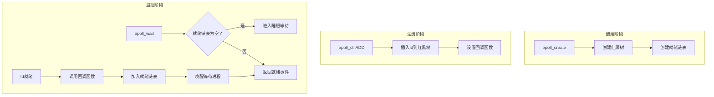

# select/poll/epoll对比

面试官问："select和epoll有什么区别？为什么Nginx能支持10万并发？"

小王说："select需要遍历所有fd，epoll不需要...epoll快..."

面试官继续追问："那什么是水平触发？什么是边缘触发？为什么epoll默认用水平触发？"

小王说："这个...好像是..."

面试官又问："用边缘触发时需要注意什么？会导致什么问题？"

小王彻底卡住了。

epoll是Linux高性能网络编程的基础，很多人对它的理解只停留在"比select快"这个层面。今天，我们把select/poll/epoll的区别彻底讲透。

## 一、从一个问题开始

先看一个餐厅叫号的场景：

```
场景：餐厅有1000桌客人等位

select方式（老式叫号系统）：
- 服务员拿着一个大喇叭喊："现在叫到的桌号是...1号！2号！3号！..."
- 每次都要把所有桌号喊一遍
- 不管有没有人回应，都得喊
- 服务员喊累了，嗓子都哑了

epoll方式（智能叫号系统）：
- 客人坐下时在系统上登记
- 菜好了，服务员在系统上点"通知"
- 系统自动叫对应桌号的客人
- 服务员只需要点一下，不用喊那么多

这就是select和epoll的本质区别：
- select：每次都要检查所有fd
- epoll：只关注就绪的fd
```

## 【直观类比】

### 三种IO多路复用 = 三种点餐通知方式

```
┌─────────────────────────────────────────────────────────────┐
│                  IO多路复用对比                              │
├─────────────────────────────────────────────────────────────┤
│                                                             │
│  select：老式广播                                          │
│  ┌───────────────────────────────────────────────────────┐ │
│  │  服务员：大家注意！现在检查一下哪些菜好了！              │ │
│  │  广播：检查1号桌...检查2号桌...检查3号桌...             │ │
│  │  （不管菜好没好，都要问一遍）                           │ │
│  │  终于检查完了，现在叫：3号桌、7号桌、15号桌好了！       │ │
│  └───────────────────────────────────────────────────────┘ │
│                                                             │
│  poll：改进版广播                                          │
│  ┌───────────────────────────────────────────────────────┐ │
│  │  和select类似，但用数组代替固定位图                    │ │
│  │  不再受1024个fd的限制                                  │ │
│  └───────────────────────────────────────────────────────┘ │
│                                                             │
│  epoll：智能通知                                           │
│  ┌───────────────────────────────────────────────────────┐ │
│  │  客人坐下时在系统登记："我是3号桌"                     │ │
│  │  服务员：好，我记住了                                  │ │
│  │  当3号桌的菜好了                                      │ │
│  │  系统直接显示：3号桌好了！（不用挨个问）               │ │
│  └───────────────────────────────────────────────────────┘ │
│                                                             │
└─────────────────────────────────────────────────────────────┘
```

### 核心指标对比

| 指标 | select | poll | epoll |
| --- | --- | --- | --- |
| 最大fd数 | 1024（FD_SETSIZE） | 无限制（受内存） | 无限制 |
| 时间复杂度 | O(n) | O(n) | O(1) |
| 时间复杂度（就绪时） | O(n) | O(n) | O(k)，k为就绪数 |
| 内存复制 | 每次都copy | 每次都copy | 用共享内存 |
| fd传入 | 每次传入 | 每次传入 | 注册后共享 |
| 触发方式 | LT | LT | LT + ET |

## 二、核心原理

### 1. select的原理

```c
#include <sys/select.h>

int select(int nfds,            // 最大fd + 1
           fd_set *readfds,     // 监控读的fd集合
           fd_set *writefds,    // 监控写的fd集合
           fd_set *exceptfds,   // 监控异常的fd集合
           struct timeval *timeout);  // 超时

// 使用示例
fd_set readfds;
FD_ZERO(&readfds);          // 清空集合
FD_SET(socket_fd, &readfds); // 添加监控的fd

struct timeval tv;
tv.tv_sec = 5;
tv.tv_usec = 0;

int ret = select(socket_fd + 1, &readfds, NULL, NULL, &tv);

if (ret > 0) {
    if (FD_ISSET(socket_fd, &readfds)) {
        // socket可读
        read(socket_fd, buf, size);
    }
}
```

**select的实现机制**：

```c
// 内核中select的实现（简化）

int sys_select(int nfds,
               fd_set __user *readfds,
               fd_set __user *writefds,
               fd_set __user *exceptfds,
               struct timeval __user *timeout) {
    
    // 1. 从用户态复制fd_set到内核态
    //    问题：每次都要复制，不管大小
    
    // 2. 遍历所有fd（0到nfds-1）
    for (fd = 0; fd < nfds; fd++) {
        // 检查每个fd的状态
        // 这是一个O(n)的操作！
        
        if (fd_is_ready(fd)) {
            // 设置返回位
            set_bit(fd, readfds);
            ret_count++;
        }
    }
    
    // 3. 如果没有就绪的fd，且没有超时
    //    进入睡眠状态（这里会有问题！）
    
    // 4. 从内核态复制fd_set回用户态
    //    又要复制一次！
    
    return ret_count;
}
```

**select的问题**：

```
问题1：fd数量限制
- FD_SETSIZE通常是1024
- 即使修改内核也可能不够用
- /usr/include/linux/posix_types.h

问题2：每次调用都要复制fd_set
- 用户态→内核态 copy
- 内核态→用户态 copy
- 10K个fd = 每次复制大量数据

问题3：O(n)遍历
- 内核需要遍历所有监控的fd
- 即使只有1个fd就绪，也要遍历所有

问题4：fd_set不可重用
- select返回后，fd_set被修改了
- 需要每次重新FD_SET
```

### 2. poll的原理

```c
#include <poll.h>

struct pollfd {
    int fd;         // 文件描述符
    short events;   // 监控的事件
    short revents;  // 返回的事件
};

int poll(struct pollfd *fds,     // 监控的fd数组
         nfds_t nfds,             // 数组长度
         int timeout);            // 超时(ms)

/*
events可选值：
- POLLIN：可读
- POLLOUT：可写
- POLLERR：错误

revents返回值：
- POLLIN/POLLOUT/POLLERR
- POLLHUP：挂起
- POLLNVAL：无效fd
*/

// 使用示例
struct pollfd fds[2];
fds[0].fd = STDIN_FILENO;    // 标准输入
fds[0].events = POLLIN;

fds[1].fd = socket_fd;        // socket
fds[1].events = POLLIN;

int ret = poll(fds, 2, 5000);  // 5秒超时

if (ret > 0) {
    if (fds[0].revents & POLLIN) {
        // 标准输入可读
    }
    if (fds[1].revents & POLLIN) {
        // socket可读
    }
}
```

**poll vs select**：

```
poll的改进：
1. 没有FD_SETSIZE限制
   - 使用动态数组，大小只受内存限制

2. pollfd结构更清晰
   - fd：目标fd
   - events：监控什么
   - revents：返回什么
   - 不需要每次重置

3. 可以重复使用同一个数组
   - events字段保持不变
   - 只需检查revents

poll的问题：
1. 仍然O(n)遍历
2. 仍然需要每次传入所有fd
3. 仍然需要从用户态复制到内核态
```

### 3. epoll的原理

```c
#include <sys/epoll.h>

// 创建epoll实例
int epoll_create(int size);      // Linux 2.6.23+
int epoll_create1(int flags);    // Linux 2.6.27+，推荐

// 操作epoll
int epoll_ctl(int epfd,         // epoll实例
              int op,           // 操作：ADD/MOD/DEL
              int fd,           // 要操作的fd
              struct epoll_event *event);

// 等待事件
int epoll_wait(int epfd,                    // epoll实例
               struct epoll_event *events,   // 返回的事件数组
               int maxevents,                // 数组大小
               int timeout);                 // 超时

// 使用示例
int epfd = epoll_create1(0);

// 添加要监控的socket
struct epoll_event ev;
ev.events = EPOLLIN;          // 监控读事件
ev.data.fd = socket_fd;
epoll_ctl(epfd, EPOLL_CTL_ADD, socket_fd, &ev);

// 等待事件
struct epoll_event events[1024];
while (1) {
    int n = epoll_wait(epfd, events, 1024, -1);
    
    for (int i = 0; i < n; i++) {
        if (events[i].events & EPOLLIN) {
            int fd = events[i].data.fd;
            read(fd, buf, size);
        }
    }
}
```

**epoll的数据结构**：

```c
// epoll内部使用红黑树管理fd
// 就绪的fd放在就绪链表中

struct epoll_instance {
    struct rb_root_cached 红黑树;  // 存储所有监控的fd
    struct list_head 就绪链表;    // 就绪的fd
    wait_queue_head_t 等待队列;   // 等待的进程
};

// 添加fd时的操作
int epoll_ctl(int epfd, int op, int fd, struct epoll_event *event) {
    switch (op) {
        case EPOLL_CTL_ADD:
            // 插入到红黑树
            // 时间复杂度 O(log n)
            break;
        case EPOLL_CTL_MOD:
            // 修改红黑树中的节点
            break;
        case EPOLL_CTL_DEL:
            // 从红黑树删除
            break;
    }
}

// 等待事件的实现
int epoll_wait(int epfd, struct epoll_event *events, int maxevents, int timeout) {
    // 检查就绪链表
    if (!list_empty(&ep->rdlist)) {
        // 复制到用户空间
        // 直接返回！不用遍历
        return 事件数量;
    }
    
    // 就绪链表为空，进入睡眠
    prepare_to_wait(&ep->wq, &wait, TASK_INTERRUPTIBLE);
    
    // ...
    
    finish_wait(&ep->wq, &wait);
    return 事件数量;
}
```

**epoll的工作流程**：



### 4. 水平触发（LT）vs 边缘触发（ET）

```
┌─────────────────────────────────────────────────────────────┐
│              水平触发 vs 边缘触发                            │
├─────────────────────────────────────────────────────────────┤
│                                                             │
│  水平触发（Level Triggered, LT）：                          │
│  - 只要条件满足，就一直通知                                  │
│  - fd可读时，每次epoll_wait都返回                          │
│                                                             │
│  示例：                                                      │
│  1. socket有100字节可读                                     │
│  2. epoll_wait返回，通知你                                  │
│  3. 你只读了50字节                                           │
│  4. 再调用epoll_wait，还是会返回（还剩50字节）               │
│  5. 继续读，直到读完                                         │
│                                                             │
│  类比：服务员一直在叫"3号桌！3号桌！"                       │
│        直到你真的去取餐为止                                  │
│                                                             │
├─────────────────────────────────────────────────────────────┤
│                                                             │
│  边缘触发（Edge Triggered, ET）：                           │
│  - 只在状态变化时通知一次                                   │
│  - fd从不可读变成可读时，通知一次                           │
│                                                             │
│  示例：                                                      │
│  1. socket从0字节变成100字节可读                            │
│  2. epoll_wait返回，通知你                                  │
│  3. 你只读了50字节                                           │
│  4. 再调用epoll_wait，不会返回（你没读完，但没新数据）       │
│  5. 必须在这次调用中读完所有数据！                          │
│                                                             │
│  类比：服务员只叫一次"3号桌！"，叫完就不叫了                │
│        你必须自己去取，不然就错过了                          │
│                                                             │
└─────────────────────────────────────────────────────────────┘
```

**为什么边缘触发需要非阻塞IO？**

```c
// 边缘触发 + 阻塞IO = 可能出问题

// 错误示例
ev.events = EPOLLIN | EPOLLET;  // 边缘触发

while (1) {
    int n = epoll_wait(epfd, events, MAX_EVENTS, -1);
    
    for (int i = 0; i < n; i++) {
        if (events[i].events & EPOLLIN) {
            // 边缘触发，必须一次读完
            int fd = events[i].data.fd;
            
            // 如果用阻塞read，可能会卡住！
            // 因为内核不会再次通知你
            while (1) {
                int ret = read(fd, buf, size);  // 阻塞在这里
                if (ret == 0) break;  // 读完了
                if (ret < 0) {
                    if (errno == EAGAIN) break;  // 非阻塞用这个退出
                    // 处理错误
                }
            }
        }
    }
}

// 正确示例：边缘触发 + 非阻塞IO
int flags = fcntl(fd, F_GETFL, 0);
fcntl(fd, F_SETFL, flags | O_NONBLOCK);  // 设置非阻塞

ev.events = EPOLLIN | EPOLLET;

while (1) {
    int n = epoll_wait(epfd, events, MAX_EVENTS, -1);
    
    for (int i = 0; i < n; i++) {
        if (events[i].events & EPOLLIN) {
            while (1) {
                int ret = read(fd, buf, size);
                if (ret > 0) {
                    // 处理数据
                } else if (ret == 0) {
                    // 连接关闭
                    break;
                } else if (errno == EAGAIN || errno == EWOULDBLOCK) {
                    // 数据读完了
                    break;
                } else {
                    // 错误
                    break;
                }
            }
        }
    }
}
```

## 三、边界与特例

### 1. epoll的惊群问题

```
惊群问题（Thundering Herd）：
多个进程/线程等待同一个事件
当事件就绪时，所有等待者都被唤醒
但只有一个人能处理，其他人都白醒了

Linux的解决方案：
- accept的惊群：内核已经修复，多个进程epoll_wait
                   只有一个被唤醒
- 其他惊群：仍然存在，需要用EPOLLEXCLUSIVE标志
```

```c
// EPOLLEXCLUSIVE解决惊群
struct epoll_event ev;
ev.events = EPOLLIN | EPOLLEXCLUSIVE;
ev.data.fd = listen_fd;
epoll_ctl(epfd, EPOLL_CTL_ADD, listen_fd, &ev);
```

### 2. epoll在fork之后

```
父子进程共享epoll实例吗？
- fork后，子进程有独立的epoll实例
- 不是共享的！

正确做法：
1. 只在父进程创建epoll
2. 或者在fork后重新创建

或者：
- 使用socketpair创建父子通信
- 父进程管理epoll
- 子进程处理连接后通知父进程
```

### 3. select/poll/epoll的选择

| 场景 | 推荐 | 原因 |
| --- | --- | --- |
| fd数量少（`<100`） | select/poll | 简单，足够用 |
| fd数量中等（100-1000） | poll | 无fd数量限制 |
| fd数量大（`>1000`） | epoll | 高效，O(1) |
| 需要边缘触发 | epoll | select/poll只支持水平触发 |
| 高并发服务器 | epoll | 10K+连接必须用epoll |

### 4. epoll的高并发原理

```
10万并发用epoll为什么快？

1. 注册方式
   - select/poll：每次调用都要传入所有fd
   - epoll：fd注册到红黑树，只需一次

2. 就绪通知
   - select/poll：需要遍历所有fd找出就绪的
   - epoll：只返回就绪的fd列表

3. 内存复制
   - select/poll：每次都要用户态/内核态复制
   - epoll：用共享内存

时间复杂度对比：
- select/poll：O(n) 每次调用
- epoll：O(k) k为就绪fd数，k远小于n
```

## 四、常见误区

### ❌ 误区一：epoll一定比select快

```
在连接少时，epoll可能更慢：

fd数量少（`<100`）：
- select：简单系统调用，overhead小
- epoll：需要维护红黑树，overhead大

fd数量多（>1000）：
- select：每次都要遍历所有fd
- epoll：只返回就绪的

结论：
- 低并发：select/poll足够
- 高并发：epoll更快
```

### ❌ 误区二：epoll是异步IO

```
epoll属于同步IO多路复用！

- epoll只告诉你"哪个fd可用了"
- 具体的读写操作（read/write）还是同步的
- 你还是要在epoll返回后调用read

真正的异步IO：
- Linux: io_uring
- Windows: IOCP
```

### ❌ 误区三：边缘触发一定比水平触发好

```
边缘触发的优点：
- 减少不必要的通知
- 效率可能更高

边缘触发的问题：
- 编程复杂
- 必须在一次通知中处理完所有数据
- 需要配合非阻塞IO
- 容易遗漏数据

结论：
- 简单场景：水平触发够用
- 高性能场景：边缘触发更优
```

### ❌ 误区四：epoll可以完全避免惊群

```
epoll_wait的惊群问题：

多个进程epoll_wait同一个epoll实例
当有fd就绪时

旧版内核：所有进程都被唤醒
新版内核（2.6后）：
- accept惊群已被修复
- 但其他场景仍可能有惊群

EPOLLEXCLUSIVE标志：
- 解决惊群问题
- 只唤醒一个进程
```

## 五、记忆技巧

### 一句话总结

> select是挨个问，poll是换了个问法，epoll是让系统帮你记着，有结果再通知

### 对比速记表

| 维度 | select | poll | epoll |
| --- | --- | --- | --- |
| fd管理 | 位图 | 数组 | 红黑树 |
| fd限制 | 1024 | 无 | 无 |
| 复制开销 | 每次copy | 每次copy | 只注册时copy |
| 遍历开销 | 每次O(n) | 每次O(n) | 就绪时O(k) |
| 触发方式 | LT | LT | LT + ET |
| 可重用fd | 否 | 是 | 是 |

### 口诀

> "select有个数限制，一千出头就不行"
> "poll换用数组来管理，个数不再受限制"
> "epoll红黑树存储，只返回就绪的fd"
> "边缘触发要小心，非阻塞IO来配合"

## 六、实战检验

### 自检题目

**题目1**：为什么epoll用红黑树而不是哈希表？

<details>
<summary>点击查看答案</summary>

```
红黑树 vs 哈希表：

红黑树的优点：
1. 有序性
   - 可以快速找到最大/最小fd
   - 可以快速找到范围的fd
   
2. 插入/删除O(log n)
   - fd会频繁添加和删除
   - 红黑树适合动态变化的场景

3. 内存开销小
   - 节点更紧凑
   - 哈希表需要额外的桶

哈希表的优点：
1. 查找O(1)
   - 但红黑树的O(log n)已经很快
   - 对于几千个fd，差距不大

epoll的设计选择：
- epoll主要关注"高效通知就绪的fd"
- 查找效率不是瓶颈
- 红黑树更适合动态增删fd的场景
```
</details>

**题目2**：epoll的高性能服务器怎么写？

<details>
<summary>点击查看答案</summary>

```c
// 伪代码：基于epoll的高性能服务器

int main() {
    // 1. 创建监听socket
    int listen_fd = socket(AF_INET, SOCK_STREAM, 0);
    bind(listen_fd, ...);
    listen(listen_fd, 128);
    
    // 2. 创建epoll实例
    int epfd = epoll_create1(0);
    
    // 3. 添加监听socket到epoll
    struct epoll_event ev;
    ev.events = EPOLLIN;  // 监听可读事件
    ev.data.fd = listen_fd;
    epoll_ctl(epfd, EPOLL_CTL_ADD, listen_fd, &ev);
    
    // 4. 事件循环
    struct epoll_event events[10240];  // 10K个事件
    while (1) {
        int n = epoll_wait(epfd, events, 10240, -1);
        
        for (int i = 0; i < n; i++) {
            int fd = events[i].data.fd;
            
            if (fd == listen_fd) {
                // 新的连接
                int conn_fd = accept(listen_fd, NULL, NULL);
                
                // 设置非阻塞
                int flags = fcntl(conn_fd, F_GETFL);
                fcntl(conn_fd, F_SETFL, flags | O_NONBLOCK);
                
                // 添加到epoll
                ev.events = EPOLLIN | EPOLLET;  // 边缘触发
                ev.data.fd = conn_fd;
                epoll_ctl(epfd, EPOLL_CTL_ADD, conn_fd, &ev);
            } else {
                // 已有连接的数据
                if (events[i].events & EPOLLIN) {
                    // 读取数据（非阻塞，要一次读完）
                    handle_request(fd);
                }
                if (events[i].events & EPOLLOUT) {
                    // 写数据
                    handle_response(fd);
                }
            }
        }
    }
}
```

关键点：
1. 非阻塞IO
2. 边缘触发（ET）
3. 一次读完所有数据
4. 10K+连接不是问题
</details>

### 面试追问预测

| 问题 | 考察点 | 进阶追问 |
| --- | --- | --- |
| epoll原理 | 内核实现 | 红黑树+就绪链表 |
| LT vs ET | 触发方式 | 什么场景用ET |
| 惊群问题 | 高并发问题 | EPOLLEXCLUSIVE |

## 七、生产实战案例

### 案例：Redis的网络模型

Redis使用epoll实现高并发：

```
Redis 6.0之前的单线程模型：

主线程：
  while (1) {
      aeApiPoll(epfd, tv);  // epoll_wait
      处理就绪的fd
      处理定时任务
  }

关键设计：
- aeEventLoop封装了epoll
- 用链表存储注册的事件
- 定时任务用最小堆管理
```

### 案例：Nginx的事件处理

Nginx使用epoll实现高性能：

```nginx
events {
    use epoll;              # 明确使用epoll
    worker_connections 10240;
    multi_accept on;        # 一次accept多个连接
}

http {
    sendfile on;
    tcp_nopush on;
    tcp_nodelay on;
}
```

**Nginx vs Apache**：

```
Apache（传统模型）：
- 每连接一个进程/线程
- 1万连接 = 1万个进程
- 上下文切换开销巨大

Nginx（epoll模型）：
- 每worker一个epoll实例
- 1万连接 = 几个worker进程
- 事件驱动，效率高

这就是为什么Nginx能轻松处理10万并发！
```

:::tip 💡

epoll的核心优势在于：**减少了无效的系统调用和内存复制**。对于高并发场景，这个优化带来的性能提升是数量级的。理解epoll的原理，是成为高性能网络编程专家的必经之路。

:::
