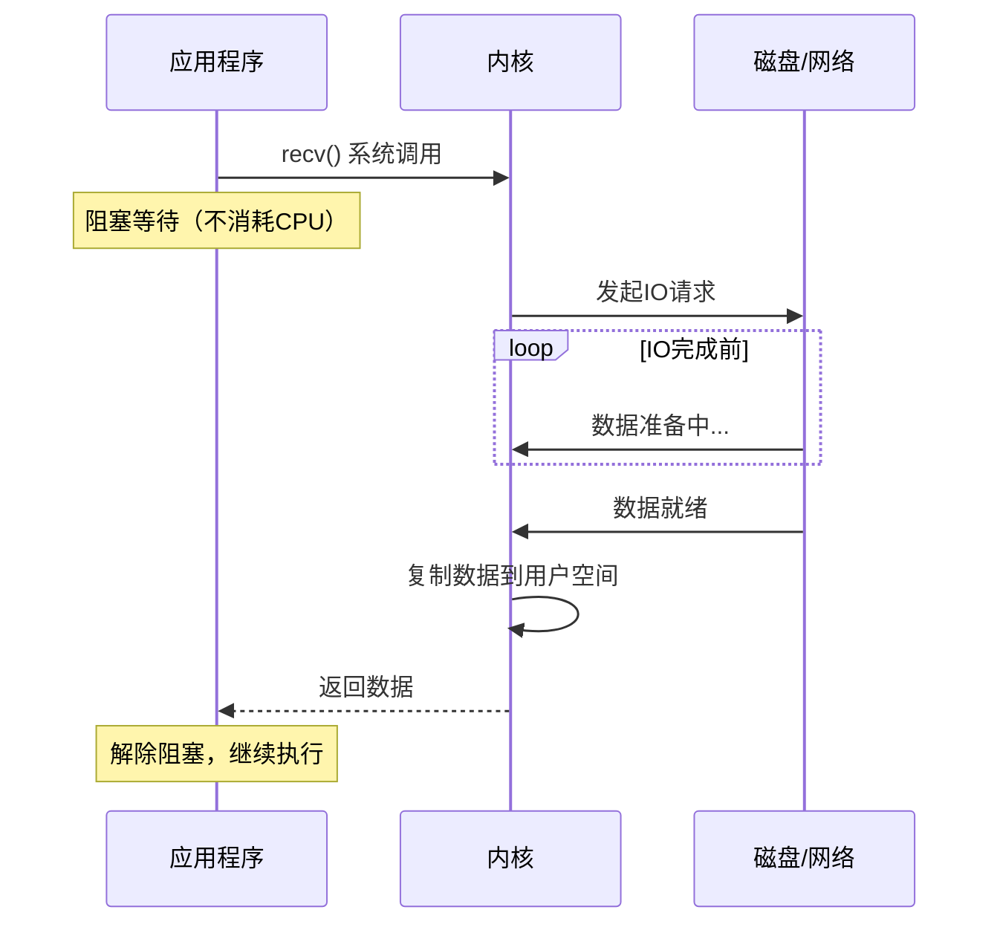
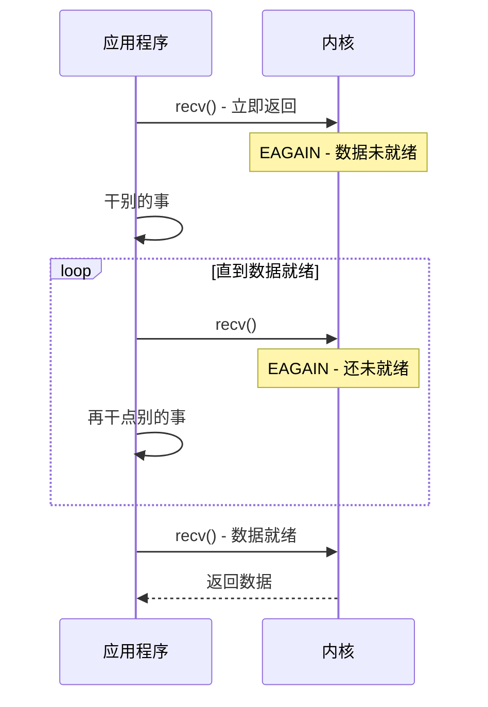
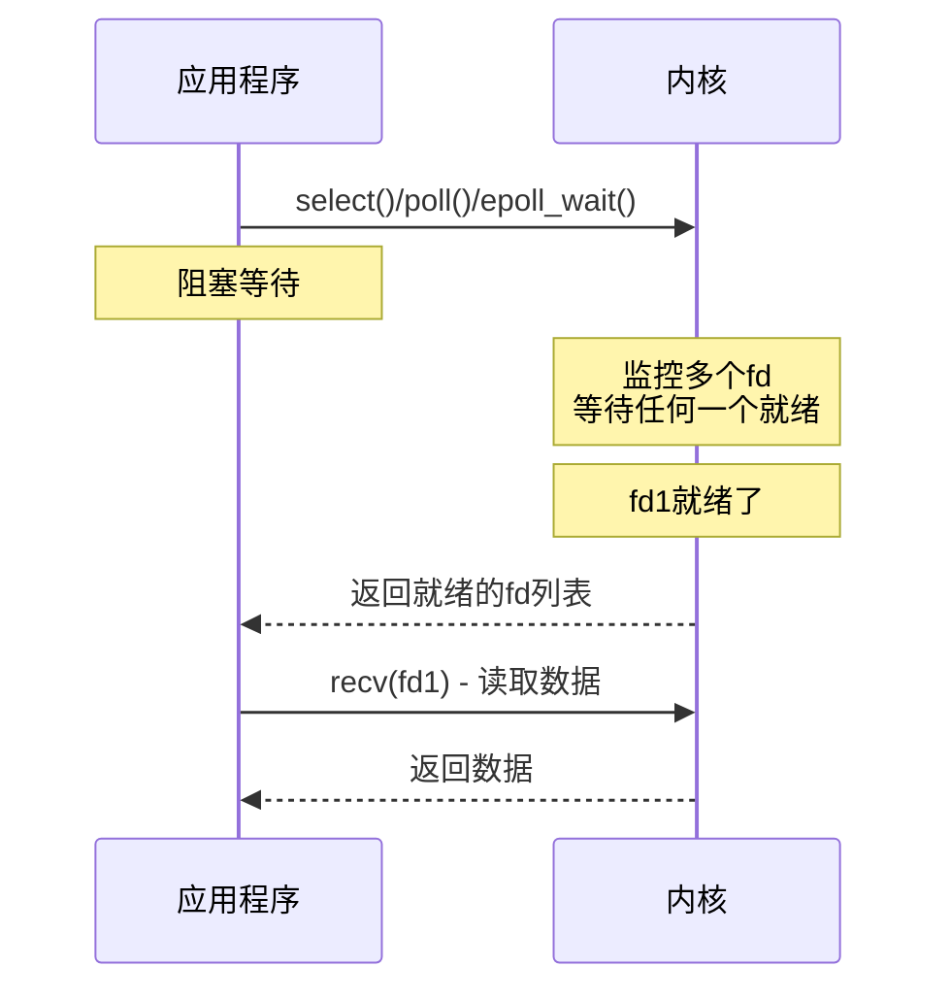
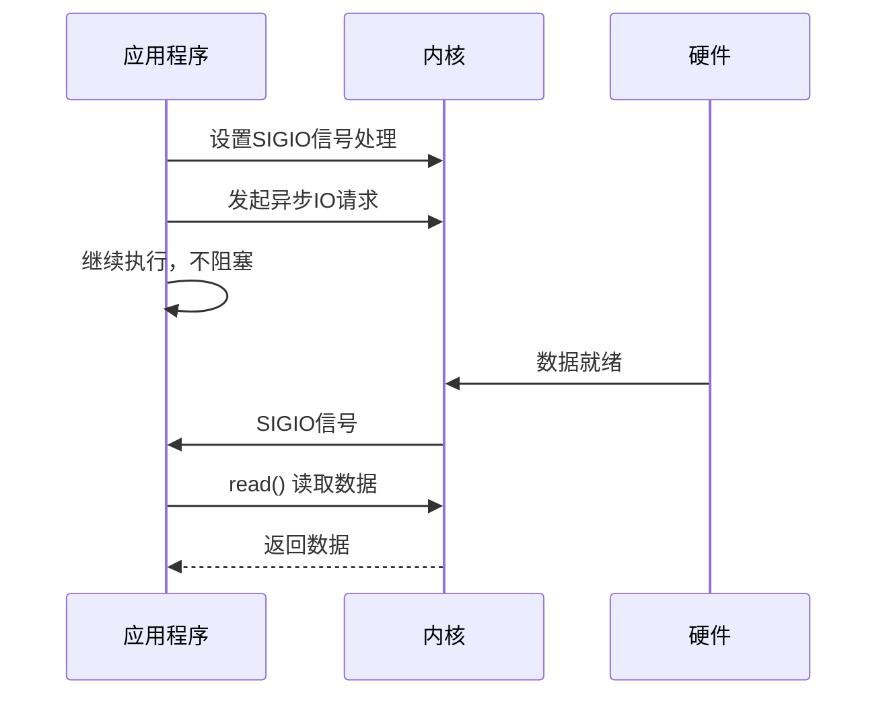
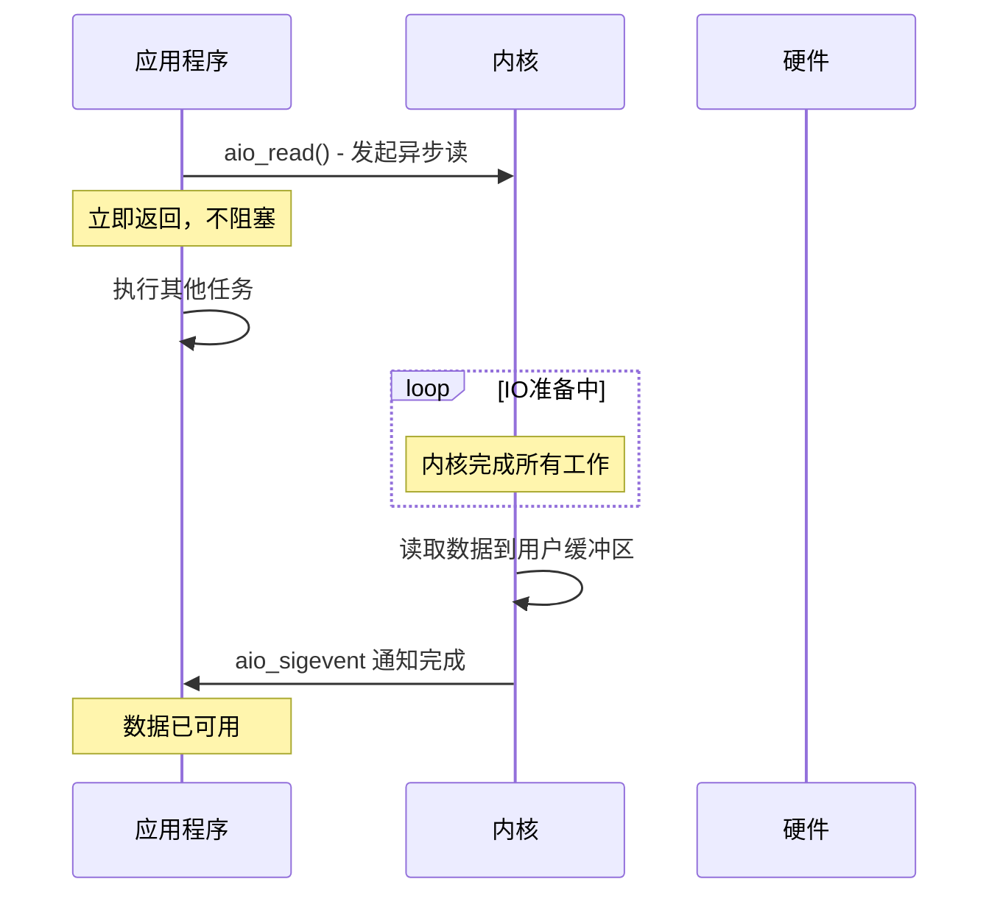

# IO模型深度解析

面试官问："什么是同步IO和异步IO？"

小王说："同步IO就是程序等待IO完成，异步IO就是程序不等IO完成..."

面试官继续追问："那你再说说阻塞IO和非阻塞IO的区别？select和epoll属于哪种？"

小王说："select是...同步IO？epoll应该也是...？"

面试官又问："Redis是同步还是异步？为什么？"

小王彻底卡住了。

IO模型是面试中的高频难点，很多人被这几个概念绕晕了。今天，我们把这个话题彻底讲透。

## 一、从一个问题开始

先看一个生活中的例子：

```
场景：你在餐厅点餐

阻塞IO（同步阻塞）：
你站在柜台前等服务员叫号
叫到你之前，你什么都干不了
只能傻站着等

非阻塞IO（同步非阻塞）：
你站在柜台前问："好了吗？"
服务员说："还没"
你走开干点别的，过一会再来问
但取餐的时候你还是得等

IO多路复用：
你拿了个号，坐在座位上
服务员喊号，你才过去取
不用一直站在柜台前等

异步IO（最理想）：
你下单后，服务员说"做好了给你送过去"
你干自己的事，餐来了直接吃
整个过程你都没参与
```

## 【直观类比】

### 五种IO模型 = 五种点餐方式

```
┌─────────────────────────────────────────────────────┐
│           点餐方式对比（IO模型类比）                  │
├─────────────────────────────────────────────────────┤
│                                                     │
│  阻塞IO：站在柜台前等，傻等                          │
│  ┌─────────┐                                        │
│  │ 等叫号   │ ← 程序阻塞在这里                        │
│  └─────────┘                                        │
│                                                     │
│  非阻塞IO：时不时去问，好没好？                       │
│  ┌─────────┐  ┌─────────┐  ┌─────────┐            │
│  │ 去问一次 │→ │ 没好    │→ │ 再去问   │            │
│  └─────────┘  └─────────┘  └─────────┘            │
│                                                     │
│  IO多路复用：拿号等通知                              │
│  ┌─────────┐  ┌─────────┐  ┌─────────┐            │
│  │ 坐下等   │→ │ 被叫号  │→ │ 去取餐   │            │
│  └─────────┘  └─────────┘  └─────────┘            │
│                                                     │
│  信号驱动IO：扫码等通知                              │
│  ┌─────────┐  ┌─────────┐  ┌─────────┐            │
│  │ 扫码离开 │→ │ 收到通知 │→ │ 去取餐   │            │
│  └─────────┘  └─────────┘  └─────────┘            │
│                                                     │
│  异步IO：外卖送到家                                  │
│  ┌─────────┐  ┌─────────┐  ┌─────────┐            │
│  │ 下单离开 │→ │ 餐送到了 │→ │ 直接吃   │            │
│  └─────────┘  └─────────┘  └─────────┘            │
└─────────────────────────────────────────────────────┘
```

### 核心概念区分

| 维度 | 同步 | 异步 |
| --- | --- | --- |
| **发起方式** | 程序主动调用 | 内核主动通知 |
| **等待方式** | 程序等待IO完成 | 程序不等，可以干别的 |
| **结果获取** | 调用返回时同步获得 | 通过回调/信号获得 |
| **代表性技术** | read/write/select | aio/Linux AIO |

| 维度 | 阻塞 | 非阻塞 |
| --- | --- | --- |
| **调用返回** | 没有数据就返回0或错误 | 立即返回（无数据返回EAGAIN） |
| **程序状态** | 挂起等待 | 可以继续执行 |
| **CPU使用** | 阻塞时不消耗CPU | 轮询时消耗CPU |

## 二、核心原理

### 1. 阻塞IO（Blocking IO）

最传统、最简单的IO模型：

```python
# 阻塞IO示例
data = socket.recv(1024)  # 程序在这里阻塞
print(data)
```

**工作流程**：



**特点**：
- 程序阻塞在系统调用
- 数据就绪后，内核复制到用户空间
- 返回后数据已可用
- 简单，但效率低（一个连接一个线程）

### 2. 非阻塞IO（Non-blocking IO）

让系统调用立即返回：

```python
import socket

sock = socket.socket()
sock.setblocking(False)  # 设置为非阻塞

try:
    data = sock.recv(1024)  # 立即返回
except BlockingIOError:
    # 数据还没准备好，做别的事
    do_other_work()
    # 稍后再尝试recv
```

**工作流程**：



**特点**：
- 系统调用立即返回
- 需要轮询检查数据是否就绪
- CPU浪费在轮询上
- 可以实现并发，但效率不高

### 3. IO多路复用（IO Multiplexing）

用一个线程管理多个IO：

```python
import select

# 监控多个socket
readable, writable, error = select.select(
    [sock1, sock2, sock3],  # 监控读
    [],                       # 监控写
    [],                       # 监控异常
    timeout=1                  # 超时时间
)

for sock in readable:
    data = sock.recv(1024)  # 肯定有数据，不会阻塞
```

**工作流程**：



**三种实现对比**：

| 系统调用 | 最大fd数 | 时间复杂度 | 工作方式 |
| --- | --- | --- | --- |
| select | 1024 | O(n) | 遍历所有fd |
| poll | 无限制 | O(n) | 遍历所有fd |
| epoll | 无限制 | O(1) | 回调通知 |

### 4. 信号驱动IO（Signal-driven IO）

用信号通知IO就绪：

```c
// 设置信号处理
struct sigaction sa;
sa.sa_handler = handler;  // 数据就绪时调用
sigaction(SIGIO, &sa, NULL);

// 设置接收进程
fcntl(fd, F_SETOWN, getpid());

// 设置异步通知
int flags = fcntl(fd, F_GETFL);
fcntl(fd, F_SETFL, flags | O_ASYNC);

// 应用继续执行，不阻塞
do_other_work();

// 信号处理函数
void handler(int sig) {
    // 数据已就绪，可以读取
    read(fd, buffer, size);
}
```

**工作流程**：



**特点**：
- 比非阻塞IO效率高
- 不需要轮询
- 编程复杂度高
- Linux支持，其他Unix变种可能不支持

### 5. 异步IO（Asynchronous IO）

真正的异步：内核完成所有工作后通知：

```python
import asyncio

async def read_data():
    # 异步IO：发起请求后不等待
    reader, writer = await asyncio.open_connection('host', 80)
    
    # 发请求后立即返回
    writer.write(b'GET / HTTP/1.0\r\n\r\n')
    
    # 读取响应
    data = await reader.read(1024)
    print(data)
```

```c
// POSIX异步IO (aio_*)
struct aiocb cb;
cb.aio_fildes = fd;
cb.aio_buf = buffer;
cb.aio_nbytes = 1024;
cb.aio_sigevent.sigev_notify = SIGEV_THREAD;

// 发起异步读
aio_read(&cb);

// 应用程序立即返回，继续执行
do_other_work();

// 读完成后，通过信号或回调通知
```

**工作流程**：



### 6. 五种模型对比

```
┌────────────────────────────────────────────────────────────────┐
│                        IO模型对比                                │
├────────────────────────────────────────────────────────────────┤
│                                                                │
│  阻塞IO：                                                         │
│  应用 ──────────── 内核处理 ──────────── 返回 ──── 应用继续       │
│       ↓阻塞        数据准备+复制          完成       ↓            │
│                                                                │
│  非阻塞IO：                                                       │
│  应用 ──→ 没数据 ──→ 没数据 ──→ 有数据 ──── 返回 ──── 应用继续   │
│       ↓立即返回   EAGAIN    EAGAIN    完成      ↓              │
│                     ↑轮询(浪费CPU)                               │
│                                                                │
│  IO多路复用：                                                      │
│  应用 ──── select/epoll ──── 返回 ──── recv ──── 返回 ──── 应用   │
│       ↓阻塞等待        就绪fd      ↓保证有数据                    │
│                                                                │
│  信号驱动IO：                                                      │
│  应用 ──── 设置sigio ──→ 继续执行 ──→ SIGIO ──→ recv ──→ 完成   │
│                      ↓                 ↑                         │
│                  不阻塞            数据已准备好                   │
│                                                                │
│  异步IO：                                                          │
│  应用 ──── aio_read ──→ 继续执行 ──→ 通知 ──→ 使用数据           │
│       ↓立即返回                  ↑                               │
│                           数据已复制到用户空间                     │
│                                                                │
│  关键区别：                                                         │
│  - 同步IO（阻塞/非阻塞/多路复用/信号）：数据复制阶段需要等待           │
│  - 异步IO：数据复制阶段也由内核完成，应用完全不参与                  │
└────────────────────────────────────────────────────────────────┘
```

## 三、边界与特例

### 1. 同步 vs 异步的本质区别

```
同步IO的特点：
- 程序主动调用IO操作
- 在数据复制阶段阻塞（或轮询）
- 程序需要等待IO完成才能继续

异步IO的特点：
- 程序发起IO操作后立即返回
- 内核完成数据复制后主动通知
- 程序可以完全并行执行其他任务
```

### 2. 各种IO模型适用场景

| IO模型 | 适用场景 | 原因 |
| --- | --- | --- |
| 阻塞IO | 连接数少、低并发 | 编程简单 |
| 非阻塞IO | 偶尔使用、检查状态 | 需要轮询 |
| IO多路复用 | 高并发（select/poll/epoll） | 高效管理多连接 |
| 信号驱动IO | 低频IO、通知场景 | 减少等待 |
| 异步IO | 高性能IO、科学计算 | 最高效率 |

### 3. Windows vs Linux的异步IO

```
Windows：
- 完整的异步IO支持（IOCP - IO Completion Port）
- 真正的异步，所有操作都异步
- 高性能服务器的Windows版本使用IOCP

Linux：
- 传统上缺乏真正的异步IO
- aio只支持磁盘IO，不支持网络IO
- Linux 5.1+ 引入了io_uring，真正支持异步IO
```

### 4. Java的IO演进

```java
// Java 1.4 之前的BIO（阻塞IO）
InputStream is = socket.getInputStream();
is.read();  // 阻塞

// Java 1.4 引入NIO（非阻塞+多路复用）
Selector selector = Selector.open();
selector.select();  // 多路复用

// Java 7 引入AIO（异步IO）
AsynchronousServerSocketChannel channel;
channel.accept().get();  // 异步回调
```

## 四、常见误区

### ❌ 误区一：非阻塞IO比阻塞IO好

```
非阻塞IO的问题：
- 需要轮询检查数据是否就绪
- 轮询本身消耗CPU
- 轮询间隔不好把握：间隔大响应慢，间隔小CPU浪费

结论：
- 低并发场景：阻塞IO更简单
- 高并发场景：用IO多路复用
```

### ❌ 误区二：select/epoll是异步IO

```
select/epoll 属于：
- 同步IO多路复用
- 它们只告诉你"哪些fd可用了"
- 具体读写操作（recv/write）还是同步的

真正的异步：
- Linux: aio_read/aio_write, io_uring
- Windows: IOCP
- 读写操作都不需要等待
```

### ❌ 误区三：Redis是异步IO

```
Redis是单线程 + epoll的同步IO模型：

1. epoll_wait等待事件（阻塞）
2. 收到请求，读取处理
3. 返回响应

虽然用了epoll高效管理连接，但：
- 每次IO操作（read/write）还是同步的
- 只是epoll减少了无效的阻塞

真正的异步Redis：
- Redis 6.0 引入了多线程IO
- 但核心命令处理仍是单线程同步的
```

### ❌ 误区四：异步IO一定比同步IO快

```
异步IO的开销：
- 回调机制有额外开销
- 状态管理更复杂
- 上下文切换可能更多

适合异步IO的场景：
- IO密集型任务
- 高并发网络请求
- 需要同时处理大量IO

不适合的场景：
- IO本身很快（如本地内存操作）
- 任务之间有依赖关系
- 简单的一次性操作
```

## 五、记忆技巧

### 一句话总结

> 同步IO：程序等IO完成；异步IO：IO完成内核通知程序

### 对比速记表

| 模型 | 阻塞？ | 同步？ | 数据就绪 | 数据复制 |
| --- | --- | --- | --- | --- |
| 阻塞IO | ✓ | ✓ | 内核通知 | 同步 |
| 非阻塞IO | ✗ | ✓ | 轮询 | 同步 |
| IO多路复用 | ✓ | ✓ | 内核通知 | 同步 |
| 信号驱动IO | ✗ | ✓ | 内核通知 | 同步 |
| 异步IO | ✗ | ✗ | 内核通知 | 异步 |

### 口诀

> "阻塞IO傻等待，CPU浪费在干等"
> "非阻塞轮询查，CPU浪费在轮询"
> "IO多路复用好，一个线程管多fd"
> "信号驱动内核叫，程序继续把活干"
> "异步IO最强悍，内核全包不用管"

### 判断流程图

```
IO操作
  ↓
需要等待数据吗？
  ↓否
非阻塞（立即返回）
  ↓是
数据复制需要程序等待吗？
  ↓是
同步IO（阻塞/非阻塞/多路复用/信号驱动）
  ↓否
异步IO（内核完成后通知）
```

## 六、实战检验

### 自检题目

**题目1**：为什么高并发服务器不用阻塞IO？

<details>
<summary>点击查看答案</summary>

阻塞IO的问题：

```
传统阻塞IO服务器模型：
主线程：
  while True:
    client = accept()      # 阻塞
    创建一个新线程处理
    线程中：
      data = recv()        # 阻塞

问题：
1. 每个连接一个线程，线程数量有限
2. 线程创建和切换开销大
3. 10K连接 = 10K线程 = 灾难

解决方案：
- IO多路复用（epoll）：一个线程管理所有连接
- 异步IO：完全不用等待
```
</details>

**题目2**：select/poll/epoll的区别是什么？

<details>
<summary>点击查看答案</summary>

| 维度 | select | poll | epoll |
| --- | --- | --- | --- |
| fd数量限制 | 1024（FD_SETSIZE） | 无限制（数组大小） | 无限制 |
| 时间复杂度 | O(n) | O(n) | O(1) |
| 工作方式 | 每次传入所有fd | 每次传入所有fd | 只传入就绪的fd |
| 内存复制 | 多（每次copy fd_set） | 多（每次copy数组） | 少（共享内存） |
| 触发方式 | 水平触发 | 水平触发 | 水平+边缘触发 |

```
select的问题：
- fd_set大小固定（通常是1024）
- 每次调用需要把fd_set从用户态复制到内核态
- 内核需要遍历所有fd
- 每次返回后需要遍历找出就绪的fd

epoll的优势：
- fd数量无限制
- 用红黑树管理fd，只在添加/删除时复制
- 就绪的fd通过回调放入就绪列表
- 每次返回就绪列表，不用遍历
```
</details>

**题目3**：为什么Redis使用单线程？

<details>
<summary>点击查看答案</summary>

Redis选择单线程的原因：

```
1. Redis瓶颈不在CPU，而在内存和网络IO
   - 单线程执行命令已经足够快

2. 多线程的复杂性
   - 需要处理锁竞争
   - 代码复杂度增加
   - 可能引入更多bug

3. 单线程的优势
   - 无锁开销
   - 无线程切换开销
   - 简单可预测的性能

Redis 6.0的改进：
- 引入了多线程IO
- 但命令执行仍是单线程
- 只是在读写IO上用了多线程加速
```
</details>

### 面试追问预测

| 问题 | 考察点 | 进阶追问 |
| --- | --- | --- |
| epoll原理 | IO多路复用 | 红黑树+就绪链表 |
| 水平触发vs边缘触发 | epoll模式 | 边缘触发要注意什么 |
| io_uring | Linux新特性 | 和epoll比有什么优势 |

## 七、生产实战案例

### 案例：Nginx的高性能IO

Nginx使用epoll实现高并发：

```nginx
# Nginx配置
events {
    worker_connections 10240;  # 每个worker的连接数
    use epoll;                # 使用epoll
    multi_accept on;           # 一次accept多个连接
}

http {
    sendfile on;              # 零拷贝
    tcp_nopush on;             # 优化TCP包
    tcp_nodelay on;            # 禁用Nagle算法
}
```

**Nginx的事件处理流程**：

```
                        ┌─────────────────┐
                        │   master进程     │
                        │  管理worker进程  │
                        └────────┬────────┘
                                 │
              ┌──────────────────┼──────────────────┐
              │                  │                  │
        ┌─────┴─────┐      ┌─────┴─────┐      ┌─────┴─────┐
        │  worker1  │      │  worker2  │      │  worker3  │
        │ (epoll)   │      │ (epoll)   │      │ (epoll)   │
        └───────────┘      └───────────┘      └───────────┘
              │                  │                  │
        管理10K连接       管理10K连接         管理10K连接
```

### 案例：Go的并发模型

Go用协程+IO多路复用实现高并发：

```go
func main() {
    // 启动1万个goroutine
    for i := 0; i < 10000; i++ {
        go func() {
            // 阻塞操作在Go运行时中变成非阻塞
            resp, err := http.Get("http://example.com")
            // 处理响应
        }()
    }
    
    // 等待所有goroutine完成
    time.Sleep(time.Second)
}
```

**Go运行时的工作原理**：

```
goroutine调度：
- GMP模型（G:goroutine, P:processor, M:machine）
- P的数量 = CPU核心数
- 每个P管理一组goroutine
- 用epoll监控goroutine的IO状态

IO处理：
1. goroutine发起网络请求
2. Go运行时注册到epoll
3. goroutine被挂起（不消耗线程）
4. epoll通知完成
5. 恢复goroutine继续执行
```

:::tip 💡

理解IO模型的关键是分清楚"等待数据"和"复制数据"两个阶段。同步IO在复制阶段需要程序参与，异步IO则完全由内核处理。选择哪种模型，要根据具体场景来定。

:::
