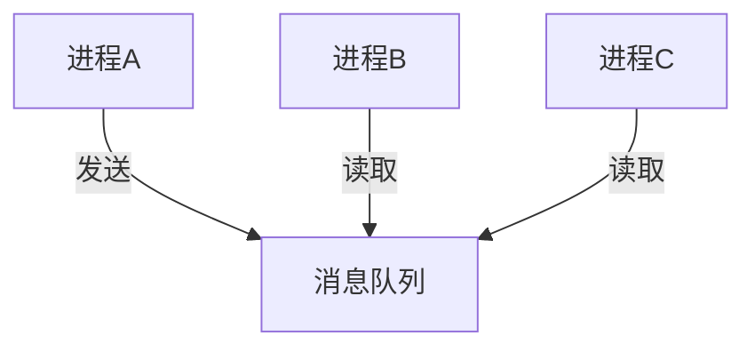

# 进程间通信方式

面试官问："进程之间怎么通信？"

小王掰着手指头数："管道、消息队列、共享内存、信号量、socket..."

面试官点点头："那管道和消息队列有什么区别？共享内存怎么保证同步？"

小王支支吾吾。

IPC（Inter-Process Communication）这道题，说起来知识点就那几个，但真正能把每种方式的适用场景和底层原理讲清楚的，不多。

今天，我们把这6种主流的IPC方式彻底讲透。

## 一、从一个问题开始

想象一个场景：你写了一个Web服务器，需要和数据库守护进程通信。

你会选择哪种方式？

- 每次查询都发一条消息？
- 共享一块内存直接读写？
- 建立一个长连接发送请求？

不同的场景，需要不同的通信方式。这就是IPC存在的意义：**让进程之间能够安全、高效地交换数据**。

## 【直观类比】

### 进程 = 两栋独立大楼

进程之间是隔离的，就像两栋独立的大楼：

```
┌──────────────┐      ┌──────────────┐
│    大楼A     │      │    大楼B     │
│  (进程A)     │      │  (进程B)     │
│              │      │              │
│  独立的土地   │      │  独立的土地   │
│  独立的基础设施│      │  独立的基础设施│
└──────────────┘      └──────────────┘
```

进程之间怎么通信？需要通过某种"通信协议"。

### 六种通信方式 = 六种通信工具

| 通信方式 | 类比 | 特点 |
| --- | --- | --- |
| 管道 | 对讲机 | 只能单向，临时通信 |
| 消息队列 | 邮局 | 异步收发，有缓冲 |
| 共享内存 | 共享笔记本 | 最快，但需要同步 |
| 信号量 | 红绿灯 | 协调访问，不是通信 |
| 信号 | 烽火台 | 通知事件，不是传数据 |
| socket | 网络电话 | 最通用，可跨主机 |

## 二、核心原理

### 1. 管道（Pipe）

管道是最古老的IPC方式，Linux下的`|`操作符就是管道。

**匿名管道**：

```bash
# 通过管道将ls的输出传给grep
ls -la | grep ".mdx"
```

实现原理：

```mermaid
graph LR
    A[父进程] -->|创建管道| B[pipefd[2]]
    B --> C[fd[0]读端]
    B --> D[fd[1]写端]
    C --> A
    D --> E[fork后子进程]
    E --> D
    A --> C
```

```c
// C语言创建管道
int pipefd[2];
pipe(pipefd);  // 创建管道

if (fork() == 0) {
    // 子进程：写入数据
    close(pipefd[0]);  // 关闭读端
    write(pipefd[1], "hello", 5);
} else {
    // 父进程：读取数据
    close(pipefd[1]);  // 关闭写端
    char buf[100];
    read(pipefd[0], buf, 100);
}
```

**命名管道（FIFO）**：

```bash
# 创建命名管道
mkfifo /tmp/myfifo

# 进程1：写入
echo "data" > /tmp/myfifo

# 进程2：读取
cat /tmp/myfifo
```

命名管道可以用于不相关的进程之间通信。

### 2. 消息队列（Message Queue）

消息队列像是一个邮箱，消息可以排队存放：



**System V消息队列**：

```c
// 创建消息队列
int msgid = msgget(key, IPC_CREAT | 0666);

// 定义消息结构
struct msgbuf {
    long mtype;       // 消息类型
    char mtext[100];  // 消息内容
};

// 发送消息
struct msgbuf msg;
msg.mtype = 1;
strcpy(msg.mtext, "Hello");
msgsnd(msgid, &msg, sizeof(msg.mtext), 0);

// 接收消息
msgrcv(msgid, &msg, sizeof(msg.mtext), 1, 0);
```

**POSIX消息队列**（更新、更易用）：

```c
// 打开/创建消息队列
mqd_t mq = mq_open("/myqueue", O_CREAT | O_RDWR, 0666, NULL);

// 发送
mq_send(mq, "hello", 5, 0);

// 接收
char buf[100];
mq_receive(mq, buf, 100, NULL);
```

### 3. 共享内存（Shared Memory）

共享内存是最快的IPC方式，因为数据不需要复制：

```
传统方式：                  共享内存：
┌─────────┐    copy    ┌─────────┐
│ 进程A   │ ────────→  │ 进程B   │
└─────────┘            └─────────┘

┌─────────┐            ┌─────────┐
│ 进程A   │  ←直接访问→ │ 进程B   │
└─────────┘            └─────────┘
```

```c
// 创建共享内存
int shmid = shmget(key, 1024, IPC_CREAT | 0666);

// 挂载到进程地址空间
void *shmaddr = shmat(shmid, NULL, 0);

// 写入数据
strcpy(shmaddr, "Hello Shared Memory!");

// 卸载
shmdt(shmaddr);
```

```python
# Python中使用mmap
import mmap

# 创建共享内存映射文件
with open("/tmp/shm", "wb") as f:
    mm = mmap.mmap(f.fileno(), 1024)
    mm.write(b"Hello from Python")
```

### 4. 信号量（Semaphore）

信号量本质上不是用来传输数据的，而是用来**协调多个进程对共享资源的访问**：

```c
// 创建信号量
int semid = semget(key, 1, IPC_CREAT | 0666);

// 初始化信号量为1（二进制信号量/互斥锁）
semctl(semid, 0, SETVAL, 1);

// P操作（等待）
struct sembuf p = {0, -1, SEM_UNDO};
semop(semid, &p, 1);

// 临界区代码
// ...

// V操作（释放）
struct sembuf v = {0, 1, SEM_UNDO};
semop(semid, &v, 1);
```

**使用场景**：

```
┌─────────────────────────────────┐
│         共享内存区域            │
│  ┌─────────────────────────┐  │
│  │     临界区（一次一进程）   │  │
│  └─────────────────────────┘  │
└─────────────────────────────────┘
        ↑
   用信号量保护
```

### 5. 信号（Signal）

信号是一种**异步通知机制**，用来告诉进程发生了什么事件：

```bash
# 发送信号
kill -SIGTERM 1234
```

```c
// 注册信号处理器
signal(SIGINT, handler);  // Ctrl+C

void handler(int sig) {
    // 清理资源
    exit(0);
}
```

常见信号：

| 信号 | 含义 | 默认行为 |
| --- | --- | --- |
| `SIGTERM` | 优雅终止 | 终止进程 |
| `SIGKILL` | 强制终止 | 终止进程 |
| `SIGSEGV` | 段错误 | 终止+core dump |
| `SIGCHLD` | 子进程退出 | 忽略 |

### 6. 套接字（Socket）

Socket是最通用的IPC方式，支持跨主机通信：

```c
// Unix Domain Socket（本地通信，比TCP更快）
struct sockaddr_un addr;
addr.sun_family = AF_UNIX;
strcpy(addr.sun_path, "/tmp/socket");

int fd = socket(AF_UNIX, SOCK_STREAM, 0);
bind(fd, (struct sockaddr *)&addr, sizeof(addr));
listen(fd, 5);
```

```python
# Python中使用Unix Domain Socket
import socket
import os

sock = socket.socket(socket.AF_UNIX, socket.SOCK_STREAM)
sock.bind("/tmp/mysocket.sock")
sock.listen(5)
```

## 三、边界与特例

### 1. 管道 vs 消息队列

| 维度 | 管道 | 消息队列 |
| --- | --- | --- |
| 数据边界 | 无结构的字节流 | 有类型的消息 |
| 生命周期 | 随进程 | 随内核（持久化） |
| 读取方式 | 顺序读取 | 可以按类型读取 |
| 容量 | 受内核缓冲区限制 | 有明确上限 |

### 2. 共享内存的同步问题

共享内存没有内置的同步机制，需要配合信号量使用：

```
错误做法：
┌─────────────────────────────────┐
│ 进程A：read → modify → write    │
│ 进程B：read → modify → write    │
│ 结果：丢失一次修改（lost update） │
└─────────────────────────────────┘

正确做法：
┌─────────────────────────────────┐
│ 进程A：P操作 → read → modify → write → V操作 │
│ 进程B：P操作 → read → modify → write → V操作 │
└─────────────────────────────────┘
```

### 3. Socket的多种类型

| 类型 | 说明 | 使用场景 |
| --- | --- | --- |
| `AF_UNIX` | Unix域套接字 | 本地进程通信 |
| `AF_INET` | IPv4 | TCP/UDP通信 |
| `AF_INET6` | IPv6 | 下一代网络 |
| `SOCK_STREAM` | 面向连接 | TCP |
| `SOCK_DGRAM` | 无连接 | UDP |

### 4. 六种方式的性能对比

| IPC方式 | 延迟 | 吞吐量 | 复杂度 |
| --- | --- | --- | --- |
| 管道 | 低 | 中 | 低 |
| 消息队列 | 中 | 中 | 中 |
| 共享内存 | 极低 | 极高 | 高（需同步） |
| 信号量 | 低 | - | 中 |
| 信号 | 极低 | - | 低 |
| Socket | 高 | 中 | 中 |

## 四、常见误区

### ❌ 误区一：管道只能用于父子进程

匿名管道确实需要fork()继承，但命名管道（FIFO）可以用于任意进程。

### ❌ 误区二：共享内存不需要同步

共享内存的访问需要额外同步，否则会出现竞态条件。

常见的同步方式：
- 信号量
- 互斥锁（需要共享内存中的锁）
- 原子操作

### ❌ 误区三：消息队列是实时的

消息队列有缓冲区，不是实时传递。消息可能排队等待，直到被接收。

### ❌ 误区四：Socket只能用网络通信

Unix Domain Socket（SOCK_STREAM、SOCK_DGRAM）是在同一台机器上进程间通信的高效方式，比TCP快很多。

## 五、记忆技巧

### 一句话总结

> 管道点对点，消息队列缓冲，共享内存最快但要同步，信号量管门卫，信号管通知，socket最通用

### 口诀

> "管道像水管，一进一出"
> "队列像邮局，存着等人取"
> "共享内存像黑板，写了大家都看得见"
> "信号量像钥匙，一次只能进一人"
> "信号像广播，听到就知道"

### 场景速查表

| 场景 | 推荐方式 |
| --- | --- |
| 父子进程通信 | 管道 |
| 不相关进程通信 | 命名管道/消息队列/Socket |
| 高性能数据交换 | 共享内存 |
| 事件通知 | 信号 |
| 访问控制 | 信号量 |

## 六、实战检验

### 自检题目

**题目1**：Linux下的`ps aux | grep python`是如何工作的？

<details>
<summary>点击查看答案</summary>

1. shell创建管道，得到`pipefd[0]`和`pipefd[1]`
2. fork一个子进程，执行`ps aux`，关闭读端，将输出写入管道
3. 再fork一个子进程，执行`grep python`，关闭写端，从管道读取输入
4. shell进程等待两个子进程结束

整个过程：父进程fork两次，创建两次管道（标准输入和输出各一个）。
</details>

**题目2**：为什么共享内存是最快的IPC方式？

<details>
<summary>点击查看答案</summary>

共享内存直接映射到进程地址空间，数据不需要在用户态和内核态之间复制。

其他IPC方式都需要：发送方复制到内核缓冲区 → 内核复制到接收方缓冲区 → 接收方复制到用户空间。

共享内存跳过了这个过程，直接在用户空间访问同一块物理内存。
</details>

**题目3**：Redis为什么使用Unix Domain Socket而不是TCP？

<details>
<summary>点击查看答案</summary>

Unix Domain Socket在同一台机器上通信，不需要走网络协议栈，开销更小。

测试数据：Unix Socket延迟约0.03ms，TCP Loopback延迟约0.1ms。

对于Redis这种高QPS的服务，这个差距不可忽视。
</details>

### 面试追问预测

| 问题 | 考察点 | 进阶追问 |
| --- | --- | --- |
| 消息队列 vs 管道 | 数据边界 | 管道能传递结构化数据吗 |
| 共享内存同步 | 竞态条件 | 如何实现一个锁 |
| 信号 vs 信号量 | 概念混淆 | 信号量能传数据吗 |

## 七、生产实战案例

### 案例：Nginx的进程间通信

Nginx采用master-worker架构，master进程和worker进程之间通过共享内存通信：

```
master进程：
- 管理worker进程的生命周期
- 通过信号通知worker（QUIT/TERM/HUP）
- 监听端口，分发连接给worker

worker进程：
- 处理实际的请求
- 通过共享内存访问连接池
- 定时向master报告状态
```

这种设计让Nginx能够：
- 热加载配置（不中断服务）
- 平滑升级（不影响连接）
- 超然的管理worker进程

### 案例：消息队列在大规模系统中的应用

```
场景：秒杀系统下单流程

用户 → API服务 → 消息队列 → 订单服务 → 库存服务
                       ↓
                    库存服务（异步）
```

使用消息队列的好处：
- **解耦**：API服务和订单服务独立
- **削峰**：秒杀流量被队列缓冲
- **可靠**：消息持久化，不丢单

:::tip 💡
面试时能说出实际生产系统中的IPC使用场景，说明你不仅懂原理，更懂工程落地。
:::
