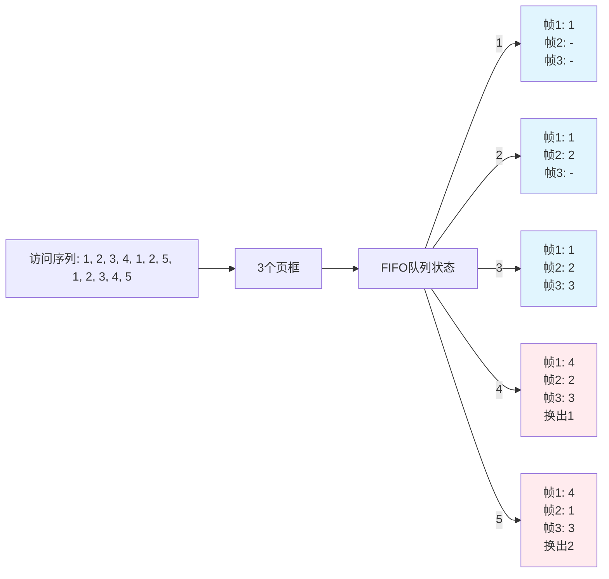
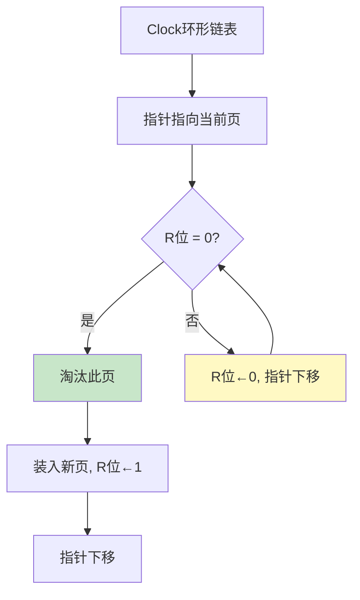

# 页面置换算法

面试官问："如果内存已满，又要加载一个新页面，该换出哪一个？"

小张说："换最久没用过的那个。"

面试官追问："那具体怎么实现？FIFO和LRU有什么区别？什么情况下FIFO反而比LRU更好？"

小张愣住了。

这个问题看起来简单，但背后涉及的算法设计、性能权衡、以及一个反直觉的"Belady异常"——坑比你想象的多得多。

## 一、从一个问题开始

先想象一个图书馆的场景：

```
你有一本借书证，最多同时借3本书。

第1天：借了《数据结构》
第2天：借了《操作系统》
第3天：借了《计算机网络》
第4天：想借《算法导论》，但已经借了3本，必须还掉一本

选择还哪本？

选择A：还掉最先借的《数据结构》
       → 之后可能还会翻《数据结构》，又要重新借

选择B：还掉最近刚翻过的《操作系统》
       → 大概率很久不会再看这本书
```

**这就是页面置换要解决的问题**：当物理内存不够时，如何选择淘汰哪个页面，让缺页率最低。

## 【直观类比】

### 页面置换 = 图书馆借书

```
┌─────────────────────────────────────────────────┐
│            页面置换的核心矛盾                    │
├─────────────────────────────────────────────────┤
│  理想目标：淘汰"未来最长时间不访问"的页面          │
│                                                  │
│  问题：我们无法预知未来！                         │
│                                                  │
│  所以只能用"历史"来预测"未来"                   │
│  - FIFO：用"在内存时间"预测                      │
│  - LRU：用"最近访问时间"预测                     │
│  - Clock：用"访问位"近似LRU                      │
└─────────────────────────────────────────────────┘
```

| 指标 | FIFO | LRU | Clock |
| --- | --- | --- | --- |
| 核心思想 | 淘汰最早进入的 | 淘汰最久未访问的 | 近似LRU但开销低 |
| 实现难度 | 简单 | 复杂（需维护时间戳） | 中等（硬件支持） |
| Belady异常 | 有 | 无 | 几乎无 |
| 开销 | 低 | 高 | 中 |

### 为什么需要页面置换？

```
程序局部性原理：

1. 时间局部性：最近访问的地址，很快可能再次访问
   for (int i = 0; i < 1000; i++) {
       a[i] = a[i] + 1;  // 同一个地址反复访问
   }

2. 空间局部性：访问某个地址后，附近地址很快也会访问
   for (int i = 0; i < 1000; i++) {
       process(a[i]);  // 顺序访问数组
   }
```

:::tip 💡
局部性原理是页面置换算法有效性的前提。如果程序访问完全没有规律，那任何置换算法都是等效的。好在实际程序大多具有良好的局部性。
:::

## 二、核心原理

### 1. FIFO（先进先出）

最朴素的思路：最早进入内存的页面，最早被淘汰。

```python
from collections import deque

class FIFOPageReplacement:
    def __init__(self, frames):
        self.frames = frames  # 物理页框数量
        self.pages = deque()  # 按进入顺序存储
        self.page_faults = 0   # 缺页次数

    def reference(self, page):
        """访问一个页面"""
        if page not in self.pages:
            self.page_faults += 1

            if len(self.pages) >= self.frames:
                # 内存已满，淘汰最早进入的
                self.pages.popleft()

            self.pages.append(page)
            return "缺页"
        return "命中"

    def run(self, reference_string):
        """运行FIFO算法"""
        for page in reference_string:
            status = self.reference(page)
            print(f"访问页面 {page}: {status}, 当前内存: {list(self.pages)}")

        return self.page_faults

# 示例：3个页框，访问序列 1, 2, 3, 4, 1, 2, 5, 1, 2, 3, 4, 5
fifo = FIFOPageReplacement(frames=3)
faults = fifo.run([1, 2, 3, 4, 1, 2, 5, 1, 2, 3, 4, 5])
print(f"\nFIFO 缺页次数: {faults}")
```

**执行过程**：



**FIFO的致命缺陷——Belady异常**：

```
Belady异常：增加物理页框数量，缺页率反而上升的现象

示例序列: 1, 2, 3, 4, 1, 2, 5, 1, 2, 3, 4, 5

3个页框时的FIFO：
缺页: 1, 2, 3, 4, 1, 2, 5, 1, 2, 3, 4, 5
       缺  缺  缺  缺  命中 命中 缺  命中 命中 缺  缺  缺
缺页次数: 9次

4个页框时的FIFO：
       缺  缺  缺  缺  命中 命中 命中 命中 命中 缺  缺  缺
缺页次数: 10次  ← 反而增加了！

原因：4个页框时，页面1在队列中停留更久，
     导致在关键时刻反而被换出
```

:::warning ⚠️
Belady异常只发生在FIFO上，绝不会发生在LRU上。这是面试常考的点：为什么LRU没有Belady异常？因为LRU基于"最近使用"而非"进入顺序"。
:::

### 2. LRU（最近最少使用）

核心思想：淘汰最久未访问的页面。

```python
class LRUPageReplacement:
    def __init__(self, frames):
        self.frames = frames
        self.page_dict = {}      # 页 -> 最近访问时间
        self.access_order = []   # 访问顺序列表
        self.page_faults = 0
        self.time = 0

    def reference(self, page):
        self.time += 1

        if page not in self.page_dict:
            self.page_faults += 1

            if len(self.page_dict) >= self.frames:
                # 淘汰最久未访问的
                lru_page = min(self.page_dict, key=self.page_dict.get)
                del self.page_dict[lru_page]

            self.page_dict[page] = self.time
            return "缺页"

        # 更新访问时间
        self.page_dict[page] = self.time
        return "命中"

    def run(self, reference_string):
        for page in reference_string:
            status = self.reference(page)
            print(f"访问页面 {page}: {status}")
        return self.page_faults

# 对比FIFO和LRU
print("=== FIFO vs LRU ===")
print("\n序列: 1, 2, 3, 4, 1, 2, 5, 1, 2, 3, 4, 5\n")

# FIFO
fifo = FIFOPageReplacement(frames=3)
print("FIFO 3帧:")
fifo.run([1, 2, 3, 4, 1, 2, 5, 1, 2, 3, 4, 5])
print(f"缺页: {fifo.page_faults}次\n")

# LRU
lru = LRUPageReplacement(frames=3)
print("LRU 3帧:")
lru.run([1, 2, 3, 4, 1, 2, 5, 1, 2, 3, 4, 5])
print(f"缺页: {lru.page_faults}次")
```

**LRU的精确实现对比FIFO**：

```
序列: 1, 2, 3, 4, 1, 2, 5, 1, 2, 3, 4, 5

┌──────────────────────────────────────────────────────────────┐
│                    3个页框下的执行对比                        │
├──────────────────────────────────────────────────────────────┤
│ 时间 │ 访问 │ FIFO(缺页?) │ LRU(缺页?)                       │
├──────────────────────────────────────────────────────────────┤
│  1   │  1   │ 缺 [1]      │ 缺 [1]                          │
│  2   │  2   │ 缺 [1,2]    │ 缺 [1,2]                        │
│  3   │  3   │ 缺 [1,2,3]  │ 缺 [1,2,3]                      │
│  4   │  4   │ 缺 [2,3,4]  │ 缺 [2,3,4]  ← 换出1              │
│  5   │  1   │ 缺 [3,4,1]  │ 缺 [4,3,1]  ← 换出4              │
│  6   │  2   │ 缺 [4,1,2]  │ 命中 [4,1,2]                    │
│  7   │  5   │ 缺 [1,2,5]  │ 缺 [1,2,5]  ← FIFO换出4,LRU换出3 │
│  8   │  1   │ 命中        │ 命中                            │
│  9   │  2   │ 命中        │ 命中                            │
│ 10   │  3   │ 缺 [2,5,3]  │ 命中                            │
│ 11   │  4   │ 缺 [5,3,4]  │ 缺 [5,1,4]                      │
│ 12   │  5   │ 缺 [3,4,5]  │ 命中                            │
├──────────────────────────────────────────────────────────────┤
│ 缺页次数  │  9次       │ 7次                                │
└──────────────────────────────────────────────────────────────┘

LRU比FIFO少了2次缺页！
```

:::tip 💡
LRU在大多数情况下优于FIFO，但代价是实现复杂度更高。FIFO只需维护一个队列，LRU需要记录每个页面的访问时间（或维护一个按访问时间排序的结构）。
:::

### 3. Clock算法（CLOCK/NRU）

LRU效果好，但开销大。Clock算法用硬件支持的"访问位"来近似LRU。

```python
class ClockPageReplacement:
    def __init__(self, frames):
        self.frames = frames
        self.pages = [None] * frames   # 存储页面号
        self.access_bits = [0] * frames  # 访问位(R位)
        self.used_bits = [0] * frames    # 使用位
        self.hand = 0                    # 指针位置
        self.page_faults = 0

    def reference(self, page):
        """Clock算法核心"""
        if page in self.pages:
            # 命中，更新访问位
            idx = self.pages.index(page)
            self.access_bits[idx] = 1
            return "命中"

        # 缺页
        self.page_faults += 1

        # 找淘汰页（Clock指针顺时针扫描）
        while True:
            if self.access_bits[self.hand] == 0:
                # 第一轮：找到R=0的页，直接淘汰
                break
            else:
                # 第二轮：R=1，清除R，指针下移
                self.access_bits[self.hand] = 0
                self.hand = (self.hand + 1) % self.frames

        # 淘汰当前指针指向的页
        self.pages[self.hand] = page
        self.access_bits[self.hand] = 1  # 新页R位置1
        self.hand = (self.hand + 1) % self.frames
        return "缺页"

    def show_state(self):
        """显示Clock状态"""
        print(f"  [{'  '.join(str(p) if p else '-':2s for p in self.pages)}]")
        print(f"  [R={'  '.join(str(b) for b in self.access_bits)}] 指针→{self.hand}")

    def run(self, reference_string):
        for page in reference_string:
            status = self.reference(page)
            print(f"访问 {page}: {status}", end="  ")
            self.show_state()
        return self.page_faults

# 示例：4个页框，访问序列 1, 2, 3, 4, 1, 2, 5, 1, 2, 3
print("=== Clock算法演示 ===\n")
clock = ClockPageReplacement(frames=4)
clock.run([1, 2, 3, 4, 1, 2, 5, 1, 2, 3])
print(f"\nClock 缺页: {clock.page_faults}次")
```

**Clock算法的核心原理**：



```
Clock算法四步走：

第一步：指针指向某页，检查R位
第二步：如果R=0 → 淘汰此页
第三步：如果R=1 → R←0，指针下移，继续检查
第四步：重复直到找到R=0的页

为什么这样设计？
- R=1 表示"最近访问过"，可能是热点页，暂不淘汰
- R=0 表示"最近未访问"，可以优先淘汰
- 一轮扫描后，所有R位都变成0，保证能选出淘汰页
```

**Clock增强版——改进型Clock（改进型NRU）**：

```python
class EnhancedClock:
    """改进型Clock算法，同时考虑访问位和修改位"""
    def __init__(self, frames):
        self.frames = frames
        self.pages = [None] * frames
        self.access_bits = [0] * frames   # R位
        self.modify_bits = [0] * frames   # M位
        self.hand = 0
        self.page_faults = 0

    def reference(self, page, modified=False):
        """modified: 页面是否被修改"""
        if page in self.pages:
            idx = self.pages.index(page)
            self.access_bits[idx] = 1
            if modified:
                self.modify_bits[idx] = 1
            return "命中"

        self.page_faults += 1

        # 改进型Clock扫描优先级：(R, M)
        # (0, 0) 最优先淘汰 → 未访问未修改
        # (0, 1) 次优先       → 未访问已修改（需写回）
        # (1, 0) 第三          → 已访问未修改
        # (1, 1) 最后          → 已访问已修改

        while True:
            r, m = self.access_bits[self.hand], self.modify_bits[self.hand]

            if r == 0 and m == 0:
                break  # 最佳淘汰对象
            elif r == 0 and m == 1:
                # 需要写回，但仍是候选
                if not hasattr(self, '_found_candidate'):
                    self._found_candidate = self.hand
            elif r == 1:
                self.access_bits[self.hand] = 0

            self.hand = (self.hand + 1) % self.frames

        # 淘汰
        self.pages[self.hand] = page
        self.access_bits[self.hand] = 1
        self.modify_bits[self.hand] = 1 if modified else 0
        self.hand = (self.hand + 1) % self.frames
        return "缺页"
```

```
改进型Clock选择顺序（优先级从高到低）：

(R=0, M=0)：未访问且未修改 → 直接淘汰，无需写回
(R=0, M=1)：未访问但已修改 → 需写回磁盘，但可接受
(R=1, M=0)：已访问未修改   → 清除R后可淘汰
(R=1, M=1)：已访问且已修改 → 最不想淘汰

这样既考虑了访问频率，又考虑了I/O开销。
```

### 4. LFU和MFU

**LFU（最不经常使用）**：淘汰访问频率最低的页面。

```python
class LFUPageReplacement:
    def __init__(self, frames):
        self.frames = frames
        self.page_freq = {}   # 页 -> 访问次数
        self.page_faults = 0

    def reference(self, page):
        if page not in self.page_freq:
            self.page_faults += 1

            if len(self.page_freq) >= self.frames:
                # 淘汰访问次数最少的
                lfu_page = min(self.page_freq, key=self.page_freq.get)
                del self.page_freq[lfu_page]

            self.page_freq[page] = 1
        else:
            self.page_freq[page] += 1

        return "命中" if page in self.page_freq else "缺页"
```

```
LFU的问题：

1. 一次性页面：刚加载的页面，访问次数少，但之后可能频繁访问
   解决方案：定期衰减访问计数（除以2）

2. 热点页永久化：某个页面访问次数很高，即使不再访问也不淘汰
   解决方案：计数器设置上限，或定期重置

3. 实现复杂度：需要维护计数器排序
```

**MFU（最经常使用）**：认为刚加载的页面可能很快会被淘汰。

这个算法很少使用，因为直觉上"最常用的页面应该保留"，MFU和直觉相悖。

## 三、边界与特例

### 1. Belady异常——FIFO的反直觉陷阱

```
Belady异常定义：增加页框数 → 缺页率上升（违反直觉）

必须满足Belady异常的序列特征：
- 序列要有明显的"工作集"切换
- FIFO会让新页面在队列中停留太久

证明Belady异常存在的序列：
页面序列: 0, 1, 2, 3, 0, 1, 4, 0, 1, 2, 3, 4

3个页框（缺页10次）：
时间: 1  2  3  4  5  6  7  8  9  10 11 12
页面: 0  1  2  3  0  1  4  0  1  2  3  4
     缺 缺 缺 缺 命中 命中 缺 命中 命中 缺 缺 缺

4个页框（缺页11次）：
     缺 缺 缺 缺 命中 命中 命中 命中 命中 命中 缺 缺
     → 缺页反而增加了1次！

LRU没有Belady异常的原因：
增加页框意味着更多页面能驻留内存，
"最久未使用"的集合永远在扩大，不会出现FIFO的"队列滞留"问题。
```

### 2. 工作集模型

```
工作集(Working Set)：进程在最近Δ个时间单位内访问的页面集合

示例：Δ=4
访问序列: 1, 2, 3, 4, 5, 1, 2, 3, 4, 5
时间窗口:
 t=1: {1}          → 需要1页
 t=2: {1,2}        → 需要2页
 t=3: {1,2,3}      → 需要3页
 t=4: {1,2,3,4}    → 需要4页
 t=5: {2,3,4,5}    → 需要4页  ← 1被移出工作集
 t=6: {1,3,4,5}    → 需要4页  ← 2被移出工作集
```

### 3. 页面置换算法的实际应用

| 场景 | 推荐算法 | 原因 |
| --- | --- | --- |
| 通用操作系统 | Clock/改进型Clock | 接近LRU效果，实现开销低 |
| 数据库/服务器 | LRU-K | 考虑历史访问模式 |
| 嵌入式系统 | FIFO | 开销最小 |
| 浏览器缓存 | LFU变种 | 考虑资源访问频率 |

### 4. 抖振现象（Thrashing）

```
当物理内存严重不足时：

1. 进程需要更多内存 → 换出页面
2. 被换出的进程需要这些页面 → 换回来
3. 但又被其他进程换出 → 又换回来
4. CPU大量时间花在换页上 → 实际计算时间接近0

这就是抖振：系统忙着换页，却没有真正做有用的工作

解决方案：
- 调整多道程序 degree（减少并发进程数）
- 使用更大的物理内存
- 使用工作集模型控制内存分配
- 页面置换算法配合内存分配策略
```

## 四、常见误区

### ❌ 误区一：FIFO一定比LRU差

```
FIFO在某些特定访问模式下反而优于LRU：

序列: 1, 2, 3, 4, 1, 2, 5, 1, 2, 3, 4, 5

3个页框：
FIFO缺页: 9次
LRU缺页: 7次  ← 看起来LRU更好

但如果是这个序列:
序列: 1, 2, 3, 4, 5, 6, 7, 8, 1, 2, 3, 4, 5, 6, 7, 8

3个页框：
FIFO: 几乎每次都命中（队列在稳定状态） 缺页 8次
LRU: 每次访问都缺页（没有局部性）      缺页 16次

所以FIFO并非总是最差，要看访问模式。
```

### ❌ 误区二：LRU是最优置换算法

```
最优置换(OPT)：淘汰未来最长时间不访问的页面

问题：OPT需要预知未来，实际无法实现！

LRU是"最优的可实现算法"吗？不一定。

LRU的问题：
1. 实现开销大（需要维护访问时间戳或链表）
2. 在某些访问模式下性能不如Clock
3. 无法应对"一次性访问"（刚加载就淘汰的情况）

实际系统很少用纯LRU，一般用Clock近似。
```

### ❌ 误区三：Clock只是LRU的简化版

```
Clock和LRU的核心区别：

LRU：基于精确的"时间戳"或"访问顺序"
Clock：基于硬件支持的"访问位(R)"

两者在很多情况下效果接近，但有本质不同：

序列: A B C D A B C D A B C D ... (循环访问4个页面)

3个页框：
LRU: 每次都缺页（因为是循环访问，没有"最久未用"）
Clock: 同样每次都缺页

序列: A B C D C B A D C B A D ... 

这个序列LRU表现很差（没有局部性），
但Clock因为只看R位，表现反而可能不同。

所以Clock不是LRU的简化版，而是一种权衡方案：
用较低的精度换取较低的实现开销。
```

### ❌ 误区四：Belady异常可以通过改进FIFO解决

```
Belady异常的本质：FIFO的"队列顺序"和"使用价值"没有关联

即使给FIFO加上"年龄位"(Age Bits)：

┌────────────────────────────────────────┐
│ FIFO + Age Bits:                        │
│                                        │
│ 000000 → 刚进入                         │
│ 111111 → 最老的                         │
│                                        │
│ 每次扫描：所有年龄位右移                 │
│ 新页年龄位置1                           │
│ 年龄位=0的页被淘汰                      │
│                                        │
│ 效果：近似LRU，消除Belady异常            │
│ 但这已经变成了Clock！                   │
└────────────────────────────────────────┘

所以：加了年龄位的FIFO本质上就是Clock。
真正的FIFO（即简单队列）无法避免Belady异常。
```

## 五、记忆技巧

### 一句话总结

> 页面置换的核心矛盾是"用历史预测未来"：FIFO用"老"，LRU用"近"，Clock用"位"。FIFO有Belady异常，LRU没有。

### 对比速记表

| 算法 | 淘汰谁 | 实现方式 | Belady异常 | 开销 |
| --- | --- | --- | --- | --- |
| FIFO | 最早进入 | 队列 | 有 | 最低 |
| LRU | 最久未用 | 时间戳/链表 | 无 | 最高 |
| Clock | R=0的页 | 环形链表+指针 | 几乎无 | 中等 |
| LFU | 访问最少 | 计数器 | 无 | 高 |
| OPT | 未来最远 | 预知未来（不可实现） | — | — |

### 口诀

> "FIFO看进入顺序，LRU看最近访问"
> "Clock指针转一圈，R位清零来排榜"
> "Belady异常FIFO独有，LRU永远不中招"
> "换页太多是抖振，加内存或者调算法"

### 记忆图

```
┌─────────────────────────────────────────────┐
│              页面置换算法全家福               │
├─────────────────────────────────────────────┤
│                                             │
│         能否预知未来？                       │
│              ↓                              │
│     ┌───────┴───────┐                       │
│     是              否                       │
│     ↓               ↓                       │
│   OPT(理论最优)   三大流派                    │
│   (无法实现)      ┌────┬─────┬─────┐        │
│                   ↓    ↓     ↓              │
│                  FIFO  LRU  Clock           │
│                  (老) (近)  (位)              │
│                     ↓    ↓     ↓             │
│                  缺页多 最优  权衡            │
│                  有异常 无异常 近似最优        │
└─────────────────────────────────────────────┘
```

## 六、实战检验

### 自检题目

**题目1**：假设有3个页框，执行以下访问序列：`1, 2, 3, 4, 1, 2, 5, 1, 2, 3, 4, 5`。分别计算FIFO和LRU的缺页次数。

<details>
<summary>点击查看答案</summary>

**FIFO（先进先出）**：

```
初始：3个空页框

访问1: 缺页 [1]
访问2: 缺页 [1,2]
访问3: 缺页 [1,2,3]
访问4: 缺页 [2,3,4] ← 换出1（FIFO队列头）
访问1: 缺页 [3,4,1] ← 换出2
访问2: 缺页 [4,1,2] ← 换出3
访问5: 缺页 [1,2,5] ← 换出4
访问1: 命中
访问2: 命中
访问3: 缺页 [2,5,3] ← 换出1
访问4: 缺页 [5,3,4] ← 换出2
访问5: 命中

FIFO 缺页次数: 9次
```

**LRU（最近最少使用）**：

```
初始：3个空页框

访问1: 缺页 [1]
访问2: 缺页 [1,2]
访问3: 缺页 [1,2,3]
访问4: 缺页 [2,3,4] ← 最久未用的是1
访问1: 缺页 [3,4,1] ← 最久未用的是2
访问2: 缺页 [4,1,2] ← 最久未用的是3
访问5: 缺页 [1,2,5] ← 最久未用的是4
访问1: 命中
访问2: 命中
访问3: 命中   ← 1,2,5中最久未用的是5
访问4: 缺页 [1,2,4] ← 最久未用的是3
访问5: 命中   ← 最久未用的是4

LRU 缺页次数: 7次
```

</details>

**题目2**：什么是Belady异常？请给出一个例子说明。

<details>
<summary>点击查看答案</summary>

Belady异常：增加物理页框数量，缺页率反而上升的现象。

```
经典例子：序列 0, 1, 2, 3, 0, 1, 4, 0, 1, 2, 3, 4

3个页框时：
访问: 0  1  2  3  0  1  4  0  1  2  3  4
      缺  缺  缺  缺  命中 命中 缺  命中 命中 缺  缺  缺
缺页率 = 9/12 = 75%

4个页框时：
访问: 0  1  2  3  0  1  4  0  1  2  3  4
      缺  缺  缺  缺  命中 命中 命中 命中 命中 命中 缺  缺
缺页率 = 6/12 = 50%

这个例子没有体现Belady异常。换一个有Belady异常的序列：

序列: 1, 2, 3, 4, 1, 2, 5, 1, 2, 3, 4, 5

3个页框: 缺页9次
4个页框: 缺页10次  ← Belady异常！

4个页框时页面1在内存中停留更久，
在时刻7需要页面5时，1恰好在队列头部被换出，
导致后续访问1时又缺页。
```

</details>

**题目3**：为什么实际操作系统大多使用Clock算法而不是LRU？

<details>
<summary>点击查看答案</summary>

```
原因1：LRU实现开销太大
- LRU需要记录每个页面的精确访问时间（时间戳）
- 每次页面访问都要更新所有页面的时间戳
- 置换时需要排序找到最大值
- 时间复杂度高，空间开销大

原因2：Clock可以用硬件支持
- 访问位(R位)是CPU硬件自动维护的
- 置换时只需环形扫描，无需排序
- 时间复杂度 O(n)，但常数极小

原因3：Clock接近LRU效果
- 在常见的访问模式下，Clock缺页率和LRU接近
- Clock通过多轮扫描可以有效识别"冷"页面
- 改进型Clock同时考虑R位和M位（是否脏页）

原因4：LRU有"一次性访问"问题
- LRU可能被一次性页面污染
- 如果某个页刚加载就被访问（即使之后不再用），LRU会保留它
- Clock的访问位会在多轮扫描后被清除，不受单次访问影响

所以：Clock是"够用且高效"的折中选择。
```

</details>

### 面试追问预测

| 问题 | 考察点 | 进阶追问 |
| --- | --- | --- |
| FIFO和LRU的区别 | 基本原理 | 哪种有Belady异常？为什么？ |
| Clock算法原理 | 实现细节 | 改进型Clock考虑哪些位？优先级是什么？ |
| 抖振是什么 | 生产问题 | 如何避免抖振？工作集模型怎么用？ |
| 页面置换的系统设计 | 综合能力 | 如果让你设计一个缓存淘汰策略，你会考虑什么？ |

:::tip 💡
面试时遇到页面置换问题，核心要展现三点：1. 能说清楚三个主流算法的原理和区别；2. 能解释Belady异常（这是FIFO的致命弱点）；3. 能说明为什么实际系统选择Clock而不是LRU（工程权衡思维）。
:::
